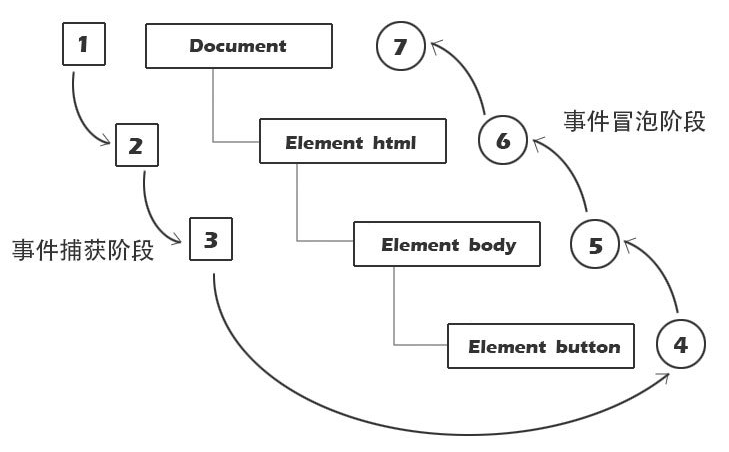

# 事件的使用

## 绑定事件

1.  DOM0 写法：`dom.on事件类型 = 事件处理函数`
2.  DOM2 写法：`dom.addEventListener('事件类型', 事件处理函数, 配置对象)`
    -   `capture`：`true`-事件在捕获阶段被触发，默认为 `false`-事件在冒泡阶段被触发（只设置 `capture` 时，可不用 `{}`）
    -   `once`：`true`-事件被调用之后自动移除，默认为 `false`
    -   `passive`：`true`-禁用 `preventDefault()`，如果仍然调用了这个函数，客户端会忽略它并抛出一个控制台警告。默认为 `false`
3.  DOM2 简写：`dom.addEventListener('事件类型', 事件处理函数, 事件处理模型)`
    -   `事件处理模型`：默认为 `false`-监听冒泡阶段；`true`-监听捕获阶段

```js
const element = document.getElementsByClassName('element')[0];
element.addEventListener('click', () => console.log('I run only once'), {
    once: true,
});
```

-   DOM0 的缺点：一个 dom 对象，一个事件类型，只能绑定**一个**函数；新绑定的函数，会覆盖前面绑定的函数。
-   DOM2 的改进：一个 dom 对象，一个事件类型，可以绑定**多个**函数；事件触发，所有函数都会**按定义的顺序**执行。

<br>

## 解除绑定

1. DOM0 写法：`dom.on事件 = null`
2. DOM2 写法：`dom.removeEventListener('事件类型', 同一个函数)`

<br><br>

# 批量绑定

通过 `for` 循环批量绑定事件

```html
<ul id="box">
    <li></li>
    <li></li>
    <li></li>
</ul>
<script>
    let li = document.getElementsByTagName('li');
    for (var i = 0; i < li.length; i++) {
        li[i].onclick = function () {
            console.log(i); // 输出的都是 3
        };
    }
</script>
```

因为**事件函数的执行是异步操作**，异步操作会在同步操作执行完之后再执行
所以，事件函数执行时，`for` 循环已执行完毕，所以取出的 `i` 都等于 `3`

<br>

解决方法 ①：用 `let` 定义 `i`

```js
let li = document.getElementsByTagName('li');
for (let i = 0; i < li.length; i++) {
    li[i].addEventListener('click', () => {
        console.log(i); // 0 1 2
    });
}
```

因为 `let` 定义的变量，具有块级作用域。事件函数执行时，只能获取到对应作用域中的 `i` 值

<br>

解决方法 ②：通过 IIFE，增加一层作用域

```js
let li = document.getElementsByTagName('li');
for (var i = 0; i < li.length; i++) {
    (function (index) {
        li[index].onclick = () => {
            console.log(index);
        };
    })(i);
}
```

<br>

解决方法 ③：添加对象属性

```js
let li = document.getElementsByTagName('li');
for (var i = 0; i < li.length; i++) {
    li[i].index = i; // 给每个 li 对象添加自己的 index 属性
    li[i].onclick = function () {
        console.log(this.index);
    };
}
```

注意：该方法在事件函数内使用了 this，所以不能使用箭头函数。

<br>

## 对应 & 排他

```css
li {
    list-style: none;
    width: 100px;
    height: 100px;
    background: lightcoral;
}
```

```html
<ul id="box">
    <li></li>
    <li></li>
    <li></li>
</ul>
```

```js
let li = document.getElementsByTagName('li');
for (let i = 0; i < li.length; i++) {
    li[i].addEventListener('click', () => {
        for (let j = 0; j < li.length; j++) {
            // 排他，性能消耗较大
            li[j].style.background = 'lightcoral';
        }
        li[i].style.background = 'lightblue'; // 对应
    });
}
```

<br>

改进：针对性排他

```js
let li = document.getElementsByTagName('li');
let cur = -1; // 默认序号
for (let i = 0; i < li.length; i++) {
    li[i].addEventListener('click', () => {
        if (cur == i) {
            // 节流
            return;
        } else if (cur !== -1) {
            li[cur].style.background = 'lightcoral';
        }
        cur = i; // 更新序号
        li[cur].style.background = 'lightblue'; // 对应
    });
}
```

<br><br>

# 事件类型

## 鼠标点击事件

1. `click` - - - 点击左键 / 按回车键（`click` = `mousedown` + `mouseup`）
2. `contextmenu` - - - 点击右键（不常用：浏览器有默认的右键行为）
3. `dblclick` - - - 左键双击（`ondblclick` = 2 \* `onclick`）
4. `mousedown` - - - 按下鼠标任意键
5. `mouseup` - - - 抬起鼠标任意键

<br>

## 鼠标移动事件

1. `mouseenter` - - - 光标进入（不冒泡）
2. `mouseleave` - - - 光标离开（不冒泡）
3. `mouseover` - - - 光标进入
4. `mouseout` - - - 光标离开
5. `mousemove` - - - 光标移动（持续触发）

<br>

## 鼠标滚轮事件

`wheel` - - - 鼠标在元素上滚动时触发（IE + Chrome）

```js
document.onwheel = event => {
    console.log(event.wheelDelta);
};
```

`event.wheelDelta`：滚动方向，`120` → 上、`-120` → 下；滚动得较快时，可能会出现 120 的整数倍

<br>

火狐使用 **`DOMMouseScroll`**，且只能通过 DOM2 的事件绑定方式使用

```js
Div.addEventListener(
    'DOMMouseScroll',
    event => {
        Div.innerHTML = event.detail;
    },
    false
);
```

火狐使用 **`event.detail`** 作为滚动方向：`-3` → 上；`3` → 下

<br>

兼容函数封装：

```js
if (document.onwheel === null) {
    // 给 Chrome 添加事件
    document.onwheel = mouseWheelHandler;
} else {
    // 给火狐添加事件
    document.addEventListener('DOMMouseScroll', mouseWheelHandler, false);
}

function mouseWheelHandler(event) {
    let direction;
    if (event.wheelDelta) {
        // Chrome 用的是 event.wheelDelta
        direction = event.wheelDelta / 120;
    } else if (event.detail) {
        // 火狐用的是 event.detail
        direction = -event.detail / 3;
    }
    console.log(direction);
}
```

<br>

## 键盘事件

`keydown` 键盘按下（所有键 = 输入键 + 功能键）：

```js
input.onkeydown = () => {
    console.log(111);
};
```

如果一直按着不动，会持续触发该事件

<br>

`keyup` 键盘抬起：

```js
input.onkeyup = function () {
    console.log(111);
};
```

<br>

`keypress` 键盘按下（输入键，功能键不触发）：

```js
input.onkeypress = function () {
    console.log(111);
};
```

<br>

常见的 `keyCode`：

-   `shift`、`ctrl`、`alt` 对应的 `event.keyCode` 为 `16`、`17`、`18`
-   `enter` 对应的 `event.keyCode` 为 `13`
-   左上右下 → `37`、`38`、`39`、`40`

注意：`keyCode` 已被弃用，推荐使用 `key` 来判断用户按下的键值。

<br>

demo - 实现留言功能：

```js
input.onkeyup = function (e) {
    if (this.value.trim()) {
        // 如果写了非空内容
        if (e.keyCode == 13 && e.ctrlKey) {
            // 同时按下 ctrl enter 键
            let oLi = document.createElement('li');
            oLi.innerHTML = this.value.trim();
            if (oUl.children[0]) {
                oUl.insertBefore(oLi, oUl.children[0]);
            } else {
                oUl.appendChild(oLi);
            }
        }
    }
};
```

可以通过查看 `ctrlKey`、`altKey`、`shiftKey` 的值是否为 `true`，来判断是否有按下 `ctrl`、`alt`、`shift` 键

<br>

demo - 实现方向键移动：

```js
let oBox = document.getElementById('box');

document.onkeydown = function (e) {
    // 给整个页面绑定事件
    switch (e.keyCode) {
        case 37:
            oBox.style.left = oBox.offsetLeft - 10 + 'px';
            break;
        case 38:
            oBox.style.top = oBox.offsetTop - 10 + 'px';
            break;
        case 39:
            oBox.style.left = oBox.offsetLeft + 10 + 'px';
            break;
        case 40:
            oBox.style.top = oBox.offsetTop + 10 + 'px';
            break;
    }
};
```

<br>

## 焦点事件

1. `focus` - - - 得到焦点时触发（不冒泡）
2. `blur` - - - 失去焦点时触发（不冒泡）
3. `focusin`：`focus` 的冒泡版
4. `focusout`：`blur` 的冒泡版

<br>

## 用户界面事件

1.  `load`：在 window 上，当页面加载完成后触发；在 img 上，当图片加载完成后触发；在 object 元素上，当对象加载完成后触发
2.  `select`：在文本框上，当用户选择了字符时触发
3.  `resize`：文档视图调整大小时触发；在 window 上，当窗口被缩放时触发
4.  `scroll`：文档视图或者一个元素在滚动时触发（区别于滚轮事件 `wheel`）
5.  `input`：当一个 `input`、`select`、`textarea` 元素的 `value` 被修改时，会触发该事件
6.  `change`：当一个 `input`、`select`、`textarea` 元素的 `value` 被修改并失焦时，会触发该事件

<br><br>

# 事件处理模型

单击某个子元素时，该元素称为事件源；单击事件不仅发生在事件源上，也发生在其**所有的父级**上。

**事件流**：捕获阶段 + 冒泡阶段；事件流对应着事件的触发顺序（先捕获、后冒泡）

1. 捕获阶段：父级 → 子级
2. 冒泡阶段：子级 → 父级（浏览器会冒泡到 window 为止）



DOM0 的事件处理函数只能监听冒泡阶段；DOM2 的事件处理函数能监听捕获阶段。

<br>

练一练：

```css
#box1 {
    width: 100px;
    height: 100px;
    background: lightgoldenrodyellow;
}

#box2 {
    width: 50px;
    height: 50px;
    background: lightgreen;
}
```

```html
<div id="box1">
    <div id="box2"></div>
</div>
```

```js
box1.addEventListener(
    'click',
    function () {
        console.log('父级捕获');
    },
    true
);

box2.onclick = function () {
    console.log('子级冒泡');
};

box2.addEventListener(
    'click',
    function () {
        console.log('子级捕获');
    },
    true
);

box1.onclick = function () {
    console.log('父级冒泡');
};
```

<br><br>

# 事件对象

JS 解析引擎会传一个实参给事件处理函数，这个实参就叫做 "事件对象"。通常用形参 `event` 接收：

```html
<div id="box">1</div>
<script>
    box.onclick = function (event) {
        console.log(event);
    };
</script>
```

输出：`PointerEvent {isTrusted: true, pointerId: 1, width: 1, height: 1, pressure: 0, …}`

<br>

事件对象 `event` 中，封装了这次事件的很多细节。eg：点击事件发生时，鼠标当前的位置...

```js
document.addEventListener('mousemove', event => {
    console.log('当前鼠标坐标为' + event.clientX + ',' + event.clientY);
});
```

<br>

## 常用方法

1.  `stopPropagation()` - 阻止事件流。

调用该方法后，事件就不会再沿着事件流继续往后触发 ( propagation 传播 ) ：

```js
box1.addEventListener(
    'click',
    function (event) {
        console.log('父级捕获');
        event.stopPropagation(); // 从这里开始阻止事件流
    },
    true
);

box2.addEventListener(
    'click',
    function () {
        console.log('子级捕获');
    },
    true
);

box2.onclick = function () {
    console.log('子级冒泡');
};

box1.onclick = function () {
    console.log('父级冒泡');
};
```

此时点击子级也不会触发子级的点击事件。

<br>

2.  `preventDefault()` - 阻止默认事件。

在浏览器中，某些元素的某些事件，会有自己的默认行为。比如：

1.  a 元素的 click 事件，会跳转页面
2.  form 元素的 submit 事件，会提交表单，最终导致页面刷新
3.  文本框的 keydown 事件，会将按键文本显示到文本框中

使用 preventDefault 方法即可阻止这些默认行为：

```html
<a id="link" href="http://www.baidu.com">百度</a>
<script>
    link.onclick = function (event) {
        event.preventDefault(); // 超链接的默认点击事件是跳转
        console.log(111);
    };
</script>
```

此时点击超链接也不会跳转页面了。

<br>

## 常用属性

1. `event.type` - 事件的类型。eg：`click`
2. `event.target` - 事件源。即使该元素身上没有监听，也是返回它。
3. `event.currentTarget` - 当前元素，即 `this` 的指向。
4. `event.button` - 区分鼠标左、中、右键（0、1、2）。

<br>

## 常用信息

1. `offsetX` / `offsetY` - - - 鼠标距离 [事件对象] 的左上角

2. `layerX` / `layerY` - - - 鼠标距离 [最近的定位元素] 的左上角（会一直找到 body 标签；自身有定位属性的话就是相对于自身）

3. `clientX` / `clientY` - - - 鼠标距离 [显示区域] 的左上角（与页面是否有滚动无关）

4. `pageX` / `pageY` - - - 鼠标距离 [页面] 的左上角（会加上滚动的距离）

5. `screenX` / `screenY` - - - 鼠标距离 [计算机屏幕] 的左上角（在多屏显示的环境下，范围将增加到屏幕的组合宽高）

6. `x` / `y` - - - `clientX` / `clientY` 的别名（尚在开发中）

-   页面没有滚动时，`page`、`client` 的值相同

<br><br>

# 事件委托

通过事件对象 event 可以得到事件源 target。所以我们可以将子级的事件委托给父级处理。

```html
<ul id="box">
    <li>li1</li>
    <li>li2</li>
    <li>li3</li>
</ul>
<script>
    box.onclick = event => {
        console.log(event.target.innerHTML);
    };
</script>
```

优势：① 不需要循环绑定每个子元素，可以节省浏览器性能；② 添加新元素时，不需要给新元素绑定事件。

<br>
