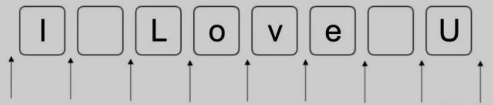
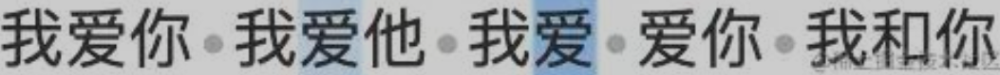

# 正则实例

## 创建正则

使用构造函数创建正则: `const reg = new RegExp(正则的规则, 修饰符)` (regular expression) <br>
接收 2 个参数: ① 正则的规则,② 修饰符 `i` `m` `g` (可选)

```javascript
const reg = new RegExp("test"); // 实例化一个正则实例
console.log(reg); // /test/
```

<br>

使用简洁语法创建正则: `const reg = /正则的规则/修饰符`

```javascript
const reg = /text/;
console.log(reg); // /test/
```

<br>

一般情况下, 推荐使用简洁语法创建正则; 但对于字符串**变量**, 只能使用构造函数创建正则:

```javascript
const str = "text";
const reg1 = /str/; // /str/
const reg2 = new RegExp(str); // /text/
```

<br>

## 修饰符

-   `i`: 不区分大小写 (ignoreCase)
-   `m`: 换行匹配 (multiline)
-   `g`: 全局匹配 (global)

<br>

`i`: 不区分大小写 (ignoreCase); 默认区分大小写.

demo - 匹配 test:

```javascript
const str = "This is a test";

const reg1 = /Test/;
console.log(str.match(reg1)); // null - 没有检索到匹配正则的数据

const reg2 = /Test/i; // 不区分大小写
console.log(str.match(reg2)); // [ 'test', index: 10, input: 'This is a test', groups: undefined ]
```

<br>

`m`: 换行匹配 (multiLine); 默认只检索第一行.

demo - 匹配 test 前缀:

```javascript
const str = "This is a \ntest";

const reg1 = new RegExp("^test"); // 匹配字符串前缀 test
console.log(str.match(reg1)); // null

const reg2 = new RegExp("^test", "m"); // 匹配行前缀 test
console.log(str.match(reg2)); // [ 'test', index: 11, input: 'This is a \ntest', groups: undefined ]
```

<br>

`g`: 全局匹配 (global); 默认只检索到第一个匹配正则的数据.

demo - 匹配 test:

```javascript
const str = "This is a test, a test";

const reg1 = new RegExp("test"); // 检索第一个匹配正则的数据
console.log(str.match(reg1)); // [ 'test', index: 10, input: 'This is a test, a test', groups: undefined ]

const reg2 = new RegExp("test", "g"); // 检索所有匹配正则的数据
console.log(str.match(reg2)); // [ 'test', 'test' ]
```

<br><br>

# 正则实例的方法

① `reg.test(str)`: 检索参数`str`, 判断`str`中是否含有匹配正则的数据

-   返回值: 若含有匹配正则的数据, 则返回 `true`; 否则, 返回 `false`

demo - 匹配 `^a`:

```javascript
const str = "bb^acc";

const reg1 = /^a/g;
console.log(reg1.test(str)); // false

const reg2 = /\^a/g; // 匹配字符 "^" 需要使用转义符 "\" 转义
console.log(reg2.test(str)); // true
```

<br>

② `reg.exec(str)`: 检索参数`str`, 获取第 1 个匹配正则的数据

-   返回值: 若含有匹配正则的数据, 则返回一个数组, 数组中存放着该数据的信息; 否则, 返回 `null`
-   数组中存放着的数据信息: ① 匹配正则的数据,② 数据开始的下标,③ 字符串 `str`,④ 所在分组
-   不论是否使用修饰符 `g`, 都只检索到第 1 个匹配正则的数据

```javascript
const str = "hello superman";

const reg1 = /monster/;
console.log(reg1.exec(str)); // null

const reg2 = /superman/;
console.log(reg2.exec(str)); // [ 'superman', index: 6, input: 'hello superman', groups: undefined ]
```

<br>

# 正则的匹配规则

正则就是字符串的一种匹配模式, 要么匹配位置, 要么匹配字符:



上图表示一个字符串 `I Love U`, 箭头表示我们要匹配的位置, 框框表示我们要匹配的字符 (包括空格)

<br>

## 匹配位置

| **模式** | **说明**                                                             |
| -------- | -------------------------------------------------------------------- |
| `^`      | 匹配开头的位置; 当正则有修饰符 `m` 时 (多行文本), 表示匹配行开头位置 |
| `$`      | 匹配结尾的位置; 当正则有修饰符 `m` 时 (多行文本), 表示匹配行结尾位置 |
| `\b`     | 匹配单词边界, 即匹配上面示例中的 `i`,`love`,`U` 前后的位置           |
| `\B`     | 匹配非单词边界, 与 `\b` 相反, 即匹配上面示例中的 `o`,`v` 前后的位置  |

demo - 匹配前后缀:

```javascript
const str1 = "javascript is my favorite";
const reg1 = /^javascript/;
console.log(reg1.test(str1)); // true

const str2 = "this code in javascript";
const reg2 = /javascript$/;
console.log(reg2.test(str2)); // true
```

demo - 匹配有边界得 code 单词:

```js
const reg = /\bcode\b/;

const str1 = "bar code";
console.log(reg.test(str1)); // true

const str2 = "barcode";
console.log(reg.test(str2)); // false
```

<br>

"断言" 的使用:

demo - 给定字符串 `我爱你 我爱他 我爱 爱你 我和你`:

| **模式**      | **说明**                                                                                                                                                                                                                                                                                                                                                                                               |
| ------------- | ------------------------------------------------------------------------------------------------------------------------------------------------------------------------------------------------------------------------------------------------------------------------------------------------------------------------------------------------------------------------------------------------------ |
| `(?=表达式)`  | 正向先行断言: 检索右侧为`表达式`的位置. eg: 检索右侧为 "你" 的位置, 正则可以这么写: `/(?=你)/g` <br><br><br>如果加上 "爱", `/爱(?=你)/g`, 就会匹配出右侧为 "你" 的 "爱" 字: <br> |
| `(?!表达式)`  | 反向先行断言; 检索右侧不为`表达式`的位置, `/爱(?!你)/g`会匹配出右侧不为 "你" 的 "爱" 字: <br>                                                                                                                                                                                               |
| `(?<=表达式)` | 正向后行断言; 检索左侧为`表达式`的位置 <br>[先行断言] 和 [后行断言] 只有一个区别, 即先行断言从左往右看, 后行断言从右往左看                                                                                                                                                                                                                                                                             |
| `(?<!表达式)` | 反向后行断言; 检索左侧不为`表达式`的位置                                                                                                                                                                                                                                                                                                                                                               |

demo - 匹配姓 "李" 的名字:

```javascript
const reg = /(?<!\S)李.+/;

const str1 = "李逍遥";
console.log(reg.test(str1)); // true

const str2 = "赵灵儿";
console.log(reg.test(str2)); // false
```

<br>

## 匹配字符

| **模式** | **说明**                                                                      |
| -------- | ----------------------------------------------------------------------------- |
| `字面量` | 匹配字符串本身; 比如 `/javascript/` 匹配 `"javascript"`; `/123/` 匹配 `"123"` |
| `\t`     | 匹配水平制表符                                                                |
| `\v`     | 匹配垂直制表符                                                                |
| `\n`     | 匹配换行符                                                                    |
| `\r`     | 匹配回车符                                                                    |
| `\f`     | 匹配换页符                                                                    |
| `\x✳✳`   | 匹配拉丁字符; 比如 `\xOA` 等价于 `\n`                                         |
| `\u✳✳✳✳` | 匹配 Unicode 字符; 比如 `\u2028` 匹配行终止符, `\u2029` 匹配段终止符          |
| `\c✳`    | 匹配 ctrl+✳; 比如 `\cI` 匹配 ctrl+I, 等价于 `\t`                              |
| `[\b]`   | 匹配 Backspace 键 (特殊记忆)                                                  |

<br><br>

# 正则的使用规则

## 字符组 `[ ]`

| **模式**    | **说明**                                                    |
| ----------- | ----------------------------------------------------------- |
| `[abc]`     | 匹配 `"a"`,`"b"`,`"c"` 其中任何一个字符                     |
| `[a-c1-3]`  | 匹配 `"a"`,`"b"`,`"c"`,`"1"`,`"2"`,`"3"` 其中任何一个字符   |
| `[^abc]`    | 匹配除 `"a"`,`"b"`,`"c"` 外的任何一个字符                   |
| `[^a-c1-3]` | 匹配除 `"a"`,`"b"`,`"c"`,`"1"`,`"2"`,`"3"` 外的任何一个字符 |

<br>

常用字符组的简写:

| **模式** | **说明**                                          |
| -------- | ------------------------------------------------- |
| `.`      | 通配符; 匹配除了少数字符 (eg:`\n`) 之外的任意字符 |
| `\d`     | 匹配数字; 等价于 `[0-9]`                          |
| `\D`     | 匹配非数字; 等价于 `[^0-9]`                       |
| `\w`     | 匹配字母数字下划线; 等价于 `[a-zA-Z0-9_]`         |
| `\W`     | 匹配非字母数字下划线; 等价于 `[^a-zA-Z0-9_]`      |
| `\s`     | 匹配空白符; 等价于 `[ \t\v\n\r\f]`                |
| `\S`     | 匹配非空白符; 等价于 `[^ \t\v\n\r\f]`             |

<br>

demo - 匹配 Javascript 和 javascript:

```javascript
const reg = /[Jj]avascript/;

const str1 = "Javascript";
console.log(reg.test(str1)); // true

const str2 = "javascript";
console.log(reg.test(str2)); // true
```

<br>

demo - 匹配 "我爱你" / "我想你" / "我" + 数字 + "你":

```js
const reg = /我[\d爱想]你/;

const str1 = "我爱你";
console.log(reg.test(str1)); // true

const str2 = "我想你";
console.log(reg.test(str2)); // true

const str3 = "我打你";
console.log(reg.test(str3)); // false

const str4 = "520, 我2你";
console.log(reg.test(str4)); // true
```

<br>

## 量词 `{ }`

-   用于设置匹配的字符个数
-   重复书写某个规则时, 可以用量词代替. eg: 匹配 10 个数字, `/\d\d\d\d\d\d\d\d\d\d/` → `/\d{10}/`

| **模式** | **说明**               |
| -------- | ---------------------- |
| `{n,m}`  | 连续出现 `n` 到 `m` 次 |
| `{n,}`   | 至少连续出现 `n` 次    |
| `{n}`    | 连续出现 `n` 次        |
| `?`      | 等价于 `{0,1}`         |
| `+`      | 等价于 `{1,}`          |
| `*`      | 等价于 `{0,}`          |

```javascript
const str = "babba"; // 5 个字符

const reg1 = /b?/g;
console.log(str.match(reg1)); // [ "b", "", "b", "b", "", "" ] → 6 个元素, 按匹配元素分割开了

const reg2 = /b*/g;
console.log(str.match(reg2)); // [ "b", "", "bb", "", "" ] → 5 个元素, 也是按匹配元素分割开了

const reg3 = /b+/g;
console.log(str.match(reg3)); // ["b", "bb"]
```

<br>

demo: 匹配手机号码, 假设手机号码规则如下:
① 必须是 11 位的数字;
② 第一位数字以 1 开头, 第二位数字可以是 [3,4,5,7,8] 中的任意一个, 后面 9 个数是 [0-9] 中的任意一个

```javascript
const regex = new RegExp(/^1[34578]\d{9}/);

regex.test("18711001111"); // true
```

<br>

demo: 提取下列数据中所有人的生日. 王伟 1993 年 1 月 2 日 张伟 1996.8.24 李伟 1996.3.21 李秀 1994-7-5

```javascript
const reg = /(?<=[年.-])\d{1,2}[月.-]\d{1,2}[日]?/g;

const str1 = "王伟 1993年1月2日";
console.log(str1.match(reg)); // [ '1月2日' ]

const str2 = "李伟 1996.3.21";
console.log(str2.match(reg)); // [ '3.21' ]
```

主要是用 `(?<=[年.-])` 反向先行断

<br>

默认**贪婪匹配**, 即尽量往字符个数多的匹配;
在量词后加 `?`, 则变为**惰性匹配**, 即尽量往字符个数少的匹配

```javascript
const str = "a b a bb a bbb a bbbb";

const reg1 = /b{2,4}/g; // 贪婪匹配
console.log(str.match(reg1)); // ["bb", "bbb", "bbbb"]

const reg2 = /b{2,4}?/g; // 惰性匹配
console.log(str.match(reg2)); // ["bb", "bb", "bb", "bb"]
```

<br>

## 子项 `( )`

| 模式           | 说明                                                                |
| -------------- | ------------------------------------------------------------------- |
| (ab)           | 捕获型分组; 把 ab 当成一个整体, 比如 (ab)+ 表示 ab 至少连续出现一次 |
| (?:ab)         | 非捕获型分组; 与 (ab) 的区别是, 它不捕获数据                        |
| (good\|nice)   | 捕获型分支结构; 匹配 good 或 nice                                   |
| (?:good\|nice) | 非捕获型分支结构; 与 (good\|nice) 的区别是, 它不捕获数据            |
| \num           | 反向引用; 比如 \2, 表示引用的是第二个括号里的捕获的数据             |

<br>

demo - 获取 d 开头,后面跟数字的字符串:

```javascript
const str = "abcd12ef";
const reg = /d(\d+)/g;
console.log(str.match(reg)); // [ 'd12' ]
```

<br>

demo - 获取 \*\* 格式的子字母字符串:

```javascript
const str = "ccsdbbcc99d";
const reg = /([a-z])\1/g;
console.log(str.match(reg)); // [ 'cc', 'bb', 'cc' ]
```

上面 `\1` 表示复用第 1 个子项 `([a-z])` 的结果

<br>

demo: 视频文件的后缀名有 .mp4,.avi,.wmv,.rmvb, 用正则表达式提取所有的视频文件

```javascript
const reg = /.+(.mp4|.avi|.wmv|.rmvb)/g;

const str1 = "海贼王.avi";
console.log(str1.match(reg)); // [ '海贼王.avi' ]

const str2 = "学习资料.rmvb";
console.log(str2.match(reg)); // [ '学习资料.rmvb' ]

const str3 = "朋友.mp3";
console.log(str3.match(reg)); // null
```

<br>

demo: 用正则表达式匹配所有的小数

```javascript
const reg = /(?<!\.)\d+\.\d+$/g;

const data1 = 0.1;
console.log(reg.test(data1)); // true

const data2 = 1.3;
console.log(reg.test(data2)); // false

const data3 = 13.14;
console.log(reg.test(data3)); // true

const data4 = "1.3.1.4";
console.log(reg.test(data4)); // false

const data5 = 1;
console.log(reg.test(data5)); // false
```

`(?<!\.)` 反向后行断言, 匹配一个位置其左边不为 `"."`;
接着 `\d+\.\d+` 匹配一位以上的数字 + `"."` + 一位以上的数字

<br>

demo: 编写正则表达式进行密码强度的验证, 规则如下: 至少一个大写字母,至少一个小写字母,至少一个数字,至少 8 个字符

```javascript
const reg = /(?=.*?[a-z])(?=.*?[A-Z])(?=.*?[0-9]).{8,}/g;

const data1 = "123456789";
console.log(reg.test(data1)); // false

const data2 = "12ABab";
console.log(reg.test(data2)); // false

const data3 = "12345ABCabc";
console.log(reg.test(data3)); // true

const data4 = "ADMIN1234()";
console.log(reg.test(data4)); // false

const data5 = "Hh201314";
console.log(reg.test(data5)); // true
```

`(?=.*?[a-z])` 这段正则表达式规定了匹配的字符串中必须存在一个右边为任意字符和小写字母的位置

`(?=.*?[a-z])(?=.*?[A-Z])(?=.*?[0-9])` 一整串连起来就是必须存在小写,大写,数字

<br>

## 正则中的 `|`

直接写在正则中 / 在正则的子项中, `|` 表示或者:

```javascript
const str = "adcd12ef";
const reg = /ad|cd/g;
console.log(str.match(reg)); // [ 'ad', 'cd' ]
```

```js
const str = "adcd12ef";
const reg = /(a|c)d/g;
console.log(str.match(reg)); // [ 'ad', 'cd' ]
```

<br>

在正则的字符组 `[ ]` 中, `|` 是普通的竖线:

```javascript
const str = "adcd1|d2ef";
const reg = /[a|c]d/g; // `[a|c]` 表示 `a`,`|`,`b` 中的任意 1 个
console.log(str.match(reg)); // [ 'ad', 'cd', '|d' ]
```

<br><br>

# RegExp 身上的属性

这些属性会根据最后执行的正则表达式操作而变化.

每个属性都有一个全名和一个简写:

```
input         -  $_  -  最后搜索的字符串 (非标准特性)
lastMatch     -  $&  -  最后匹配的文本
lastParen     -  $+  -  最后匹配的捕获组 (非标准特性)
leftContext   -  $`  -  input 字符串中出现在 lastMatch 前面的文本
rightContext  -  $'  -  input 字符串中出现在 lastMatch 后面的文本
```

通过这些属性可以提取出与 exec / test 执行的操作相关的信息:

```js
const text = "this has been a short summer";
const pattern = /(.)hort/g;
if (pattern.test(text)) {
    console.log(RegExp.input); // this has been a short summer
    console.log(RegExp.leftContext); // this has been a
    console.log(RegExp.rightContext); // summer
    console.log(RegExp.lastMatch); // short
    console.log(RegExp.lastParen); // s
}
```

以上代码创建了一个模式, 用于搜索任何后跟 "hort" 的字符, 并把第一个字符放在了捕获组中. 不同属性包含的内容如下.

-   input 属性中包含原始的字符串.
-   leftContext 属性包含原始字符串中 "short" 之前的内容, rightContext 属性包含 "short" 之后的内容.
-   lastMatch 属性包含匹配整个正则表达式的上一个字符串, 即 "short".
-   lastParen 属性包含捕获组的上一次匹配, 即 "s".

<br>

这些属性名也可以替换成简写形式:

```js
const text = "this has been a short summer";
const pattern = /(.)hort/g;
if (pattern.test(text)) {
    console.log(RegExp.$_); // this has been a short summer
    console.log(RegExp["$`"]); // this has been a
    console.log(RegExp["$'"]); // summer
    console.log(RegExp["$&"]); // short
    console.log(RegExp["$+"]); // s
}
```

<br>

RegExp 还有其他几个构造函数属性, 可以存储最多 9 个捕获组的匹配项. 这些属性通过 RegExp.$1 ~ RegExp.$9 来访问, 分别包含第 1 ~ 9 个捕获组的匹配项. 在调用 exec / test 时, 这些属性就会被填充, 然后就可以像下面这样使用它们:

```js
const text = "this has been a short summer";
const pattern = /(..)or(.)/g;
if (pattern.test(text)) {
    console.log(RegExp.$1); // sh
    console.log(RegExp.$2); // t
}
```

在这个例子中, 模式包含两个捕获组. 调用 test 搜索字符串之后, 因为找到了匹配项所以返回 true, 而且可以打印出通过 RegExp 构造函数的 $1 和$2 属性取得的两个捕获组匹配的内容.

> 注意: RegExp 构造函数的所有属性都没有任何 Web 标准出处, 因此不要在生产环境中使用它们.

<br>
