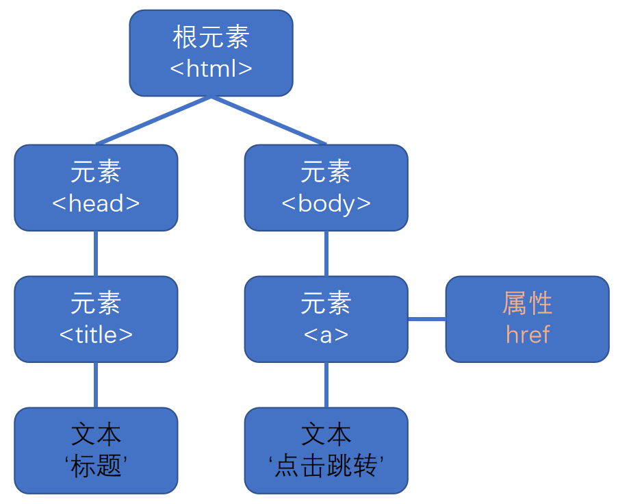

# DOM 节点

页面会被抽象成树形结构的 DOM 节点:



<br><br>

# DOM 节点的常用属性

1. `nodeType`: 一个整数, 表示节点的类型（只读）
2. `nodeName`: 一个字符串, 表示节点的名称（只读）
3. `nodeValue`: 获取/修改 [文本节点] / [注释节点] 的内容；元素节点的 `nodeValue` 为 `null`

```html
<ul id="box">
    content
</ul>
<script>
    console.log(box.nodeType); // 1
    console.log(box.nodeName); // UL
    console.log(box.nodeValue); // null
</script>
```

<br>

不同的 DOM 节点有不同的 `nodeType` 值:

-   元素节点 → 1
-   属性节点 → 2
-   文本节点 → 3
-   注释节点 → 8
-   文档节点 ( document ) → 9
-   文档片段节点 ( DocumentFragment ) → 11
-   ...

<br><br>

# 操作 DOM 节点

## 获取 DOM 节点

1. `parentNode`: 父节点（最高的父节点为 document）
2. `childNodes`: 所有子节点, 返回类数组对象
3. `firstChild`: 第一个子节点
4. `lastChild`: 最后一个子节点
5. `nextSibling`: 下一个兄弟节点
6. `previousSibling`: 上一个兄弟节点

```html
<ul id="box">
    <li id="con1"></li>
    <li id="con2"></li>
    <li id="con3"></li>
</ul>
<script>
    console.log(box.parentNode); // body
    console.log(box.childNodes); // NodeList(7) [text, li#con1, text, li#con2, text, li#con3, text]
    console.log(box.firstChild); // #text
    console.log(box.lastChild); // #text
    console.log(box.nextSibling); // #text
    console.log(box.previousSibling); // #text
</script>
```

打印 `#text` 表示获取到**文本节点**, 这里表示空格和换行符.

<br>

## 创建 DOM 节点

1. `document.createElement()`: 创建元素节点
2. `document.createTextNode()`: 创建文本节点
3. `document.createComment()`: 创建注释节点
4. `document.createDocumentFragment()`: 创建文档片段

```js
const eleNode = document.createElement("span");
console.log(eleNode); // <span></span>

const textNode = document.createTextNode("文本内容");
console.log(textNode); // "文本内容"

const comNode = document.createComment("注释内容");
console.log(comNode); // <!-- 注释内容 -->

const fraNode = document.createDocumentFragment();
console.log(fraNode); // #document_fragment
```

注意: 创建的节点不在 DOM 树上, 所以不会被渲染到页面上.

<br>

## 克隆 DOM 节点

1.  `ele.cloneNode(xx)`: 克隆 `ele`；`xx` 为 `true` 时表示深度克隆, 为 `false` 时表示浅度克隆；返回新的 DOM 节点.

```html
<div>我是 div</div>
<script>
    const div = document.querySelector("div");

    const cloneElement1 = div.cloneNode(true);
    console.log(cloneElement1); // <div>我是 div</div>
    console.log(cloneElement1 === div); // false

    const cloneElement2 = div.cloneNode();
    console.log(cloneElement2); // <div></div>
    console.log(cloneElement2 === div); // false
</script>
```

<br>

## 插入 DOM 节点

1. `parentNode.appendChild(child)`: 在 `parentNode` 的最后添加节点 `child`
2. `parentNode.insertBefore(frontChild, rearChild)`: 把 `frontChild` 添加到 `rearChild` 前面

把创建的节点插到页面上, 就可以在页面上显示啦.

<br>

demo - 最新评论, 将节点插到最前面:

```html
<ul id="box">
    <li id="con1"></li>
    <li id="con2"></li>
    <li id="con3"></li>
</ul>
<script>
    const eleNode = document.createElement("li");
    const textNode = document.createTextNode("文本");
    eleNode.appendChild(textNode);
    if (box.firstElementChild) {
        // 作为第一个节点
        box.insertBefore(eleNode, box.firstChild);
    } else {
        box.appendChild(eleNode);
    }
</script>
```

页面显示:

```html
<ul id="box">
    <li>文本</li>
    <li id="con1"></li>
    <li id="con2"></li>
    <li id="con3"></li>
</ul>
```

注意: 每个节点都是唯一的, 如果我们插入的节点是已经存在的节点, 则相当于把节点从原来的位置挪到了插入的位置.

<br>

## 删除 DOM 节点

1. `parent.removeChild(child)`: 删除节点 `child`, 会返回被删除的节点
2. `element.remove()`: 删除节点 `element`, 没有返回值

```html
<ul id="box">
    <li id="con1"></li>
    <li id="con2"></li>
    <li id="con3"></li>
</ul>
<script>
    box.removeChild(con2);
</script>
```

页面显示:

```html
<ul id="box">
    <li id="con1"></li>
    <li id="con3"></li>
</ul>
```

<br>

## 替换 DOM 节点

1. `parentNode.replace(newEle, oldEle)`: 用节点 `newEle` 代替节点 `oldEle`, 会返回被替换的节点 `oldEle`

```html
<ul id="box">
    <li id="con1"></li>
    <li id="con2"></li>
    <li id="con3"></li>
</ul>
<script>
    const liNode = document.createElement("li");
    liNode.className = "new";
    box.replaceChild(liNode, con2);
</script>
```

页面显示:

```html
<ul id="box">
    <li id="con1"></li>
    <li class="new"></li>
    <li id="con3"></li>
</ul>
```

如果用 `con1` 替换 `con2`, 相当于删除 `con2`.

<br>

## 其他操作

1. `element.hasChildNodes()`: 用于判断一个**元素节点**有没有子节点, 有则返回 `true`, 无则返回 `false`

```html
<ul id="box">
    <li id="con1"></li>
    <li id="con2"></li>
    <li id="con3"></li>
</ul>
<script>
    const result1 = box.hasChildNodes();
    console.log(result1); // true
    const result2 = con1.hasChildNodes();
    console.log(result2); // false
</script>
```

<br>
