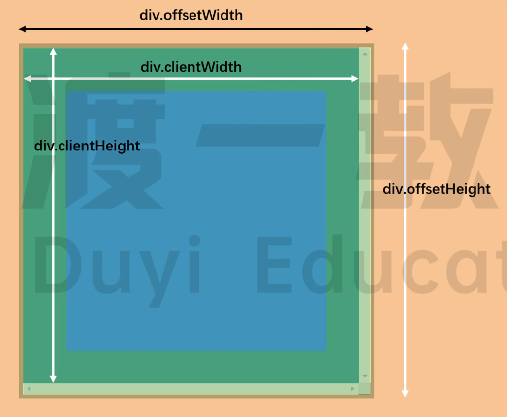

# 获取 DOM 元素

## 直接获取

`document`: 获取 document 对象

```js
console.log(document); // #document
```

<br>

1. `document.documentElement`: 获取 html 元素
2. `document.head`: 获取 head 元素
3. `document.body`: 获取 body 元素

```js
console.log(document.documentElement); // html
console.log(document.head); // head
console.log(document.body); // body
```

<br>

`document.title`: 获取或设置文档的标题, 默认为 `<title>` 里边的值.

```js
console.log(document.title); // "Document"
```

<br>

1. `dom.parentElement`: 获取父元素
2. `dom.children`: 获取子元素, 返回类数组对象
3. `dom.firstElementChild`: 获取第一个子元素
4. `dom.lastElementChild`: 获取最后一个子元素
5. `dom.nextElementSibling`: 获取下一个兄弟元素
6. `dom.previousElementSibling`: 获取上一个兄弟元素

```html
<ul id="box">
    <li id="con1">1</li>
    <li id="con2">2</li>
</ul>
<script>
    console.log(box.parentElement); // body
    console.log(box.children); // HTMLCollection(2) [li#con1, li#con2, con1: li#con1, con2: li#con2]
    console.log(box.firstElementChild); // li#con1
    console.log(box.lastElementChild); // li#con2
    console.log(box.nextElementSibling); // script
    console.log(box.previousElementSibling); // null
</script>
```

<br>

## 通过 getXxx 获取

`document.getElementById(id)`: 返回一个匹配特定 ID 的元素; 若在当前 Document 下没有找到, 则返回 `null`.

```html
<div id="demo"></div>
<script>
    const ele = document.getElementById("demo");
    console.log(ele); // div
</script>
```

注意 - 可以直接使用元素的 ID 来操作该元素 (不推荐) :

```html
<div id="demo"></div>
<script>
    console.log(demo); // div
</script>
```

<br>

`document.getElementsByName(name)`: 根据给定的 `name` 返回一个在 document 的 NodeList 集合.

```html
<form>
    <input type="radio" name="gender" />
    <input type="radio" name="gender" />
</form>
<script>
    const ele = document.getElementsByName("gender");
    console.log(ele); // NodeList(2) [input, input]
</script>
```

<br>

`element.getElementsByClassName(className)`: 返回一个包含了所有指定类名的子元素的类数组对象.

当在 document 对象上调用时, 会搜索整个 DOM 文档, 包含根节点. 也可以在任意元素上调用 getElementsByClassName 方法, 它将返回的是以当前元素为根节点, 所有指定类名的子元素.

```html
<div class="name">
    <p class="name"></p>
</div>
<script>
    const ele1 = document.getElementsByClassName("name");
    console.log(ele1); // HTMLCollection(2) [div.name, p.name]
    const ele2 = ele1[0].getElementsByClassName("name");
    console.log(ele2); // HTMLCollection [p.name]
</script>
```

<br>

`element.getElementsByTagName(tagName)`: 返回一个包括所有给定标签名称的元素的 HTML 集合 HTMLCollection.

当在 document 对象上调用时, 会搜索整个 DOM 文档, 包含根节点. 也可以在任意元素上调用 getElementsByTagName 方法, 它将返回的是以当前元素为根节点, 所有指定标签名称的子元素.

```html
<div class="name1">
    <div class="name2"></div>
</div>
<script>
    let ele1 = document.getElementsByTagName("div");
    console.log(ele1); // HTMLCollection(2) [div.name1, div.name2]
    let ele2 = ele1[0].getElementsByTagName("div");
    console.log(ele2); // HTMLCollection [div.name2]
</script>
```

<br>

## 通过 queryXxx 获取

`element.querySelector(selector)`: 返回与指定选择器或选择器组匹配的第一个 Element 对象. 如果找不到匹配项, 则返回 `null`.

当在 document 对象上调用时, 会搜索整个 DOM 文档, 包含根节点. 也可以在任意元素上调用 querySelector 方法, 它将返回的是以当前元素为根节点, 与指定选择器或选择器组匹配的第一个 Element 对象.

<br>

`element.querySelectorAll(selector)`: 返回与指定的选择器组匹配的元素列表.

当在 document 对象上调用时, 会搜索整个 DOM 文档, 包含根节点. 也可以在任意元素上调用 querySelectorAll 方法, 它将返回的是以当前元素为根节点, 所有与指定的选择器组匹配的元素列表.

```html
<ul class="box">
    <li class="content"></li>
    <li class="content"></li>
    <li class="content"></li>
</ul>
<script>
    const ele1 = document.querySelector(".box li"); // 传入字符串参数
    console.log(ele1); // <li class="content"></li>
    const ele2 = document.querySelectorAll(".box li");
    console.log(ele2); // NodeList(3) [li.content, li.content, li.content]
</script>
```

<br>

## getXxx & queryXxx

getXxx 是动态获取, 每次使用时都会重新获取; queryXxx 是静态获取, 第 1 次获取后, 不会再更新.

```html
<ul id="box">
    <li id="con1"></li>
    <li id="con2"></li>
    <li id="con3"></li>
</ul>
<script>
    const a = document.getElementById("box");
    console.log(a);
    // <ul id="box">
    //     <li id="con1"></li>
    //     <li id="con2"></li>
    //     <li id="con3"></li>
    // </ul>
    box.removeChild(con2); // 删除 <li id="con2"></li>
    console.log(a);
    // <ul id="box">
    //     <li id="con1"></li>   // 可以看到 a 的值改变了
    //     <li id="con3"></li>
    // </ul>
</script>
```

```html
<ul id="box">
    <li id="con1"></li>
    <li id="con2"></li>
    <li id="con3"></li>
</ul>
<script>
    const a = document.querySelectorAll("#box li");
    console.log(a); // NodeList(3) [li#con1, li#con2, li#con3]
    box.removeChild(con2); // 删除 <li id="con2"></li>
    console.log(a); // NodeList(3) [li#con1, li#con2, li#con3]  // 可以看到 a 的值没有改变
</script>
```

<br><br>

# 操作 DOM 元素的内容

1. `innerHTML`: 获取元素节点的内容, 可读可写; 如果内容符合 HTML 格式, 会被解析成标签
2. `innerText`: 获取元素节点的内容, 可读可写; 即使内容符合 HTML 格式, 也不会被解析成标签

```html
<div id="wrap1">123</div>
<div id="wrap2">123</div>
<script>
    wrap1.innerHTML = "<h4>文本</h4>";
    wrap2.innerText = "<h4>文本</h4>";
</script>
```

如果 wrap 内没有内容, 则添加; 有内容, 则替换

<br>

获取内容时, `innerHTML` 是获取里面的标签内容; `innerText` 是获取里面的文本内容

```html
<ul id="wrap">
    <li>香蕉</li>
</ul>
<script>
    console.log(wrap.innerHTML); // <li>香蕉</li>
    console.log(wrap.innerText); // 香蕉
</script>
```

<br>

我们可以利用该属性, 减少页面重构和重绘的次数

方法 1: 重构了 `arr.length` 次

```html
<ul id="wrap"></ul>
<script>
    let arr = ["苹果", "雪梨", "香蕉"];
    let oLi;
    for (let index = 0; index < arr.length; index++) {
        oLi = document.createElement("li");
        oLi.innerText = arr[index]; // 使用 innerText 就无需创建文本节点了
        wrap.appendChild(oLi);
    }
</script>
```

方法 2: 使用字符串拼接, 重构了 `1` 次

```html
<ul id="wrap"></ul>
<script>
    let arr = ["苹果", "雪梨", "香蕉"];
    let oLi = "";
    for (let index = 0; index < arr.length; index++) {
        oLi += "<li>" + arr[index] + "</li>";
    }
    wrap.innerHTML = oLi;
</script>
```

方法 3: 使用文档片段, 重构了 `1` 次

```html
<div id="wrap"></div>
<script>
    let arr = ["苹果", "雪梨", "香蕉"];
    let oLi, oFrag;
    oFrag = document.createDocumentFragment();
    for (let index = 0; index < arr.length; index++) {
        oLi = document.createElement("li");
        oLi.innerText = arr[index];
        oFrag.appendChild(oLi); // 先存储在文档片段节点中
    }
    wrap.appendChild(oFrag); // 将文档片段节点添加到 wrap 中
</script>
```

<br><br>

# 操作 DOM 元素的属性

## 使用 attributes 获取

返回一个注册到指定节点的所有属性节点的实时集合, 该集合是一个 NamedNodeMap 对象:

```html
<ul id="box">
    content
</ul>
<script>
    console.log(box.attributes); // NamedNodeMap {0: id, id: id, length: 1}
</script>
```

`el.attributes.attr`: 获取元素的属性**对象**

1.  `el.attributes.attr.name` 属性名
2.  `el.attributes.attr.value` 属性值

<br>

## 使用 `.` 操作

```javascript
imgEl.src; // 获取图片地址
aEl.href = "www.baidu.com"; // 设置超链接地址
inputEl.value = ""; // 清空表单的内容
divEl.style.color = "red"; // 设置行内 CSS 样式
```

-   当给样式赋值为空字符串时, 相当于删除该内联样式.

<br>

-   `class` 属性需要通过 `className` 获取, 因为 `class` 是保留字

```javascript
divEl.className = "da"; // 设置类名, 会覆盖原来的类名
divEl.className += " hide"; // 添加类名, 注意前面要有空格
```

-   如果属性由多个单词组成, 可以使用小驼峰拼写, 或者通过 `[]` 设置

```javascript
link.style.backgroundColor = "pink";
link.style["background-color"] = "pink";
```

-   单属性的属性值为布尔类型
-   路径类的属性值会被转为绝对路径

<br>

## 使用 api 操作

1.  `el.getAttribute('class')`: 获取元素的 `class` 属性值
2.  `el.setAttribute('class', 'my-class-name')`: 设置元素的 `class` 属性值
3.  `el.removeAttribute('class')`: 删除元素的 `class` 属性

<br>

## 区别

1.  使用 `.` 无法获取并修改**自定义属性**; 使用 `getAttribute` / `setAttribute` 可以:

```html
<a id="link" href="www.baidu.com" style="color: red;">我是超链接</a>
```

```js
link["my-name"] = "superman"; // 不好使
link.setAttribute("my-friend", "monster"); // 好使
```

2.  使用 `.` 得到的是一个**对象**, 我们可以再通过 `.` 获取子属性 (eg: `XXX.style.color`) ; `getAttribute` 得到的是**字符串**:

```javascript
console.log(typeof link.style); // object
console.log(typeof link.getAttribute("style")); // string
```

3.  使用 `getAttribute` 得到的结果比较直观:

```javascript
link.getAttribute("class");
link.className;
```

4.  使用 `.` 获取的属性名要符合标识符规范, 所以有连字符的属性名要写成小驼峰式 / `[]` 形式:

```javascript
link.getAttribute("background-color");
link.style.backgroundColor;
link.style["background-color"];
```

<br><br>

# 获取 DOM 元素的样式

## getComputedStyle

返回一个对象, 该对象包含了一个元素的所有 CSS 样式的值.

<br>

用法: `window.getComputedStyle(el[, pseudoElt])`

1.  `el` - 要获取计算样式的元素
2.  `pseudoElt` - 指定一个要匹配的伪元素的字符串, 比如 `"after"` 或 `"before"`; 对普通元素省略或设置为 `null`

```javascript
const linkStyle = getComputedStyle(link, null);
```

通过 `.` 获取指定 CSS 样式时, 属性名要符合标识符规范. 含有连字符 `-` 的属性名要写成小驼峰的形式:

```javascript
console.log(linkStyle.backgroundColor);
```

通过 `[]` 获取指定 CSS 样式时, `[]` 内可以编写任意字符串, 所以可以保留连字符:

```javascript
console.log(linkStyle["background-color"]);
```

<br>

demo1 - 获取元素和伪元素的指定 CSS 样式:

```html
<div id="box"></div>
```

```css
#box {
    width: 100px;
}
#box::after {
    content: "";
    display: block;
    width: 60px;
}
```

```javascript
const elWidth = parseInt(getComputedStyle(box).width);
console.log(elWidth); // 100

const afterElWidth = parseInt(getComputedStyle(box, "after").width);
console.log(afterElWidth); // 60
```

<br>

demo2 - 获取元素的指定 CSS 样式, 并修改元素的行内样式:

```html
<div id="box"></div>
```

```css
#box {
    width: 100px;
    height: 100px;
    background-color: bisque;
}
```

```js
const wid = parseInt(getComputedStyle(box).width); // 获取 CSS 样式
box.onclick = function () {
    wid += 20;
    box.style.width = wid + "px"; // 修改行内样式
};
```

<br>

## getBoundingClientRect

返回一个 DOMRect 对象, 其提供了元素的大小及其相对于视口的位置.

DOMRect 对象有以下属性:

1.  `bottom` - 元素**底部**距离页面**顶部**的距离
2.  `top` / `y` - 元素**顶部**距离页面**顶部**的距离
3.  `right` - 元素**右边**距离页面**左边**的距离
4.  `left` / `x` - 元素**左边**距离页面**左边**的距离
5.  `width` / `height`: 在标准盒子模型中, `width` / `height` 属性值分别与元素的 width / height + padding + border-width 相等. <br>
    而如果是 box-sizing: border-box, 两个属性则直接与元素的 width / height 相等.


<br>

## offsetXxx

盒子的大小:

1.  `offsetWidth` = 左右 border + 左右 padding + width + 竖直方向滚动条 (scrollbar) (如果存在的话)
2.  `offsetHeight` = 上下 border + 上下 padding + height + 水平方向滚动条 (scrollbar) (如果存在的话)


该属性值将会 round (四舍五入) 为一个整数. 如果你想要一个 fractional (小数) 值, 请使用 `element.getBoundingClientRect()`

<br>

盒子的位置:

1.  `offsetLeft`: 该元素左边框外, 到自己的 `offsetParent` 对象的左边框内的距离
2.  `offsetTop`: 该元素上边框外, 到自己的 `offsetParent` 对象的下边框内的距离

<br>

元素的 `offsetParent` 对象: 离自己最近的,定位的祖先元素. 最后的父级为 `body`

```javascript
op.offsetParent; // 查找离自己最近的定位父级
```

<br>

demo: 封装 `getElPosition()` 函数, 获取元素相对于文档的坐标

```javascript
function getElPosition(dom) {
    let x = dom.offsetLeft + dom.clientLeft; // 水平距离 + 左边框
    let y = dom.offsetTop + dom.clientTop; // 竖直距离 + 上边框
    let parent = dom.offsetParent; // 父级

    while (parent) {
        // 有父级的话
        x += parent.offsetLeft + parent.clientLeft; // 父级的水平距离 + 左边框
        y += parent.offsetTop + parent.clientTop; // 父级的竖直距离 + 上边框
        parent = parent.offsetParent; // 再取父级
    }
    return { x: x, y: y };
}
```

<br>

## clientXxx

盒子的大小:

1.  clientWidth = width + 左右 padding
2.  clientHeight = height + 上下 padding



```js
let pageWidth = window.innerWidth,
    pageHeight = window.innerHeight;
if (typeof pageWidth != "number") {
    // 判断 document 是否为标准模式
    if (document.compatMode == "CSS1Compat") {
        pageWidth = document.documentElement.clientWidth;
        pageHeight = document.documentElement.clientHeight;
    } else {
        pageWidth = document.body.clientWidth;
        pageHeight = document.body.clientHeight;
    }
}
```

这里, 先将 pageWidth 和 pageHeight 的值分别设置为 window.innerWidth 和 window. innerHeight. 然后, 检查 pageWidth 是不是一个数值, 如果不是则通过 document.compatMode 来检查页面是否处于标准模式. 如果是, 则使用 document.documentElement.clientWidth 和 document.documentElement.clientHeight; 否则, 就使用 document.body.clientWidth 和 document.body.clientHeight.

<br>

盒子的边框:

1.  clientTop: 上边框线的宽度; 与 `parseInt(getComputedStyle(box).borderTopWidth)` 等效
2.  clientLeft: 左边框线的宽度; 与 `parseInt(getComputedStyle(box).borderLeftWidth)` 等效

<br><br>

# classList

`classList` 是 H5 新增的属性, 是一个类数组 ( IE9 及以下不兼容 )

用于设置元素的类名, 有几个常用的方法:

1. `add('value')`: 添加类名 `value`, 不会重复添加
2. `remove('value')`: 删除类名 `value`
3. `contains('value')`: 查询类名 `value`, 返回布尔值
4. `toggle('value')`: 查询类名 `value`. 有则删除, 并返回 `false`; 无则添加, 并返回 `true`
5. `replace('old', 'new')`: 用 `new` 替换类名 `old`

<br><br>

# dataset

H5 新增了**自定义数据属性**, 需要以 `data-` 开头.

**元素节点**有一个 `dataset` 属性用来获取和设置自定义属性:

```html
<div id="box" data-myName="man"></div>
```

```js
const div = document.getElementById("box");

// 获取自定义属性值
console.log(div.dataset); // DOMStringMap {myname: "man"}

// 修改自定义属性值
div.dataset.myname = "super"; // 属性名都是小写, 不需要驼峰

console.log(div.dataset); // DOMStringMap {myname: "super"}
console.log(div); // <div id="box" data-myname="super"></div>
```

<br>

这里的 `myname` 必须都使用小写, `myName` 会在 HTML 中变成 `data-my-name`

```js
const div = document.getElementById("box");

// 获取自定义属性值
console.log(div.dataset); // DOMStringMap {myname: "man"}

// 修改自定义属性值
div.dataset.myName = "super"; // 属性名都是小写, 不需要驼峰

console.log(div.dataset); // DOMStringMap {myname: "man", myName: "super"}
console.log(div); // <div id="box" data-myname="man" data-my-name="super"></div>
```

<br><br>
