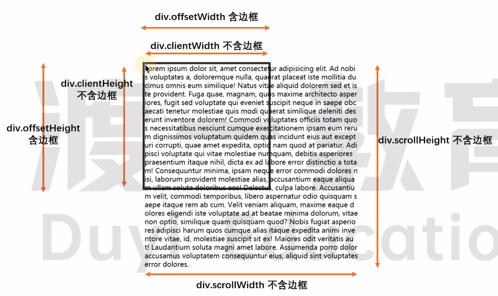

# 元素内容的滚动

## 获取宽高

如果内容超出元素, `dom.scrollWidth` 表示内容所占的宽度, `dom.scrollHeight` 表示内容所占的高度.

```html
<div id="box">
    Lorem, ipsum dolor sit amet consectetur adipisicing elit. Ipsam recusandae suscipit possimus architecto sunt debitis
    voluptatem fuga, animi quibusdam eos explicabo eaque, libero dolore dolores quidem! Sed ipsa corporis accusantium?
</div>
```

```css
#box {
    width: 200px;
    height: 200px;
    background-color: bisque;
    border: 10px solid pink;
}
```

```js
box.addEventListener("click", (e) => {
    console.log("clientHeight", e.target.clientHeight); // clientHeight 200
    console.log("offsetHeight", e.target.offsetHeight); // offsetHeight 220
    console.log("scrollHeight", e.target.scrollHeight); // scrollHeight 227
    console.log("height", parseInt(getComputedStyle(e.target).height)); // height 200
});
```

<br>

如果内容没有超出元素, `dom.scrollWidth` 表示元素所占的宽度, `dom.scrollHeight` 表示元素所占的高度.

```css
#box {
    width: 300px;
    height: 300px;
    background-color: bisque;
    border: 10px solid pink;
}
```

```js
box.addEventListener("click", (e) => {
    console.log("clientHeight", e.target.clientHeight); // clientHeight 300
    console.log("offsetHeight", e.target.offsetHeight); // offsetHeight 320
    console.log("scrollHeight", e.target.scrollHeight); // scrollHeight 300
    console.log("height", parseInt(getComputedStyle(e.target).height)); // height 300
});
```

<br>



<br>

## 获取/设置滚动的距离

1.  `dom.scrollTop` [获取] / [设置] 元素内容在垂直方向上的滚动距离
2.  `dom.scrollLeft` [获取] / [设置] 元素内容在水平方向上的滚动距离


<br>

```css
#box {
    width: 200px;
    height: 200px;
    background-color: bisque;
    border: 10px solid pink;
    overflow: auto;
}
```

```js
box.addEventListener("scroll", (e) => {
    console.log("========================================");
    console.log("scrollHeight", e.target.scrollHeight); // scrollHeight 227
    console.log("clientHeight", e.target.clientHeight); // clientHeight 200
    console.log("scrollTop", e.target.scrollTop);
    console.log("距离元素底部距离", e.target.scrollHeight - e.target.scrollTop - e.target.clientHeight);
});

box.addEventListener("click", (e) => {
    e.target.scrollTop = e.target.scrollTop + 5;
});
```

<br><br>

# 页面的滚动

## 获取页面宽高

1.  `window.innerWidth`,`window.innerHeight` (包括滚动条, 不包括浏览器边框和工具栏)
2.  `window.outerWidth`,`window.outerHeight` (包括滚动条, 且包括浏览器边框和工具栏)


<br>

## 获取页面的位置

1. `window.screenLeft`: 浏览器窗口到屏幕左边缘的 CSS 像素距离数值
2. `window.screenTop`: 浏览器窗口到屏幕上边缘的 CSS 像素距离数值

<br>

## 获取页面滚动距离

1.  `window.scrollX` / `window.pageXOffset`: 水平方向上滚动的像素值
2.  `window.scrollY` / `window.pageYOffset`: 垂直方向上滚动的像素值

<br><br>

# overscroll-behavior

用于控制浏览器过度滚动时的表现.

默认情况下, 当触及页面 (或其他可滚动区域) 的顶部或者底部时, 移动端浏览器倾向于提供一种 "触底" 效果, 甚至进行页面刷新. 可以发现, 当对话框中含有可滚动内容时, 一旦滚动至对话框的边界, 对话框下方的页面内容也会开始滚动, 这被称为 "滚动链".

在某些情况下我们不想要这些表现, 使用 `overscroll-behavior` 来去除不需要的滚动链, 以及应用下拉刷新效果等.

<br>

1.  `auto` 默认值
2.  `contain` 默认的滚动边界行为不变 ("触底"效果或者刷新), 但临近的滚动区域不会被滚动链影响 (比如对话框后方的页面不会滚动)
3.  `none` 临近滚动区域不受到滚动链影响, 而且默认的滚动到边界的表现也被阻止

<br>

可以使用两个关键字来指定 `overscroll-behavior` 分别在 x 和 y 轴的值. 只用一个值的话, x 和 y 轴都被指定为该值:

```css
overscroll-behavior: auto contain;
```

<br>
