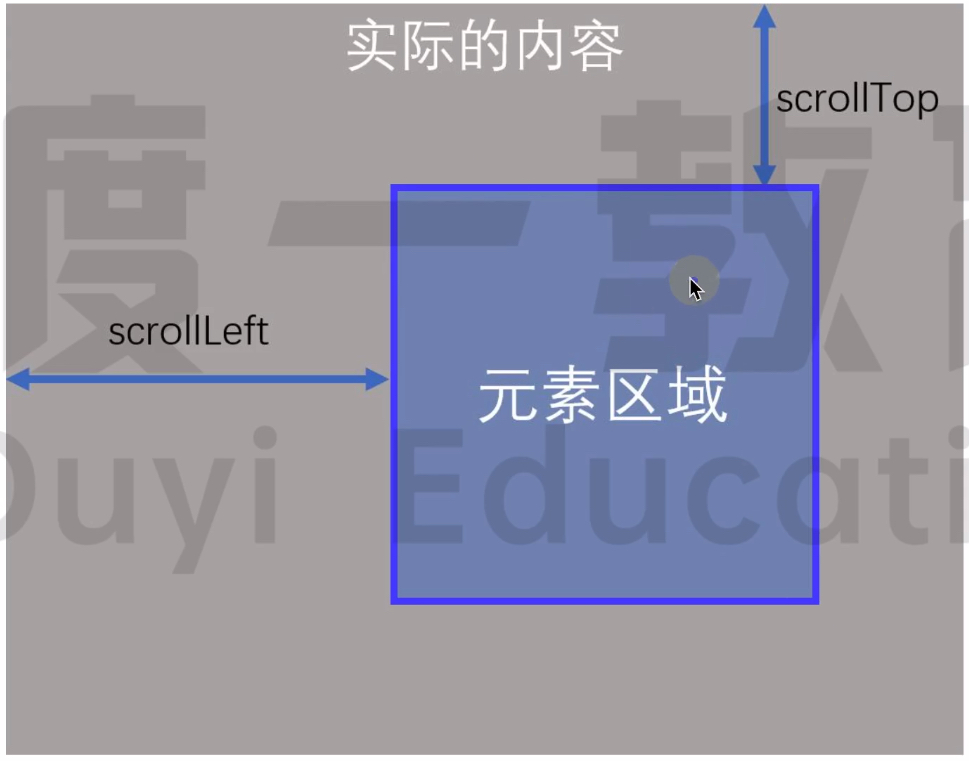

# 元素内容的滚动

## 获取宽高

如果内容超出元素, `dom.scrollWidth` 表示内容所占的宽度,`dom.scrollHeight` 表示内容所占的高度.

```html
<div id="box">
    Lorem, ipsum dolor sit amet consectetur adipisicing elit. Ipsam recusandae suscipit possimus architecto sunt debitis
    voluptatem fuga, animi quibusdam eos explicabo eaque, libero dolore dolores quidem! Sed ipsa corporis accusantium?
</div>
```

```css
#box {
    width: 200px;
    height: 200px;
    background-color: bisque;
    border: 10px solid pink;
}
```

```js
box.addEventListener("click", (e) => {
    console.log("clientHeight", e.target.clientHeight); // clientHeight 200
    console.log("offsetHeight", e.target.offsetHeight); // offsetHeight 220
    console.log("scrollHeight", e.target.scrollHeight); // scrollHeight 227
    console.log("height", parseInt(getComputedStyle(e.target).height)); // height 200
});
```

<br>

如果内容没有超出元素, `dom.scrollWidth` 表示元素所占的宽度,`dom.scrollHeight` 表示元素所占的高度.

```css
#box {
    width: 300px;
    height: 300px;
    background-color: bisque;
    border: 10px solid pink;
}
```

```js
box.addEventListener("click", (e) => {
    console.log("clientHeight", e.target.clientHeight); // clientHeight 300
    console.log("offsetHeight", e.target.offsetHeight); // offsetHeight 320
    console.log("scrollHeight", e.target.scrollHeight); // scrollHeight 300
    console.log("height", parseInt(getComputedStyle(e.target).height)); // height 300
});
```

<br>


<br>

## 获取/设置滚动的距离

1.  `dom.scrollTop` [获取] / [设置] 元素内容在垂直方向上的滚动距离
2.  `dom.scrollLeft` [获取] / [设置] 元素内容在水平方向上的滚动距离



<br>

```css
#box {
    width: 200px;
    height: 200px;
    background-color: bisque;
    border: 10px solid pink;
    overflow: auto;
}
```

```js
box.addEventListener("scroll", (e) => {
    console.log("========================================");
    console.log("scrollHeight", e.target.scrollHeight); // scrollHeight 227
    console.log("clientHeight", e.target.clientHeight); // clientHeight 200
    console.log("scrollTop", e.target.scrollTop);
    console.log("距离元素底部距离", e.target.scrollHeight - e.target.scrollTop - e.target.clientHeight);
});

box.addEventListener("click", (e) => {
    e.target.scrollTop = e.target.scrollTop + 5;
});
```

<br><br>

# scrollIntoView

用于滚动 dom.parentElement, 使 dom 对用户可见.

```
dom.scrollIntoView()
dom.scrollIntoView(alignToTop)
dom.scrollIntoView(scrollIntoViewOptions)
```

<br>

## alignToTop 参数

`el.scrollIntoView(alignToTop)` 中的 `alignToTop` 默认为 `true`, 能使元素的顶端和滚动容器对齐, 否则元素的底端和滚动容器对齐.

```js
dom.scrollIntoView();
dom.scrollIntoView(true);
```


```js
dom.scrollIntoview(false);
```


<br>

注意: `alignToTop` 用于设置「垂直方向」上的滚动; 如果是「水平方向」的滚动, 则会忽略 `alignToTop`.

```js
// 水平滚动下, 以下 3 种写法作用相同
dom.scrollIntoview();
dom.scrollIntoview(true);
dom.scrollIntoview(false);
```

<br>

## scrollIntoViewOptions 参数

`el.scrollIntoView(scrollIntoViewOptions)` 中的 `scrollIntoViewOptions` 是一个对象, 包含 behavior,block,inline.

<br>

**`behavior`: 定义滚动动画**

1.  `auto` - 默认值; 滚动行为由 scroll-behavior 的计算值决定
2.  `smooth` - 平滑滚动
3.  `instant` - 无动画, 直接跳转

`behavior` 默认情况下是 `auto`, 也就是由 CSS scroll-behavior 属性决定, 如果我们给滚动容器添加了这个属性:

```css
.list {
    scroll-behavior: smooth;
}
```

这样, 在不传递任何参数的情况下, 也能实现平滑滚动:

```js
dom.scrollIntoView();
```

一般情况下推荐使用 CSS 方式.

<br>

**`block`: 定义「垂直方向」上的对齐方式**

1.  `start` - 默认值; 元素顶部和滚动容器顶部对齐
2.  `center` - 元素和滚动容器居中对齐
3.  `end` - 元素底部和滚动容器底部对齐
4.  `nearest` - 如果已经在视野范围内, 就不滚动, 否则就滚动到顶部或者底部 (哪个更靠近就滚到哪里)

```js
// 以下写法
dom.scrollIntoView({
    block: "start",
});
dom.scrollIntoView({
    block: "end",
});
// 等同于
dom.scrollIntoView(true);
dom.scrollIntoView(false);
```

`center` 是一个比较实用的属性, 可以让元素一直处于中间位置, 非常适合上一个,下一个切换的场景

<br>

**`inline`: 定义「水平方向」上的对齐方式**

1.  `start` - 元素左侧和滚动容器左侧对齐
2.  `center` - 元素和滚动容器居中对齐
3.  `end` - 元素右侧和滚动容器右侧对齐
4.  `nearest`- 默认值; 如果已经在视野范围内, 就不滚动, 否则就滚动到左边或者右边 (哪个更靠近就滚到哪里)

有没有发现？`block` 和 `inline` 的默认值是不一样的, 这也是为什么在水平滚动下, `scrollIntoView(true)` 和 `scrollIntoView(false)` 效果完全一致了, 就是因为水平方向上已经在可视区了, 所以不会有任何滚动.

<br>

## scrollIntoView 的边距

大家发现没, 在使用 `start`,`end` 这些属性值的时候, 元素滚动到视野范围之内都是紧靠边缘的.

视觉上有点不好看, 有没有办法预留一点空间呢？

当然有, 不过不是 scrollIntoView 本身, 而是需要借助 CSS 中的 「scroll-margin」属性:

```css
.item {
    scroll-margin: 10px;
}
```


和 scroll-margin 比较类似的还有一个 scroll-padding, 功能都是一样的, 只是作用对象不一样. scroll-margin 是直接设置目前元素上的, scroll-padding 不一样, 它需要设置在滚动容器上, 比如:

```css
html {
    scroll-padding: 6rem;
}
```

<br><br>

# 页面的滚动

## 获取页面宽高

1.  `window.innerWidth`,`window.innerHeight` (包括滚动条, 不包括浏览器边框和工具栏)
2.  `window.outerWidth`,`window.outerHeight` (包括滚动条, 且包括浏览器边框和工具栏)


<br>

## 获取页面的位置

1. `window.screenLeft`: 浏览器窗口到屏幕左边缘的 CSS 像素距离数值
2. `window.screenTop`: 浏览器窗口到屏幕上边缘的 CSS 像素距离数值

<br>

## 获取页面滚动距离

1.  `window.scrollX` / `window.pageXOffset`: 水平方向上滚动的像素值
2.  `window.scrollY` / `window.pageYOffset`: 垂直方向上滚动的像素值

<br>

## 设置页面/元素滚动

页面/元素滚动到指定位置:

1.  `window.scrollTo(x-coord, y-coord)` / `ele.scroll(x-coord, y-coord)`
2.  `window.scrollTo(options)` / `ele.scroll(options)`

```js
window.scrollTo(0, 100);
```

```javascript
window.scrollTo({
    top: 100,
    left: 100,
    behavior: "smooth",
});
```

<br>

页面/元素滚动指定距离:

1.  `window.scrollBy(x-coord, y-coord)` / `ele.scrollBy(x-coord, y-coord)`
2.  `window.scrollBy(options)` / `ele.scrollBy(options)`

```js
window.scrollBy(0, 100);
```

```javascript
window.scrollBy({
    top: 100,
    left: 0,
    behavior: "smooth",
});
```

<br><br>

# 滚动样式

## scroll-behavior

用于指定滚动行为, `auto` 表示滚动框立即滚动,`smooth` 表示滚动框平滑滚动.

```css
scroll-behavior: smooth;
```

<br>

## overscroll-behavior

用于控制浏览器过度滚动时的表现.

默认情况下, 当触及页面 (或其他可滚动区域) 的顶部或者底部时, 移动端浏览器倾向于提供一种 "触底" 效果, 甚至进行页面刷新. 可以发现, 当对话框中含有可滚动内容时, 一旦滚动至对话框的边界, 对话框下方的页面内容也会开始滚动, 这被称为 "滚动链".

在某些情况下我们不想要这些表现, 使用 `overscroll-behavior` 来去除不需要的滚动链, 以及应用下拉刷新效果等.

<br>

1.  `auto` 默认值
2.  `contain` 默认的滚动边界行为不变 ("触底"效果或者刷新), 但临近的滚动区域不会被滚动链影响 (比如对话框后方的页面不会滚动)
3.  `none` 临近滚动区域不受到滚动链影响, 而且默认的滚动到边界的表现也被阻止

<br>

可以使用两个关键字来指定 `overscroll-behavior` 分别在 x 和 y 轴的值. 只用一个值的话, x 和 y 轴都被指定为该值:

```css
overscroll-behavior: auto contain;
```

<br>
