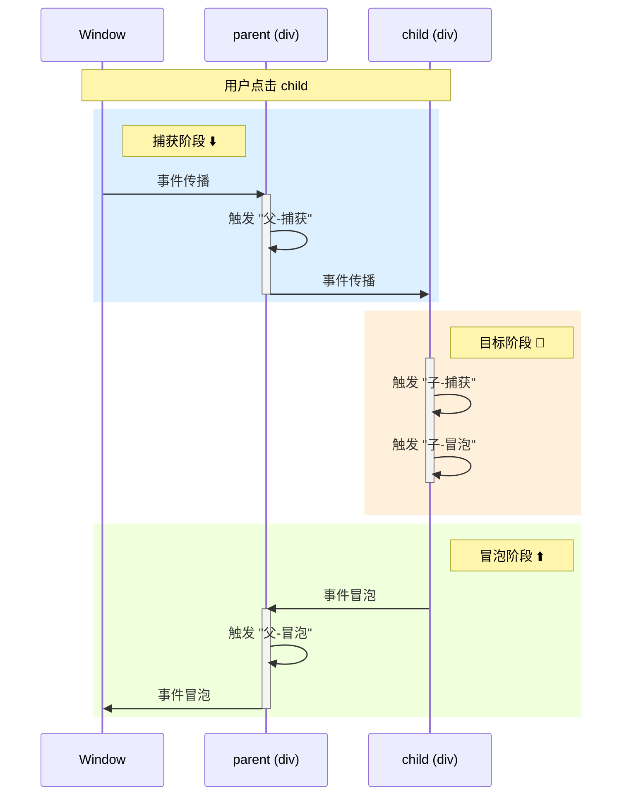

# 事件的用法

## 事件绑定

**DOM0:**

通过元素的 `on事件类型` 属性绑定:

```js
const btn = document.getElementById("btn");

btn.onclick = function (event) {
    console.log("按钮被点击");
};
```

**特点:**

-   同一事件类型只能绑定一个处理函数 (后绑定会覆盖前面的)
-   只能在冒泡阶段触发

<br>

**DOM2 (推荐):**

使用 `addEventListener` 方法绑定:

```js
element.addEventListener(type, listener, options);
```

**参数说明:**

-   `type`: 事件类型字符串 (不带 `on` 前缀), 如 `'click'`, `'keydown'`
-   `listener`: 事件处理函数 / 包含 `handleEvent` 方法的对象
-   `options`: 配置对象 / 布尔值 (`{ capture: Boolean }` 的简写)

**配置对象属性:**

| 属性      | 类型        | 默认值                            | 说明                                                  |
| --------- | ----------- | --------------------------------- | ----------------------------------------------------- |
| `capture` | Boolean     | `false`                           | `true` 表示在捕获阶段触发, `false` 表示在冒泡阶段触发 |
| `once`    | Boolean     | `false`                           | `true` 表示监听器触发一次后自动移除                   |
| `passive` | Boolean     | 特定事件为 `true`, 一般为 `false` | `true` 表示永远不会调用 `preventDefault()`            |
| `signal`  | AbortSignal | -                                 | 通过 `AbortController` 控制监听器的移除               |

**使用示例:**

```js
const btn = document.getElementById("btn");

// 基础用法
btn.addEventListener("click", function (event) {
    console.log("点击事件触发");
});

// 捕获阶段触发
btn.addEventListener("click", handler, true);
// 或者
btn.addEventListener("click", handler, { capture: true });

// 一次性监听器
btn.addEventListener("click", handler, { once: true });

// 使用 AbortSignal 控制移除
const controller = new AbortController();
btn.addEventListener("click", handler, { signal: controller.signal });
controller.abort(); // 移除监听器
```

**监听器可以是对象:**

```js
const handler = {
    handleEvent(event) {
        console.log(`事件类型: ${event.type}`);
    },
};

btn.addEventListener("click", handler);
```

**推荐使用 `addEventListener` 的理由:**

1. 可为同一事件类型绑定多个监听器, 按绑定顺序依次执行
2. 可精确控制在捕获/冒泡阶段触发
3. 适用范围广: Element, Document, Window, XMLHttpRequest 等所有 EventTarget 对象
4. 提供更丰富的配置选项

<br>

## 事件解绑

**DOM0:**

```js
element.onclick = null;
```

<br>

**DOM2:**

```js
element.removeEventListener(type, listener, options);
```

**注意事项:**

-   必须使用相同的 `listener` 函数引用 (匿名函数无法解绑)
-   `capture` 参数必须与绑定时一致
-   其他配置项 (`once`, `passive`, `signal`) 无需匹配

```js
// ❌ 错误示例: 无法解绑匿名函数
btn.addEventListener("click", () => console.log("clicked"));
btn.removeEventListener("click", () => console.log("clicked")); // 无效

// ✅ 正确示例
function handleClick() {
    console.log("clicked");
}
btn.addEventListener("click", handleClick);
btn.removeEventListener("click", handleClick); // 有效
```

<br><br>

# 事件流

当用户在网页上触发某个事件时 (如点击一个嵌套元素), 事件会按照特定顺序在 DOM 树上传播, 这个过程称为 **事件流 (Event Flow)**.

事件流包含三个阶段:

1. **捕获阶段 (Capturing Phase)**: 事件从 `Window` → `Document` → `<html>` → ... → 目标元素的父级
2. **目标阶段 (Target Phase)**: 事件到达目标元素本身
3. **冒泡阶段 (Bubbling Phase)**: 事件从目标元素的父级 → ... → `<html>` → `Document` → `Window`

<br>

## 事件触发顺序

点击一个嵌套元素时, 事件会按照以下顺序触发:

```html
<div id="parent">
    parent
    <div id="child">child</div>
</div>
```

```js
parent.addEventListener("click", () => console.log("父-捕获"), true);
child.addEventListener("click", () => console.log("子-捕获"), true);
child.addEventListener("click", () => console.log("子-冒泡"), false);
parent.addEventListener("click", () => console.log("父-冒泡"), false);

// 点击 child, 输出顺序:
// 1. 父-捕获
// 2. 子-捕获
// 3. 子-冒泡
// 4. 父-冒泡
```

**可视化流程:**



<br>

## 特殊情况: 目标元素

当事件到达目标元素本身时, **先执行捕获阶段的监听器, 再执行冒泡阶段的监听器**:

```js
child.addEventListener("click", () => console.log("A-冒泡"), false);
child.addEventListener("click", () => console.log("B-捕获"), true);
child.addEventListener("click", () => console.log("C-冒泡"), false);

// 点击 child, 输出顺序:
// B-捕获 → A-冒泡 → C-冒泡 (捕获阶段优先, 同阶段按绑定顺序)
```

**规则:**

1. 目标元素上的捕获监听器先执行
2. 目标元素上的冒泡监听器后执行
3. 同阶段的监听器按绑定顺序执行

<br><br>
