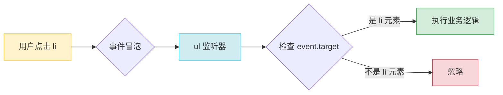

# passive 性能优化

## 作用原理

`passive: true` 告诉浏览器: "这个监听器不会调用 `preventDefault()`", 浏览器可以立即执行默认行为 (如滚动), 无需等待 JS 代码执行完毕.

```js
// 未设置 passive 时的执行流程:
// 1. 用户滚动 → 2. 触发事件 → 3. 等待 JS 执行 → 4. 检查是否调用 preventDefault()
// 5. 如果没有调用, 才执行滚动 → 可能造成卡顿

// 设置 passive: true 后的执行流程:
// 1. 用户滚动 → 2. 立即执行滚动 + 并行触发事件 → 流畅
```

<br>

## 浏览器默认行为

根据规范, `passive` 默认为 `false`, 但大部分浏览器 (Safari 除外) 对以下情况做了优化:

**文档级节点** (`Window`, `Document`, `Document.body`) 的以下事件, `passive` 默认为 `true`:

-   `wheel`
-   `mousewheel`
-   `touchstart`
-   `touchmove`

<br>

## 使用建议

```js
// ✅ 纯粹的监听逻辑, 不阻止默认行为
document.addEventListener(
    "touchstart",
    (e) => {
        console.log("触摸开始");
    },
    { passive: true }
);

// ❌ 如果需要阻止默认行为, 必须设置 passive: false
document.addEventListener(
    "touchstart",
    (e) => {
        e.preventDefault(); // 需要阻止默认滚动
    },
    { passive: false }
);
```

<br>

## 常见警告

当你在 `passive: true` 的监听器中调用 `preventDefault()` 时, 浏览器会:

1. **忽略这个调用** - 继续执行默认行为 (如滚动)
2. **在控制台产生警告** - 提醒你这是无效操作

```js
element.addEventListener(
    "wheel",
    (e) => {
        e.preventDefault(); // 尝试阻止滚动
    },
    { passive: true }
);

// ⚠️ 控制台警告:
// Unable to preventDefault inside passive event listener invocation.
```

**原因分析:**

设置 `passive: true` 就是在告诉浏览器 "我保证不会调用 `preventDefault()`", 但如果你违反了这个承诺, 浏览器会:

-   为了性能, 忽略你的 `preventDefault()` 调用
-   产生警告, 提示你代码逻辑矛盾

**正确做法:**

```js
// 如果需要调用 preventDefault(), 必须设置 passive: false
element.addEventListener(
    "wheel",
    (e) => {
        e.preventDefault(); // ✅ 会生效
    },
    { passive: false }
);
```

<br><br>

# 事件委托

## 原理

利用事件冒泡机制, 将子元素的事件统一委托给父元素处理, 通过 `event.target` 获取真正触发事件的元素.



<br>

## 基础示例

```html
<ul id="list">
    <li>项目 1</li>
    <li>项目 2</li>
    <li>项目 3</li>
</ul>

<script>
    // ❌ 传统方式: 循环绑定
    const items = document.querySelectorAll("li");
    items.forEach((item) => {
        item.addEventListener("click", () => {
            console.log(item.textContent);
        });
    });

    // ✅ 事件委托: 绑定父元素
    list.addEventListener("click", (e) => {
        if (e.target.tagName === "LI") {
            console.log(e.target.textContent);
        }
    });
</script>
```

<br>

## 优势

### 1. 性能优化

减少事件监听器数量, 降低内存占用.

```js
// 假设有 1000 个列表项
// 传统方式: 1000 个监听器
// 事件委托: 1 个监听器
```

<br>

### 2. 动态元素支持

无需为动态添加的元素单独绑定事件.

```js
list.addEventListener("click", (e) => {
    if (e.target.classList.contains("item")) {
        console.log("点击了", e.target.textContent);
    }
});

// 新增元素会自动支持事件
const newItem = document.createElement("li");
newItem.className = "item";
newItem.textContent = "新项目";
list.append(newItem); // 点击 newItem 也会触发事件
```

<br>

## 注意事项

### 1. 精确匹配目标元素

使用 `closest()` 处理嵌套元素:

```js
// ❌ 可能点到按钮内的图标
button.addEventListener("click", (e) => {
    if (e.target.tagName === "BUTTON") {
        // 如果点击到 <span>, 不会触发
    }
});

// ✅ 向上查找最近的按钮
container.addEventListener("click", (e) => {
    const btn = e.target.closest(".btn");
    if (btn) {
        // 点击按钮或其子元素都会触发
    }
});
```

<br>

### 2. 不适合不冒泡的事件

以下事件不冒泡, 无法使用事件委托:

-   `focus`,`blur`
-   `mouseenter`,`mouseleave`
-   `load`,`unload`,`scroll` (部分元素)

**解决方案:** 使用冒泡版本 (`focusin`,`focusout`) 或直接绑定.

<br>

### 3. 性能权衡

如果父元素范围过大 (如 `document`), 每次点击都会触发事件处理函数, 需要谨慎使用.

```js
// ⚠️ 性能问题: 页面任意位置点击都会执行
document.addEventListener("click", (e) => {
    if (e.target.matches(".my-button")) {
        // ...
    }
});

// ✅ 更好的做法: 缩小委托范围
toolbar.addEventListener("click", (e) => {
    if (e.target.matches(".button")) {
        // ...
    }
});
```

<br>
