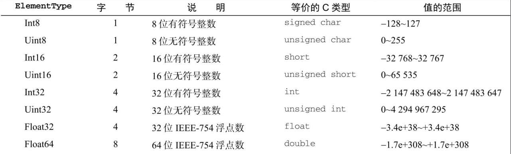

# ArrayBuffer

ArrayBuffer 是一个普通的 JS 构造函数, 可用于在内存中分配特定数量的字节空间.

```js
const buf = new ArrayBuffer(16); // 在内存中分配 16 字节
console.log(buf.byteLength); // 16
```

ArrayBuffer 一经创建就不能再调整大小. 不过, 可以使用 slice 复制其全部或部分到一个新实例中:

```js
const buf1 = new ArrayBuffer(16);
const buf2 = buf1.slice(4, 12);
console.log(buf2.byteLength); // 8
```

-   ArrayBuffer 在分配失败时会抛出错误.
-   ArrayBuffer 分配的内存不能超过 `Number.MAX_SAFE_INTEGER`(`2^53-1`) 字节.
-   声明 ArrayBuffer 会将所有二进制位初始化为 0.
-   通过声明 ArrayBuffer 分配的堆内存可以被当成垃圾回收, 不用手动释放.

要读取或写入 ArrayBuffer, 就必须通过视图.

<br><br>

# DataView

第一种允许你读写 ArrayBuffer 的视图是 DataView. 这个视图专为文件 I/O 和网络 I/O 设计, 其 API 支持对缓冲数据的高度控制, 但相比于其他类型的视图性能也差一些. DataView 对缓冲内容没有任何预设, 也不能迭代.

必须在对已有的 ArrayBuffer 读取或写入时才能创建 DataView 实例. 这个实例可以使用全部或部分 ArrayBuffer, 且维护着对该缓冲实例的引用, 以及视图在缓冲中开始的位置.

```js
const buf = new ArrayBuffer(16);

// DataView 默认使用整个 ArrayBuffer
const fullDataView = new DataView(buf);
console.log(fullDataView.byteOffset); // 0
console.log(fullDataView.byteLength); // 16
console.log(fullDataView.buffer === buf); // true

// 构造函数接收两个可选参数: 字节偏移量,字节长度
//    byteOffset = 0 表示视图从缓冲起点开始
//    byteLength = 8 限制视图为前 8 个字节
const firstHalfDataView = new DataView(buf, 0, 8);
console.log(firstHalfDataView.byteOffset); // 0
console.log(firstHalfDataView.byteLength); // 8
console.log(firstHalfDataView.buffer === buf); // true

// 如果不指定, 则 DataView 会使用剩余的缓冲
//    byteOffset = 8 表示视图从缓冲的第 9 个字节开始
//    byteLength 未指定, 默认为剩余缓冲
const secondHalfDataView = new DataView(buf, 8);
console.log(secondHalfDataView.byteOffset); // 8
console.log(secondHalfDataView.byteLength); // 8
console.log(secondHalfDataView.buffer === buf); // true
```

要通过 DataView 读取缓冲, 还需要几个组件.

-   首先是要读或写的字节偏移量. 可以看成 DataView 中的某种 "地址".
-   DataView 应该使用 ElementType 来实现 JS 的 Number 类型到缓冲内二进制格式的转换.
-   最后是内存中值的字节序. 默认为大端字节序.

<br>

## ElementType

DataView 对存储在缓冲内的数据类型没有预设. 它暴露的 API 强制开发者在读,写时指定一个 ElementType, 然后 DataView 就会忠实地为读,写而完成相应的转换.

ES6 支持 8 种不同的 ElementType:


DataView 为上表中的每种类型都暴露了 get 和 set 方法, 这些方法使用 byteOffset (字节偏移量) 定位要读取或写入值的位置. 类型是可以互换使用的, 如下例所示:

```js
// 在内存中分配两个字节并声明一个 DataView
const buf = new ArrayBuffer(2);
const view = new DataView(buf);

// 说明整个缓冲确实所有二进制位都是 0
// 检查第一个和第二个字符
console.log(view.getInt8(0)); // 0
console.log(view.getInt8(1)); // 0

// 检查整个缓冲
console.log(view.getInt16(0)); // 0

// 将整个缓冲都设置为 1
// 255 的二进制表示是 11111111 (2^8-1)
view.setUint8(0, 255);

// DataView 会自动将数据转换为特定的 ElementType
// 255 的十六进制表示是 0xFF
view.setUint8(1, 0xff);

// 现在, 缓冲里都是 1 了
// 如果把它当成二补数的有符号整数, 则应该是 -1
console.log(view.getInt16(0)); // -1
```

<br>

## 字节序

前面例子中的缓冲有意回避了字节序的问题. "字节序" 指的是计算系统维护的一种字节顺序的约定. DataView 只支持两种约定: 大端字节序和小端字节序. 大端字节序也称为 "网络字节序", 意思是最高有效位保存在第一个字节, 而最低有效位保存在最后一个字节. 小端字节序正好相反, 即最低有效位保存在第一个字节, 最高有效位保存在最后一个字节.

JS 运行时所在系统的原生字节序决定了如何读取或写入字节, 但 DataView 并不遵守这个约定. 对一段内存而言, DataView 是一个中立接口, 它会遵循你指定的字节序. DataView 的所有 API 方法都以大端字节序作为默认值, 但接收一个可选的布尔值参数, 设置为 true 即可启用小端字节序.

```js
// 在内存中分配两个字节并声明一个 DataView
const buf = new ArrayBuffer(2);
const view = new DataView(buf);

// 填充缓冲, 让第一位和最后一位都是 1
view.setUint8(0, 0x80); // 设置最左边的位等于 1
view.setUint8(1, 0x01); // 设置最右边的位等于 1
// 缓冲内容 (为方便阅读, 人为加了空格)
// 0x8   0x0   0x0   0x1
// 1000000000000001

// 按大端字节序读取 Uint16
// 0x80 是高字节, 0x01 是低字节
// 0x8001 = 2^15 + 2^0 = 32768 + 1 = 32769
console.log(view.getUint16(0)); // 32769

// 按小端字节序读取 Uint16
// 0x01 是高字节, 0x80 是低字节
// 0x0180 = 2^8 + 2^7 = 256 + 128 = 384
console.log(view.getUint16(0, true)); // 384

// 按大端字节序写入 Uint16
view.setUint16(0, 0x0004);
// 缓冲内容 (为方便阅读, 人为加了空格)
// 0x0   0x0   0x0   0x4
// 0000000000000100
console.log(view.getUint8(0)); // 0
console.log(view.getUint8(1)); // 4

// 按小端字节序写入Uint16
view.setUint16(0, 0x0002, true);
// 缓冲内容 (为方便阅读, 人为加了空格)
// 0x0   0x2   0x0   0x0
// 0000001000000000
console.log(view.getUint8(0)); // 2
console.log(view.getUint8(1)); // 0
```

<br>

## 边界情形

DataView 完成读,写操作的前提是必须有充足的缓冲区, 否则就会抛出 RangeError:

```js
const buf = new ArrayBuffer(6);
const view = new DataView(buf);

// 尝试读取部分超出缓冲范围的值
view.getInt32(4); // RangeError

// 尝试读取超出缓冲范围的值
view.getInt32(8); // RangeError

// 尝试读取超出缓冲范围的值
view.getInt32(-1); // RangeError

// 尝试写入超出缓冲范围的值
view.setInt32(4, 123); // RangeError
```

DataView 在写入缓冲里会尽最大努力把一个值转换为适当的类型, 后备为 0. 如果无法转换, 则抛出错误:

```js
const buf = new ArrayBuffer(1);
const view = new DataView(buf);

view.setInt8(0, 1.5);
console.log(view.getInt8(0)); // 1

view.setInt8(0, [4]);
console.log(view.getInt8(0)); // 4

view.setInt8(0, "f");
console.log(view.getInt8(0)); // 0

view.setInt8(0, Symbol()); // TypeError
```

<br><br>

# 定型数组

定型数组是另一种形式的 ArrayBuffer 视图. 虽然概念上与 DataView 接近, 但定型数组的区别在于, 它特定于一种 ElementType 且遵循系统原生的字节序. 相应地, 定型数组提供了适用面更广的 API 和更高的性能. 设计定型数组的目的就是提高与 WebGL 等原生库交换二进制数据的效率. 由于定型数组的二进制表示对操作系统而言是一种容易使用的格式, JS 引擎可以重度优化算术运算,按位运算和其他对定型数组的常见操作, 因此使用它们速度极快.

创建定型数组的方式包括读取已有的缓冲,使用自有缓冲,填充可迭代结构, 以及填充基于任意类型的定型数组. 另外, 通过 `<ElementType>.from()` 和`<ElementType>.of()` 也可以创建定型数组:

```js
// 创建一个 12 字节的缓冲
const buf = new ArrayBuffer(12);
// 创建一个引用该缓冲的 Int32Array
const ints = new Int32Array(buf);
// 这个定型数组知道自己的每个元素需要 4 字节
// 因此长度为 3
console.log(ints.length); // 3

// 创建一个长度为 6 的 Int32Array
const ints2 = new Int32Array(6);
// 每个数值使用 4 字节, 因此 ArrayBuffer 是 24 字节
console.log(ints2.length); // 6
// 类似 DataView, 定型数组也有一个指向关联缓冲的引用
console.log(ints2.buffer.byteLength); // 24

// 创建一个包含 [2, 4, 6, 8] 的 Int32Array
const ints3 = new Int32Array([2, 4, 6, 8]);
console.log(ints3.length); // 4
console.log(ints3.buffer.byteLength); // 16
console.log(ints3[2]); // 6

// 通过复制 ints3 的值创建一个 Int16Array
const ints4 = new Int16Array(ints3);
// 这个新类型数组会分配自己的缓冲
// 对应索引的每个值会相应地转换为新格式
console.log(ints4.length); // 4
console.log(ints4.buffer.byteLength); // 8
console.log(ints4[2]); // 6

// 基于普通数组来创建一个 Int16Array
const ints5 = Int16Array.from([3, 5, 7, 9]);
console.log(ints5.length); // 4
console.log(ints5.buffer.byteLength); // 8
console.log(ints5[2]); // 7

// 基于传入的参数创建一个 Float32Array
const floats = Float32Array.of(3.14, 2.718, 1.618);
console.log(floats.length); // 3
console.log(floats.buffer.byteLength); // 12
console.log(floats[2]); // 1.6180000305175781
```

定型数组的构造函数和实例都有一个 BYTES_PER_ELEMENT 属性, 返回该类型数组中每个元素的大小:

```js
console.log(Int16Array.BYTES_PER_ELEMENT); // 2
console.log(Int32Array.BYTES_PER_ELEMENT); // 4

const ints = new Int32Array(1),
    floats = new Float64Array(1);
console.log(ints.BYTES_PER_ELEMENT); // 4
console.log(floats.BYTES_PER_ELEMENT); // 8
```

如果定型数组没有用任何值初始化, 则其关联的缓冲会以 0 填充:

```js
const ints = new Int32Array(4);
console.log(ints[0]); // 0
console.log(ints[1]); // 0
console.log(ints[2]); // 0
console.log(ints[3]); // 0
```

<br>

## 定型数组行为

从很多方面看, 定型数组与普通数组都很相似. 定型数组支持如下操作符,方法和属性:

-   `[]`: 读取或写入数组元素
-   `length`: 数组长度
-   `copyWithin()`: 复制数组元素
-   `entries()`: 返回一个迭代器, 用于遍历数组的索引和值
-   `every()`: 判断数组是否满足某个条件
-   `fill()`: 填充数组
-   `filter()`: 返回满足某个条件的数组元素
-   `find()`: 返回满足某个条件的第一个数组元素
-   `findIndex()`: 返回满足某个条件的第一个数组元素的索引
-   `forEach()`: 遍历数组
-   `indexOf()`: 返回数组元素的索引
-   `join()`: 将数组元素连接成字符串
-   `keys()`: 返回一个迭代器, 用于遍历数组的索引
-   `lastIndexOf()`: 返回数组元素的最后一个索引
-   `map()`: 返回一个新数组, 新数组的元素是对原数组元素的处理结果
-   `reduce()`: 从左到右遍历数组, 将数组元素组合成一个值
-   `reduceRight()`: 从右到左遍历数组, 将数组元素组合成一个值
-   `reverse()`: 反转数组元素的顺序
-   `slice()`: 返回数组的一个片段
-   `some()`: 判断数组是否有元素满足某个条件
-   `sort()`: 对数组元素进行排序
-   `toLocaleString()`: 返回数组元素的本地化字符串
-   `toString()`: 返回数组元素的字符串表示
-   `values()`: 返回一个迭代器, 用于遍历数组的值

其中, 返回新数组的方法也会返回包含同样元素类型 (element type) 的新定型数组:

```js
const ints = new Int16Array([1, 2, 3]);
const doubleints = ints.map((x) => 2 * x);
console.log(doubleints instanceof Int16Array); // true
```

定型数组有一个 Symbol.iterator 符号属性, 因此可以通过 `for..of` 循环和扩展操作符来操作:

```js
const ints = new Int16Array([1, 2, 3]);
for (const int of ints) {
    console.log(int); // 1 2 3
}
console.log(Math.max(...ints)); // 3
```

<br>

## 合并,复制和修改定型数组

定型数组同样使用数组缓冲来存储数据, 而数组缓冲无法调整大小. 因此, 下列方法不适用于定型数组:

-   `concat()`: 合并数组
-   `push()`: 向数组末尾添加元素
-   `pop()`: 从数组末尾删除元素
-   `shift()`: 从数组开头删除元素
-   `unshift()`: 向数组开头添加元素
-   `splice()`: 从数组中删除元素

不过, 定型数组也提供了两个新方法, 可以快速向外或向内复制数据: set 和 subarray.

set 从提供的数组或定型数组中把值复制到当前定型数组中指定的索引位置:

```js
// 创建长度为 8 的 int16 数组
const container = new Int16Array(8);

// 把定型数组复制为前 4 个值
// 偏移量默认为索引 0
container.set(Int8Array.of(1, 2, 3, 4));
console.log(container); // [1,2,3,4,0,0,0,0]

// 把普通数组复制为后4 个值
// 偏移量4 表示从索引4 开始插入
container.set([5, 6, 7, 8], 4);
console.log(container); // [1,2,3,4,5,6,7,8]

// 溢出会抛出错误
container.set([5, 6, 7, 8], 7); // RangeError
```

subarray 会基于从原始定型数组中复制的值返回一个新定型数组. 复制值时的开始索引和结束索引是可选的:

```js
const source = Int16Array.of(2, 4, 6, 8);

// 把整个数组复制为一个同类型的新数组
const fullCopy = source.subarray();
console.log(fullCopy); // [2, 4, 6, 8]

// 从索引 2 开始复制数组
const halfCopy = source.subarray(2);
console.log(halfCopy); // [6, 8]

// 从索引 1 开始复制到索引 3
const partialCopy = source.subarray(1, 3);
console.log(partialCopy); // [4, 6]
```

定型数组没有原生的拼接能力, 但使用定型数组 API 提供的很多工具可以手动构建:

```js
// 第一个参数是应该返回的数组类型
// 其余参数是应该拼接在一起的定型数组
function typedArrayConcat(typedArrayConstructor, ...typedArrays) {
    // 计算所有数组中包含的元素总数
    const numElements = typedArrays.reduce((x, y) => (x.length || x) + y.length);
    // 按照提供的类型创建一个数组, 为所有元素留出空间
    const resultArray = new typedArrayConstructor(numElements);
    // 依次转移数组
    let currentOffset = 0;
    typedArrays.map((x) => {
        resultArray.set(x, currentOffset);
        currentOffset += x.length;
    });
    return resultArray;
}
const concatArray = typedArrayConcat(
    Int32Array,
    Int8Array.of(1, 2, 3),
    Int16Array.of(4, 5, 6),
    Float32Array.of(7, 8, 9)
);
console.log(concatArray); // [1, 2, 3, 4, 5, 6, 7, 8, 9]
console.log(concatArray instanceof Int32Array); // true
```

<br>

## 下溢和上溢

定型数组中值的下溢和上溢不会影响到其他索引, 但仍然需要考虑数组的元素应该是什么类型. 定型数组对于可以存储的每个索引只接受一个相关位, 而不考虑它们对实际数值的影响. 以下代码演示了如何处理下溢和上溢:

```js
// 长度为 2 的有符号整数数组
// 每个索引保存一个二补数形式的有符号整数
// 范围是 -128 (-1 * 2^7) ~ 127 (2^7-1)
const ints = new Int8Array(2);

// 长度为 2 的无符号整数数组
// 每个索引保存一个无符号整数
// 范围是 0 ~ 255 (2^7-1)
const unsignedInts = new Uint8Array(2);

// 上溢的位不会影响相邻索引
// 索引只取最低有效位上的 8 位
unsignedInts[1] = 256; // 0x100
console.log(unsignedInts); // [0, 0]
unsignedInts[1] = 511; // 0x1FF
console.log(unsignedInts); // [0, 255]

// 下溢的位会被转换为其无符号的等价值
// 0xFF 是以二补数形式表示的 -1 (截取到 8 位) ,
// 但 255 是一个无符号整数
unsignedInts[1] = -1; // 0xFF (truncated to 8 bits)
console.log(unsignedInts); // [0, 255]

// 上溢自动变成二补数形式
// 0x80 是无符号整数的 128, 是二补数形式的 -128
ints[1] = 128; // 0x80
console.log(ints); // [0, -128]

// 下溢自动变成二补数形式
// 0xFF 是无符号整数的 255, 是二补数形式的 -1
ints[1] = 255; // 0xFF
console.log(ints); // [0, -1]
```

除了 8 种元素类型, 还有一种 "夹板" 数组类型: Uint8ClampedArray, 不允许任何方向溢出. 超出最大值 255 的值会被向下舍入为 255, 而小于最小值 0 的值会被向上舍入为 0.

```js
const clampedInts = new Uint8ClampedArray([-1, 0, 255, 256]);
console.log(clampedInts); // [0, 0, 255, 255]
```

按照 JS 之父 Brendan Eich 的说法: "Uint8ClampedArray 完全是 HTML5canvas 元素的历史留存. 除非真的做跟 canvas 相关的开发, 否则不要使用它. "

<br>
