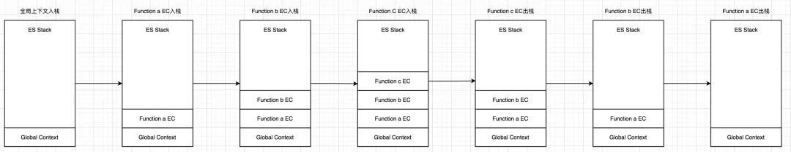
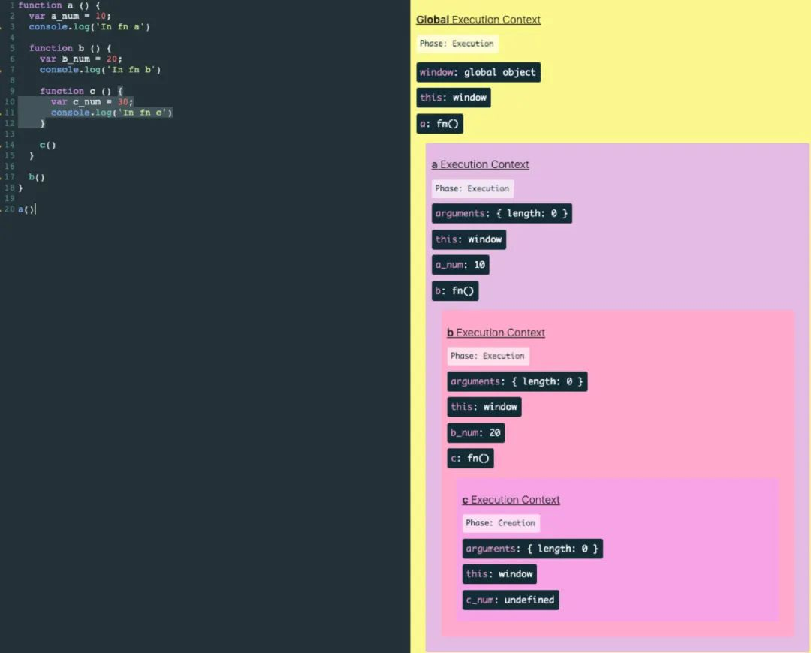

<br>

JS 代码的执行, 主要分为 2 个阶段: 编译阶段,执行阶段.

<br><br>

# 编译阶段

## 词法分析 (Lexing)

将字符串分解成 (对编程语言来说) 有意义的代码块, 这些代码块被称为词法单元 (token) .

例如 `var a = 2;` 这段程序通常会被分解成为下面这些词法单元: `var`,`a`,`=`,`2` ,`;`. 空格是否会被当作词法单元, 取决于空格在这门语言中是否具有意义.

```js
[
    {
        type: "Keyword",
        value: "var",
    },
    {
        type: "Identifier",
        value: "a",
    },
    {
        type: "Punctuator",
        value: "=",
    },
    {
        type: "Numeric",
        value: "2",
    },
    {
        type: "Punctuator",
        value: ";",
    },
];
```

<br>

## 语法分析 (Parsing)

将词法单元流 (即上述的数组) 转换成一个由元素逐级嵌套组成的,代表了程序语法结构的树.
这个树被称为 "抽象语法树" (Abstract Syntax Tree, AST).

```js
{
    "type": "Program",
    "body": [
        {
            "type": "VariableDeclaration",
            "declarations": [
                {
                    "type": "VariableDeclarator",
                    "id": {
                        "type": "Identifier",
                        "name": "a"
                    },
                    "init": {
                        "type": "Literal",
                        "value": 2,
                        "raw": "2"
                    }
                }
            ],
            "kind": "var"
        }
    ],
    "sourceType": "script"
}
```

在此过程中, 如果源代码不符合语法规则, 则会终止, 并抛出 "语法错误".

可以使用 [esprima](https://esprima.org/demo/parse.html#) 实时生成语法树~

<br>

## 代码生成

将 AST 转换为可执行代码的过程被称为代码生成. 这个过程与语言,目标平台等息息相关.

抛开具体细节, 简单来说就是有某种方法可以将 `var a = 2;` 的 AST 转化为一组机器指令, 用来创建一个叫作 `a` 的变量 (包括分配内存等) , 并将一个值储存在 `a` 中.

<br>

比起那些编译过程只有三个步骤的语言的编译器, JS 引擎要复杂得多. 例如, 在语法分析和代码生成阶段有特定的步骤来对运行性能进行优化, 包括对冗余元素进行优化等.

首先, JS 引擎不会有大量的 (像其他语言编译器那么多的) 时间用来进行优化, 因为与其他语言不同, JS 的编译过程不是发生在构建之前的.

对于 JS 来说, 大部分情况下编译发生在代码执行前的几微秒 (甚至更短！) 的时间内. 在我们所要讨论的作用域背后, JS 引擎用尽了各种办法 (比如 JIT, 可以延迟编译甚至实施重编译) 来保证性能最佳.

简单地说, 任何 JS 代码片段在执行前都要进行编译 (通常就在执行前) . 因此, JS 编译器首先会对 `var a = 2;` 这段程序进行编译, 然后做好执行它的准备, 并且通常马上就会执行它.

<br>

JIT (Just In Time):

1. 在 JS 引擎中增加一个监视器 (分析器). 监视器监控着代码的运行情况.
   如果同一行代码运行了几次, 这个代码段就被标记成了 "warm"; 如果运行了很多次, 则被标记成 "hot".
2. 如果一段代码变成了 "warm", JIT 就会把它送到**基线编译器**去编译, 并且把编译结果存储起来.
   如果监视器监视到了某行/变量执行了同样的代码,使用了同样的变量类型, 就会用编译后的结果替换掉这一行代码的执行,并存储.
3. 如果一段代码变成了 "hot", 监视器就会把它发送到**优化编译器**中. 生成一个更快速,高效的代码,并存储.
   例如: 循环给一个对象添加属性时, 假设属性是 INT 类型, 则优先做 INT 类型的判断.
4. 可是对于 JS 从来就没有确定这么一说, 前 99 个对象属性保持着 INT 类型, 可能第 100 个就没有这个属性了, 那么这时候 JIT 会认为做了一个错误的假设, 并把优化代码丢掉, 执行过程将会回到解释器/基线编译器, 这一过程叫做**反优化**.

<br>

对于 `var a = 2;` 这段程序时, 引擎认为这里有两个完全不同的声明, 一个由编译器在编译时处理, 另一个则由引擎在运行时处理.

编译器首先会将这段程序分解成词法单元, 然后将词法单元解析成一个树结构. 但是当编译器开始进行代码生成时, 它对这段程序的处理方式会和预期的有所不同.

可以合理地假设编译器所产生的代码能够用下面的伪代码进行概括: "为一个变量分配内存, 将其命名为 `a`, 然后将值 `2` 保存进这个变量. " 然而, 这并不完全正确.

事实上编译器会进行如下处理:

1.  遇到 `var a`, 编译器会询问作用域是否已经有一个该名称的变量存在于同一个作用域的集合中. 如果是, 编译器会忽略该声明, 继续进行编译; 否则它会要求作用域在当前作用域的集合中声明一个新的变量, 并命名为 `a`.
2.  接下来编译器会为引擎生成运行时所需的代码, 这些代码被用来处理 `a = 2` 这个赋值操作. 引擎运行时会首先询问作用域, 在当前的作用域集合中是否存在一个叫作 `a` 的变量. 如果是, 引擎就会使用这个变量; 如果否, 引擎会继续查找该变量.

如果引擎最终找到了 `a` 变量, 就会将 `2` 赋值给它. 否则引擎就会举手示意并抛出一个异常！

**总结**: 变量的赋值操作会执行两个动作, 首先编译器会在当前作用域中声明一个变量 (如果之前没有声明过) , 然后在运行时引擎会在作用域中查找该变量, 如果能够找到就会对它赋值.

<br><br>

# 执行阶段

## 执行上下文

-   [执行上下文] 是当前 JS 代码被解析和执行时所在环境的抽象概念.
-   遇到函数执行的时候, 就会创建一个 [执行上下文].
-   JS 中有 3 种执行上下文类型:
    ① 全局执行上下文 (只有一个)
    ② 函数执行上下文
    ③ eval
-   执行上下文的创建分为 2 个阶段创建:
    ① 创建阶段
    ② 执行阶段

<br>

## 创建阶段

-   在任意的 JS 代码被执行时, 执行上下文处于创建阶段.
-   在创建阶段中总共发生了 3 件事情:
    ① 确定 this 值, 也被称为 This Binding.
    ② LexicalEnvironment (词法环境), 组件被创建.
    ③ VariableEnvironment (变量环境), 组件被创建.

```js
ExecutionContext = {
    ThisBinding = <this value>, // 确定this
    LexicalEnvironment = { ... }, // 词法环境
    VariableEnvironment = { ... }, // 变量环境
}
```

<br>

## This Binding

在全局执行上下文中, this 指向全局对象. 在浏览器中, this 指向 window 对象.
在函数执行上下文中, this 的值取决于函数的调用方式. 如果它被一个对象引用调用, 那么 this 的值被设置为该对象, 否则 this 的值被设置为全局对象或 `undefined` (严格模式下) .

<br>

## 词法环境 Lexical Environment

-   词法环境是一个包含 [标识符-变量] 映射的结构.
-   在词法环境中, 有 2 个组成部分:
    ① 环境记录 (environment record): 存储变量和函数声明的实际位置.
    ② 对外部环境的引用: 意味着它可以访问其外部词法环境 (实现作用域链的重要部分).
-   词法环境有 2 种类型:
    ① 全局环境: 是一个没有外部环境的词法环境. 全局环境的外部环境引用为 `null`.
    它拥有一个全局对象 (window) 及其关联的方法和属性 & 用户自定义的全局变量.
    ② 函数环境: 用户在函数中定义的变量被存储在环境记录中.
    对外部环境的引用可以是全局环境, 也可以是包含内部函数的外部函数环境.
-   注意: 对于函数环境而言, [环境记录] 还包含 arguments 对象, 包含了 [索引-传递给函数的参数] 映射 & 传递给函数的参数的数量.

<br>

## 变量环境 Variable Environment

-   变量环境也是一个词法环境, 具有上面定义的词法环境的所有属性.
-   其 Environment Record 包含了由 Variable Statements 在此 [执行上下文] 创建的绑定.

```js
let a = 20;
const b = 30;
var c;

function multiply(e, f) {
    var g = 20;
    return e * f * g;
}

c = multiply(20, 30);
```

```js
/* 全局执行上下文 */
GlobalExecutionContext = {
    ThisBinding: <Global Object>,

    LexicalEnvironment: {
        EnvironmentRecord: {
            Type: "Object",
            // 标识符绑定在这里
            a: <uninitialized>,
            b: <uninitialized>,
            multiply: <func>,
        },
        outer: <null>,
    },

    VariableEnvironment: {
        EnvironmentRecord: {
            Type: "Object",
            // 标识符绑定在这里
            c: undefined,
        },
        outer: <null>,
    },
};

/* 函数执行上下文 */
FunctionExecutionContext = {
    ThisBinding: <Global Object>,

    LexicalEnvironment: {
        EnvironmentRecord: {
            Type: "Declarative",
            // 标识符绑定在这里
            Arguments: { 0: 20, 1: 30, length: 2 },
        },
        outer: <GlobalLexicalEnvironment>, // 指定全局环境
    },

    VariableEnvironment: {
        EnvironmentRecord: {
            Type: "Declarative",
            // 标识符绑定在这里
            g: undefined,
        },
        outer: <GlobalLexicalEnvironment>,
    },
};
```

仔细看上面: `a: <uninitialized>`,`c: undefined`.
可知: `let a` 之前 `console.log(a)` 会得到 Uncaught ReferenceError: Cannot access 'a' before initialization.

<br>

## 为什么要有两个词法环境

变量环境组件 (VariableEnvironment) 用来登记 `var` `function` 的声明;
词法环境组件 (LexicalEnvironment) 用来登记 `let` `const` `class` ... 的声明.

在 ES6 之前都没有块级作用域, ES6 之后我们可以用 `let` `const` 来声明块级作用域.
有这两个词法环境是为了实现块级作用域的同时不影响 `var` 变量声明和函数声明.

1. 首先在一个正在运行的执行上下文内, 词法环境由 LexicalEnvironment 和 VariableEnvironment 构成, 用来登记所有的变量声明.
2. 当执行到块级代码时候, LexicalEnvironment 会先记录下来, 记录为 oldEnv.
3. 创建一个新的 LexicalEnvironment ( outer 指向 oldEnv ), 记录为 newEnv, 并将 newEnv 设置为正在执行上下文的 LexicalEnvironment.
4. 块级代码内的 `let` `const` 会登记在 newEnv 里面, 但是 `var` 声明和函数声明还是登记在原来的 VariableEnvironment 里.
5. 块级代码执行结束后, 将 oldEnv 还原为正在执行上下文的 LexicalEnvironment.

```js
function foo() {
    var a = 1;
    let b = 2;
    {
        let b = 3;
        var c = 4;
        let d = 5;
        console.log(a); // 1
        console.log(b); // 3
    }
    console.log(b); // 2
    console.log(c); // 4
    console.log(d); // ReferenceError: d is not defined
}
foo();
```

可以看出, 当进入函数的作用域块时, 作用域块中通过 let 声明的变量, 会被存放在词法环境的一个单独的区域中, 这个区域中的变量并不影响作用域块外面的变量, 比如在作用域外面声明了变量 b, 在该作用域块内部也声明了变量 b, 当执行到作用域内部时, 它们都是独立的存在.

其实, 在词法环境内部, 维护了一个小型**栈**结构. 栈底是函数最外层的变量, 进入一个作用域块后, 就会把该作用域块内部的变量压到栈顶; 当作用域执行完成之后, 该作用域的信息就会从栈顶弹出, 这就是词法环境的结构. 需要注意下, 我这里所讲的变量是指通过 let / const 声明的变量.

再接下来, 当执行到作用域块中的 console.log(a) 这行代码时, 就需要在词法环境和变量环境中查找变量 a 的值了, 具体查找方式是:
沿着词法环境的栈顶向下查询:
① 如果在词法环境中的某个块中查找到了, 就直接返回给 JS 引擎.
② 如果没有查找到, 则继续在变量环境中查找.

<br>

## 执行栈 Execution Context Stack

每个函数都会有自己的执行上下文, 多个执行上下文就会以栈 (调用栈) 的方式来管理.

```js
function a() {
    console.log("In fn a");
    function b() {
        console.log("In fn b");
        function c() {
            console.log("In fn c");
        }
        c();
    }
    b();
}
a();
```



可以用 javascript visualizer 更直观地观察进栈,出栈.



作用域链就是在执行上下文创建阶段确定的. 有了执行的环境, 才能确定它应该和谁构成作用域链.

<br>
