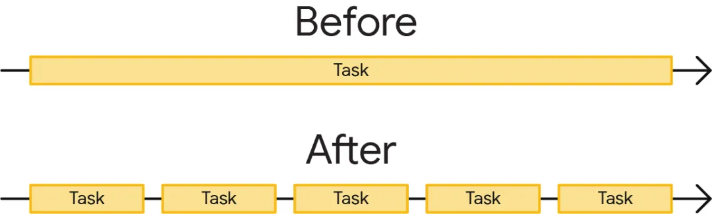
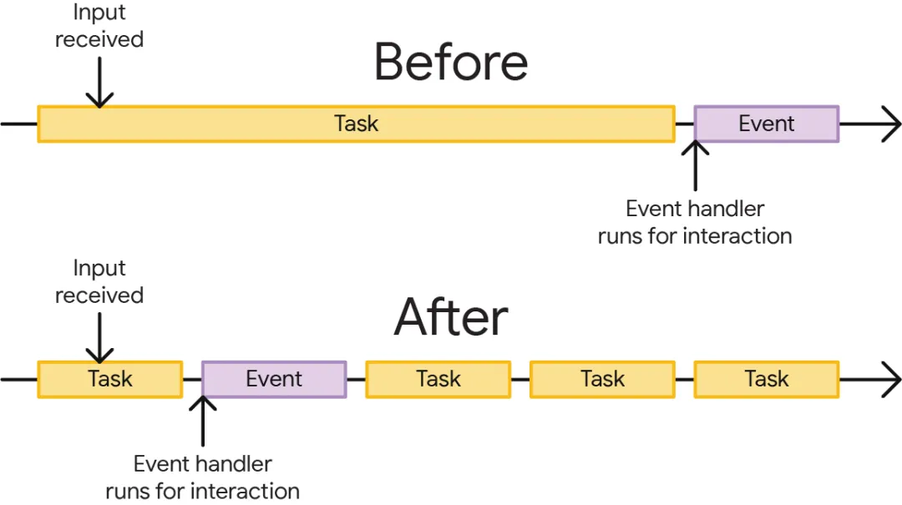
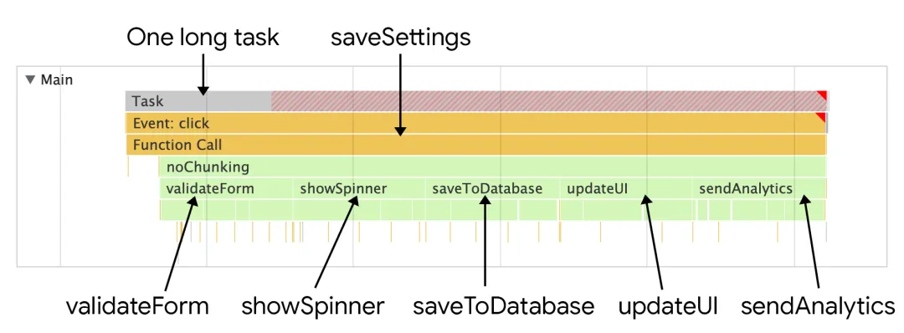
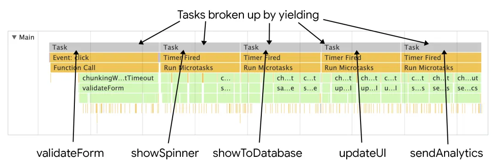
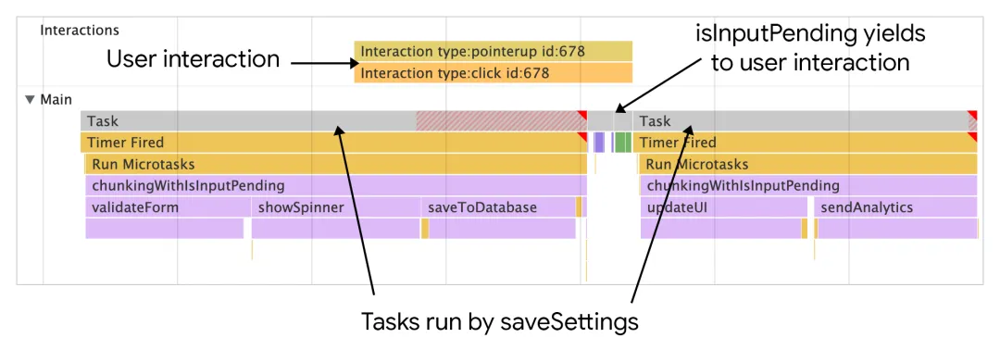
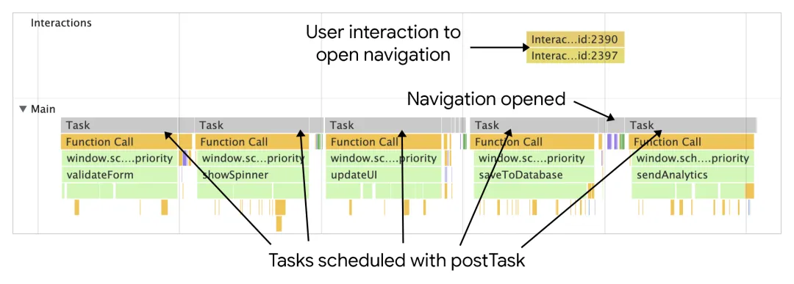

主线程每次只能处理一个任务, 当任务耗时超过特定时间, 比如 50ms 就会被归类为长耗时. 如果发生长耗时时存在用户交互, 或者关键渲染更新时, 浏览器就会延后再处理用户交互, 这会直接导致用户交互或者渲染出现延迟.

优化长耗时, 意味着将单个长耗时任务拆解成几个耗时相对短的小任务:



拆分长任务后, 浏览器就有了更多的机会, 可以去处理优先级别更高的工作, 其中就包括用户交互行为:



# 任务管理策略

软件架构中有时候会将一个任务拆分成多个函数, 这不仅能增强代码可读性, 也让项目更容易维护, 当然这样也更容易写测试.

```js
function saveSettings() {
    validateForm();
    showSpinner();
    saveToDatabase();
    updateUI();
    sendAnalytics();
}
```

在上面的例子中, 该函数 saveSettings 调用了另外 5 个函数, 包括验证表单,展示加载的动画,发送数据到后端等. 理论上讲, 这是很合理的架构. 如果需调试这些功能, 也只需要在项目中查找每个函数即可.

然而, 这样也有问题, 就是 js 并不是为每个方法开辟一个单独的任务, 因为这些方法都包含在 saveSetting 这个函数中, 也就是说这五个方法在一个任务中执行.



<br>

## 使用代码延迟任务执行

为了拆分长任务, 开发者经常使用定时器 setTimeout. 通过把方法传递给 setTimeout, 也就等同于重新创建了一个新的任务, 延迟了回调的执行, 而且使用该方法, 即便是将 delay 时间设定成 0, 也是有效的.

```js
function saveSettings() {
    validateForm();
    showSpinner();
    updateUI();

    setTimeout(() => {
        saveToDatabase();
        sendAnalytics();
    }, 0);
}
```

<br>

除了 setTimeout 的方式, 确有一些 api 能够允许延迟代码到随后的任务中执行. 其中一个方式便是使用 postMessage 替代定时器:

1. 将长任务拆分为多个小块, 逐块处理.

2. 每块处理完后, 使用 postMessage 向主线程发送消息:

```javascript
// 长任务的处理函数
function processLongTask(dataChunk) {
    // 处理数据块
    // ...

    // 处理完毕后, 向主线程发送消息
    window.postMessage({ type: "TASK_COMPLETE", result: processedData }, "*");
}
```

3. 在主线程中监听消息, 当收到消息后继续处理下一个块:

```javascript
// 主线程中的消息处理函数
window.addEventListener("message", (event) => {
    if (event.data.type === "TASK_COMPLETE") {
        const processedData = event.data.result;
        // 继续处理下一个数据块
    }
});
```

注意安全性:

-   在使用 postMessage 时, 务必验证消息来源和目标源, 以确保安全性.
-   在 postMessage 中的第二个参数中指定目标源, 而不是使用通配符 `"*"`.

<br>

也可以使用 requestIdleCallback, 但是需要注意这个 api 编排的任务的优先级别最低, 而且只会在浏览器空闲时才会执行. 当主线程繁忙时, 通过 requestIdleCallback 这个 api 编排的任务可能永远不会执行.

<br>

## 使用 async await 来创造让步点

一种让步于主线程的方式是配合用了 setTimeout 的 promise.

```js
function yieldToMain() {
    return new Promise((resolve) => {
        setTimeout(resolve, 0);
    });
}
```

在 saveSettings 的函数中, 可以在每次 await 函数 yieldToMain 后让步于主线程:

```js
async function saveSettings() {
    // Create an array of functions to run
    const tasks = [validateForm, showSpinner, saveToDatabase, updateUI, sendAnalytics];

    // Loop over the tasks
    while (tasks.length > 0) {
        // Shift the first task off the tasks array
        const task = tasks.shift();

        // Run the task
        task();

        // Yield to the main thread
        await yieldToMain();
    }
}
```

这样的好处是, 就能看到单个大的长任务被拆分成了多个独立的任务:



注意: 并不是所有函数调用都要让步于主线程. 如果两个函数的结果在用户界面上有重要的更新, 最好就不要这样做. 如果可以, 可以想让任务执行, 然后考虑在那些不重要的函数或者能在后台运行的函数之间让步.

<br>

假如有一堆的任务, 但是只想在用户交互的时候才让步, 该怎么办？正好有这种 api -- isInputPending

isInputPending 这个函数可以在任何时候调用, 它能判断用户是否要与页面元素进行交互. 调用 isInputPending 会返回布尔值, true 代表要与页面元素交互, false 则不交互.

比如说, 任务队列中有很多任务, 但是不想阻挡用户输入, 使用 isInputPending 和自定义方法 yieldToMain 方法, 就能够保证用户交互时的 input 不会延迟.

```js
async function saveSettings() {
    // 函数队列
    const tasks = [validateForm, showSpinner, saveToDatabase, updateUI, sendAnalytics];

    while (tasks.length > 0) {
        // 让步于用户输入
        if (navigator.scheduling.isInputPending()) {
            // 如果有用户输入在等待, 则让步
            await yieldToMain();
        } else {
            // Shift the the task out of the queue:
            const task = tasks.shift();

            // Run the task:
            task();
        }
    }
}
```



saveSetting 这个任务队列中有 5 个任务, 但此时如果正在执行第二个任务而用户想打开某个菜单, 于是点击了这个菜单, isInputPending 就会让步, 让主线程处理交互事件, 同时也会稍后执行后面剩余的任务.

用户输入后 isInputPending 的返回值不一定总是 true, 这是因为操作系统需要时间来通知浏览器交互结束, 也就是说其他代码可能已经开始执行, 比如截图例子中的 saveToDatabase 这个方法可能已经在执行了. 即便使用 isInputPending, 还是需要在每个方法限制任务中的方法数量.

使用 isInputPending 配合让步的策略, 能让浏览器有机会响应用户的重要交互, 这在很多情况下, 尤其是很多执行很多任务时, 能够提高页面对用户的响应能力.

另一种使用 isInputPending 的方式, 特别是担心浏览器不支持该策略, 就可以使用另一种结合时间的方式.

```js
async function saveSettings() {
    // A task queue of functions
    const tasks = [validateForm, showSpinner, saveToDatabase, updateUI, sendAnalytics];

    let deadline = performance.now() + 50;

    while (tasks.length > 0) {
        // Optional chaining operator used here helps to avoid
        // errors in browsers that don't support `isInputPending`:
        if (navigator.scheduling?.isInputPending() || performance.now() >= deadline) {
            // There's a pending user input, or the
            // deadline has been reached. Yield here:
            await yieldToMain();

            // Extend the deadline:
            deadline += 50;

            // Stop the execution of the current loop and
            // move onto the next iteration:
            continue;
        }

        // Shift the the task out of the queue:
        const task = tasks.shift();

        // Run the task:
        task();
    }
}
```

使用这种方式, 通过结合时间来兼容不支持 isInputPending 的浏览器, 尤其是使用截止时间或者在特定时间点, 让工作能在适当时候中断, 不论是通过让步于用户输入还是在特定时间节点.

<br>

## postTask

postTask 对于所有的 chromium 浏览器和 firefox 均可使用.

postTask 能让浏览器编排任务的优先级, 以便地低优先级别的任务能够让步于主线程.

postTask 方法有 3 个优先级别: "user-blocking" > "user-visible" > "background".

```js
function saveSettings() {
    // Validate the form at high priority
    scheduler.postTask(validateForm, { priority: "user-blocking" });

    // Show the spinner at high priority:
    scheduler.postTask(showSpinner, { priority: "user-blocking" });

    // Update the database in the background:
    scheduler.postTask(saveToDatabase, { priority: "background" });

    // Update the user interface at high priority:
    scheduler.postTask(updateUI, { priority: "user-blocking" });

    // Send analytics data in the background:
    scheduler.postTask(sendAnalytics, { priority: "background" });
}
```

在上面例子中, 通过这些任务的优先级的编排方式, 能让高浏览器级别的任务, 比如用户交互等得以触发.



注意: postTask 并不是所有浏览器都支持. 可以检测是否空, 或者考虑使用 polyfill.
