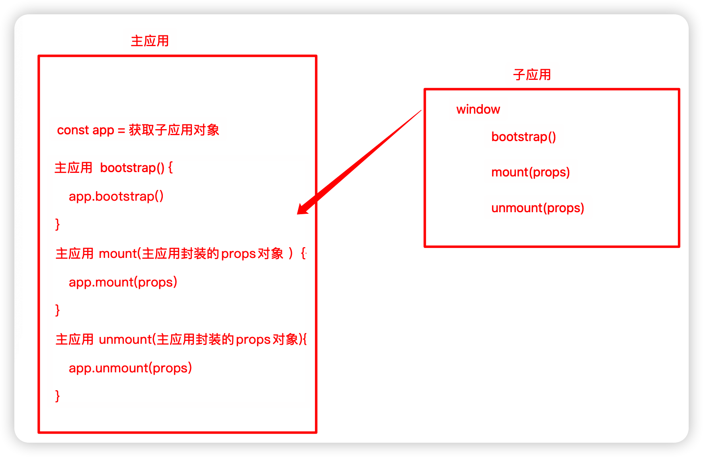

# 搭建 qiankun 项目

## 配置主应用 (Vue2)

1.  安装 qiankun：

```bash
pnpm i qiankun
```

<br>

2.  配置 src/main.js：

```js
import { registerMicroApps, start } from 'qiankun';

// 注册子应用
registerMicroApps([
    {
        // 子应用的名称
        name: 'app-vue2-demo',

        // 子应用 index.html 的地址
        entry: '//localhost:4001',

        // 挂载子应用的容器
        container: '#subapp-container',

        // 激活子应用的地址前缀, 可以配置为 location.pathname 前缀或 location.hash 前缀
        activeRule: '/app-vue2-demo',
    },
]);

// 启动 qiankun
start();

// ... 其他配置 ...
```

<br>

3.  配置 src/App.vue：

```vue
<template>
    <div id="app">
        <el-menu default-active="/" router>
            <el-menu-item index="/">
                <span slot="title">main-app</span>
            </el-menu-item>
            <!-- 激活子应用的地址前缀 -->
            <el-menu-item index="/app-vue2-demo">
                <span slot="title">sub-app-vue2-demo</span>
            </el-menu-item>
        </el-menu>
        <el-container>
            <el-header>Micro-App</el-header>
            <el-main>
                <router-view></router-view>
                <!-- 挂载子应用的容器 -->
                <div id="subapp-container"></div>
            </el-main>
        </el-container>
    </div>
</template>

<script>
export default { name: 'App' };
</script>
```

<br>

## 配置子应用 (Vue2 + Webpack5)

1.  配置 vue.config.js：

```js
const { defineConfig } = require('@vue/cli-service');

// 获取 package.json 中的 name 字段, 与注册子应用时的 name 保持一致
const { name } = require('./package.json');

module.exports = defineConfig({
    // 配置 webpack
    configureWebpack: {
        output: {
            // 配置输出代码定义的模块的名字; [name] 表示子应用的 App.vue 的 name 属性值
            library: `${name}-[name]`,

            // 输出代码将使用 UMD 的方式兼容多种模块化标准
            libraryTarget: 'umd',

            // 指定一个全局的函数名, 用于加载异步的代码块
            chunkLoadingGlobal: `webpackJsonp_${name}`,
        },
    },

    devServer: {
        // 子应用的端口号, 与注册子应用时 entry 中的端口号保持一致
        port: 4001,

        // 因为主应用通过 fetch HTML 的方式加载子应用, 所以子应用需要允许跨域
        headers: { 'Access-Control-Allow-Origin': '*' },
    },

    // ... 其他配置 ...
});
```

<br>

2.  配置静态资源路径：

创建、配置 src/public-path.js：

```js
// 判断是否在 qiankun 环境下, 如果是则修改运行时的 publicPath, 避免静态资源加载出错
if (window.__POWERED_BY_QIANKUN__) {
    __webpack_public_path__ = window.__INJECTED_PUBLIC_PATH_BY_QIANKUN__;
    // webpack 暴露了一个名为 __webpack_public_path__ 的全局变量, 供开发者修改运行时的 publicPath
}
```

在 src/main.js 的最上面导入 src/public-path.js：

```js
import './public-path';
```

<br>

3.  修改 src/routes/index.js 配置（可选，方便获取主应用传递的数据）：

```js
const routes = [
    {
        path: '/',
        name: 'Home',
        component: () => import('@/views/Home.vue'),
    },
    {
        path: '/about',
        name: 'About',
        component: () => import('@/views/About.vue'),
    },
    {
        path: '/users',
        name: 'Users',
        component: () => import('@/views/Users.vue'),
    },
];

export default routes;
```

<br>

4.  配置 src/main.js：

```js
import './public-path';

// ... 其他配置 ...

import Vue from 'vue';
import VueRouter from 'vue-router';

import App from './App.vue';

// import router from "@/routes"
import routes from '@/routes';

Vue.use(VueRouter);

let router = null;
let instance = null;

function render(props = {}) {
    // container 为主应用自动传递过来的挂载子应用的容器
    // routerBase 为主应用注册子应用时手动配置 props 传递过来的数据
    const { container, routerBase } = props;

    router = new VueRouter({
        routes,

        // 如果在 qiankun 环境下, 则动态设置路由前缀, 以激活子应用
        // routerBase 需要与主应用注册子应用时的 activeRule 保持一致
        base: window.__POWERED_BY_QIANKUN__ ? routerBase : '/',

        // history 模式表示通过 location.pathname 前缀激活子应用 (需要后端支持)
        // hash 模式则通过 location.hash 前缀激活子应用
        mode: 'history',
    });

    // 避免与主应用的 Vue 容器发生冲突
    const dom = container ? container.querySelector('#app') : '#app';
    instance = new Vue({
        router,
        render: (h) => h(App),
    }).$mount(dom);
}

// 如果为独立运行, 则直接挂载应用
if (!window.__POWERED_BY_QIANKUN__) {
    render();
}

/**
 * bootstrap 只会在子应用初始化时调用一次, 下次子应用重新进入时会直接调用 mount 钩子, 不会重复触发 bootstrap
 * 通常我们可以在这里初始化一些全局变量, 比如不会在 unmount 阶段被销毁的应用级别的缓存等
 */
export async function bootstrap() {
    console.log('sub-app-vue2-bootstrap');
}

/**
 * 应用每次进入都会调用 mount 方法, 通常我们会在这里触发应用的渲染方法
 */
export async function mount(props) {
    console.log('sub-app-vue2-mount', props);
    render(props);
}

/**
 * 应用 每次切出 / 卸载 时会调用 unmount 方法, 通常我们会在这里卸载微应用的应用实例
 */
export async function unmount(props) {
    console.log('sub-app-vue2-mount', props);
    instance.$destroy();
    instance.$el.innerHTML = '';
    instance = null;
    router = null;
}
```

<br>

5.  修改主应用的 src/main.js 配置：

```js
import { registerMicroApps, start } from 'qiankun';

registerMicroApps([
    {
        name: 'app-vue2-demo',
        entry: '//localhost:4001',
        container: '#subapp-container',
        activeRule: '/app-vue2-demo',
        props: {
            // 配置 props 传递数据给子应用
            routerBase: '/app-vue2-demo',
        },
    },
]);

start();

// ... 其他配置 ...
```

<br>

至此，配置完成。

子应用的代码通过 umd 打包得到的模块会挂载到 window 对象上，我们可以直接启动子应用并在控制台打印 window 查看：


从上图可以看到暴露出来的 3 个生命周期钩子函数，那就是说，主应用可以直接获取到这 3 个函数。在主应用中，只需要封装一下子应用的生命周期钩子函数，然后在合适的时间调用即可。



<br><br>

# 微应用的生命周期钩子函数

```ts
type Lifecycle = (app: RegistrableApp) => Promise<any>;
```

1.  `beforeLoad` - `Lifecycle | Array<Lifecycle>`
2.  `beforeMount` - `Lifecycle | Array<Lifecycle>`
3.  `afterMount` - `Lifecycle | Array<Lifecycle>`
4.  `beforeUnmount` - `Lifecycle | Array<Lifecycle>`
5.  `afterUnmount` - `Lifecycle | Array<Lifecycle>`

```js
import { registerMicroApps, start } from 'qiankun';

registerMicroApps(
    [
        {
            name: 'app-vue2-demo',
            entry: '//localhost:4001',
            container: '#subapp-container',
            activeRule: '/app-vue2-demo',
        },
    ],
    // 使用微应用的生命周期钩子函数
    {
        beforeLoad: (app) => console.log('beforeLoad', app.name), // Lifecycle 形式
        beforeMount: [(app) => console.log('beforeMount', app.name)], // Array<Lifecycle> 形式
    }
);

start();

// ... 其他配置 ...
```

<br>

**demo**：使用生命周期钩子函数做个进度条

1.  安装 nprogress：

```bash
pnpm i nprogress
```

2.  配置 main.js：

```js
import NProgress from 'nprogress'; // 导入依赖包
import 'nprogress/nprogress.css'; // 导入进度条样式文件

import { registerMicroApps, start } from 'qiankun';

registerMicroApps(
    [
        {
            name: 'app-vue2-demo',
            entry: '//localhost:4001',
            container: '#subapp-container',
            activeRule: '/app-vue2-demo',
        },
    ],
    {
        beforeLoad: (app) => {
            console.log('beforeLoad', app);
            NProgress.start(); // 微应用加载前, 展示进度条
        },
        afterMount: (app) => {
            console.log('afterMount', app.name);
            NProgress.done(); // 微应用挂载后, 完成进度条
        },
    }
);

start();

// ... 其他配置 ...
```

<br><br>

# 接入 React 子应用

## 配置主应用

1.  配置 src/main.js：

```js
import { registerMicroApps, start } from 'qiankun';

registerMicroApps([
    {
        name: 'app-vue2-demo',
        entry: '//localhost:4001',
        container: '#subapp-container',
        activeRule: '/app-vue2-demo',
        props: {
            routerBase: '/app-vue2-demo',
        },
    },
    // 添加 React 子应用配置
    {
        name: 'app-react-demo',
        entry: '//localhost:4002',
        container: '#subapp-container',
        activeRule: '/app-react-demo',
    },
]);

start();

// ... 其他配置 ...
```

<br>

2.  配置 src/App.vue：

```vue
<template>
    <div id="app">
        <el-menu default-active="/" router>
            <el-menu-item index="/">
                <span slot="title">main-app</span>
            </el-menu-item>
            <el-menu-item index="/app-vue2-demo">
                <span slot="title">sub-app-vue2-demo</span>
            </el-menu-item>
            <!-- 配置激活 React 子应用的地址前缀 -->
            <el-menu-item index="/app-react-demo">
                <span slot="title">sub-app-vue2-demo</span>
            </el-menu-item>
        </el-menu>
        <el-container>
            <el-header>Micro-App</el-header>
            <el-main>
                <router-view></router-view>
                <div id="subapp-container"></div>
            </el-main>
        </el-container>
    </div>
</template>

<script>
export default { name: 'App' };
</script>
```

<br>

## 配置子应用 (React16 + Webpack5)

1.  修改 webpack 配置：

安装 @rescripts/cli：

```bash
pnpm i -D @rescripts/cli # 可以考虑使用参数 --legacy-peer-deps
```

> 附：[--legacy-peer-deps](#--legacy-peer-deps) 介绍

创建、配置 .rescriptsrc.js：

```js
const { name } = require('./package');

module.exports = {
    webpack: (config) => {
        config.output.library = `${name}-[name]`;
        config.output.libraryTarget = 'umd';
        config.output.chunkLoadingGlobal = `webpackJsonp_${name}`;
        config.output.globalObject = 'window';
        return config;
    },

    devServer: (config) => {
        config.headers = { 'Access-Control-Allow-Origin': '*' };
        config.historyApiFallback = true;
        config.hot = false;
        config.liveReload = false;
        return config;
    },
};
```

修改 package.json：

```bash
-   "start": "react-scripts start", # 修改
+   "start": "rescripts start",
-   "build": "react-scripts build", # 修改
+   "build": "rescripts build",
-   "test": "react-scripts test", # 修改
+   "test": "rescripts test",
-   "eject": "react-scripts eject", # 删掉~ 不需要了
```

<br>

2.  配置静态资源路径：

创建、配置 src/public-path.js：

```js
if (window.__POWERED_BY_QIANKUN__) {
    __webpack_public_path__ = window.__INJECTED_PUBLIC_PATH_BY_QIANKUN__;
}
```

在 src/index.js 的最上面导入 src/public-path.js：

```js
import './public-path';
```

<br>

3.  配置 src/App.js：

```jsx
import { BrowserRouter as Router, Routes, Route } from 'react-router-dom';
import Home from './views/Home';
import About from './views/About';
import Info from './views/Info';
import LayoutMain from './views/LayoutMain';

function App() {
    return (
        <>
            <Router
                // 如果在 qiankun 环境下, 则动态设置路由前缀, 以激活子应用
                // 这里的 '/app-react-demo' 需要与主应用注册子应用时的 activeRule 保持一致
                basename={
                    window.__POWERED_BY_QIANKUN__ ? '/app-react-demo' : '/'
                }
            >
                <Routes>
                    <Route path='/' element={<LayoutMain />}>
                        <Route index element={<Home />} />
                        <Route path='about' element={<About />} />
                        <Route path='info' element={<Info />} />
                    </Route>
                </Routes>
            </Router>
        </>
    );
}

export default App;
```

<br>

4.  配置 src/index.js：

```jsx
import './public-path';

import React from 'react';
import ReactDOM from 'react-dom/client';
import './index.css';
import App from './App';

let root = null;

function render(props = {}) {
    const { container } = props;
    const dom = container
        ? container.querySelector('#root')
        : document.querySelector('#root');
    root = ReactDOM.createRoot(dom);
    root.render(
        <React.StrictMode>
            <App />
        </React.StrictMode>
    );
}

if (!window.__POWERED_BY_QIANKUN__) {
    render();
}

export async function bootstrap() {
    console.log('sub-app-react16-bootstrap');
}

export async function mount(props) {
    console.log('sub-app-react16-mount', props);
    render(props);
}

export async function unmount(props) {
    console.log('sub-app-react16-unmount', props);
    const { container } = props;
    const dom = container
        ? container.querySelector('#root')
        : document.querySelector('#root');
    root.unmount(dom);
}
```

<br>

5.  配置子应用的端口号，与注册子应用时 entry 中的端口号保持一致

<br><br>

# 接入 Vite 子应用

<br><br>

# 附：--legacy-peer-deps

`--legacy-peer-deps` 是一个用于安装 npm 包时的参数，它的作用是让 npm 忽略 `peerDependencies` 的版本冲突，而使用旧版的安装方式，即只安装 direct dependencies，而不自动安装 `peerDependencies`。

`peerDependencies` 是一种用于指定 npm 包的间接依赖的方式，它可以让 npm 包的开发者告诉用户，他们的包需要哪些其他的包，以及这些包的版本范围，以保证正常的运行。

例如，如果一个 npm 包 A 依赖于另一个 npm 包 B，那么 A 的开发者可以在 A 的 package.json 文件中，添加如下的字段：

```json
{
    "peerDependencies": {
        "B": "^1.0.0"
    }
}
```

这表示 A 需要 B 的版本在 1.0.0 以上，但是低于 2.0.0。

在 npm 的旧版本（v3~v6）中，当用户安装 A 时，npm 不会自动安装 B，而是给出一个警告，让用户自己去安装 B，并且选择合适的版本。

在 npm 的新版本（v7+）中，当用户安装 A 时，npm 会自动安装 B，并且尝试选择一个符合 A 的 peerDependencies 的版本。

这样做的好处是，可以避免用户忘记安装 `peerDependencies`，或者安装了不兼容的版本，导致错误或者异常。

但是，这样做的坏处是，有时候会出现版本冲突的情况，例如，如果用户已经安装了 B 的一个高版本，比如 2.0.0，而 A 需要 B 的一个低版本，比如 1.0.0，那么 npm 就会报错，无法完成安装。

这时候，用户可以使用 `--legacy-peer-deps` 参数，来让 npm 忽略 `peerDependencies` 的版本冲突，而使用旧版的安装方式，即只安装 A，而不自动安装 B，而是给出一个警告，让用户自己去安装 B，并且选择合适的版本。

例如，用户可以这样执行命令：

```bash
npm install A --legacy-peer-deps
```

这样，npm 就会安装 A，但是不会安装 B，而是给出如下的警告：

```bash
npm WARN A@1.0.0 requires a peer of B@^1.0.0 but none is installed. You must install peer dependencies yourself.
```

这样，用户就可以自己去安装 B，并且选择合适的版本，例如：

```bash
npm install B@1.0.0
```

或者：

```bash
npm install B@1.5.0
```

使用 `--legacy-peer-deps` 参数的好处是，可以避免 npm 的自动安装导致的版本冲突，而使用用户自己的选择，或者保持原有的版本。

使用 `--legacy-peer-deps` 参数的坏处是，有可能会导致 `peerDependencies` 不满足，或者不兼容，从而引起错误或者异常。

因此，使用 `--legacy-peer-deps` 参数的时候，需要谨慎，并且仔细检查 `peerDependencies` 的版本要求，以及自己安装的版本，以保证正常的运行。

<br>
