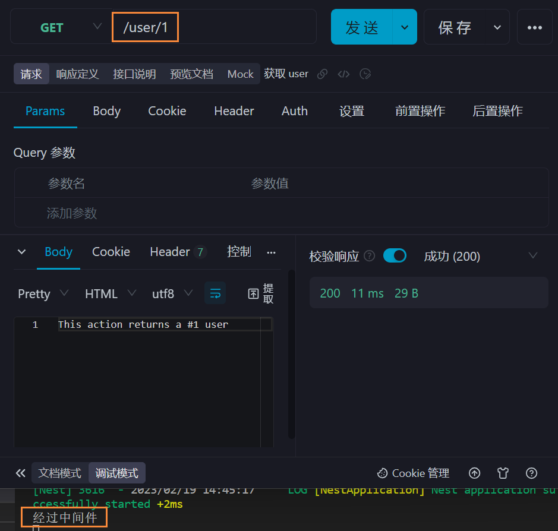

中间件是在路由处理程序之前调用的函数，所以在中间件函数中可以访问请求和响应。

中间件函数需要执行 `next()` 将控制传递给下一个中间件函数，否则请求会被挂起。

可以使用 `nest g mi XXX` 创建中间件。

<br><br>

# 局部中间件

1. `nest g res user`
2. `nest g mi ajax`、编写中间件代码

```typescript
import { Injectable, NestMiddleware } from '@nestjs/common';
import { NextFunction, Request, Response } from 'express';

@Injectable()
export class AjaxMiddleware implements NestMiddleware {
    use(req: Request, res: Response, next: NextFunction) {
        console.log('经过中间件');
        next();
    }
}
```

3. 注册中间件

```typescript
import { MiddlewareConsumer, Module, NestModule } from '@nestjs/common';
import { UserService } from './user.service';
import { UserController } from './user.controller';
import { AjaxMiddleware } from 'src/ajax/ajax.middleware';

@Module({
    controllers: [UserController],
    providers: [UserService],
})
export class UserModule implements NestModule {
    /* 注册中间件;  可以 implements NestModule 获取代码提示 */
    configure(consumer: MiddlewareConsumer) {
        consumer.apply(AjaxMiddleware).forRoutes('user'); // 指定要拦截的路由
    }
}
```

现在所有访问 `/user/*` 的请求否会被中间件拦截



<br>

除了使用 `forRoutes('user')` 指定路由，还能给 `forRoutes()` 传入配置对象作为参数

```typescript
import {
    MiddlewareConsumer,
    Module,
    NestModule,
    RequestMethod,
} from '@nestjs/common';
import { UserService } from './user.service';
import { UserController } from './user.controller';
import { AjaxMiddleware } from 'src/ajax/ajax.middleware';

@Module({
    controllers: [UserController],
    providers: [UserService],
})
export class UserModule implements NestModule {
    configure(consumer: MiddlewareConsumer) {
        consumer.apply(AjaxMiddleware).forRoutes({
            path: 'user', // 指定拦截的路由
            method: RequestMethod.GET, // 仅拦截 GET 请求
        });
    }
}
```

<br>

此外，还能直接把 controller 传入 `forRoutes()` 作为参数，表示拦截该 controller 里面的所有请求

```typescript
import { MiddlewareConsumer, Module, NestModule } from '@nestjs/common';
import { UserService } from './user.service';
import { UserController } from './user.controller';
import { AjaxMiddleware } from 'src/ajax/ajax.middleware';

@Module({
    controllers: [UserController],
    providers: [UserService],
})
export class UserModule implements NestModule {
    configure(consumer: MiddlewareConsumer) {
        // 拦截 UserController 里面的所有请求
        consumer.apply(AjaxMiddleware).forRoutes(UserController);
    }
}
```

<br>

若要指定多个路由应用中间件，可以给 `forRoutes()` 传入多个参数。

若要应用多个中间件，可以给 `apply()` 传入多个参数。

<br><br>

# exclude

有时我们想从中间件中排除某些路由，可以使用 `exclude()`：

```typescript
consumer
    .apply(AjaxMiddleware)
    .exclude(
        { path: 'cats', method: RequestMethod.GET },
        { path: 'cats', method: RequestMethod.POST },
        'cats/(.*)',
    )
    .forRoutes('user');
```

若要排除多个路由，可以给 `exclude()` 传入多个参数。

<br><br>

# 函数式中间件

可以发现中间件的编写非常简单，就是一个类，类里面只有一个 `use` 函数。所以，我们也可以直接把中间件编写成一个函数：

```typescript
import { NextFunction, Request, Response } from 'express';

export function ajaxMiddleware(
    req: Request,
    res: Response,
    next: NextFunction,
) {
    console.log('经过中间件');
    next();
}
```

然后就可以在别的 module 导入 `ajax` 并使用啦

```typescript
consumer.apply(ajaxMiddleware).forRoutes('user');
```

<br><br>

# 全局中间件

只能使用函数式中间件作全局中间件

全局中间件的优先级比局部中间件高，会先执行

```typescript
import { NextFunction, Request, Response } from 'express';

const whiteList = ['/user']; // 白名单

export function ajaxMiddleware(
    req: Request,
    res: Response,
    next: NextFunction,
) {
    console.log(req.originalUrl);
    if (whiteList.includes(req.originalUrl)) {
        next();
    } else {
        res.send('小黑子露出鸡脚了吧');
    }
}
import { NestFactory } from '@nestjs/core';
import { AppModule } from './app.module';
import { ajaxMiddleware } from 'src/ajax/ajax.middleware'; // 导入函数式中间件

async function bootstrap() {
    const app = await NestFactory.create(AppModule);
    app.use(ajaxMiddleware); // 使用中间件
    await app.listen(3000);
}
bootstrap();
```

<br><br>

# 第三方中间件

demo：使用 cors 处理跨域

1. `npm i cors` (NestJS 内置了)
2. `npm i @types/cors -D`

```typescript
import { NestFactory } from '@nestjs/core';
import { AppModule } from './app.module';
import * as cors from 'cors'; // 导入 cors

async function bootstrap() {
    const app = await NestFactory.create(AppModule);

    app.use(cors()); // 注册中间件

    await app.listen(3000);
}
bootstrap();
```

<br><br>