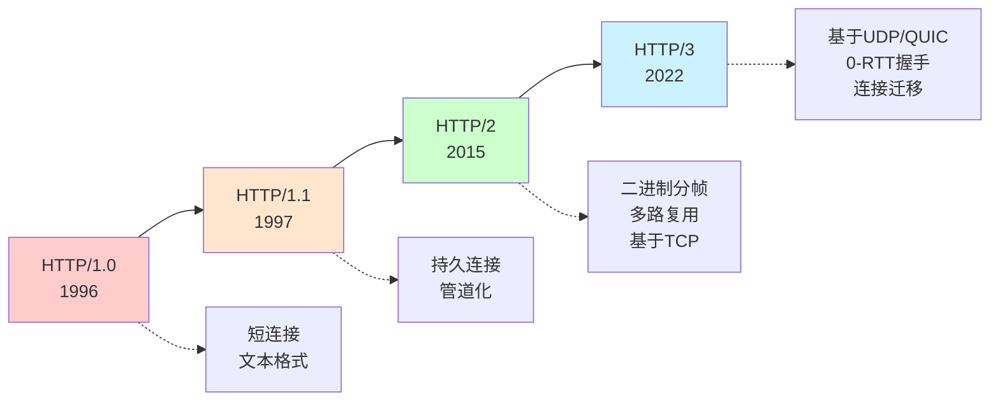
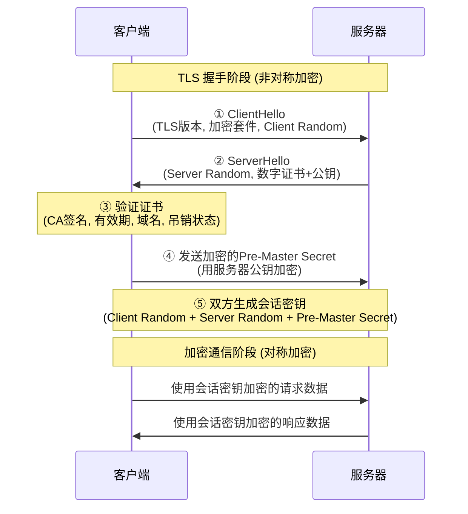
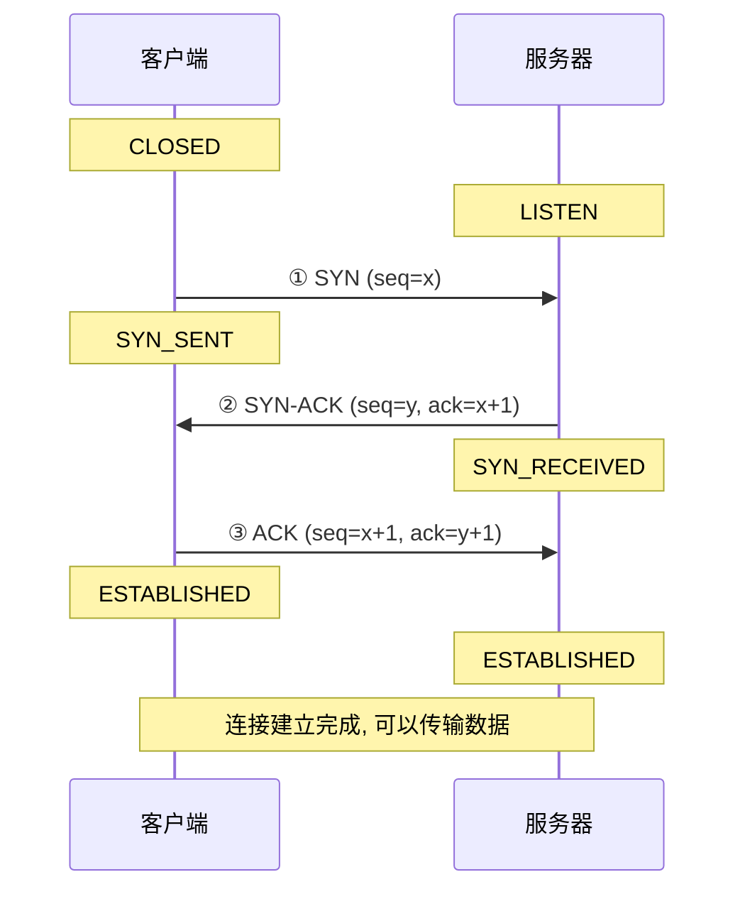
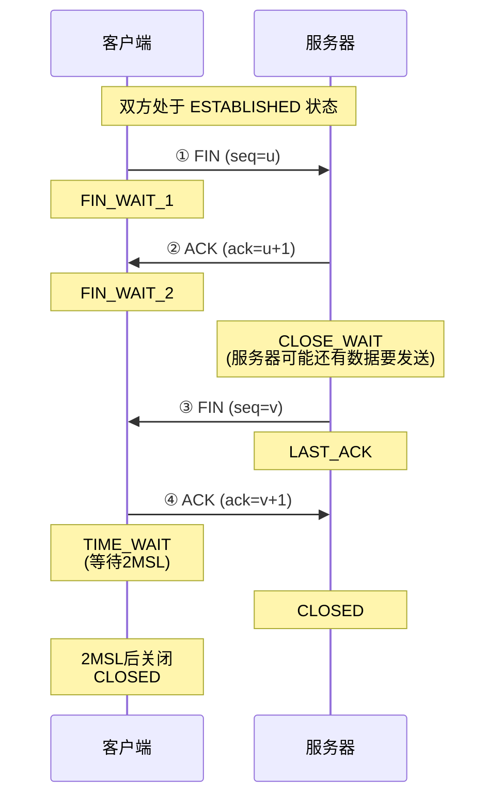

# HTTP 协议

## 概述

HTTP (Hypertext Transfer Protocol, 超文本传输协议) 是一种应用层协议, 用于在客户端与服务器之间传输超文本数据. 它工作在 TCP/IP 模型之上, 默认使用 **80 端口**.

  

### 核心特性

1. **无状态性**: 服务器不保存客户端的状态信息, 每次请求都是独立的. 通常使用 Cookie 来维护客户端和服务器之间的状态.

2. **明文传输**: HTTP 以明文方式发送内容, 攻击者可以通过抓包直接读取传输数据, 存在安全隐患.

3. **请求-响应模型**: 客户端主动发起请求, 服务器被动响应.

  

## HTTP 版本演进

 

### HTTP/1.0 (1996)

-   每次请求建立新的 TCP 连接, 请求完成后立即断开
-   效率低下, 存在大量连接建立和关闭的开销
-   基于文本格式传输

 

### HTTP/1.1 (1997)

**主要改进:**

1. **持久连接** (Keep-Alive): 默认开启长连接, 通过 `Connection: keep-alive` 复用 TCP 连接, 减少握手开销.

2. **管道化** (Pipelining): 允许在同一连接上连续发送多个请求, 无需等待前一个响应.

3. **分块传输编码**: 支持动态生成的内容边生成边传输.

4. **Host 头部**: 支持虚拟主机, 允许一个 IP 地址托管多个域名.

**局限性:**

-   **队头阻塞** (Head-of-Line Blocking): 前一个请求阻塞会影响后续请求
-   文本格式解析效率低
-   头部冗余, 未压缩

 

### HTTP/2 (2015)

HTTP/2 在兼容 HTTP/1.1 的基础上进行了重大性能优化:

1. **二进制分帧** (Binary Framing): 采用二进制格式传输, 将数据分割为更小的帧 (Frame), 提高解析效率和传输性能.

2. **多路复用** (Multiplexing): 在单个 TCP 连接上并行发送多个请求和响应, 彻底解决应用层队头阻塞问题, 减少连接数量.

3. **头部压缩** (HPACK): 使用 HPACK 算法压缩请求头和响应头, 减少带宽占用. 客户端和服务器维护头部索引表, 实现头部复用.

4. **服务器推送** (Server Push): 服务器可以主动推送客户端可能需要的资源 (如 CSS, JS), 减少请求往返次数.

5. **流优先级** (Stream Priority): 支持对请求设置优先级, 确保关键资源优先传输.

6. **流量控制** (Flow Control): 在连接和流级别进行流量控制, 防止快速发送方压垮慢速接收方.

 

### HTTP/3 (2022)

HTTP/3 是最新版本, 基于 QUIC 协议 (Quick UDP Internet Connections) 实现:

**核心改变:**

1. **基于 UDP**: 放弃 TCP, 使用 UDP 作为传输层协议, 避免 TCP 的队头阻塞问题.

2. **内置 TLS 1.3**: 加密和握手集成在 QUIC 层, 0-RTT 或 1-RTT 握手, 显著减少连接建立时间.

3. **连接迁移**: 支持在网络切换 (如 Wi-Fi 切换到 4G) 时保持连接不断开.

4. **改进的拥塞控制**: 更现代的拥塞控制算法, 提升弱网环境性能.

5. **独立的流**: 单个流的丢包不会阻塞其他流, 彻底解决队头阻塞.

**适用场景**: 移动网络, 弱网环境, 需要快速建立连接的场景.

  

## HTTPS 协议

### 概述

HTTPS (Hypertext Transfer Protocol Secure, 超文本传输安全协议) 是 HTTP 的安全版本, 在 HTTP 基础上通过 **SSL/TLS** 协议提供加密, 身份验证和数据完整性保护. HTTPS 默认使用 **443 端口**.

 

### 安全机制

HTTPS 通过 **非对称加密 + 对称加密 + 数字证书** 三者结合实现安全通信:

1. **加密** (Encryption): 防止数据在传输过程中被窃听
2. **身份验证** (Authentication): 通过数字证书验证服务器身份, 防止中间人攻击
3. **完整性校验** (Integrity): 确保数据在传输过程中未被篡改

 

### HTTPS 工作流程

#### 1. TLS 握手阶段 (使用非对称加密)

**第一步: 客户端发起请求 (ClientHello)**

-   客户端向服务器发送支持的 TLS 版本, 加密套件列表, 随机数 (Client Random)

**第二步: 服务器响应 (ServerHello)**

-   服务器选择加密套件, 返回服务器随机数 (Server Random)
-   发送 **数字证书** (包含服务器公钥), 证书由受信任的 CA (证书颁发机构) 签发

**第三步: 客户端验证证书**

客户端验证证书的有效性:

-   证书是否由可信 CA 签发
-   证书是否在有效期内
-   证书域名是否与访问域名匹配
-   证书是否被吊销

**第四步: 生成会话密钥**

-   客户端生成 **预主密钥** (Pre-Master Secret)
-   使用服务器的公钥加密预主密钥, 发送给服务器
-   服务器使用私钥解密, 获得预主密钥

**第五步: 协商会话密钥**

-   客户端和服务器分别使用以下内容生成相同的 **会话密钥** (对称密钥):
    -   Client Random
    -   Server Random
    -   Pre-Master Secret

#### 2. 加密通信阶段 (使用对称加密)

-   客户端和服务器使用协商好的 **会话密钥** 进行对称加密通信
-   对称加密速度快, 适合大量数据传输
-   即使数据被拦截, 攻击者没有会话密钥也无法解密

 

### 为什么这样设计?

-   **非对称加密**: 安全性高但性能开销大, 仅用于握手阶段交换密钥
-   **对称加密**: 性能高效, 用于实际数据传输
-   **数字证书**: 解决公钥信任问题, 防止中间人攻击

 

### 浏览器策略

现代浏览器强制执行 **混合内容策略**: 通过 HTTPS 加载的页面中, 所有资源 (图片, 脚本, 样式表等) 也应该使用 HTTPS 协议获取, 否则可能被阻止或警告.

 

### 前端加密的局限性

前端 JavaScript 加密无法防止恶意用户攻击:

-   JavaScript 代码对用户完全可见
-   攻击者可以修改本地代码绕过加密逻辑

防护措施 (高级):

-   混淆和压缩 JavaScript 代码
-   频繁更新加密算法
-   实现 JavaScript 虚拟机 (如 Google 的做法)

**结论**: 真正的安全必须依赖 HTTPS 和服务端验证, 前端加密只能作为辅助手段.

  

## TCP 连接管理

HTTP 基于 TCP 协议, 理解 TCP 连接的建立和断开过程有助于优化网络性能.

 

### 三次握手 (建立连接)

TCP 通过三次握手确保双方具备发送和接收数据的能力:

1. **第一次握手 (SYN)**: 客户端发送 SYN (同步序列号) 包到服务器, 进入 SYN_SENT 状态, 表示 "我想建立连接".

2. **第二次握手 (SYN-ACK)**: 服务器收到后, 返回 SYN-ACK 包, 进入 SYN_RECEIVED 状态, 表示 "我收到了, 同意建立连接".

3. **第三次握手 (ACK)**: 客户端收到后, 发送 ACK 确认包, 双方进入 ESTABLISHED 状态, 连接建立完成.

**为什么需要三次?**

-   防止旧的重复连接请求导致混乱
-   确认双方的发送和接收能力都正常

 

### 四次挥手 (断开连接)

TCP 通过四次挥手安全地关闭连接:

1. **第一次挥手 (FIN)**: 客户端发送 FIN 包, 表示 "我没有数据要发送了", 进入 FIN_WAIT_1 状态.

2. **第二次挥手 (ACK)**: 服务器收到后返回 ACK, 表示 "我知道了", 进入 CLOSE_WAIT 状态. 此时服务器可能还有数据要发送.

3. **第三次挥手 (FIN)**: 服务器发送完剩余数据后, 发送 FIN 包, 表示 "我也没有数据了", 进入 LAST_ACK 状态.

4. **第四次挥手 (ACK)**: 客户端收到后返回 ACK, 进入 TIME_WAIT 状态 (等待 2MSL 后关闭) , 服务器收到后关闭连接.

**为什么需要四次?**

-   连接是全双工的, 双方都需要单独关闭各自的发送通道
-   确保双方都能完成数据传输后再关闭

**TIME_WAIT 状态的作用:**

-   确保最后的 ACK 能够到达服务器
-   防止旧连接的数据包干扰新连接

  

## 总结

-   **HTTP/1.1**: 持久连接, 但存在队头阻塞
-   **HTTP/2**: 二进制分帧 + 多路复用, 大幅提升性能
-   **HTTP/3**: 基于 UDP 的 QUIC, 适合移动和弱网环境
-   **HTTPS**: 通过 TLS/SSL 提供加密, 是现代 Web 的标准
-   **TCP 连接**: 三次握手建立, 四次挥手断开, 保证可靠传输

 
