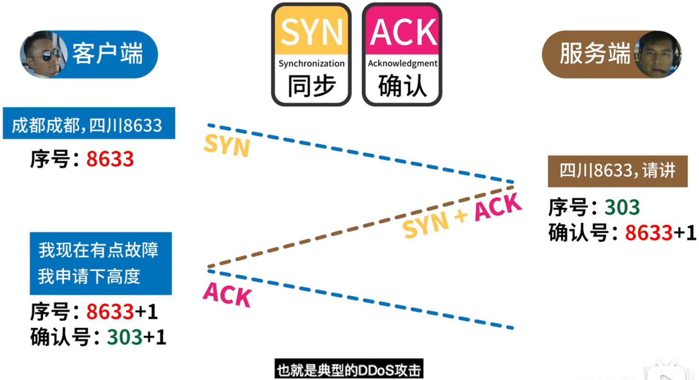
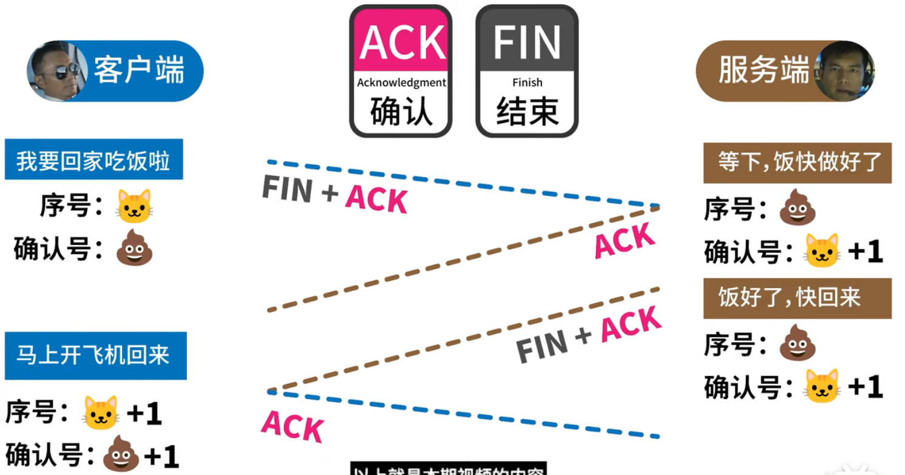

# TCP & UDP

## TCP

1. TCP 是**面向连接**的

2. TCP 提供**可靠交付**的服务

3. TCP 连接只能是**一对一**的

4. TCP 是**面向字节流**

    不保证 [接收方收到的数据块] 和 [发送方发出的数据块] 具有对应大小的关系

    但 [接收方收到的字节流] 必须和 [发送方发出的字节流] 一样

5. TCP 提供全双工通信 (双向同时通信)

 

## UDP

1. UDP 是**无连接**的, 发送数据前 不用建立连接, 以减少开销 & 加快发送速度
2. UDP 不保证可靠交付, 因此主机不需要维持复杂的 [连接状态表]
3. UDP 支持一对一,一对多,多对一,多对多的交互通信
4. UDP 是**面向报文**的. 应用层的报文怎么传下来, 就怎么发出去. UDP 一次交付一个完整的报文
5. UDP 没有拥塞控制; 如果网络出现拥塞, 也不会降低主机的发送速率. 这对某些实时应用非常重要
6. UDP 的首部开销小, 只有 8 个字节（TCP 的首部有 20 个字节）

 

## 3 握 4 挥

因为服务器可能还没发送完数据, 所以需要 4 次挥手

 
