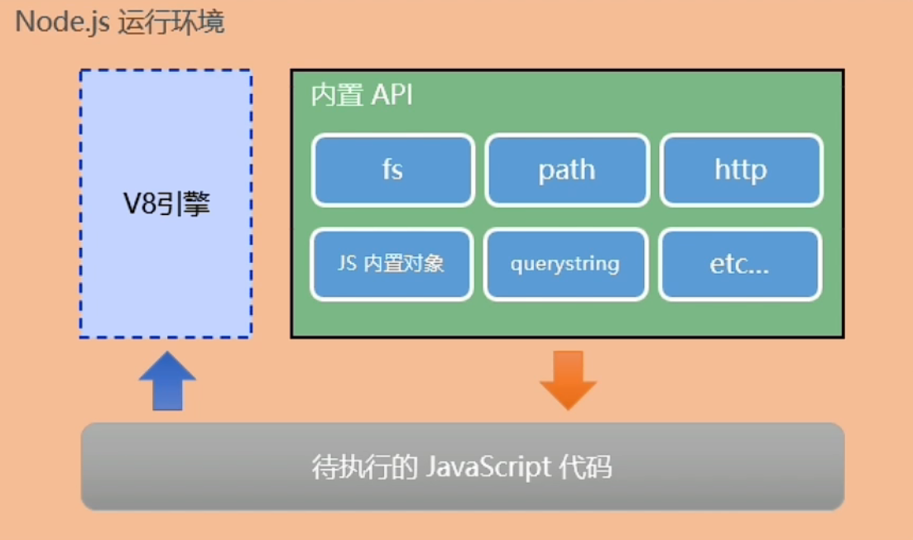

# Node 简介

-   Node 是一个基于 V8 引擎的 JS 运行环境。浏览器是 JS 的前端运行环境；Node 是 JS 的后端运行环境。
-   Node 中无法使用 DOM、BOM 等浏览器内置 API，但可以使用 ECMAScript 和 Node 内置的 API。
-   Node 的内置对象：`String` `Number` `Boolean` `Math` `Date` `RegExp` `Function` `Object` `Array`...



<br>

作用 - 搭建服务器：

-   传统的服务器都是多线程的：每进来一个请求，就创建一个线程去处理
-   Node 服务器是单线程的，但是在后台拥有一个 I/O 线程池

<br><br>

# DOS 命令

**常用指令：**

-   `dir`：列出当前目录下的文件(夹)名
-   `cd`：进入到指定的目录
-   `md`：创建文件夹
-   `rd`：删除文件夹
-   `cls`：清屏
-   `cd > 1.txt`：创建文件
-   `del 1.txt`：删除文件

<br>

**快捷键：**

1. `↑` 上一条命令
2. `tab` 命令补全
3. `esc` 清空当前已输入的命令

<br>

**目录：**

-   `.`：当前目录
-   `..`：上一级目录

<br>

当我们在命令行窗口 [打开一个文件] / [调用一个程序] 时，系统会先在当前目录下寻找文件程序（这里是 node.exe）
· 如果找到了，则直接打开；
· 如果没有找到，则到环境变量 path 的路径下依次寻找，直到找到为止；
· 如果最后都没找到，则报错。

<br><br>

# 安装

-   到 node 官网下载，傻瓜式安装即可
-   安装完成后，可在命令行窗口输入 `node -v` 查看版本，以确定是否安装成功

<br>

**node 的使用：**

1. 在命令行中，**输入 `node`，进入 node 环境**，即可执行 JS 语句
2. 按 CTRL + C 可以退出 node 环境

<br>

**执行指定的 JS 文件：**

1. 在命令行窗口中，`cd` 到 JS 文件所在的目录
2. 输入 `node 文件名` 执行文件

```js
// demo.js
console.log('Hello Node.js');
```

```
E:\study>node demo.js
Hello Node.js
```

<br>

**VSCode 运行 node：**

-   安装 code runner 插件，重启 VSCode 后，即可直接运行 JS 代码
-   运行快捷键：`Ctrl + Alt + N`
-   停止运行快捷键： `Ctrl + Alt + M`

<br><br>

# 进程

进程：计算机上运行的软件代表相应的进程

-   `process.arch`：查看当前 CPU 架构
-   `process.platform`：查看当前的操作系统
-   `process.version`：查看当前 Node 版本
-   `process.pid`：查看当前 Node 进程编号
-   `process.kill()`：结束指定编号的进程

```js
console.log(process.arch); // x64
console.log(process.platform); // win32
console.log(process.version); // v14.18.1
console.log(process.pid); // 20124
// console.log(process.kill(进程编号)); // 结束指定的进程
```

<br><br>

# nvm

nvm（Node Version Manger，Node 版本管理器）

<br>

## 安装

需要先卸载已安装的 Node，再安装 nvm

1.  直接运行 nvm-setup.exe
2.  选择 nvm 安装路径
3.  选择 Node 安装路径
4.  确认安装

<br>

## 常用命令

1.  `nvm -v`：查看 nvm 版本
2.  `nvm install <版本号>`：安装指定版本的 Node
    注意：这里可能会报错 "无权限安装"，以管理员身份运行即可
3.  `nvm uninstall <版本号>`：卸载指定版本的 Node
4.  `nvm use <版本号>`：使用指定版本的 Node
5.  `nvm ls`：查看已安装的 Node；为 `nvm list` 的简写
    `nvm ls available`：查看可安装的版本
6.  `nvm on`：开启 Node 版本管理
    `nvm off`：关闭 Node 版本管理

<br>
