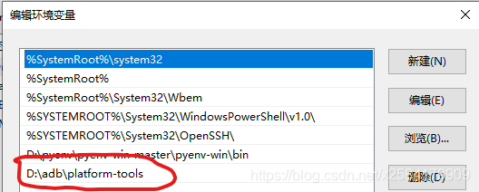

<br>

ADB 是 Android Debug Bridge (安卓调试桥) 的缩写, 它是一个用于连接和控制 Android 设备或模拟器的命令行工具, 它可以让你在电脑上执行各种操作, 例如安装或卸载应用,传输文件,运行 shell 命令,获取设备信息等. ADB 是 Android SDK 的一部分, 可以从 Android 官网下载并安装.

<br><br>

# 下载 & 配置

下载 zip 包, 解压到指定目录下:

-   Windows 版本: https://dl.google.com/android/repository/platform-tools-latest-windows.zip
-   Mac 版本: https://dl.google.com/android/repository/platform-tools-latest-darwin.zip
-   Linux 版本: https://dl.google.com/android/repository/platform-tools-latest-linux.zip

虽然这些链接不会发生变化, 但它们始终指向最新版本的工具.

<br>

配置环境变量:

1.  按键 `windows` + `r` 打开运行, 输入 `sysdm.cpl`, 回车
2.  高级 - 环境变量 - 系统变量 - path
3.  将 adb.exe 的存放路径添加到 path 中



<br>

在命令行执行 `adb`, 以检查是否安装成功.

<br><br>

# 常用命令

1.  查看 adb 版本: `adb version`
2.  启动 adb server: `adb start-server`
3.  关闭 adb server: `adb kill-server`

<br>

1.  将电脑文件传到手机: `adb push <电脑上的文件路径> <手机上的目录路径>`
2.  将手机文件传到电脑: `adb pull <手机上的文件路径> <电脑上的目录路径>`

<br>

1.  安装应用程序: `adb install xxx.apk` <br>
    覆盖已存在的应用: `adb install -r xxx.apk` <br>
    允许测试包: `adb install -t xxx.apk`
2.  卸载应用程序: `adb uninstall xxx.apk` <br>卸载应用程序, 但不删除数据: `adb uninstall -k xxx.apk`
3.  进入设备或模拟器的 shell 环境: `adb shell` <br>
    查看已安装的应用: `adb shell pm list packages`
4.  查看日志: `adb logcat`

<br>

查看日志命令的标准写法: `adb logcat [选项] [过滤项]`

**选项**:

1.  `-c`: 清除所有的日志缓冲区, 然后退出. <br>
    eg: `adb logcat -c`
2.  `-s`: 设置输出日志的标签, 只显示该标签的日志, 可以使用多个 `-s` 参数来指定多个标签. <br>
    eg: `adb logcat -s network` 只显示 network 的日志
3.  `-v`: 设置日志的输出格式, 注意只能设置一项. <br>
    eg: `adb logcat -v time` 在每条日志前面显示时间戳
4.  `-d`: 只显示当前的日志缓冲区, 而不持续输出新的日志. <br>
    eg: `adb logcat -d`
5.  `-b`: 加载一个日志缓冲区, 默认是 main 区.
6.  `-g`: 查看日志缓冲区信息.

**过滤项**: 格式为 `<tag>[:priority]`; `priority` 为日志等级, 默认是 `I`.

1.  `V`: Verbose (明细)
2.  `D`: Debug (调试)
3.  `I`: Info (信息)
4.  `W`: Warn (警告)
5.  `E`: Error (错误)
6.  `F`: Fatal (严重错误)
7.  `S`: Silent (Super all output) (最高的优先级, 可能不会记载东西)

**demo: **

1.  `adb logcat -b all -v time -s RecordPointImpl`: 检查埋点
2.  `adb logcat -b all -v time -s network`: 检查请求

<br><br>

# 连接设备

1.  在电脑上启动 ADB 服务器.
2.  通过 USB 或者 WiFi 连接 Android 设备或模拟器, 并开启 USB 调试模式.
3.  命令行执行 `adb devices`, 列出已连接的设备或模拟器:

```powershell
List of devices attached
UWUCG67HIFGQDEDQ        device
```

-   如果没有显示连接的设备, 需要重新安装 ADB 驱动: [Universal ADB Drivers](https://adb.clockworkmod.com/), 下载后傻瓜式安装即可.
-   如果出现 unauthorized 字样, 说明手机未授权此电脑进行 USB 调试. 授权后重新执行 `adb devices` 即可.
-   授权: 手机 "设置" - "开发者模式" - "USB 调试"

<br>
