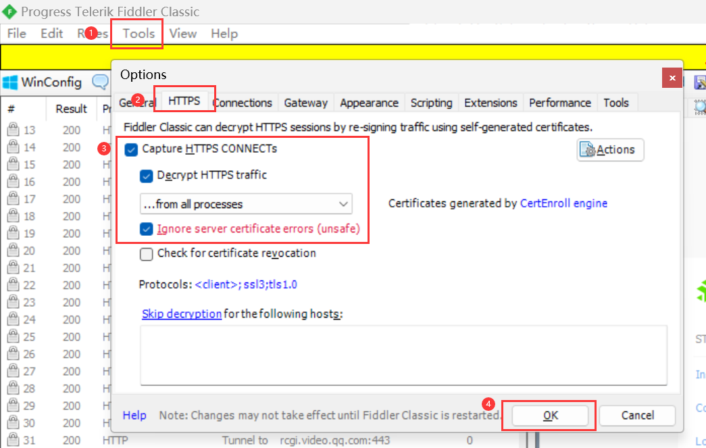
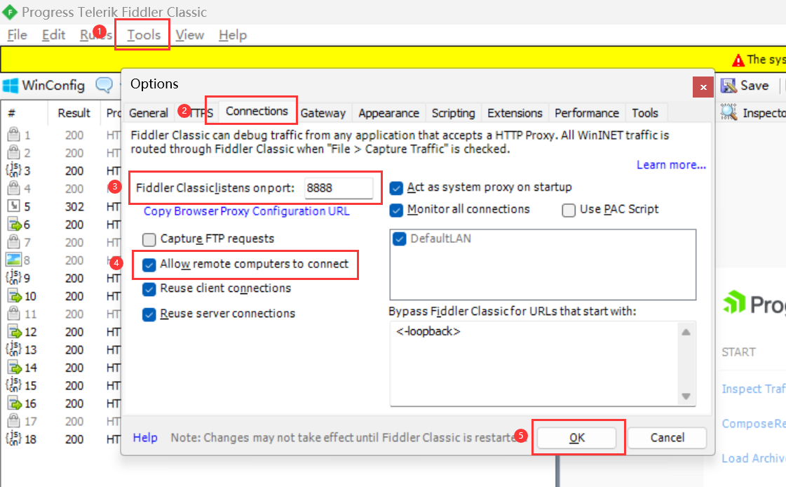
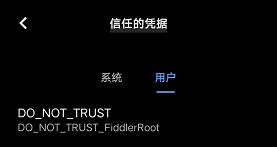
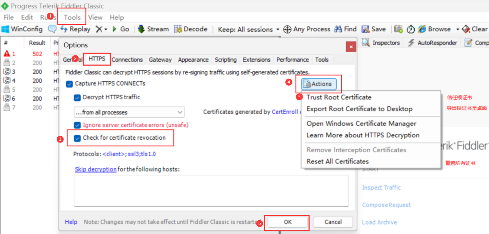

# 下载与配置

1.  下载并安装：https://www.telerik.com/download/fiddler

 

## 配置 HTTPS

Fiddler 默认只抓取 HTTP 请求，如需抓取 HTTPS 请求，可进行配置：

1.  "Tools" → "HTTPS"
2.  勾选 "**Capture HTTPS CONNECTs**"
3.  勾选 "**Decrypt HTTPS traffic**"
4.  弹窗 "SCARY TEXT AHEAD：Read Carefully！"，点击 "**Yes**"
5.  弹窗 "安全警告"，询问是否安装证书，点击 "**是**"
6.  弹窗 "Add certificate to the Machine Root List？"，点击 "**是**"
7.  弹窗 "TrustCert Success"，点击 "**确定**"
8.  勾选 "**Ignore server certificate errors(unsafe)**"
9.  点击 "**OK**"

如果还是抓不到 HTTPS，重新启动一下~

  

# 抓包

## App 抓包

① 配置 Fiddler

1.  "Tools" → "Connections"
2.  留意端口号，后面会用到。这里是 **8888**
3.  勾选 "**Allow remote computers to connect**"
4.  弹窗 "Enabling Remote Access"，点击 "**确认**"
5.  点击 "**OK**"

 

② 配置手机

1.  查看**计算机的 IP 地址**：`Win + R` → `cmd` → `ipconfig`  
    也可以在 Fiddler 的右上角查看（将鼠标悬浮在 online 上面即可查看）
2.  设置手机 WIFI 代理：主机名为**计算机的 IP 地址**、端口号为 8888
3.  手机安装 Fiddler 证书：
    1.  手机浏览器打开 http://**计算机的 IP 地址**:8888
    2.  点击 "**FiddlerRoot certificate**" 下载证书
    3.  自定义证书名称，并确认安装
    4.  可在手机 "设置" - "安全" - "信任的凭据" - "用户" 中看见证书即安装成功

 

## 小程序抓包

打开微信 PC 端，进入小程序面板，选择小程序。即可在 Fiddler 中看到小程序的请求啦~

  

# 计算机重置证书

1.  "Tools" → "HTTPS"
2.  勾选 "**Check for certificate revocation**"
3.  点击 "**Actions**"
4.  选择："**Trust Root Certificate**"
5.  出现弹窗，均选择 **yes**
6.  回到 HTTPS 的页面，点击 "**OK**"，再重启一下 Fiddler 即可

如果重启 Fiddler 后，打开浏览器网址依旧连接失败：
就重置证书，再次信任根证书，保存后，关闭 Fiddler 和浏览器，重启计算机后再操作

 
