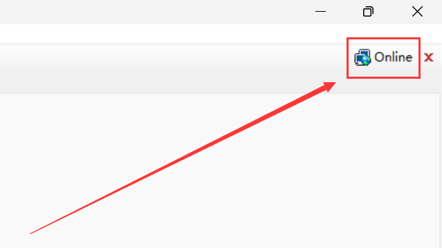
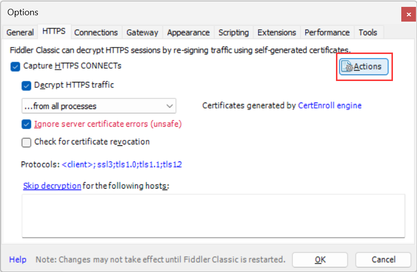

# 安装 Fiddler

1.  官网下载并安装: https://www.telerik.com/download/fiddler

<br><br>

# 配置 HTTPS

"Tools" - "Options" - "HTTPS":


<br><br>

# 移动端调试

**① - 配置 Fiddler**

1.  "Tools" - "Options" - "Connections":


2.  重启 Fiddler

<br>

**② - 配置手机**

1.  查看**计算机的 IP 地址**: 方法 1 - `Win + R` → `powershell` → `ipconfig`, 方法 2 - 鼠标悬停在 Fiddler 的右上角 "online" 处



2.  配置手机 WIFI 代理: 主机名为**计算机的 IP 地址**,端口号为 8888


注意: 电脑和手机要在同一个局域网下~

<br><br>

# 证书的安装与重置

## 安装

**PC 端**:

1. "Tools" → "Options" → "HTTPS" → "Actions" → "Trust Root Certificate"



2.  确认弹窗


3.  确认弹窗


4.  确认弹窗


<br>

**移动端**:

1. 手机浏览器打开 **计算机的 IP 地址**:8888

2. 点击 "**FiddlerRoot certificate**" 下载证书

3. 在设置中安装证书（每台手机的安装方式都可能会有点不一样）

4. 在 "信任的凭证" - "用户" 中看到证书即说明安装成功


<br>

## 重置

**PC 端**:

1. "Tools" → "Options" → "HTTPS" → "Actions" → "Reset All Certificates"


2. 重新安装

<br>

**移动端**:

1. 删除证书


2. 重新安装

<br><br>

# 配置防火墙

如果配置完手机代理还不能上网, 那可能是电脑配置还有点问题. 可以对防火墙进行配置.

1. "防火墙与网络安全" - "允许应用通过防火墙": 勾选 Fiddler 相关应用, 使其能通过防火墙


2. "防火墙与网络安全" - "高级设置": 找到 "出站规则" 和 "入站规则", 然后分别点击 "新建规则", 添加 8888 端口


<br><br>

# 配置 Fiddler

解决手机网络配置代理后无法上网的问题:

<br>

## 在注册表添加文件

1. windows + R 输入 regedit

2. 右键 "计算机\HKEY_CURRENT_USER\SOFTWARE\Microsoft\Fiddler2", "新建" - "DWORD (32 位) 值", 值设置为 80


<br>

## 配置 FiddlerScript

1. 在 Fiddler 面板的右半部分中, 找到 FiddlerScript 并点击

2. 使用 Ctrl + F 快捷键, 搜索 OnBeforeRequest 方法, 并在该方法的最后添加以下代码并保存

```javascript
if (oSession.host.toLowerCase() == "webserver:8888") {
    oSession.host = "webserver:80";
}
```


<br>
