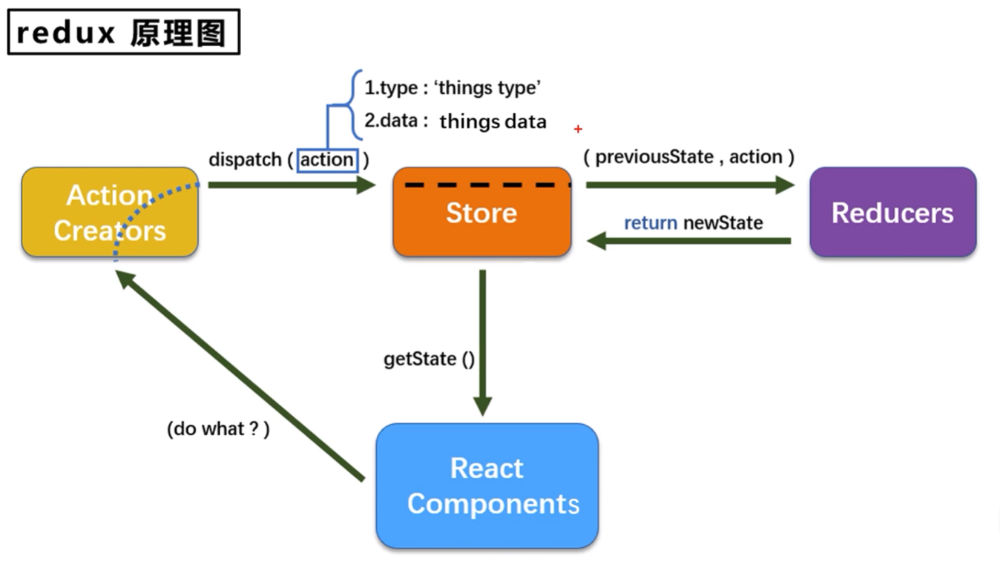

<br>

-   Redux 是一个专门用于做状态管理的 JS 库（不是 React 插件库）
-   Redux 可以在 React、Vue 等项目中使用，但基本都与 React 配合使用



<br><br>

# Redux 的 3 个核心概念 del

## action

action 是一个表示动作的对象：`{ type: String, data?: * }`

eg：`{ type: 'ADD_USER', data: { name: 'superman' } }`

```js
// src/redux/actionType.js
export const ADD = "ADD_USER";
export const DELETE = "DELETE_USER";
```

```js
// src/redux/action.js
import { ADD, DELETE } from "./actionType";

/**
 * @param {Object} payload - eg: { name: 'superman' }
 */
export function addActionCreator(payload) {
    return { type: ADD, payload };
}

/**
 * @param {Object} payload - eg: { id: 1 }
 */
export function delActionCreator(payload) {
    return { type: DELETE, payload };
}
```

<br>

## reducer

reducer 用于初始化、加工状态。

reducer 接收 2 个参数：旧的状态 `previousState`、动作对象 `action`。加工状态时，会根据旧的 state 和 action 来计算并返回新的 state。初始化状态时，从 Store 传入的参数 `previousState` 为 `undefined`。

reducer 为**纯函数**，只能接收参数 并根据参数返回指定值，不会在函数体内影响其他数据的变化。

```js
// src/redux/reducers.js - 计算新的 state 并返回
import { ADD, DELETE } from "./actionType";

const initialState = { list: [{ id: 1, name: "superman" }] };

export default function rootReducer(state = initialState, action) {
    // 初始化时, 被传入的参数 previousState 为 undefined, 这里设置了默认值为 initState
    switch (action.type) {
        case ADD:
            const newItem = { id: state.list.length + 1, ...action.payload };
            const newList = [...state.list, newItem];
            return { ...state, list: newList };
        case DELETE:
            const newList = state.list.filter(
                (item) => item.id !== action.payload.id
            );
            return { ...state, list: newList };
        default:
            // 初始化时会执行这里, 此时需要返回一个初始值
            return state;
    }
}
```

记住，reducer 只完成最基础的动作，其他逻辑处理不应放在 reducer 函数内。

reducer 会对返回值进行比较，如果返回值和原值一样的话，则不会重新渲染页面。所以，如果更新的值为数组等引用类型数据时，需要创建新的引用类型数据并返回，而不能直接使用 `unshift` 等方法修改原数据并返回。如果使用 `unshift` 方法修改原数据并返回，则返回值和原值一样 (因为引用类型数据比较的是存储地址)，页面不会重新渲染。

<br>

## store

store 是一个将 state、action、reducer 联系在一起的对象。

整个应用只有一个 store 对象

```javascript
// src/redux/store.js
import { createStore } from "redux";
import rootReducer from "./reducers";

const store = createStore(rootReducer);

export default store;
```

当有多个 reducer 时，需要使用 `combineReducers` 合并 reducer 并注册 store：

```javascript
import { createStore, combineReducers } from "redux";
import person from "./reducers/person";
import card from "./reducers/card";

const reducer = combineReducers({ person, card });
const store = createStore(reducer);

export default store;
```

<br><br>

# 使用 Redux

1.  导入 store

2.  使用 store：

    -   获取数据：`store.getState()`
    -   修改数据：`store.dispatch(addActionCreator('monster'))` / `store.dispatch(delActionCreator(1))`

需要注意：修改 redux 中存放的数据后，页面不会自动重新渲染。需要使用 `store.subscribe(() => { ... })` 监听 store 数据的变化，然后重新渲染页面。我们可以在组件中配合生命周期方法使用：

```javascript
// 组件挂载完成后
componentDidMount() {
    // 监听 store 的变化
    store.subscribe(() => {
        this.setState({}); // 什么数据都不改, 单纯重新渲染页面
    });
}
```

也可以在入口文件中配置：

```jsx
root.render(
    <React.StrictMode>
        <BrowserRouter>
            <App />
        </BrowserRouter>
    </React.StrictMode>
);

// 监听 store 的变化, 一旦 store 发生变化, 就重新渲染根组件
store.subscribe(() => {
    root.render(
        <React.StrictMode>
            <BrowserRouter>
                <App />
            </BrowserRouter>
        </React.StrictMode>
    );
});
```

<br><br>

# 异步 action

如果 action 的值为一个**对象**，则为**同步** action；如果 action 的值为一个**函数**，则为**异步** action

如果我们想延迟更新 state 中的数据，可以在组件方法中使用定时器：

```javascript
const increment = () => {
    setTimeout(() => {
        store.dispatch(addActionCreator(1));
    }, 500);
};
```

也可以使用异步 action，把异步操作放到 action 中：

```javascript
const increment = () => {
    store.dispatch(addSyncActionCreator(1, 500));
};
```

```javascript
import { ADD, SUB } from "./constants";

export const addActionCreator = (data) => ({ type: ADD, data });

// 异步 action creator
export const addSyncActionCreator = (data, delay) => {
    // store.dispatch 会作为参数传入
    return (dispatch) => {
        setTimeout(() => {
            dispatch(addActionCreator(data));
        }, delay);
    };
};
```

使用异步 action 时，需要插件 redux-thunk 的支持：

```javascript
import { createStore, applyMiddleware } from "redux";
import thunk from "redux-thunk";
import reducer from "./reducer";

// applyMiddleware(thunk) 用于支持异步 action
const store = createStore(reducer, applyMiddleware(thunk));

export default store;
```

<br>
