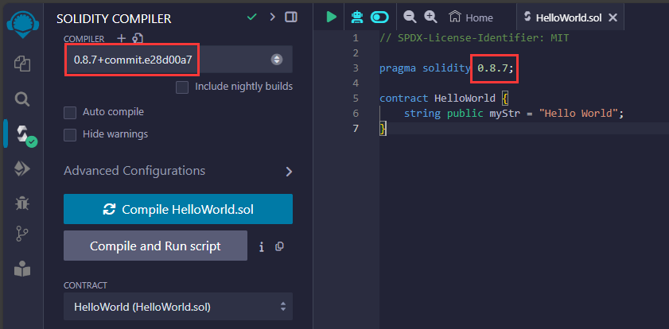
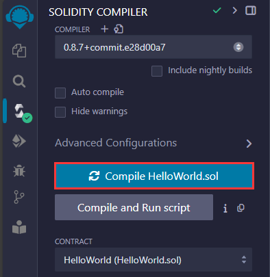
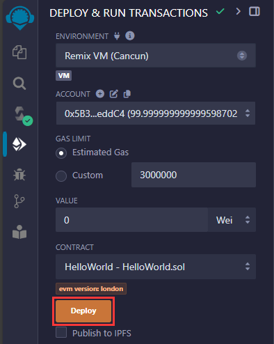
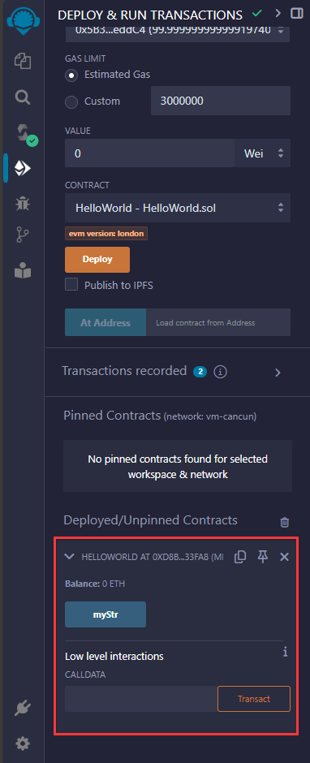
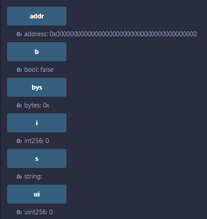

# Hello World

1.  进入在线编辑器 https://remix.ethereum.org
2.  创建并编写 HelloWorld.sol

```solidity
// SPDX-License-Identifier: MIT
pragma solidity 0.8.7;

contract HelloWorld {
	// public: 可以被合约内部和外部调用
    string public myStr = "Hello World";
}
```

3.  编译 HelloWorld.sol

确保编辑器使用的 Solidity 版本与你代码中声明的一样：



点击按钮开始编译：



4.  部署 HelloWorld.sol



现在 HelloWorld 就部署到本地啦~



<br><br>

# 数据类型

常用数据类型：

```solidity
// SPDX-License-Identifier: MIT
pragma solidity 0.8.7;

contract Type {
    string public s;

    bool public b;

    address public addr;

    uint public ui; // uint is an alias for uint256; 0 ~ 2^256-1
    // uint8, uint16, uint32, ... uint256

    int public i; // int is an alias for int256; -2^255 ~ 2^255-1
    // int8, int16, int32, ... int256

    bytes public bys; // bytes is an alias for bytes1; 0x00 ~ 0xff
    // bytes1, bytes2, bytes3, ... bytes32
}
```

可以在 Remix 中部署并查看对应类型的默认值：



在 Solidity 中可以直接通过 API 获取指定数字类型的最大最小值：

```solidity
contract MaxAndMinInt {
    uint public max = type(uint).max; // 2^256-1
    uint public min = type(uint).min; // 0

    int public maxInt = type(int).max; // 2^255-1
    int public minInt = type(int).min; // -2^255
}
```

<br><br>

# 变量

```solidity
// SPDX-License-Identifier: MIT
pragma solidity 0.8.7;

contract Variable {
    uint public stateVariable = 0; // 状态变量, 会把数据存储在区块链上

    function getLocalVariable() external pure returns (uint) {
        uint localVariable = 0; // 局部变量
        return localVariable;
    }
}
```

<br><br>

# 全局变量

全局变量主要用于提供 [关于区块链的信息] / [工具函数]：

1. 区块属性：

    - `block.basefee (uint)`：当前区块的基础费用。
    - `block.chainid (uint)`：当前链的 ID。
    - `block.coinbase (address)`：当前区块的矿工地址。
    - `block.difficulty (uint)`：当前区块的难度。
    - `block.gaslimit (uint)`：当前区块的 gas 限额。
    - `block.number (uint)`：当前区块号。
    - `block.timestamp (uint)`：当前区块的时间戳。

2. 交易属性：

    - `tx.gasprice (uint)`：交易的 gas 价格。
    - `tx.origin (address)`：交易发起者的地址。

3. 消息属性：

    - `msg.data (bytes)`：完整的 calldata。
    - `msg.sender (address)`：消息发送者的地址（当前调用者）。
    - `msg.sig (bytes4)`：calldata 的前 4 字节（函数选择器）。
    - `msg.value (uint)`：随消息发送的 wei 数量。

4. 工具函数：
    - `gasleft() returns (uint256)`：返回当前剩余的 gas 数量。
    - `abi.encode(...) returns (bytes)`：对给定的参数进行 ABI 编码。
    - `abi.decode(bytes memory encodedData, (...)) returns (...)`：对给定的数据进行 ABI 解码。
    - `blockhash(uint blockNumber) returns (bytes32)`：返回指定区块的哈希值（仅适用于最近的 256 个区块）。

```solidity
// SPDX-License-Identifier: MIT
pragma solidity 0.8.7;

contract GlobalVariables {
    function getGlobalVariables() public view returns (address, uint, uint) {
        address sender = msg.sender; // 调用者地址
        uint blockNumber = block.number; // 区块号
        uint timestamp = block.timestamp; // 调用该函数时的时间戳
        return (sender, blockNumber, timestamp);
    }
}
```

<br>
