# 变量

**状态变量**：状态变量是在合约内声明的变量；状态变量的数据存储在区块链上。

```solidity
contract Demo {
    uint public count; // 声明状态变量 count
}
```

**局部变量**：局部变量是在函数内声明的变量；局部变量的数据存储在内存中，函数执行完后 内存会被释放。

```solidity
contract Demo {
    function calculateSum(uint a, uint b) public pure returns (uint) {
        uint c = a + b;
        return c;
    }
    // 上例的 a b c 都是局部变量
}
```

**全局变量**：全局变量是 Solidity 提供的特殊变量，用于获取区块链相关的信息。

1. 区块属性

    - `block.basefee`(uint)：当前区块的基础费用

    - `block.chainid`(uint)：当前链的 ID

    - `block.difficulty`(uint)：当前区块的难度

    - `block.gaslimit`(uint)：当前区块的 gas 限额

    - `block.number`(uint)：当前区块号

    - `block.timestamp`(uint)：当前区块的时间戳

    - `block.coinbase`(address)：当前区块的矿工地址

2. 交易属性

    - `tx.gasprice`(uint)：交易所需的 gas

    - `tx.origin`(address)：交易发起者的地址

3. 消息属性

    - `msg.data`(bytes)：调用数据 (calldata)

    - `msg.sig`(bytes4)：调用数据的前 4 个字节 (即函数选择器)

    - `msg.value`(uint)：随调用发送的以太币数量 (以 wei 为单位)

    - `msg.sender`(address)：调用者的地址

4. 工具函数

    - `gasleft() returns (uint)`：返回剩余的 gas 数量

    - `blockhash(uint blockNumber) returns (bytes32)`：返回指定区块的哈希值（仅适用于最近的 256 个区块）

```solidity
contract Demo {
    function getGlobalVariables() public view returns (address, uint) {
        address sender = msg.sender; // 调用者的地址
        uint timestamp = block.timestamp; // 当前区块的时间戳
        return (sender, timestamp);
    }
}
```

<br><br>

# 值类型

值类型的变量在赋值或作为函数参数传递时会被复制数据的值。

1.  **布尔类型**：

```solidity
contract Demo {
    bool public isActive; // 默认为 false
}
```

2.  **整数类型**：

    -   无符号整数类型：`uint8`、`uint16`、...、`uint256` (`uint256` 可简写为 `uint`)

    -   有符号整数类型：`int8`、`int16`、...、`int256` (`int256`可简写为 `int`)

```solidity
contract Demo {
    // 有符号整数类型
    int public signedInt; // 默认为 0
    // 无符号整数类型
    uint public unsignedInt; // 默认为 0
}
```

-   在 Solidity 中可以直接通过 API 获取指定整数类型的最大最小值：

```solidity
contract Demo {
    uint public maxUint = type(uint).max; // 2^256-1
    uint public minUint = type(uint).min; // 0

    int public maxInt = type(int).max; // 2^255-1
    int public minInt = type(int).min; // -2^255
}
```

3.  **地址类型**：用于存储以太坊地址，占 20 字节

```solidity
contract Demo {
    address public owner; // 默认为 0x0000000000000000000000000000000000000000
}
```

4.  **定长字节类型**：

    -   `bytes1`、`bytes2`、...、`bytes32`

```solidity
contract Demo {
    bytes1 public dataHash1; // 默认为 0x00
    bytes2 public dataHash2; // 默认为 0x0000
}
```

5.  **枚举类型**：

    -   枚举的默认值是其定义中的第一个值

    -   枚举值在内部表示为无符号整数，从 0 开始递增

```solidity
contract Demo {
    enum State {
        PENDING, // 0
        ACTIVE, // 1
        INACTIVE // 2
    }
    State public state; // 默认值为 PENDING, 即 0
}
```

<br><br>

# 引用类型

引用类型的变量在赋值或作为函数参数传递时会被复制存储数据的地址。

1.  **字符串类型**：

```solidity
contract Demo {
    string public stringData; // 默认为空字符串 ""
}
```

2.  **动态字节类型**：

```solidity
contract Demo {
    bytes public byteData; // 默认为 0x
}
```

3.  **数组类型**：

    -   固定大小数组类型：`uint[5]` 表示包含 5 个无符号整数的数组

    -   动态大小数组类型：`uint[]` 表示大小可变的无符号整数数组

```solidity
contract Demo {
    // 固定大小数组类型
    uint[3] public fixedArray1; // 默认为 [0, 0, 0]
    // 动态大小数组类型
    uint[] public dynamicArray; // 默认为 []
    // 对于固定大小数组类型的变量, 还能如下创建
    uint[] public fixedArray2 = new uint[](3); // 默认为 [0, 0, 0]
}
```

4.  **映射类型**：用于存储 key-value

```solidity
contract Demo {
    mapping(address => uint) public balances;
    // key-value 中, value 的默认值为对应类型的默认值, 这里为 uint 的默认值 0
}
```

5.  **结构体类型**：用于将不同类型的数据组合在一起

```solidity
contract Demo {
    struct Person {
        string name;
        uint age;
    }
    Person public person;
    // 数据的默认值为对应类型的默认值, 这里 name 默认为空字符串 "", age 默认为 0
}
```

<br><br>

# 操作 Enum

```solidity
contract Demo {
    enum State {
        PENDING,
        ACTIVE,
        INACTIVE
    }
    State private state;

    // 更新 state
    function updateState(State _state) public {
        state = _state;
    }

    // 重置 state
    function resetState() public {
        delete state; // 重置为默认值 PENDING, 即 0
    }

    // 获取 state
    function getState() public view returns (State) {
        return state;
    }
}
```

1. 部署 Demo 合约，state 默认值为 PENDING，即 0

2. 调用 getState 方法，返回值为 uint8 类型的整数 0

3. 调用 updateState 方法，传入 0 / 1 / 2，分别表示 PENDING / ACTIVE / INACTIVE

4. 调用 getState 方法，返回值为传入的整数

5. 调用 resetState 方法，重置 state 为默认值 PENDING，即 0

6. 调用 getState 方法，返回值为 0

<br><br>

# 操作 Array

操作动态大小的数组：

```solidity
contract Demo {
    uint[] private dynamicArray;

    // 获取数组长度
    function getLength() public view returns (uint) {
        return dynamicArray.length;
    }

    // 获取指定元素
    function get(uint _index) public view returns (uint) {
        return dynamicArray[_index];
    }

    // 添加元素
    function push(uint _value) public {
        dynamicArray.push(_value);
    }

    // 更新指定元素
    function set(uint _index, uint _value) public {
        dynamicArray[_index] = _value;
    }

    // 重置指定元素; eg: [1, 2, 3] - [1, 0, 3]
    function deleteByIndex(uint _index) public {
        delete dynamicArray[_index]; // 注意: 这里是将该元素重置为默认值了, 不会改变数组长度
    }

    // 删除最后一个元素; eg: [1, 2, 3] - [1, 2]
    function pop() public {
        dynamicArray.pop();
    }

    // 删除指定元素; eg: [1, 2, 3] - [1, 3]
    function remove(uint _index) public {
        for (uint i = _index; i < dynamicArray.length - 1; i++) {
            dynamicArray[i] = dynamicArray[i + 1];
        }
        dynamicArray.pop();
    }

    // 删除所有元素; eg: [1, 2, 3] - []
    function clear() public {
        delete dynamicArray; // 注意: 这里是将数组重置为空数组了, 数组长度变为 0
    }
}
```

操作固定大小的数组：

```solidity
contract Demo {
    uint[3] private fixedArray1;
    uint[] private fixedArray2 = new uint[](3);

    // 获取数组长度
    function getLength() public view returns (uint, uint) {
        return (fixedArray1.length, fixedArray2.length);
    }

    // 获取指定元素
    function get(uint _index) public view returns (uint, uint) {
        return (fixedArray1[_index], fixedArray2[_index]);
    }

    // 更新指定元素
    function set(uint _index, uint _value) public {
        fixedArray1[_index] = _value;
        fixedArray2[_index] = _value;
    }

    // 重置指定元素; eg: [1, 2, 3] - [1, 0, 3]
    function deleteByIndex(uint _index) public {
        delete fixedArray1[_index];
        delete fixedArray2[_index];
        // 注意: 这里是将该元素重置为默认值了, 不会改变数组长度
    }

    // 重置所有元素; eg: [1, 2, 3] - [0, 0, 0]
    function clear() public {
        delete fixedArray1;
        delete fixedArray2;
        // 注意: 这里是将所有元素重置为默认值了, 不会改变数组长度
    }
}
```

在内存中创建数组：

```solidity
contract Demo {
    function createArray(uint size) public pure returns (uint[] memory) {
        uint[] memory arr = new uint[](size);
        for (uint i = 0; i < size; i++) {
            arr[i] = i;
        }
        return arr;
    }
}
```

<br><br>

# 操作 Mapping

```solidity
contract Demo {
    mapping(address => uint) private myBalance;

    // 获取指定值
    function getMyBalance(address _user) public view returns (uint) {
        return myBalance[_user];
    }

    // 更新指定值
    function setMyBalance(address _user, uint _amount) public {
        myBalance[_user] += _amount;
    }

    // 重置指定值
    function deleteMyBalance(address _user) public {
        delete myBalance[_user]; // 重置为类型的默认值
    }
}
```

实现可迭代的 Mapping：

```solidity
contract Demo {
    mapping(address => uint) private balance; // 用户 => 余额
    mapping(address => bool) public isCustomer; // 用户 => 是否是客户
    address[] public customers; // 客户列表

    // 存款
    function deposit(address _customer, uint _amount) public {
        balance[_customer] += _amount;
        if (!isCustomer[_customer]) {
            customers.push(_customer);
            isCustomer[_customer] = true;
        }
    }

    // 通过地址取款
    function getBalance(address _customer) public view returns (uint) {
        return balance[_customer];
    }

    // 通过索引取款
    function getBalanceByIndex(uint _index) public view returns (uint) {
        return balance[customers[_index]];
    }
}
```

<br><br>

# 操作 Struct

```solidity
contract Demo {
    struct Student {
        uint id;
        string name;
    }
    Student[] private students;
}
```

1.  创建 Struct 实例：

```solidity
function addStudent1(string memory _name) public {
    // 按属性顺序创建 Struct 实例, 并添加到 students 数组
    students.push(Student(students.length, _name));
}

function addStudent2(string memory _name) public {
    // 按属性名创建 Struct 实例, 并添加到 students 数组
    students.push(Student({id: students.length, name: _name}));
}

function addStudent3(string memory _name) public {
    // 创建 Struct 实例, 但不指定属性值, 会使用默认值
    Student memory student;
    // 设置属性值
    student.id = students.length;
    student.name = _name;
    // 添加到 students 数组
    students.push(student);
}
```

2.  访问 Struct 实例属性：

```solidity
function getStudentInfoByIndex(
    uint _index
) public view returns (uint, string memory) {
    Student memory student = students[_index];
    return (student.id, student.name);
}
```

3.  修改 Struct 实例属性：

```solidity
function updateStudentNameByIndex(uint _index, string memory _name) public {
    Student storage student = students[_index];
    student.name = _name;
}
```

4.  重置 Struct 实例属性：

```solidity
function deleteStudentNameByIndex(uint _index) public {
    Student storage student = students[_index];
    delete student.name; // 将属性值重置为默认值
}
```

5.  重置 Struct 实例：

```solidity
function deleteStudentByIndex(uint _index) public {
    delete students[_index]; // 将该 Struct 实例的属性值都重置为默认值
}
```

<br><br>

# 访问修饰符

-   `private`：表示仅能在合约内部访问；可用于修饰函数和状态变量

-   `internal`：表示能在合约内部或继承合约内部访问；可用于修饰函数和状态变量

-   `public`：表示能在任何地方访问；可用于修饰函数和状态变量

-   `external`：表示仅能在合约外部访问；仅可用于修饰函数

```solidity
contract Demo {
    uint private privateVar = 1;
    uint internalVar = 2; // default internal
    uint public publicVar = 3;

    function privateFunc() private view returns (uint) {
        return privateVar;
    }

    function internalFunc() internal view returns (uint) {
        return internalVar;
    }

    function publicFunc() public view returns (uint) {
        return publicVar;
    }

    function externalFunc() external pure returns (uint) {
        return 4;
    }

    function testFuncInDemo() public view {
        privateVar + internalVar + publicVar;

        privateFunc();
        internalFunc();
        publicFunc();
        // externalFunc();
    }
}

contract ChildDemo is Demo {
    function testFuncInChild() public view {
        publicVar + internalVar + publicVar;

        // privateFunc();
        internalFunc();
        publicFunc();
        // externalFunc();
    }
}

contract ExternalDemo {
    Demo demo = new Demo(); // 创建外部合约实例

    function testFuncInExternal() public view {
        demo.publicVar;

        // demo.privateFunc();
        // demo.internalFunc();
        demo.publicFunc();
        demo.externalFunc();
    }
}
```

在 Solidity 中，public 修饰的状态变量会自动生成 getter 函数，一般情况下 可以直接访问变量，但也有需要调用 getter 的情况：

```solidity
contract Demo {
    uint public publicVar = 1;
}

contract ExternalDemo {
    Demo demo = new Demo(); // 创建外部合约实例

    function testFunc() public view returns (uint) {
        demo.publicVar; // 直接访问
        return demo.publicVar(); // 通过 getter 访问
    }
}
```

<br><br>

# 函数修饰符

-   `pure`：表示函数既不读取也不修改合约的状态变量
-   `view`：表示函数会读取合约的状态变量，但不修改它们

```solidity
contract Demo {
    uint public x = 10;

    function pureFunc(uint a, uint b) public pure returns (uint) {
        return a * b;
    }

    function viewFunc() public view returns (uint) {
        return x;
    }
}
```

对于会修改状态变量的函数，不需要函数修饰符：

```solidity
contract Demo {
    uint public count;

    function increment() external {
        count++;
    }
}
```

<br><br>

# 状态变量修饰符

-   `constant`：表示变量会在编译时确定值，且之后不会再更新
-   `immutable`：表示变量会在合约部署时确定值，且之后不会再更新

```solidity
contract Demo {
    uint public constant NUM = 100;
    address public immutable OWNER;

    constructor() {
        OWNER = msg.sender;
    }
}
```

<br><br>

# 局部变量修饰符

在函数中，可用 storage、memory、calldata 修饰引用类型数据。

-   `storage`：表示此处操作的是数据地址；仅可用于局部变量
-   `memory`：表示此处操作的是数据副本；可用于局部变量、参数、返回值
-   `calldata`：表示数据只读，不可操作；仅可用于参数

```solidity
contract Demo {
    struct Person {
        string name;
        uint age;
    }
    Person[] public persons;

    // calldata: 表示数据只读, 不可操作; 仅可用于参数
    function addPerson(string calldata _name, uint _age) public {
        persons.push(Person(_name, _age));
    }

    function getPerson(uint _index) public view returns (string memory, uint) {
        // memory: 表示此处操作的是数据副本; 可用于局部变量、参数、返回值
        return (persons[_index].name, persons[_index].age);
    }

    function updatePerson(uint _index, uint _age) public {
        // storage: 表示此处操作的是数据地址; 仅可用于局部变量
        Person storage person = persons[_index];
        person.age = _age;
    }
}
```

<br><br>

# 构造函数

构造函数仅在合约部署时调用一次，主要用于初始化状态变量。

```solidity
contract Demo {
    address public owner;
    uint public num;

    constructor(uint _num) {
        owner = msg.sender;
        num = _num;
    }
}
```

<br><br>

# 函数输出

单输出：

```solidity
contract Demo {
    function getSingleNumber() public pure returns (uint) {
        return 42;
    }
}
```

多输出：

```solidity
contract Demo {
    function getMultipleNumbers() public pure returns (uint, uint) {
        return (1, 2);
    }
}
```

命名输出：

```solidity
contract Demo {
    function getNamedNumbers1() public pure returns (uint first, uint second) {
        first = 3;
        second = 4;
    }

    // 相当于

    function getNamedNumbers2() public pure returns (uint, uint) {
        uint first;
        uint second;
        first = 3;
        second = 4;
        return (first, second);
    }
}
```

获取函数返回值：

```solidity
contract Demo {
    // ...

    function callFunctions() public pure returns (uint, uint, uint) {
        uint singleNumber = getSingleNumber(); // 获取单个返回值
        (uint multipleNumber1, uint multipleNumber2) = getMultipleNumbers(); // 获取多个返回值
        return (singleNumber, multipleNumber1, multipleNumber2);
    }
}
```

<br><br>

# 函数装饰器

函数装饰器可以在函数执行之前或之后插入代码逻辑，比如检查条件、限制访问权限等。

```solidity
contract Demo {
    address public owner;

    constructor() {
        owner = msg.sender;
    }

    // 定义装饰器
    modifier onlyOwner() {
        require(msg.sender == owner, "Not the contract owner");
        _;
    }

    // 使用装饰器
    function changeOwner(address newOwner) public onlyOwner {
        owner = newOwner;
    }
}
```

装饰器可以接收参数 & 函数可以同时使用多个装饰器：

```solidity
contract Demo {
    address public owner;

    constructor() {
        owner = msg.sender;
    }

    // 定义装饰器
    modifier onlyOwner() {
        require(msg.sender == owner, "Not the contract owner");
        _;
    }

    // 定义带参数的装饰器
    modifier validAddress(address _addr) {
        require(_addr != address(0), "Invalid address");
        // address(0) is often used to represent an invalid or uninitialized address.
        _;
    }

    // 同时使用多个装饰器
    function changeOwner(
        address newOwner
    ) public onlyOwner validAddress(newOwner) {
        owner = newOwner;
    }
}
```

三明治装饰器：可以在函数执行之前和之后插入代码逻辑的装饰器。demo - 防止重入攻击：

```solidity
contract Demo {
    bool private locked = false;

    // 定义一个防止重入攻击的装饰器
    modifier noReentrant() {
        require(!locked, "No Reentrant");
        locked = true;
        _;
        locked = false;
    }

    // 使用装饰器
    function withdraw() public noReentrant {
        // ... 提现逻辑 ...
    }
}
```

<br><br>

# 异常处理

Solidity 中有 3 个异常处理方法：

```solidity
contract Demo {
    // 1. require
    function testRequire(uint a) public pure returns (uint) {
        require(a > 10, "a must be greater than 10"); // 若条件不满足, 则触发异常, 并抛出异常信息; 会退还剩余的 gas
        return a;
    }

    // 2. revert
    function testRevert(uint a) public pure returns (uint) {
        if (a <= 10) {
            revert("a must be greater than 10"); // 触发异常, 并抛出异常信息; 会退还剩余的 gas
        }
        return a;
    }

    // 3. assert
    function testAssert(uint a) public pure returns (uint) {
        assert(a > 10); // 若条件不满足, 则触发异常; 会消耗剩余的 gas
        return a;
    }
}
```

自定义异常 - 可以自定义异常信息，且更节省 gas；搭配 revert 使用：

```solidity
contract Demo {
    error MyError(address sender, uint value);

    function testCustomError(uint a) public view returns (uint) {
        if (a <= 10) {
            revert MyError(msg.sender, a); // 触发异常, 并抛出自定义的异常信息
        }
        return a;
    }
}
```

try catch - 适用于处理外部合约调用失败的情况：

```solidity
// 外部合约, 用于示例
contract ExternalContract {
    function mayFail(uint value) public pure returns (uint) {
        require(value != 0, "Value cannot be zero");
        return value * 2;
    }
}

// 主合约, 使用 try/catch 处理外部调用
contract TryCatchExample {
    event Success(uint value);
    event Failure(string reason);

    ExternalContract externalContract;

    constructor() {
        // 创建外部合约实例
        externalContract = new ExternalContract();
    }

    function tryCatchExample(uint value) public {
        try externalContract.mayFail(value) returns (uint result) {
            emit Success(result);
        } catch Error(string memory reason) {
            // 捕获 require 和 revert 抛出的错误, 并返回错误消息
            emit Failure(reason);
        } catch (bytes memory) {
            // 捕获低级别错误 (如 assert 抛出的错误), 并返回通用错误消息
            emit Failure("Low-level error");
        }
    }
}
```

<br><br>

# 事件

```solidity
contract Demo {
    event Transfer(address indexed from, address indexed to, uint value); // 定义事件

    function transfer(address _to, uint _value) public {
        emit Transfer(msg.sender, _to, _value); // 触发事件
    }
}
```

事件的用途：

-   事件可以用于记录交易日志，帮助调试和监控合约的运行状态。
-   外部应用程序可以通过以太坊客户端的 RPC 接口订阅和监听这些事件，从而在事件发生时执行相应的操作。

事件的继承：

-   事件可以在合约中被继承，这使得子合约可以使用父合约定义的事件。

索引参数：

-   事件参数可以使用 `indexed` 关键字进行索引，最多可以索引三个参数。
-   索引参数可以加快事件的搜索和过滤。

监听事件：

外部应用程序（如 DApp）可以使用 Web3.js 等库来监听和处理事件。

```javascript
const event = contractInstance.Transfer();
event.watch(function (error, result) {
    if (!error) {
        console.log(result.args.from, result.args.to, result.args.value);
    }
});
```

<br>

# 流程控制

## 条件判断

if-else：

```solidity
function testIf(uint a, uint b) public pure returns (uint) {
    if (a > b) {
        return a;
    } else {
        return b;
    }
}
```

三元运算符：

```solidity
function testTernary(uint a, uint b) public pure returns (uint) {
    return a > b ? a : b;
}
```

注意：Solidity 不支持 switch-case 语句

<br><br>

## 循环

for 循环：

```solidity
function forLoop() public pure returns (uint) {
    uint sum = 0;
    for (uint i = 0; i < 10; i++) {
        if (i == 3) continue;
        if (i == 5) break;
        sum += i;
    }
    return sum;
}
```

while 循环：

```solidity
function whileLoop() public pure returns (uint) {
    uint sum = 0;
    uint i = 0;
    while (i < 10) {
        if (i == 3) {
            i++;
            continue;
        }
        if (i == 5) break;
        sum += i;
        i++;
    }
    return sum;
}
```

do while 循环：

```solidity
function doWhileLoop() public pure returns (uint) {
    uint sum = 0;
    uint i = 0;
    do {
        if (i == 3) { i++; continue; }
        if (i == 5) break;
        sum += i;
        i++;
    } while (i < 10);
    return sum;
}
```

注意：在 Solidity 中需要控制好循环的次数，因为循环得越多 消耗的 gas 就越多 ~

<br>

# 继承

Solidity 中使用 `is` 关键字实现继承：

```solidity
contract Father {
    function getNumber() public pure returns (uint) {
        return 10;
    }

    function getNumber2() public pure virtual returns (uint) {
        return 20;
    }
}

contract Son is Father {}
```

现在 Son 就可以调用 Father 的 getNumber、getNumber2 方法啦

<br><br>

# 函数重写

对于父合约中用 virtual 修饰的方法，可以在子合约中改用 override 修饰 并重写方法的内容：

```solidity
contract Father {
    function getNumber() public pure returns (uint) {
        return 10;
    }

    function getNumber2() public pure virtual returns (uint) {
        return 20;
    }
}

contract Son is Father {
    function getNumber2() public pure override returns (uint) {
        return 40;
    }
}
```

<br><br>

# 多级继承

```solidity
contract Father {
    function getNumber() public pure returns (uint) {
        return 10;
    }

    function getNumber2() public pure virtual returns (uint) {
        return 20;
    }

    function getNumber3() public pure virtual returns (uint) {
        return 30;
    }
}

contract Son is Father {
    function getNumber2() public pure override returns (uint) {
        return 40;
    }

    // 用 virtual 和 override 同时修饰方法
    function getNumber3() public pure virtual override returns (uint) {
        return 50;
    }
}

contract GrandSon is Son {
    function getNumber3() public pure override returns (uint) {
        return 60;
    }
}
```

<br><br>

# 多重继承

在 Solidity 中，继承顺序通过 C3 线性化算法确定。这个算法确保继承关系是一个有向无环图（DAG），并强制一个特定的继承顺序。

**demo1**：

```
   X
 / |
Y  |
 \ |
   Z
```

根据 C3 线性化算法，继承顺序是从最底层的合约开始，逐层向上合并继承路径。具体步骤如下：

1. 从最底层合约 `Z` 开始：

    - `Z` 继承自 `Y` 和 `X`。
    - 继承顺序：`[Z, Y, X]`。

2. 合并继承路径：

    - `Y` 继承自 `X`。
    - 继承顺序：`[Y, X]`。

3. 最终继承顺序：

    - 合并 `Z` 的继承顺序 `[Z, Y, X]` 和 `Y` 的继承顺序 `[Y, X]`。
    - 确保每个合约只出现一次，并且遵循继承关系。
    - 最终继承顺序为：`[Z, Y, X]`。

```solidity
contract X {
    function foo() public virtual returns (string memory) {
        return "X";
    }
}

contract Y is X {
    function foo() public virtual override returns (string memory) {
        return "Y";
    }
}

// 根据继承顺序, 先 X 后 Y;  若遇平级, 则顺序随意
contract Z is X, Y {
    // override 里面的顺序无所谓
    function foo() public pure override(Y, X) returns (string memory) {
        return "Z";
    }
}
```

**demo2**：

```
  X
 / \
Y   A
|   |
|   B
 \ /
  Z
```

根据 C3 线性化算法，继承顺序是从最底层的合约开始，逐层向上合并继承路径。具体步骤如下：

1. 从最底层合约 `Z` 开始：

    - `Z` 继承自 `Y` 和 `B`。
    - 继承顺序：`[Z, Y, B]`。

2. 合并继承路径：

    - `Y` 继承自 `X`。
    - `B` 继承自 `A`，`A` 继承自 `X`。
    - 继承顺序：`[Y, X]` 和 `[B, A, X]`。

3. 最终继承顺序：

    - 合并 `Z` 的继承顺序 `[Z, Y, B]` 和 `Y` 的继承顺序 `[Y, X]` 以及 `B` 的继承顺序 `[B, A, X]`。
    - 确保每个合约只出现一次，并且遵循继承关系。
    - 最终继承顺序为：`[Z, Y, B, A, X]`。

```solidity
contract X {
    function foo() public virtual returns (string memory) {
        return "X";
    }
}

contract Y is X {
    function foo() public virtual override returns (string memory) {
        return "Y";
    }
}

contract A is X {
    function foo() public virtual override returns (string memory) {
        return "A";
    }
}

contract B is A {
    function foo() public virtual override returns (string memory) {
        return "B";
    }
}

contract Z is Y, B {
    function foo() public pure override(Y, B) returns (string memory) {
        return "Z";
    }
}
```

<br><br>

# 调用父合约的构造函数

```solidity
contract A {
    string public name;

    constructor(string memory _name) {
        name = _name;
    }
}

contract B {
    uint public number;

    constructor(uint _number) {
        number = _number;
    }
}

// demo 1 - 在构造函数后面调用基类构造函数
contract C is A, B {
    constructor(string memory _name, uint _number) A(_name) B(_number) {}
}

// demo 2 - 在合约定义时调用基类构造函数
contract D is A("Hello"), B(42) {}

// demo 3 - 混合使用 demo 1 和 2 的方法
contract E is A("Hello"), B {
    constructor(uint _number) B(_number) {}
}
```

构造函数的调用顺序：先继承的父合约 → 后继承的父合约 → 当前合约

所以，demo 1 是 A → B → C、 demo 2 是 A → B → D、 demo 3 是 A → B → E

<br><br>

# 调用父合约的方法

```solidity
contract A {
    event Log(string message);

    function func() public virtual {
        emit Log("A.func");
    }
}

contract B is A {
    function func() public virtual override {
        emit Log("B.func");
        // 方法 1 - 通过 super 调用
        super.func(); // A
    }
}

contract C is A {
    function func() public virtual override {
        emit Log("C.func");
        // 方法 2 - 通过合约调用
        A.func(); // A
    }
}

contract D is B, C {
    // 方法 1 和方法 2 的区别

    function func() public override(B, C) {
        C.func(); // C - A
        B.func(); // B - A
        A.func(); // A
    }

    function funcD() public {
        super.func(); // C - B - A
    }
}
```

<br>

# 以太比的单位

wei、gwei、finney 和 ether 是以太币（Ether）的不同单位。

1. wei 是以太币的最小单位，1 ether = 10^18 wei；这是 Solidity 中的默认单位

```solidity
uint public oneWei = 1 wei;
```

2. gwei 是 wei 的 10^9 倍，1 ether = 10^9 gwei；常用于表示交易费用 (gas price)

```solidity
uint public oneGwei = 1 gwei;
```

3. finney 是 wei 的 10^15 倍，1 ether = 10^3 finney

```solidity
uint public oneFinney = 1 finney;
```

4. ether 是 wei 的 10^18 倍；是以太坊的基本单位

```solidity
uint public oneEther = 1 ether;
```

<br><br>

# payable 修饰符

```solidity
contract Demo {
    // 接收以太币的函数, 必须使用 payable 修饰符
    function receiveEther() external payable {
        require(msg.value > 0, "Must send some Ether");
    }

    // 提现函数，将合约中的以太币发送给调用者
    function withdraw() external {
        uint amount = address(this).balance;
        require(amount > 0, "No Ether to withdraw");
        payable(msg.sender).transfer(amount);
    }

    // 获取合约的以太币余额
    function getBalance() external view returns (uint) {
        return address(this).balance;
    }
}
```

1.  部署 Demo 合约

2.  设置以太币的数量，调用 receiveEther 函数

3.  调用 getBalance 函数，查看合约的以太币余额

4.  调用 withdraw 函数，将合约中的以太币发送给调用者

5.  再次调用 getBalance 函数，查看合约的以太币余额

<br><br>

# receive & fallback 方法

在 Solidity 中，receive & fallback 是一种特殊的函数。声明形式为 `receive/fallback() external payable { ... }`。它不需要 `function` 关键字，没有参数，也没有返回值。

**特性**：

-   receive & fallback 函数必须声明为 `external`，表示只能通过外部调用来触发。
-   receive 必须使用 `payable` 修饰符；fallback 可以使用 `payable` 修饰符。

**receive & fallback 的区别**：

-   receive：专门用于处理没有附加数据的以太币转账。
-   fallback：用于处理所有其他情况，包括调用不存在的函数或接收带有附加数据的以太币转账。如果合约没有定义 `receive` 方法，但定义了 `payable` 的 `fallback` 方法，那么在接收以太币时会调用 `fallback` 方法。

```solidity
contract Demo {
    event Log(string message, address sender, uint value, bytes data);

    // 定义 receive 方法
    receive() external payable {
        emit Log("receive", msg.sender, msg.value, "");
    }

    // 定义 fallback 方法
    fallback() external payable {
        emit Log("fallback", msg.sender, msg.value, msg.data);
    }
}
```

<br><br>

# 以太币的发送与接收

有 3 种方法发送以太币：

1.  transfer：有 2300 gas 的限制；如果转账失败，会回滚交易
2.  send：有 2300 gas 的限制；如果转账失败，不会回滚交易，而是返回 `false`；需要手动检查返回值并处理失败情况
3.  call：没有 gas 限制，可以指定 gas 量；如果转账失败，不会回滚交易，而是返回 `false`；需要手动检查返回值并处理失败情况

有 2 种方法接收以太币：

1. 用 payable 修饰 constructor，接收部署时传入的以太币
2. 编写 receive / fallback 方法，接收以太币

```solidity
contract SendEther {
    // 使用 transfer 方法发送以太币
    function sendEtherViaTransfer(address payable recipient) external payable {
        recipient.transfer(msg.value);
    }

    // 使用 send 方法发送以太币
    function sendEtherViaSend(address payable recipient) external payable {
        bool success = recipient.send(msg.value);
        require(success, "Send failed");
    }

    // 使用 call 方法发送以太币 (推荐)
    function sendEtherViaCall(address payable recipient) external payable {
        (bool success, ) = recipient.call{value: msg.value}("");
        require(success, "Call failed");
    }
}

contract ReceiveEther {
    event Received(address, uint, uint);

    // 接收部署时传入的以太币
    constructor() payable {}

    // 接收以太币
    receive() external payable {
        // 打印发送者、接收的以太币数量、剩余的 gas
        emit Received(msg.sender, msg.value, gasleft());
    }
}
```

1. 部署 SendEther 合约

2. 设置以太币的数量，部署 ReceiveEther 合约；部署完成后可以看到接收的以太币数量

3. ReceiveEther 合约的地址作为参数，设置以太币的数量，调用 SendEther 合约的 sendEtherViaTransfer 函数；可以看到 ReceiveEther 合约的以太币余额变化

4. ReceiveEther 合约的地址作为参数，设置以太币的数量，调用 SendEther 合约的 sendEtherViaSend 函数；可以看到 ReceiveEther 合约的以太币余额变化

5. ReceiveEther 合约的地址作为参数，设置以太币的数量，调用 SendEther 合约的 sendEtherViaCall 函数；可以看到 ReceiveEther 合约的以太币余额变化

<br>

# ABI 解码

ABI 编码将函数调用和参数转换为字节数据，以便在以太坊网络上传输。解码则是将这些字节数据还原为原始类型。

数据编码：用于与智能合约交互时的参数编码。

1. abi.encode：每个参数都会被填充为 32 字节的数据，并拼接在一起

2. abi.encodePacked：类似 abi.encode，但会省略其中填充的零

函数编码：用于调用其他合约的函数。

1. abi.encodeWithSignature：第一个参数为函数签名，后面的参数为函数参数

2. abi.encodeWithSelector：第一个参数为函数选择器，后面的参数为函数参数

解码：

1. abi.decode：接受两个参数：编码后的数据和类型列表

```solidity
// SPDX-License-Identifier: MIT
pragma solidity ^0.8.26;

contract ABIDecodeExample {
    function encodeData() external pure returns (bytes memory) {
        uint a = 1;
        address b = 0x1234567890123456789012345678901234567890;
        string memory c = "Hello, World!";
        return abi.encode(a, b, c);
    }

    function decodeData(
        bytes memory data
    ) external pure returns (uint, address, string memory) {
        (uint a, address b, string memory c) = abi.decode(
            data,
            (uint, address, string)
        );
        return (a, b, c);
    }
}
```

<br><br>

# 函数选择器

函数选择器（Function Selector）可以标识智能合约中的特定函数。主要用于智能合约的调用和交互。

<br>

## 函数选择器的生成

函数选择器通过对函数签名进行 Keccak-256 哈希计算得到的前 4 个字节。

函数签名由函数名称和参数类型组成，中间没有空格。例如，对于以下函数：

```solidity
function transfer(address recipient, uint amount) external returns (bool);
```

其函数签名为：

```
transfer(address,uint)
```

通过 Keccak-256 哈希计算得到的前 4 个字节就是该函数的选择器。

<br>

## 计算函数选择器

可以使用 Solidity 内置的 `selector` 属性或手动计算函数选择器。以下是两种方法的示例：

```solidity
bytes4 selector = this.transfer.selector;
bytes4 selector = bytes4(keccak256("transfer(address,uint)"));
```

<br>

## Demo

```solidity
// SPDX-License-Identifier: MIT
pragma solidity ^0.8.26;

contract Receiver {
    event Log(bytes data);

    function transfer(
        address to,
        uint amount
    ) public returns (address, uint) {
        emit Log(msg.data);
        return (to, amount);
    }
}

contract FunctionSelector {
    // 传入函数签名 transfer(address,uint)
    function getSelector(string memory signature) public pure returns (bytes4) {
        return bytes4(keccak256(bytes(signature)));
    }
}
```

1. 部署 Receiver、FunctionSelector 合约

2. 调用 Receiver 合约的 transfer 方法，这里我传入的参数是 `0x5B38Da6a701c568545dCfcB03FcB875f56beddC4` 和 `123`：

3. 查看 Log 事件，可以看到打印了：

```
0xa9059cbb0000000000000000000000005b38da6a701c568545dcfcb03fcb875f56beddc4000000000000000000000000000000000000000000000000000000000000007b
```

4. 调用 FunctionSelector 合约的 getSelector 方法，传入函数签名 `transfer(address,uint)`，可以得到函数选择器：

```
0xa9059cbb // 可以看到和上面 Log 的前 4 个字节是一样的
```

5. 上面的 Log 中，剩下的部分是参数 `0x5B38Da6a701c568545dCfcB03FcB875f56beddC4` 和 `123` 的 16 进制转换结果。

<br><br>

# Gas Golf

Gas Golf 是一种优化智能合约以减少 Gas 消耗的技术。

Gas 是以太坊网络上执行交易和智能合约所需的计算资源的度量单位。通过优化代码，可以显著降低交易成本，提高合约的效率。

以下是一些常见的 Gas 优化技巧：

1. 使用 calldata 代替 memory

calldata 是一种只读数据位置，适用于函数参数。

```solidity
function example(uint[] calldata nums) external {
    // 使用 calldata 代替 memory
}
```

2. 将状态变量加载到内存中

频繁访问状态变量会消耗大量 Gas。将状态变量加载到内存中可以减少重复访问的开销。

```solidity
uint public total;

function example() external {
    uint _total = total;
    // 使用 _total 代替 total
    total = _total;
}
```

3. 使用前置递增运算符

在循环中，使用 ++i 代替 i++ 可以节省 Gas，因为前置递增运算符更高效。

```solidity
for (uint i = 0; i < nums.length; ++i) {
    // 使用 ++i 代替 i++
}
```

4. 缓存数组长度

在循环中，频繁访问数组的长度会消耗 Gas。将数组长度缓存到局部变量中可以减少开销。

```solidity
uint len = nums.length;
for (uint i = 0; i < len; ++i) {
    // 使用缓存的 len 代替 nums.length
}
```

5. 短路求值

在逻辑运算中，使用短路求值可以避免不必要的计算，从而节省 Gas。

```solidity
if (condition1 && condition2) {
    // 如果 condition1 为 false，则不会计算 condition2
}
```

6. 使用 unchecked 块

在某些情况下，可以使用 unchecked 块来避免溢出检查，从而节省 Gas。

```solidity
unchecked {
    ++i;
}
```

7. 将常访问的值缓存到内存中

在循环中，将常访问的值缓存到内存中可以减少重复访问的开销。

```solidity
for (uint i = 0; i < nums.length; i++) {
    uint num = nums[i];
    // 使用 num 代替 nums[i]
}
```

demo：

```solidity
// 未优化的代码
function sumIfEvenAndLessThan99(uint[] memory nums) external {
    for (uint i = 0; i < nums.length; i++) {
        bool isEven = nums[i] % 2 == 0;
        bool isLessThan99 = nums[i] < 99;
        if (isEven && isLessThan99) {
            total += nums[i];
        }
    }
}

// 优化后的代码
function sumIfEvenAndLessThan99(uint[] calldata nums) external {
    uint _total = total;
    uint len = nums.length;
    for (uint i = 0; i < len;) {
        uint num = nums[i];
        if (num % 2 == 0 && num < 99) {
            _total += num;
        }
        unchecked {
            ++i;
        }
    }
    total = _total;
}
```

<br>

# 调用其他合约的方法

```solidity
contract Demo1 {
    // 方法 1: 通过地址调用
    function setDemo2X_1(address _demo2, uint _x) public {
        Demo2 demo2 = Demo2(_demo2);
        demo2.setX(_x);
    }

    // 方法 2: 通过合约实例调用
    function setDemo2X_2(Demo2 _demo2, uint _x) public {
        _demo2.setX(_x);
    }
}

contract Demo2 {
    uint public x;

    event Log(address caller, uint x);

    function setX(uint _x) public {
        x = _x;
        emit Log(msg.sender, x);
    }
}
```

1.  部署 Demo2 合约

2.  调用 Demo2 合约的 setX 方法，设置 x 值；查看 Demo2 合约的 x 值，可以看到 x 值被更新；查看 Log 事件，可以看到调用者地址为编辑器地址

3.  部署 Demo1 合约

4.  传入 Demo1 合约的地址和新 x 值，调用 Demo1 合约的 setDemo2X_1 方法；查看 Demo2 合约的 x 值，可以看到 x 值被更新；查看 Log 事件，可以看到调用者地址为 Demo1 合约地址

5.  传入 Demo1 合约的地址和新 x 值，调用 Demo1 合约的 setDemo2X_2 方法；查看 Demo2 合约的 x 值，可以看到 x 值被更新；查看 Log 事件，可以看到调用者地址为 Demo1 合约地址

<br>

调用的同时传输以太币：

```solidity
contract Demo1 {
    function setDemo2X(Demo2 _demo2, uint _x) public payable {
        _demo2.getEther{value: msg.value}(_x); // 要求: msg.value >= value 值;  这里设置成一样
    }
}

contract Demo2 {
    uint public x;
    uint public value;
    address public caller;

    function setX(uint _x) public payable {
        value = msg.value;
        caller = msg.sender;
        x = _x;
    }
}
```

1. 部署 Demo2 合约

2. 传入新 x 值，设置以太币数量，调用 Demo2 合约的 setX 方法；查看 Demo2 合约的 x 值、value 值、caller 值，可以看到 x 值被更新、value 值为设置的以太币数量、caller 值为编辑器地址

3. 部署 Demo1 合约

4. 传入 Demo2 合约的地址、新 x 值，设置以太币数量，调用 Demo1 合约的 setDemo2X 方法；查看 Demo2 合约的 x 值、value 值、caller 值，可以看到 x 值被更新、value 值为设置的以太币数量、caller 值为 Demo1 合约地址

<br><br>

# call 方法

call 是一个比较底层的方法，可以用来调用其他合约的函数 同时发送以太。

```solidity
contract TestCall {
    event Log(string _str, uint _num, uint _value, address _sender);

    function foo(
        string calldata _str,
        uint _num
    ) external payable returns (string memory, uint) {
        emit Log(_str, _num, msg.value ,msg.sender);
        return (_str, _num);
    }
}

contract Call {
    bytes public data;

    function testCall(address _addr) public payable {
        (bool success, bytes memory _data) = _addr.call{
            // 传输的以太数量; 若设置的以太数量小于该下限, 会报错
            value: 100,
            // gas 上限; 若消耗的 gas 大于该上限, 会报错
            gas: 500000
            // 传入 encodeWithSignature 包装后的调用数据; 第 1 参数是方法签名, 不能有空格, 不能用简写
        }(abi.encodeWithSignature("foo(string,uint256)", "call foo", 123));
        require(success, "call failed");
        data = _data; // 返回值 _data 是被调用合约的方法的返回值
    }
}
```

1. 部署 TestCall 合约

2. 传入字符串和数字，设置以太币数量，调用 TestCall 合约的 foo 方法；查看 Log 事件，可以看到传入的字符串、数字、以太币数量、调用者地址 (为编辑器地址)

3. 部署 Call 合约

4. 传入 TestCall 合约的地址，设置以太币数量，调用 Call 合约的 testCall 方法；查看 Call 合约的 data 值，可以看到 TestCall 合约的 foo 方法的返回值 (为 bytes 形式)；查看 Log 事件，可以看到传入的字符串、数字、以太币数量、调用者地址 (为 Call 合约地址)

<br><br>

# 委托调用

Delegate Call：在当前合约通过 delegatecall 借用其他合约的方法，更新当前合约的状态变量

```solidity
contract B {
    uint public num;
    address public sender;
    uint public value;

    function setVars(uint _num) public payable {
        num = _num;
        sender = msg.sender;
        value = msg.value;
    }
}

contract A {
    uint public num;
    address public sender;
    uint public value;

    function setVars1(address _contract, uint _num) public payable {
        // 搭配 encodeWithSignature
        (bool success1, ) = _contract.delegatecall(
            abi.encodeWithSignature("setVars(uint256)", _num)
        );
        require(success1, "delegatecall 1 failed");
    }

    function setVars2(address _contract, uint _num) public payable {
        // 搭配 encodeWithSelector
        (bool success2, ) = _contract.delegatecall(
            abi.encodeWithSelector(B.setVars.selector, _num)
        );
        require(success2, "delegatecall 2 failed");
    }
}
```

1. 部署 B 合约

2. 传入数字，设置以太币数量，调用 B 合约的 setVars 方法；可以看到 B 合约的 num 被更新为传入的数字、sender 为编辑器地址、value 为设置的以太币数量

3. 部署 A 合约

4. 传入 B 合约的地址、数字，设置以太币数量，调用 A 合约的 setVars 方法；可以看到 A 合约的 num 被更新为传入的数字、sender 为编辑器地址、value 为设置的以太币数量

使用 delegatecall 后，只要 B 合约更新、升级了，A 合约就能跟着升级 而无需更新代码，非常方便~

<br><br>

# Multi Call

Multi Call 表示在单个交易中调用多个合约函数。

Multi Call 合约通过循环调用多个目标合约的函数，并将结果聚合返回。每个函数调用使用 staticcall，这是一种低级调用方式，不会改变区块链状态。

```solidity
// SPDX-License-Identifier: MIT
pragma solidity ^0.8.26;

contract TestMultiCall {
    function func1() external view returns (uint, uint) {
        return (1, block.timestamp);
    }

    function func2() external view returns (uint, uint) {
        return (2, block.timestamp);
    }

    // 返回调用 func1 函数所需的编码数据
    function getFunc1Data() external pure returns (bytes memory) {
        // 使用 abi.encodeWithSelector 编码 func1 函数的选择器, 并返回编码数据
        return abi.encodeWithSelector(this.func1.selector);
    }

    // 返回调用 func2 函数所需的编码数据
    function getFunc2Data() external pure returns (bytes memory) {
        // 使用 abi.encodeWithSelector 编码 func2 函数的选择器, 并返回编码数据
        return abi.encodeWithSelector(this.func2.selector);
    }
}

contract MultiCall {
    function aggregate(
        address[] calldata targets, // 要调用的目标合约地址
        bytes[] calldata data // 每个目标合约的调用数据
    ) external view returns (bytes[] memory) {
        require(targets.length == data.length, "MultiCall: invalid input");
        bytes[] memory results = new bytes[](targets.length);
        for (uint i = 0; i < targets.length; i++) {
            (bool success, bytes memory result) = targets[i].staticcall(
                data[i]
            );
            require(success, "MultiCall: staticcall failed");
            results[i] = result;
        }
        return results;
    }
}
```

1. 部署 TestMultiCall、MultiCall 合约

2. 调用 TestMultiCall 的 getFunc1Data、getFunc2Data 方法，获取调用 func1、func2 函数所需的编码数据

3. 调用 MultiCall 的 aggregate 方法，传入 `["TestMultiCall 合约地址", "TestMultiCall 合约地址"]` 和 `["getFunc1Data 返回的编码数据", "getFunc2Data 返回的编码数据"]`，获取的调用结果应该为 `[bytes 格式的 func1 的返回值, bytes 格式的 func2 的返回值]`

4. 观察返回结果，可以看到 func1、func2 函数返回相同的时间戳

<br><br>

# Multi Delegate Call

Multi Delegate Call 允许在单个交易中调用多个合约函数，并在调用过程中共享调用者的上下文。

```solidity
// SPDX-License-Identifier: MIT
pragma solidity ^0.8.26;

contract MultiDelegateCall {
    function multiDelegateCall(
        bytes[] calldata data
    ) external payable returns (bytes[] memory results) {
        results = new bytes[](data.length);
        for (uint i = 0; i < data.length; i++) {
            (bool success, bytes memory result) = address(this).delegatecall(
                data[i]
            );
            require(success, "Delegate call failed");
            results[i] = result;
        }
    }
}

contract TestMultiDelegateCall is MultiDelegateCall {
    event Log(address caller, string funcName, uint value);

    function func1(uint x, uint y) external {
        emit Log(msg.sender, "func1", x + y);
    }

    function func2() external returns (uint) {
        emit Log(msg.sender, "func2", 123);
        return 123;
    }
}

contract Helper {
    function getFunc1Data(uint x, uint y) external pure returns (bytes memory) {
        return abi.encodeWithSelector(TestMultiDelegateCall.func1.selector, x, y);
    }

    function getFunc2Data() external pure returns (bytes memory) {
        return abi.encodeWithSelector(TestMultiDelegateCall.func2.selector);
    }
}
```

1. 部署 Helper、TestMultiDelegateCall 合约

2. 调用 Helper 的 getFunc1Data、getFunc2Data 方法，获取调用 func1、func2 函数所需的编码数据 func1Data、func2Data

3. 调用 TestMultiDelegateCall 继承的 multiDelegateCall 方法，传入 `["func1Data", "func2Data"]`，获取调用结果，应该返回 `[bytes 格式的 func1 的返回值, bytes 格式的 func2 的返回值]`

4. 观察返回结果，可以看到 `bytes 格式的 func1 的返回值` 为 `0x`，这是因为 func1 函数没有返回值

5. 查看 TestMultiDelegateCall 的事件日志，可以看到 func1、func2 函数的调用者是编辑器地址

<br>

在传输以太时需要注意传输的数量，以免出现不合预期的情况：

```solidity
// SPDX-License-Identifier: MIT
pragma solidity ^0.8.26;

contract MultiDelegateCall {
    function multiDelegateCall(
        bytes[] calldata data
    ) external payable returns (bytes[] memory results) {
        results = new bytes[](data.length);
        for (uint i = 0; i < data.length; i++) {
            (bool success, bytes memory result) = address(this).delegatecall(
                data[i]
            );
            require(success, "Delegate call failed");
            results[i] = result;
        }
    }
}

contract TestMultiDelegateCall is MultiDelegateCall {
    mapping(address => uint) public balanceOf;

    function mint() external payable {
        balanceOf[msg.sender] += msg.value;
    }
}

contract Helper {
    function getMintData() external pure returns (bytes memory) {
        return abi.encodeWithSelector(TestMultiDelegateCall.mint.selector);
    }
}
```

1. 部署 Helper、TestMultiDelegateCall 合约

2. 调用 Helper 的 getMintData 方法，获取调用 mint 函数所需的编码数据 mintData

3. 调用 TestMultiDelegateCall 继承的 multiDelegateCall 方法，传入 `["mintData", "mintData", "mintData"]`，设置以太数为 1 wei

4. 用编辑器地址查看 TestMultiDelegateCall 合约的 balanceOf，可以看到以太数为 3 wei

<br><br>

# 新建合约

我们可以编写一个工厂合约，用于创建其他合约：

```solidity
contract Account {
    address public caller;
    address public creator;
    uint public value;

    constructor(address _creator) payable {
        caller = msg.sender;
        value = msg.value;
        creator = _creator;
    }
}

contract AccountFactory {
    Account[] public accounts;

    function createAccount(address _creator) public payable {
        // 创建合约并传输以太币;  要求 msg.value >= 111
        Account newAccount = new Account{value: 111}(_creator);
        accounts.push(newAccount);
    }
}
```

1.  部署 AccountFactory 合约

2.  传入编辑器地址，设置以太币数量，调用 AccountFactory 合约的 createAccount 方法；查看 accounts 的第 1 个元素，可以看到新创建的 Account 合约地址

3.  通过 Account 合约地址，将 Account 合约添加到 Remix 中

4.  点开新创建的 Account 合约，可以看到 creator 为编辑器地址、caller 为 AccountFactory 合约地址、value 为设置的以太币数量

<br><br>

# interface

```solidity
contract Counter {
    uint public count;

    function increment() public {
        count += 1;
    }
}

contract MyContract {
    // 通过地址调用 Counter 合约的 increment 方法
    function incrementCounter(address _counter) public {
        Counter(_counter).increment();
    }

    // 通过地址获取 Counter 合约的状态变量 count
    function getCount(address _counter) public view returns (uint) {
        return Counter(_counter).count();
    }
}
```

如果我们不知道 Counter 里面的代码，我们就需要使用接口：

```solidity
interface ICounter {
    function increment() external;

    function count() external view returns (uint);
}

contract MyContract {
    function incrementCounter(address _counter) public {
        ICounter(_counter).increment();
    }

    function getCount(address _counter) public view returns (uint) {
        return ICounter(_counter).count();
    }
}
```

<br><br>

# library

1.  library 不能拥有自己的状态变量

2.  推荐使用 internal 修饰 library 的方法，这样 我们在部署合约时，library 的方法就能内嵌到合约中；如果使用 public 修饰 library 的方法，则需要单独部署 library；如果使用 private / external 修饰 library 的方法，则无法在合约中调用 library 的方法

使用方式 1：

```solidity
library Math {
    function max(uint a, uint b) internal pure returns (uint) {
        return a >= b ? a : b;
    }
}

contract Test {
    function test() public pure returns (uint) {
        return Math.max(1, 2); // 通过库名 Math 调用里面的方法 max
    }
}
```

使用方式 2：

```solidity
library ArrayLib {
    function findIndex(
        uint[] memory arr,
        uint value
    ) internal pure returns (int) {
        for (uint i = 0; i < arr.length; i++) {
            if (arr[i] == value) {
                return int(i);
            }
        }
        return -1;
    }
}

contract Test {
    using ArrayLib for uint[]; // 通过库名 ArrayLib 增强类型 uint[]

    uint[] public arr = [1, 2, 3, 4, 5];

    function findIndex(uint value) public view returns (int) {
        return arr.findIndex(value); // uint[] 类型的变量可直接调用 ArrayLib 里面的方法 findIndex
    }
}
```

<br>

# 部署合约

我们可以通过合约的 creation code 部署合约，并获取合约地址。creation code = 合约代码 code 的长度 (占 32 byte) + 合约代码 code

实现合约部署功能需要在 Solidity 的内联汇编 `assembly { ... }` 里面调用 create 方法。

create 方法：`create(v, p, n)`；`v` 表示要发送的以太数量、`p` 是合约代码 code 的起始指针，用于告诉 Solidity 编译器合约代码 code 的起始位置、`n` 表示合约代码 code 的长度；create 方法会部署合约并返回合约地址。

注意 ①：在 Solidity 中 发送的以太数量用 `msg.value` 表示，但在汇编中 用 `callvalue()` 表示；注意 ②：deployDemo 方法的入参 `_creationCode` = 合约代码 code 的长度 (占 32 byte) + 合约代码 code，所以传入 `p` 时要跳过 32 byte，在汇编中可以通过 `add(_creationCode, 0x20)` 实现；注意 ③：合约代码 code 的长度 `n` 在汇编中可以用 `mload(_creationCode)` 获取。

```solidity
contract Demo {
    address public owner = msg.sender;
}

// 这里的 Helper 合约仅作演示，日常开发中可以使用 Web3.js、Ether.js 等工具库获取合约的 creation code
contract Helper {
    function getByteCode() public pure returns (bytes memory) {
        return type(Demo).creationCode; // 获取 Demo 合约的 creation code 并返回
    }
}

contract Proxy {
    function deployDemo(
        bytes memory _creationCode // 合约的 creation code
    ) public payable returns (address addr) {
        assembly {
            // 部署合约, 获取合约地址并返回
            addr := create(callvalue(), add(_creationCode, 0x20), mload(_creationCode))
        }
        // 检查合约地址的有效性
        require(addr != address(0), "Failed to deploy contract");
    }
}
```

1. 部署 Helper 合约、Proxy 合约

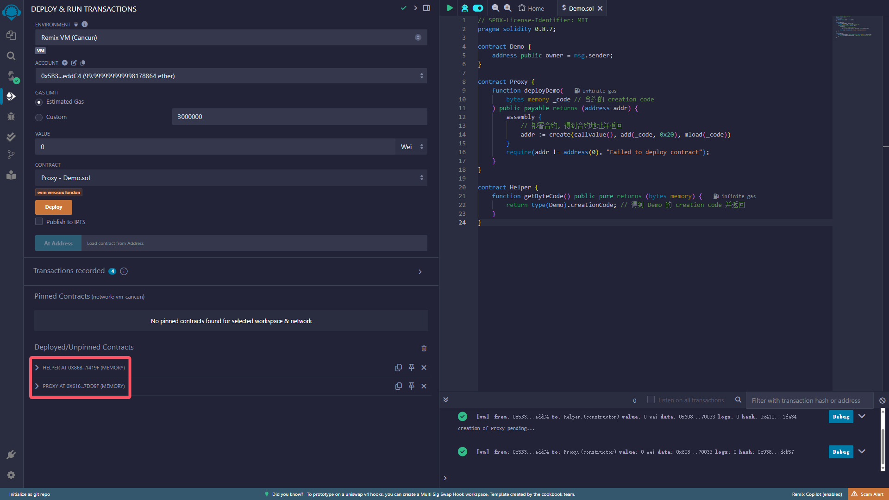

2.  执行 Helper 合约的 getByteCode 方法，得到 Demo 合约的 creation code

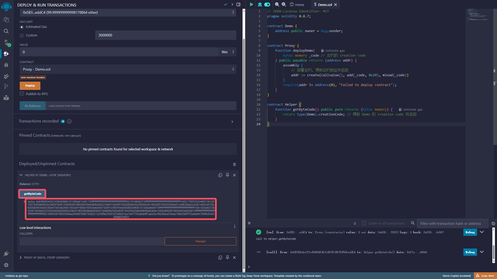

3.  将 Demo 合约的 creation code 作为参数传入 Proxy 合约的 deployDemo 方法并执行，部署 Demo 合约并得到其地址

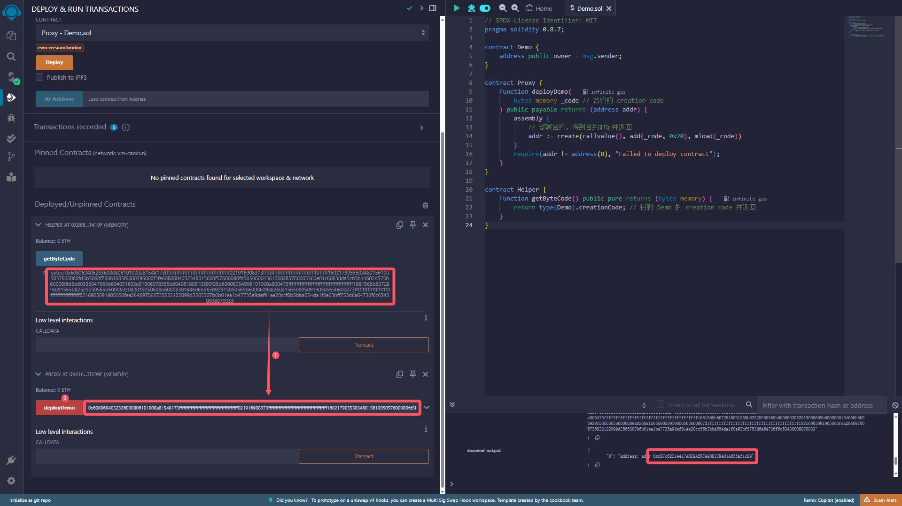

4.  通过 Demo 合约的地址添加 Demo 合约到 Remix

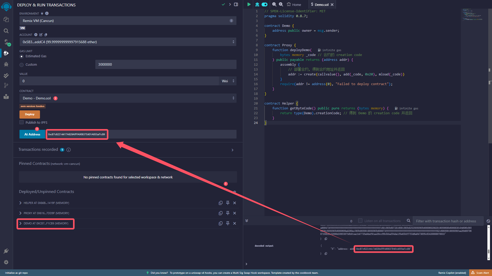

5.  检查 Demo 合约的 owner 是否为 Proxy 合约的地址

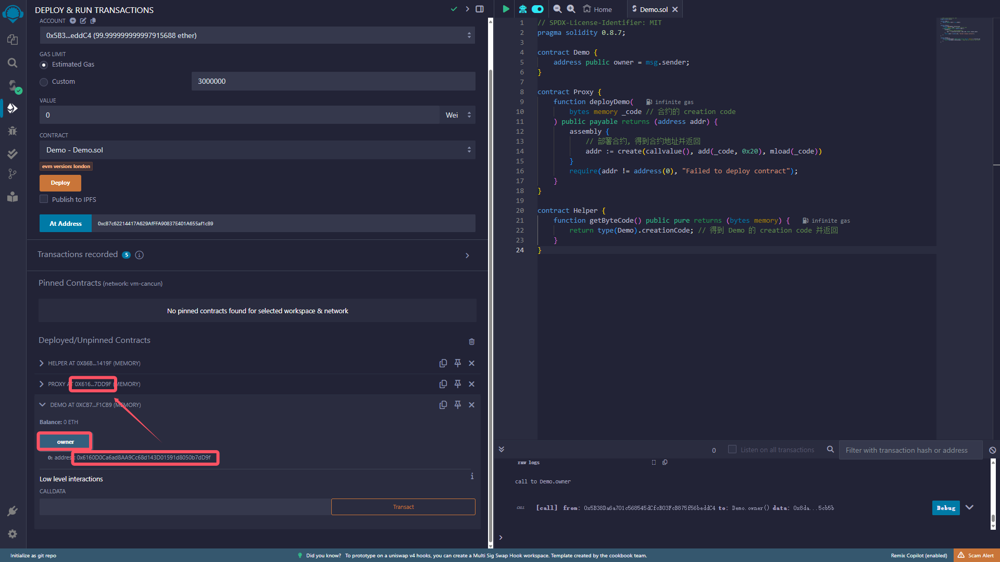

<br><br>

# 部署合约并传入参数

```solidity
contract Demo {
    address public owner = msg.sender;
    uint public count;

    constructor(uint _count) {
        count = _count;
    }
}

contract Helper {
    function getByteCode(uint _count) public pure returns (bytes memory) {
        return abi.encodePacked(type(Demo).creationCode, abi.encode(_count));
        // 用 encode 编码传入的参数; 用 encodePacked 包装 Demo 合约的 creation code 和编码后的参数; 返回结果
    }
}

contract Proxy {
    function deployDemo(
        bytes memory _creationCode
    ) public returns (address addr) {
        assembly {
            addr := create(callvalue(), add(_creationCode, 0x20), mload(_creationCode))
        }
        require(addr != address(0), "Failed to deploy contract");
    }
}
```

1. 部署 Helper 合约、Proxy 合约

2. 传入参数 \_count 到 Helper 合约的 getByteCode 方法并执行，得到 Demo 合约的 creation code

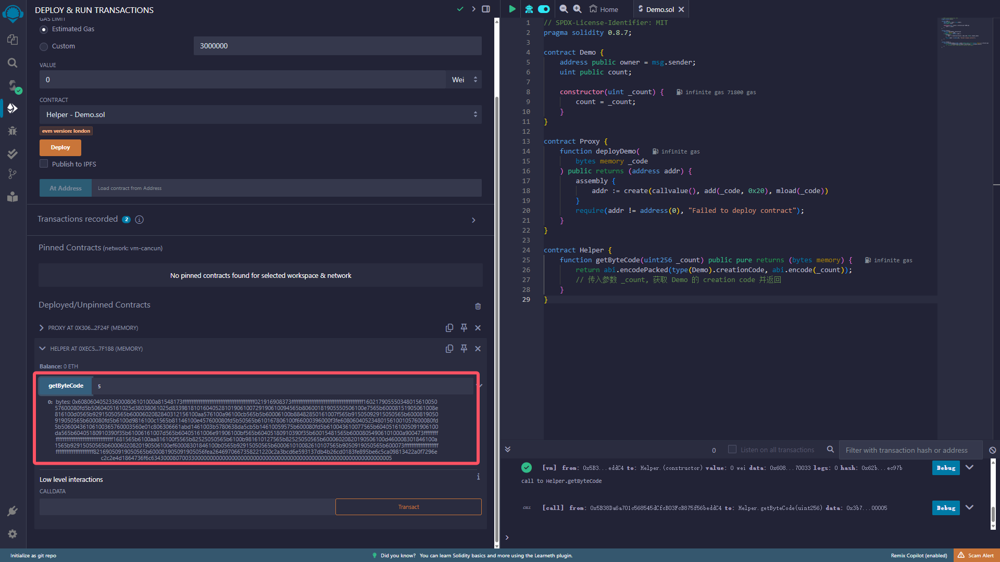

3.  将 Demo 合约的 creation code 作为参数传入 Proxy 合约的 deployDemo 方法并执行，部署 Demo 合约并得到其地址

4.  通过 Demo 合约的地址添加 Demo 合约到 Remix

5.  检查 Demo 合约的 owner 是否为 Proxy 合约的地址、count 是否为步骤 2 中传入的参数

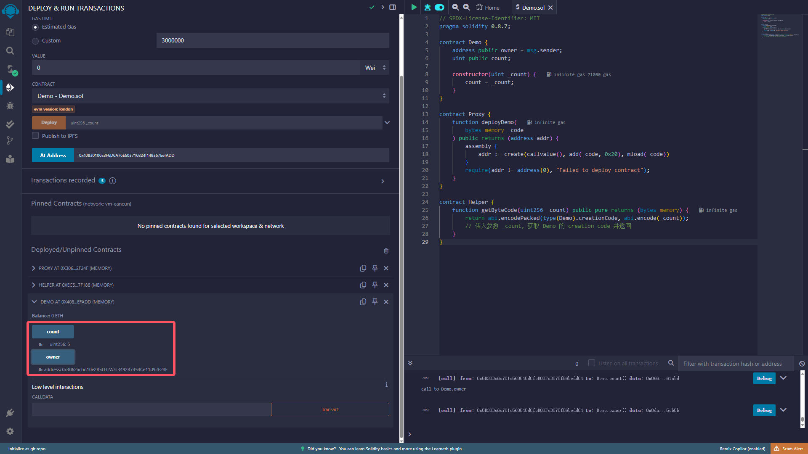

<br><br>

# 部署合约并传输以太

```solidity
contract Demo {
    address public owner = msg.sender;
    uint public value = msg.value;

    constructor() payable {} // 使用 payable 修饰构造方法, 以支持在部署合约时传输以太
}

contract Helper {
    function getByteCode() public pure returns (bytes memory) {
        return type(Demo).creationCode;
    }
}

contract Proxy {
    function deployDemo(
        bytes memory _creationCode
    ) public payable returns (address addr) {
        // 使用 payable 修饰方法, 以支持以太的传输
        assembly {
            addr := create(callvalue(), add(_creationCode, 0x20), mload(_creationCode))
        }
        require(addr != address(0), "Failed to deploy contract");
    }
}
```

1. 部署 Helper 合约、Proxy 合约

2. 执行 Helper 合约的 getByteCode 方法，得到 Demo 合约的 creation code

3. 设置以太数量、将 Demo 合约的 creation code 作为参数传入 Proxy 合约的 deployDemo 方法并执行，部署 Demo 合约并得到其地址

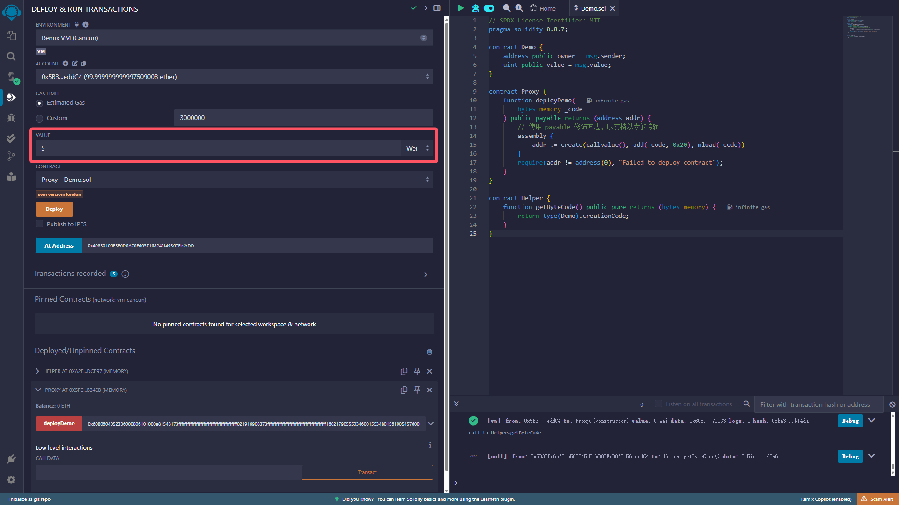

4.  通过 Demo 合约的地址添加 Demo 合约到 Remix

5.  检查 Demo 合约的 owner 是否为 Proxy 合约的地址、value 是否为步骤 3 中传输的以太数量

<br><br>

# 调用合约方法并传入参数

```solidity
contract Demo {
    address public owner = msg.sender;

    function setOwner(address _owner) external {
        require(msg.sender == owner, "Only owner can change owner");
        owner = _owner;
    }
}

contract Helper {
    function getByteCode() public pure returns (bytes memory) {
        return type(Demo).creationCode;
    }

    function getCallData(address _addr) public pure returns (bytes memory) {
        return abi.encodeWithSignature("setOwner(address)", _addr);
        // 传入参数 _addr, 获取 "setOwner(address)" 方法的 calldata 并返回
    }
}

contract Proxy {
    function deployDemo(bytes memory _creationCode) public returns (address addr) {
        assembly {
            addr := create(callvalue(), add(_creationCode, 0x20), mload(_creationCode))
        }
        require(addr != address(0), "Failed to deploy contract");
    }

    function executeDemo(
        address _addr, // 合约的地址
        bytes memory _data // 想调用的方法的 calldata
    ) public returns (bytes memory result) {
        // 通过 call 方法可以调用 _addr 表示的合约中 calldata 表示的方法, 并获取调用结果
        (bool success, bytes memory data) = _addr.call(_data);
        require(success, "Failed to execute contract");
        return data;
    }
}
```

**操作 Remix 部署合约**：

1. 部署 Helper 合约、Proxy 合约

2. 执行 Helper 合约的 getByteCode 方法，得到 Demo 合约的 creation code

3. 将 Demo 合约的 creation code 作为参数传入 Proxy 合约的 deployDemo 方法并执行，部署 Demo 合约并得到其地址

4. 通过 Demo 合约的地址添加 Demo 合约到 Remix

5. 检查 Demo 合约的 owner 是否为 Proxy 合约的地址

**操作 Remix 调用方法**：

1.  将编辑器地址作为参数传入 Helper 合约的 getCallData 方法，得到 "setOwner(address)" 的 calldata

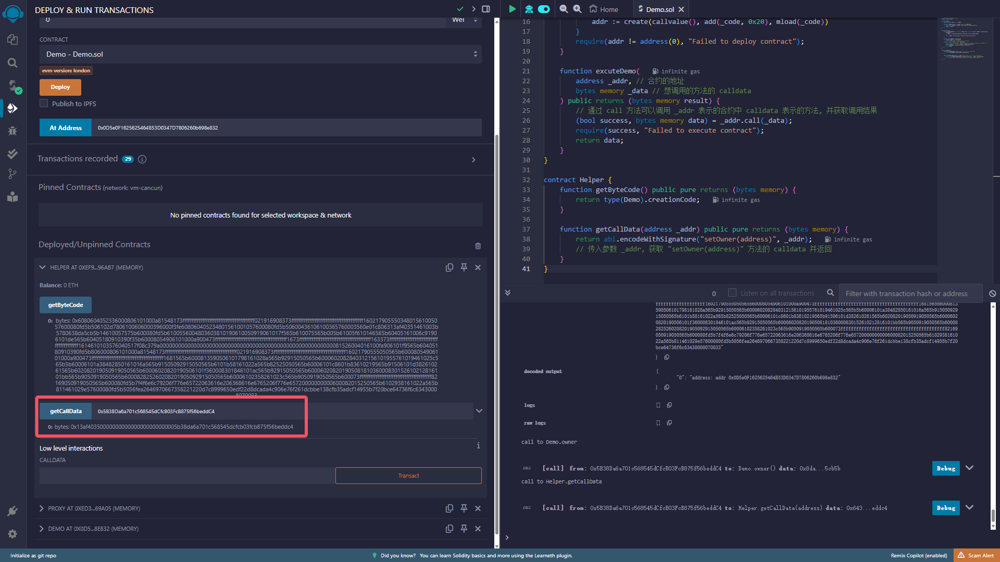

2.  将 Demo 合约的地址和 "setOwner(address)" 的 calldata 作为参数传入 Proxy 合约的 executeDemo 方法，以更新 Demo 合约的 owner

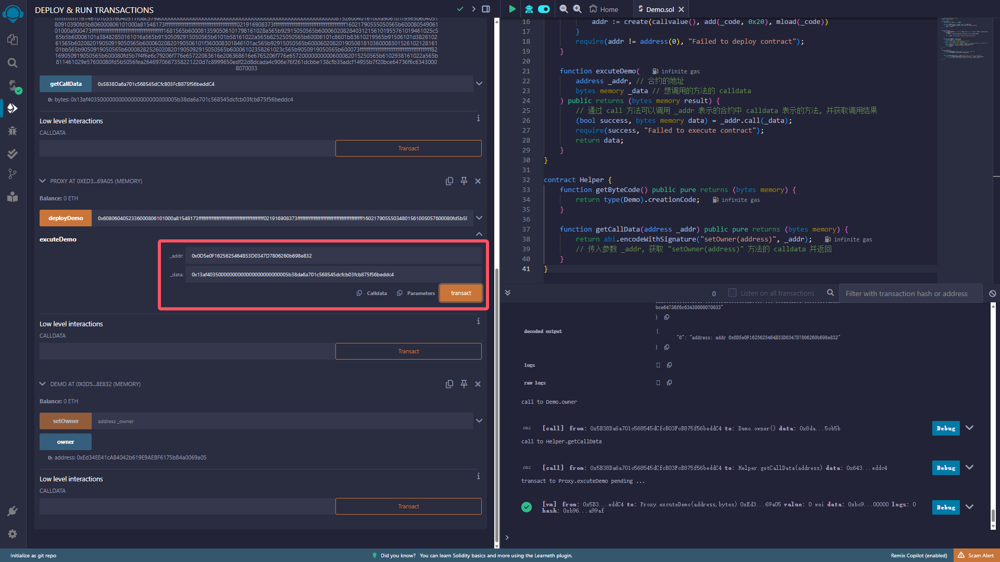

3.  检查 Demo 合约的 owner 是否为编辑器地址

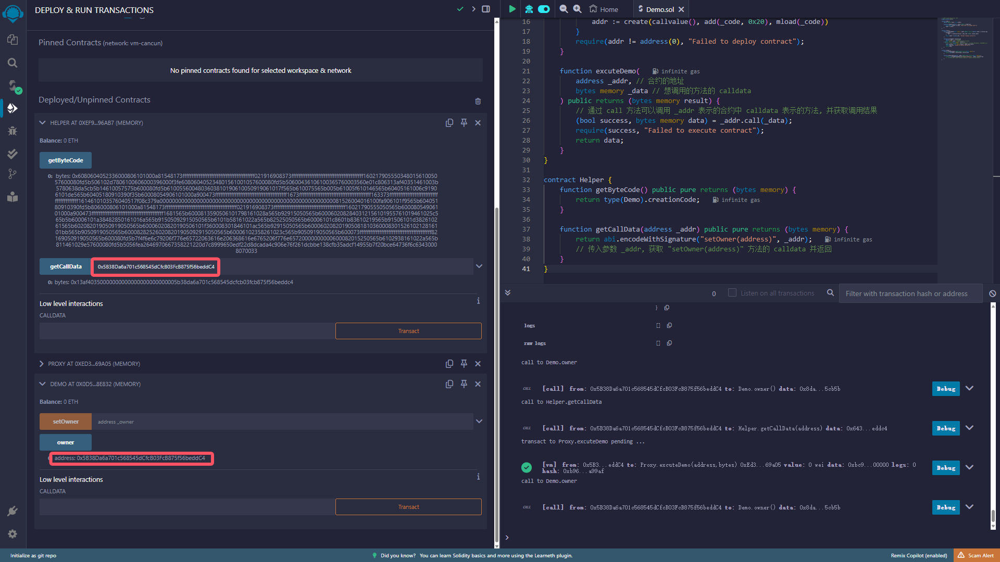

<br><br>

# 调用合约方法并传输以太

```solidity
contract Demo {
    address public owner = msg.sender;
    uint public value = msg.value;

    function updateValue() external payable {
        require(msg.sender == owner, "Only owner can update value");
        value = msg.value;
    }
}

contract Helper {
    function getByteCode() public pure returns (bytes memory) {
        return type(Demo).creationCode;
    }

    function getCallData() public pure returns (bytes memory) {
        return abi.encodeWithSignature("updateValue()");
        // 获取 "updateValue()" 方法的 calldata 并返回
    }
}

contract Proxy {
    function deployDemo(bytes memory _creationCode) public payable returns (address addr) {
        assembly {
            addr := create(callvalue(), add(_creationCode, 0x20), mload(_creationCode))
        }
        require(addr != address(0), "Failed to deploy contract");
    }

    function executeDemo(
        address _addr,
        bytes memory _data
    ) public payable returns (bytes memory result) {
        // 使用 payable 修饰方法, 以支持以太的传输; 调用 call 方法时传入 msg.value
        (bool success, bytes memory data) = _addr.call{value: msg.value}(_data);
        require(success, "Failed to execute contract");
        return data;
    }
}
```

**操作 Remix 部署合约**：

1. 部署 Helper 合约、Proxy 合约

2. 执行 Helper 合约的 getByteCode 方法，得到 Demo 合约的 creation code

3. 将 Demo 合约的 creation code 作为参数传入 Proxy 合约的 deployDemo 方法并执行，部署 Demo 合约并得到其地址

4. 通过 Demo 合约的地址添加 Demo 合约到 Remix

5. 检查 Demo 合约的 owner 是否为 Proxy 合约的地址

**操作 Remix 调用方法**：

1.  执行 Helper 合约的 getCallData 方法，得到 "updateValue()" 的 calldata

2.  设置以太数量、将 Demo 合约的地址和 "updateValue()" 的 calldata 作为参数传入 Proxy 合约的 executeDemo 方法，以更新 Demo 合约的 value

3.  检查 Demo 合约的 value 是否为步骤 2 中传输的以太数量

<br>

# 信息安全

发送方 A：

1. 计算消息 message 的哈希值 H：hash(message) = H

2. 私钥 privateKey + 哈希值 H 得到签名 signature：signature = sign(H, privateKey)

3. 将消息 message 和签名 signature 发送给 B

接收方 B：

1. 计算消息 message 的哈希值 H1：hash(message) = H1

2. 公钥 publicKey + 签名 signature 得到 H2：H2 = verify(signature, publicKey)

3. 比较 H1 和 H2，如果相等 则说明消息未被篡改且确实来自 A

<br><br>

# Keccak256 哈希函数

```solidity
// SPDX-License-Identifier: MIT
pragma solidity ^0.8.26;

contract HashFunc {
    function hash(
        string memory _testString,
        uint _testUint
    ) public pure returns (bytes32) {
        return keccak256(abi.encodePacked(_testString, _testUint));
    }
}
```

encodePacked 方法可以对多个参数进行编码，并压缩编码后的结果，节省 gas 费用。但某些情况下会导致哈希碰撞(哈希冲突)。

为了避免哈希碰撞，可以使用 encode 方法，它不会压缩编码结果，但会消耗更多 gas。

```solidity
// SPDX-License-Identifier: MIT
pragma solidity ^0.8.26;

contract HashFunc {
    function hash(
        string memory _testString,
        uint _testUint
    ) public pure returns (bytes32) {
        // 使用 encode 方法避免哈希碰撞
        return keccak256(abi.encode(_testString, _testUint));
    }
}
```

除了使用 encode 方法，我们还可以在 encodePacked 的入参之间再插入一个参数，这样也能避免哈希碰撞。

```solidity
// SPDX-License-Identifier: MIT
pragma solidity ^0.8.26;

contract HashFunc {
    function hash(
        string memory _string1,
        uint _uint, // 用来避免哈希碰撞的参数
        string memory _string2
    ) public pure returns (bytes32) {
        // 在 encodePacked 的入参之间再插入一个参数，避免哈希碰撞
        return keccak256(abi.encodePacked(_string1, _uint, _string2));
    }
}
```

<br><br>

# 签名与验证

```solidity
// SPDX-License-Identifier: MIT
pragma solidity ^0.8.26;

contract VerifySig {
    // 将一个 65 字节长的签名拆分成 r、s 和 v 三个部分
    function split(
        bytes memory _signature
    ) internal pure returns (bytes32 r, bytes32 s, uint8 v) {
        require(_signature.length == 65, "invalid signature length");
        assembly {
            // 从 _signature 的第 32 字节开始加载 32 字节的数据, 并将其赋值给 r
            // 这是因为前 32 字节是 _signature 的长度信息
            r := mload(add(_signature, 32))
            // 从 _signature 的第 64 字节开始加载 32 字节的数据, 并将其赋值给 s
            s := mload(add(_signature, 64))
            // 从 _signature 的第 96 字节开始加载 32 字节的数据, 并取其第一个字节给 v
            v := byte(0, mload(add(_signature, 96)))
        }
    }

    // 计算给定消息的哈希值
    function getMessageHash(
        string memory _message
    ) public pure returns (bytes32) {
        return keccak256(abi.encodePacked(_message));
    }

    // 生成一个符合以太坊签名标准的消息哈希值
    function getEthSignedMessageHash(
        bytes32 _messageHash
    ) public pure returns (bytes32) {
        return
            keccak256(
                abi.encodePacked(
                    "\x19Ethereum Signed Message:\n32",
                    // 这是一个固定的前缀, 用于防止签名重用攻击
                    // 这个前缀告诉以太坊客户端这是一个签名消息, 而不是交易或其他数据
                    // \x19 是一个字节, 表示消息的长度，32 表示消息哈希的长度为 32 字节
                    _messageHash
                )
            );
    }

    // 从签名中恢复出签名者的地址
    function recover(
        bytes32 _ethSignedMessageHash,
        bytes memory _signature
    ) public pure returns (address) {
        (bytes32 r, bytes32 s, uint8 v) = split(_signature);
        return ecrecover(_ethSignedMessageHash, v, r, s);
    }

    // 验证消息的有效性 (签名者是否正确、消息是否被篡改)
    function verify(
        address _signer,
        string memory _message,
        bytes memory _signature
    ) public pure returns (bool) {
        bytes32 messageHash = getMessageHash(_message);
        bytes32 ethSignedMessageHash = getEthSignedMessageHash(messageHash);
        return recover(ethSignedMessageHash, _signature) == _signer;
    }
}
```

**部署合约并测试**：

发送方 A：

1. 将要发送的消息作为参数传入 getMessageHash 方法，得到消息的哈希值，这里以字符串 "hello" 为例

2. F12 打开控制台，执行 `ethereum.enable()`；查看 Promise，若为 fulfilled 状态则说明 MetaMask 已连接，可查看 Promise 结果得到 MetaMask 的账号地址（需要先安装 MetaMask 插件并登录）

3. 执行 `ethereum.request({ method: "personal_sign", params: [步骤 2 得到的 MetaMask 账号地址, 步骤 1 得到的哈希值] })`，会弹出签名框，点击 sign 进行签名；查看 Promise，若为 fulfilled 状态则说明签名成功，可查看 Promise 结果得到签名

---

假设 A 将步骤 3 得到的签名和消息发送给了 B：

---

接收方 B：

1. 将收到的消息作为参数传入 getMessageHash 方法，得到消息的哈希值，这里是 A 步骤 1 使用的字符串 "hello"

2. 将步骤 1 得到的哈希值作为参数传入 getEthSignedMessageHash 方法，得到符合以太坊签名标准的消息哈希值

3. 将步骤 2 得到的消息哈希值和收到的签名作为参数传入 recover 方法，得到签名者的地址，这里是 A 步骤 2 得到的 MetaMask 账号地址

4. 将步骤 3 得到的签名者的地址、收到的消息、收到的签名作为参数传入 verify 方法，得到 true，说明签名者正确且消息未被篡改

<br><br>

# 访问控制

```solidity
// SPDX-License-Identifier: MIT
pragma solidity ^0.8.26;

contract AccessControl {
    // 定义两个角色
    bytes32 public constant ROLE_ADMIN =
        keccak256(abi.encodePacked("ROLE_ADMIN"));
    bytes32 public constant ROLE_USER =
        keccak256(abi.encodePacked("ROLE_USER"));

    // 定义一个双重映射, 用于管理 "角色 - 用户 - 权限"
    mapping(bytes32 => mapping(address => bool)) public roles;

    // 分配权限
    function _grantRole(bytes32 _role, address _account) internal {
        roles[_role][_account] = true;
    }

    // 撤销权限
    function _revokeRole(bytes32 _role, address _account) internal {
        roles[_role][_account] = false;
    }

    // 构造函数
    constructor() {
        _grantRole(ROLE_ADMIN, msg.sender);
    }

    // 函数装饰器, 限制只有管理员才能调用
    modifier onlyAdmin() {
        require(
            roles[ROLE_ADMIN][msg.sender],
            "AccessControl: sender must be an admin to perform this action"
        );
        _;
    }

    // 分配权限 (外部使用, 只有管理员才能调用)
    function grantUserRole(address _account) public onlyAdmin {
        _grantRole(ROLE_USER, _account);
    }

    // 撤销权限 (外部使用, 只有管理员才能调用)
    function revokeUserRole(address _account) public onlyAdmin {
        _revokeRole(ROLE_USER, _account);
    }
}
```

1. 部署合约，部署者将成为管理员

2. 获取编辑器地址和 ROLE_ADMIN 的哈希值，填入 roles 中查看权限，此处应为 true

3. 更新编辑器地址，获取新的编辑器地址和 ROLE_USER 的哈希值，填入 roles 中查看权限，此处应为 false

4. 使用管理员地址调用 grantUserRole 方法，并传入新的编辑器地址作为参数，授权新的编辑器地址为 ROLE_USER

5. 获取新的编辑器地址和 ROLE_USER 的哈希值，填入 roles 中查看权限，此处应为 true

6. 使用管理员地址调用 revokeUserRole 方法，并传入新的编辑器地址作为参数，取消新的编辑器地址的 ROLE_USER 权限

7. 获取新的编辑器地址和 ROLE_USER 的哈希值，填入 roles 中查看权限，此处应为 false

8. 不使用管理员地址调用 grantUserRole 方法，会报错

<br>

# ERC20

ERC-20 是以太坊区块链上的一种代币标准，全称为 "Ethereum Request for Comment 20"。ERC-20 标准定义了一组通用的接口，使得代币可以在不同的应用程序和平台之间互操作。

ERC-20 标准包括以下核心方法：

```solidity
interface IERC20 {
    function totalSupply() external view returns (uint);

    function balanceOf(address account) external view returns (uint);

    function transfer(address recipient, uint amount) external returns (bool);

    function allowance(address owner, address spender) external view returns (uint);

    function approve(address spender, uint amount) external returns (bool);

    function transferFrom(
        address sender,
        address recipient,
        uint amount
    ) external returns (bool);

    event Transfer(address indexed from, address indexed to, uint value);
    event Approval(address indexed owner, address indexed spender, uint value);
}
```

ERC-20 标准还定义了两个重要的事件：

-   `Transfer(address indexed from, address indexed to, uint value)`: 记录代币转移操作。
-   `Approval(address indexed owner, address indexed spender, uint value)`: 记录授权操作。

以下是一个简单的 ERC-20 代币合约示例：

```solidity
contract ERC20 is IERC20 {
    // 存储代币的名称、符号和小数位数
    string public name = "TestToken";
    string public symbol = "TTK";
    uint8 public decimals = 18; // 10^decimals 表示一个 "TestToken" 代币

    // 存储代币的总供应量
    uint public totalSupply;

    // 存储每个地址的代币余额; owner => balance
    mapping(address => uint) public balanceOf;

    // 存储每个地址对其他地址的授权额度; owner => spender => amount
    mapping(address => mapping(address => uint)) public allowance;

    // 定义两个事件，用于记录代币转移和授权操作
    event Transfer(address indexed from, address indexed to, uint value);
    event Approval(
        address indexed owner,
        address indexed spender,
        uint value
    );

    // 将 amount 数量的代币从调用者的账户转移到 recipient 账户
    function transfer(
        address recipient,
        uint amount
    ) external override returns (bool) {
        require(
            balanceOf[msg.sender] >= amount,
            "ERC20: transfer amount exceeds balance"
        );
        balanceOf[msg.sender] -= amount;
        balanceOf[recipient] += amount;
        emit Transfer(msg.sender, recipient, amount);
        return true;
    }

    // 授权 spender 可以从调用者的账户中转移最多 amount 数量的代币
    function approve(
        address spender,
        uint amount
    ) external override returns (bool) {
        allowance[msg.sender][spender] = amount;
        emit Approval(msg.sender, spender, amount);
        return true;
    }

    // 从 sender 账户转移 amount 数量的代币到 recipient 账户
    function transferFrom(
        address sender,
        address recipient,
        uint amount
    ) external override returns (bool) {
        require(
            balanceOf[sender] >= amount,
            "ERC20: transfer amount exceeds balance"
        );
        require(
            allowance[sender][msg.sender] >= amount,
            "ERC20: transfer amount exceeds allowance"
        );
        balanceOf[sender] -= amount;
        balanceOf[recipient] += amount;
        allowance[sender][msg.sender] -= amount;
        emit Transfer(sender, recipient, amount);
        return true;
    }
}
```

除了上述核心方法，你可能还听过 mint、burn 等方法，这些方法是 ERC-20 标准之外的扩展方法，用于增发和销毁代币。

```solidity
contract ERC20 is IERC20 {
    // ...

    // 增发 amount 数量的代币
    function mint(uint amount) external {
        totalSupply += amount;
        balanceOf[msg.sender] += amount;
        emit Transfer(address(0), msg.sender, amount);
    }

    // 销毁 amount 数量的代币
    function burn(uint amount) external {
        require(
            balanceOf[msg.sender] >= amount,
            "ERC20: burn amount exceeds balance"
        );
        totalSupply -= amount;
        balanceOf[msg.sender] -= amount;
        emit Transfer(msg.sender, address(0), amount);
    }
}
```

如果 mint 方法没有适当的权限控制，可能会导致无限制地创建代币，进而引发通货膨胀和代币价值下降。如果 burn 方法没有适当的检查，可能会导致用户意外销毁大量代币，造成经济损失。为了防止这些风险，通常会在合约中加入权限控制和严格的检查机制。例如，只有合约所有者或经过授权的账户才能调用 mint 方法。

<br><br>

# 多签钱包

多签钱包（Multisig Wallet）是一种需要多个密钥持有者共同授权才能执行交易的数字钱包。常见的签名模式包括 2/3、3/5 等。例如，在 2/3 签名模式中，三个密钥中至少需要两个签名才能执行交易。

在创建多签钱包时，需要指定多个密钥持有者和最少签名数。例如，可以设置三个密钥持有者，并要求至少两个签名才能执行交易。任何一个密钥持有者可以提交交易请求，其他密钥持有者需要对交易进行签名和确认，当达到最少签名数时，交易将被执行。

以下是一个简单的多签钱包智能合约示例：

1. 先定义一些事件：

```solidity
contract MultiSigWallet {
    // 当 sender 把 amount 存入合约时触发
    event Deposit(address indexed sender, uint amount);

    // 当 txIndex 被提交时触发
    event Submit(uint indexed txIndex);

    // 当 owner 批准 txIndex 时触发
    event Approve(address indexed owner, uint indexed txIndex);

    // 当 owner 撤销 txIndex 时触发
    event Revoke(address indexed owner, uint indexed txIndex);

    // 当 txIndex 被执行时触发
    event Execute(uint indexed txIndex);
}
```

2. 定义交易的结构体：

```solidity
contract MultiSigWallet {
    // 交易的结构体
    struct Transaction {
        address to; // 接收地址
        uint value; // 金额
        bytes data; // 数据
        bool executed; // 是否已执行
    }
}
```

3. 定义一些状态变量：

```solidity
contract MultiSigWallet {
    // 交易
    Transaction[] public transactions;

    // owner 们
    address[] public owners;

    // owner => 是否为 owner
    mapping(address => bool) public isOwner;

    // 需要多少个 owner 批准, 交易才能被执行
    uint public numApprovalsRequired;

    // 交易被 owner 批准的情况; txIndex => owner => 是否批准
    mapping(uint => mapping(address => bool)) public isApproved;
}
```

4. 实现构造函数：

```solidity
contract MultiSigWallet {
    constructor(address[] memory _owners, uint _numApprovalsRequired) {
        require(_owners.length > 0, "owners required");
        require(
            _numApprovalsRequired > 0 &&
                _numApprovalsRequired <= _owners.length,
            "invalid number of required approvals"
        );

        for (uint i = 0; i < _owners.length; i++) {
            address owner = _owners[i];
            require(owner != address(0), "invalid owner");
            require(!isOwner[owner], "owner not unique");
            isOwner[owner] = true;
            owners.push(owner);
        }

        numApprovalsRequired = _numApprovalsRequired;
    }
}
```

5. 实现一些函数装饰器：

```solidity
contract MultiSigWallet {
    // 函数装饰器; 检查调用者是否为 owner, 是则继续
    modifier onlyOwner() {
        require(isOwner[msg.sender], "not owner");
        _;
    }

    // 函数装饰器; 检查交易是否存在, 存在则继续
    modifier txExists(uint _txIndex) {
        require(_txIndex < transactions.length, "tx does not exist");
        _;
    }

    // 函数装饰器; 检查交易是否已执行, 未执行则继续
    modifier notExecuted(uint _txIndex) {
        require(!transactions[_txIndex].executed, "tx already executed");
        _;
    }

    // 函数装饰器; 检查交易是否被 owner 批准, 未批准则继续
    modifier notApproved(uint _txIndex) {
        require(!isApproved[_txIndex][msg.sender], "tx already approved");
        _;
    }
}
```

6. 实现函数接收以太币：

```solidity
contract MultiSigWallet {
    // 接收以太币
    receive() external payable {
        emit Deposit(msg.sender, msg.value);
    }
}
```

7. 实现函数提交交易：

```solidity
contract MultiSigWallet {
    // 提交交易
    function submitTransaction(
        address _to,
        uint _value,
        bytes calldata _data
    ) external onlyOwner {
        uint txIndex = transactions.length;
        transactions.push(
            Transaction({to: _to, value: _value, data: _data, executed: false})
        );
        emit Submit(txIndex);
    }
}
```

8. 实现函数批准交易：

```solidity
contract MultiSigWallet {
    // 批准交易
    function approveTransaction(
        uint _txIndex
    )
        external
        onlyOwner
        txExists(_txIndex)
        notExecuted(_txIndex)
        notApproved(_txIndex)
    {
        isApproved[_txIndex][msg.sender] = true;
        emit Approve(msg.sender, _txIndex);
    }
}
```

9. 实现函数撤销批准：

```solidity
contract MultiSigWallet {
    // 撤销批准
    function revokeTransaction(
        uint _txIndex
    ) external onlyOwner txExists(_txIndex) notExecuted(_txIndex) {
        require(isApproved[_txIndex][msg.sender], "tx not approved");
        isApproved[_txIndex][msg.sender] = false;
        emit Revoke(msg.sender, _txIndex);
    }
}
```

10. 实现函数执行交易：

```solidity
contract MultiSigWallet {
    // helper function; 获取已批准的 owner 数量
    function _getApprovals(uint _txIndex) private view returns (uint) {
        uint approvals = 0;
        for (uint i = 0; i < owners.length; i++) {
            if (isApproved[_txIndex][owners[i]]) {
                approvals++;
            }
        }
        return approvals;
    }

    // 执行交易
    function executeTransaction(
        uint _txIndex
    ) external onlyOwner txExists(_txIndex) notExecuted(_txIndex) {
        require(
            _getApprovals(_txIndex) >= numApprovalsRequired,
            "cannot execute tx"
        );

        Transaction storage transaction = transactions[_txIndex];
        transaction.executed = true;

        (bool success, ) = transaction.to.call{value: transaction.value}(
            transaction.data
        );
        require(success, "tx failed");

        emit Execute(_txIndex);
    }
}
```

<br><br>

# WETH

包装以太币（Wrapped Ether，简称 WETH）是一种将原生的以太币（ETH）转换为 ERC-20 代币的机制。由于以太坊网络上的许多去中心化应用（DApps）和智能合约主要与 ERC-20 代币交互，WETH 使得 ETH 可以与这些应用和合约无缝集成。

WETH 的价值与 ETH 1:1 锚定。包装和解包过程涉及将 ETH 存入或从智能合约中提取。

```solidity
// SPDX-License-Identifier: MIT
pragma solidity ^0.8.26;

contract WETH {
    // 代币名称
    string public name = "Wrapped Ether";

    // 代币符号
    string public symbol = "WETH";

    // 代币的小数位数, 通常为 18
    uint8 public decimals = 18;

    // 记录每个地址的 WETH 余额
    mapping(address => uint) public balanceOf;

    // 记录存入 ETH 的事件
    event Deposit(address indexed account, uint amount);

    // 记录提取 ETH 的事件
    event Withdrawal(address indexed account, uint amount);

    // 使合约可以接受 ETH
    receive() external payable {
        deposit();
    }

    // 接受 ETH 并将其转换为 WETH
    function deposit() public payable {
        balanceOf[msg.sender] += msg.value;
        emit Deposit(msg.sender, msg.value);
    }

    // 将 WETH 转换回 ETH 并提取到调用者的地址
    function withdraw(uint amount) public {
        require(balanceOf[msg.sender] >= amount, "Insufficient balance");
        balanceOf[msg.sender] -= amount;
        payable(msg.sender).transfer(amount);
        emit Withdrawal(msg.sender, amount);
    }

    // 返回合约中存储的 ETH 总量
    function totalSupply() public view returns (uint) {
        return address(this).balance;
    }
}
```

我们可以直接使用 OpenZeppelin 的 ERC20 合约库来实现 WETH 合约：

```solidity
// SPDX-License-Identifier: MIT
pragma solidity ^0.8.26;

import "@openzeppelin/contracts/token/ERC20/ERC20.sol";

contract WETH is ERC20 {
    // 记录存入 ETH 的事件
    event Deposit(address indexed account, uint amount);

    // 记录提取 ETH 的事件
    event Withdrawal(address indexed account, uint amount);

    // 初始化 WETH 合约
    constructor() ERC20("Wrapped Ether", "WETH") {}

    // 使合约可以接受 ETH
    receive() external payable {
        deposit();
    }

    // 接受 ETH 并将其转换为 WETH
    function deposit() public payable {
        _mint(msg.sender, msg.value);
        emit Deposit(msg.sender, msg.value);
    }

    // 将 WETH 转换回 ETH 并提取到调用者的地址
    function withdraw(uint amount) public {
        _burn(msg.sender, amount);
        payable(msg.sender).transfer(amount);
        emit Withdrawal(msg.sender, amount);
    }
}
```

1. 部署 WETH 合约

2. 调用 WETH 合约的 deposit 函数，设置传入的 ETH 数量，这里以 1 ETH 为例

3. 调用 WETH 合约继承的 balanceOf 函数，传入部署 WETH 合约的地址，查看 WETH 余额

4. 调用 WETH 合约继承的 totalSupply 函数，查看合约中存储的 ETH 总量

5. 调用 WETH 合约的 withdraw 函数，传入提取的 WETH 数量，提取 ETH

6. 调用 WETH 合约继承的 balanceOf 函数，查看 WETH 余额

7. 调用 WETH 合约继承的 totalSupply 函数，查看合约中存储的 ETH 总量

<br>

# 荷兰式拍卖

荷兰式拍卖（Dutch Auction），也称为减价拍卖。

拍卖从一个较高的起始价格开始，这个价格通常高于市场预期。随着时间的推移，价格按照预先设定的降价阶梯逐步降低。当价格降到某个竞买人愿意接受的水平时，该竞买人出价并成交。第一个应价的竞买人获胜，并支付当时的价格。

1. 定义接口：

```solidity
interface IERC721 {
    function transferFrom(
        address _from,
        address _to,
        uint _tokenId
    ) external;
}
```

2. 定义状态变量：

```solidity
contract DutchAuction {
    // 拍卖的 NFT 合约地址
    IERC721 public immutable nft;

    // 拍卖的 NFT ID
    uint public immutable nftId;

    // 卖家地址
    address payable public immutable seller;

    // 拍卖的持续时间
    uint public constant DURATION = 7 days;

    // 起拍价
    uint public immutable startPrice;

    // 拍卖开始时间
    uint public immutable startTime;

    // 拍卖结束时间
    uint public immutable endTime;

    // 每天的降价幅度
    uint public immutable discountPerDay;
}
```

3. 实现构造函数：

```solidity
contract DutchAuction {
    constructor(
        uint _startPrice,
        uint _discountPerDay,
        address _nft,
        uint _tokenId
    ) {
        require(
            _startPrice >= _discountPerDay * DURATION,
            "start price must be greater than or equal to the end price"
        );

        seller = payable(msg.sender);
        startPrice = _startPrice;
        discountPerDay = _discountPerDay;
        startTime = block.timestamp;
        endTime = startTime + DURATION;
        nft = IERC721(_nft);
        nftId = _tokenId;
    }
}
```

4. 实现函数：

```solidity
contract DutchAuction {
    // 查询当前价格
    function getCurrentPrice() public view returns (uint) {
        uint timeElapsed = block.timestamp - startTime; // 已经过去的时间
        return startPrice - discountPerDay * timeElapsed; // 当前价格
    }

    // 购买
    function buy() public payable {
        require(block.timestamp >= startTime, "auction has not started yet");
        require(block.timestamp < endTime, "auction has ended");
        uint currentPrice = getCurrentPrice();
        require(msg.value >= currentPrice, "insufficient funds");

        nft.transferFrom(seller, msg.sender, nftId);
        uint refund = msg.value - currentPrice;
        if (refund > 0) {
            payable(msg.sender).transfer(refund);
        }
    }
}
```

<br><br>

# 英式拍卖

英式拍卖（English Auction），也称为增价拍卖。

拍卖从一个较低的起拍价开始。竞买人按竞价阶梯逐步提高出价。每次出价必须高于当前最高出价。当没有人愿意再出更高的价格时，拍卖结束，出价最高者成为买受人。

1. 定义接口：

```solidity
interface IERC721 {
    function transferFrom(
        address _from,
        address _to,
        uint _tokenId
    ) external;
}
```

2. 定义事件：

```solidity
contract EnglishAuction {
    // 当拍卖开始时触发
    event Start();

    // 当有新的出价时触发
    event Bid(address indexed bidder, uint amount);

    // 当退款时触发
    event Refund(address indexed bidder, uint amount);

    // 当拍卖结束时触发
    event End(address highestBidder, uint highestBid);
}
```

3. 定义状态变量：

```solidity
contract EnglishAuction {
    // 拍卖的 NFT 合约地址
    IERC721 public immutable nft;

    // 拍卖的 NFT ID
    uint public immutable nftId;

    // 卖家地址
    address payable public immutable seller;

    // 拍卖结束时间
    uint public endTime;

    // 拍卖是否已开始
    bool public isStarted;

    // 拍卖是否已结束
    bool public isEnded;

    // 当前最高出价者
    address public highestBidder;

    // 当前最高出价
    uint public highestBid;

    // 出价记录
    mapping(address => uint) public bids;
}
```

4. 实现构造函数：

```solidity
contract EnglishAuction {
    // 构造函数
    constructor(IERC721 _nft, uint _nftId, uint _startBid) {
        nft = _nft;
        nftId = _nftId;
        seller = payable(msg.sender);
        highestBid = _startBid;
    }
}
```

5. 实现函数开始拍卖：

```solidity
contract EnglishAuction {
    // 开始售卖
    function startAuction() external {
        require(msg.sender == seller, "Only seller can start auction");
        require(!isStarted, "Auction already started");

        isStarted = true;
        endTime = block.timestamp + 7 days;
        nft.transferFrom(seller, address(this), nftId);

        emit Start();
    }
}
```

6. 实现函数出价：

```solidity
contract EnglishAuction {
    // 出价
    function bid() external payable {
        require(isStarted, "Auction not started");
        require(block.timestamp < endTime && !isEnded, "Auction ended");
        require(msg.sender != seller, "Seller cannot bid");
        require(msg.value > highestBid, "Bid must be higher than highest bid");

        if (highestBidder != address(0)) {
            bids[highestBidder] += highestBid;
        }
        highestBidder = msg.sender;
        highestBid = msg.value;

        emit Bid(msg.sender, msg.value);
    }
}
```

7. 实现函数结束拍卖：

```solidity
contract EnglishAuction {
    // 结束拍卖
    function endAuction() external {
        require(isStarted, "Auction not started");
        require(!isEnded, "Auction already ended");
        require(block.timestamp >= endTime, "Auction not ended");

        isEnded = true;
        if (highestBidder != address(0)) {
            // 有人出价, 转移 NFT 和 ETH 给最高出价者
            nft.transferFrom(address(this), highestBidder, nftId);
            seller.transfer(highestBid);
        } else {
            // 无人出价, 退还 NFT 给卖家
            nft.transferFrom(address(this), seller, nftId);
        }

        emit End(highestBidder, highestBid);
    }
}
```

8. 实现函数退款：

```solidity
contract EnglishAuction {
    // 退款
    function refund() external {
        require(msg.sender != highestBidder, "Highest bidder cannot refund");

        uint amount = bids[msg.sender];
        bids[msg.sender] = 0;
        payable(msg.sender).transfer(amount);

        emit Refund(msg.sender, amount);
    }
}
```

<br>

# 群众筹资

1. 定义接口：

```solidity
interface IERC20 {
    function transfer(address, uint) external returns (bool);

    function transferFrom(address, address, uint) external returns (bool);
}
```

2. 定义事件：

```solidity
contract CrowdFunding {
    // 发起众筹时触发
    event Launch(
        uint id,
        address indexed creator,
        uint goal,
        uint balance,
        uint32 startTime,
        uint32 endTime
    );

    // 取消众筹时触发
    event Cancel(uint id);

    // 用户参与众筹时触发
    event Donate(uint indexed id, address indexed donor, uint amount);

    // 用户取消参与众筹时触发
    event CancelDonation(uint indexed id, address indexed donor, uint amount);

    // 发起人提取众筹资金时触发
    event Claim(uint id);

    // 退还未达标的众筹资金时触发
    event Refund(uint indexed id, address indexed donor, uint amount);
}
```

3. 定义结构体：

```solidity
contract CrowdFunding {
    // 众筹项目的数据结构
    struct Campaign {
        // 众筹发起人
        address creator;
        // 众筹目标金额
        uint goal;
        // 众筹已筹金额
        uint balance;
        // 众筹开始时间
        uint32 startTime;
        // 众筹结束时间
        uint32 endTime;
        // 众筹是否已被提取
        bool claimed;
    }
}
```

4. 定义状态变量：

```solidity
contract CrowdFunding {
    // 众筹代币
    IERC20 public immutable token;

    // 众筹项目数量
    uint public count;

    // 众筹项目
    mapping(uint => Campaign) public campaigns;

    // 用户对众筹项目的捐赠
    mapping(uint => mapping(address => uint)) public donations;
}
```

5. 实现构造函数：

```solidity
contract CrowdFunding {
    constructor(IERC20 _token) {
        token = _token;
    }
}
```

6. 实现发起众筹方法：

```solidity
contract CrowdFunding {
    // 发起众筹
    function launch(uint _goal, uint32 _startTime, uint32 _endTime) external {
        require(_goal > 0, "invalid goal");
        require(_startTime > block.timestamp, "invalid start time");
        require(_endTime > _startTime, "invalid end time");

        count++;
        campaigns[count] = Campaign(
            msg.sender,
            _goal,
            0,
            _startTime,
            _endTime,
            false
        );

        emit Launch(count, msg.sender, _goal, 0, _startTime, _endTime);
    }
}
```

7. 实现取消众筹方法：

```solidity
contract CrowdFunding {
    // 取消众筹
    function cancel(uint _id) external {
        Campaign storage campaign = campaigns[_id];
        require(msg.sender == campaign.creator, "not creator");
        require(block.timestamp < campaign.startTime, "crowdfunding started");

        delete campaigns[_id];

        emit Cancel(_id);
    }
}
```

8. 实现用户参与众筹方法：

```solidity
contract CrowdFunding {
    // 用户参与众筹
    function donate(uint _id, uint _amount) external {
        Campaign storage campaign = campaigns[_id];
        require(campaign.creator != address(0), "invalid campaign");
        require(
            block.timestamp >= campaign.startTime,
            "crowdfunding not started"
        );
        require(block.timestamp < campaign.endTime, "crowdfunding ended");
        require(_amount > 0, "invalid amount");

        campaign.balance += _amount;
        donations[_id][msg.sender] += _amount;
        token.transferFrom(msg.sender, address(this), _amount);

        emit Donate(_id, msg.sender, _amount);
    }
}
```

9. 实现用户取消参与众筹方法：

```solidity
contract CrowdFunding {
    // 用户取消参与众筹
    function cancelDonation(uint _id) external {
        Campaign storage campaign = campaigns[_id];
        require(
            block.timestamp >= campaign.startTime,
            "crowdfunding not started"
        );
        require(block.timestamp < campaign.endTime, "crowdfunding ended");
        require(donations[_id][msg.sender] > 0, "invalid donation");

        uint amount = donations[_id][msg.sender];
        campaign.balance -= amount;
        donations[_id][msg.sender] = 0;
        token.transfer(msg.sender, amount);

        emit CancelDonation(_id, msg.sender, amount);
    }
}
```

10. 实现发起人提取众筹资金方法：

```solidity
contract CrowdFunding {
    // 发起人提取众筹资金
    function claim(uint _id) external {
        Campaign storage campaign = campaigns[_id];
        require(campaign.creator == msg.sender, "not creator");
        require(block.timestamp >= campaign.endTime, "crowdfunding not ended");
        require(campaign.balance >= campaign.goal, "not reach goal");
        require(!campaign.claimed, "claimed");

        campaign.claimed = true;
        token.transfer(msg.sender, campaign.balance);

        emit Claim(_id);
    }
}
```

11. 实现退还未达标的众筹资金方法：

```solidity
contract CrowdFunding {
    // 退还未达标的众筹资金
    function refund(uint _id) external {
        Campaign storage campaign = campaigns[_id];
        require(campaign.creator != address(0), "invalid campaign");
        require(block.timestamp >= campaign.endTime, "crowdfunding not ended");
        require(campaign.balance < campaign.goal, "reach goal");
        require(!campaign.claimed, "claimed");

        uint amount = donations[_id][msg.sender];
        donations[_id][msg.sender] = 0;
        token.transfer(msg.sender, amount);

        emit Refund(_id, msg.sender, amount);
    }
}
```

<br><br>

# CREATE2

CREATE2 是以太坊虚拟机（EVM）中的一个操作码，用于创建智能合约。与传统的 CREATE 操作码不同，CREATE2 允许开发者在部署合约之前预测其地址。

CREATE2 通过以下公式计算合约地址：`address = keccak256(0xff + sender + salt + keccak256(bytecode))`，其中：`0xff` 是一个常量，用于区分 CREATE2 和 CREATE；`sender` 是创建合约的合约地址；`salt` 是一个 32 字节的随机值，由开发者提供；`bytecode` 是要部署的合约的字节码。

```solidity
// SPDX-License-Identifier: MIT
pragma solidity ^0.8.26;

contract DeployWithCreate2 {
    address public owner;

    constructor(address _owner) {
        owner = _owner;
    }
}

contract Create2Factory {
    event Deploy(address addr);

    // 使用 CREATE2 操作码部署 DeployWithCreate2 合约
    function deploy(uint _salt) external {
        DeployWithCreate2 _contract = new DeployWithCreate2{
            salt: bytes32(_salt)
        }(msg.sender);
        emit Deploy(address(_contract));
    }

    // 获取 DeployWithCreate2 合约的字节码
    function getBytecode(address _owner) public pure returns (bytes memory) {
        // 获取 DeployWithCreate2 合约的创建字节码
        // 创建字节码包含了合约的所有代码, 但不包括构造函数参数
        bytes memory bytecode = type(DeployWithCreate2).creationCode;
        // 将创建字节码和编码后的构造函数参数打包在一起, 并返回
        return abi.encodePacked(bytecode, abi.encode(_owner));
    }

    // 计算合约地址
    function getAddress(
        bytes memory bytecode,
        uint _salt
    ) public view returns (address) {
        bytes32 hash = keccak256(
            abi.encodePacked(
                bytes1(0xff),
                address(this),
                _salt,
                keccak256(bytecode)
            )
        );
        // 将 hash 转为 uint 再转为 uint160, 表示取最后 20 个字节, 因为以太坊地址是 20 字节长
        return address(uint160(uint(hash)));
    }
}
```

1. 部署 Create2Factory 合约

2. 将编辑器的地址作为参数传入 getBytecode 方法并调用，获取 DeployWithCreate2 合约的字节码

3. 将获取到的字节码和随机值作为参数传入 getAddress 方法并调用，计算合约地址；随机值这里以 123 为例

4. 调用 deploy 方法，传入随机值 123，部署 DeployWithCreate2 合约

5. 查看 DeployWithCreate2 合约地址，与计算的合约地址比对，两者应该相等

<br><br>

# Time Lock

时间锁（TimeLock）是一种机制，用于将智能合约中的某些操作延迟执行，以提高安全性和透明度。时间锁通常用于去中心化金融（DeFi）和去中心化自治组织（DAO）中，以防止恶意操作和提供足够的时间进行审查和反应。

时间锁合约允许用户创建一个交易，并将其放入一个队列中。该交易在指定的延迟时间后才能执行。

主要功能：

1.  创建交易：将交易加入时间锁队列。

2.  执行交易：在锁定期满后执行交易。

3.  取消交易：在锁定期内取消交易。

```solidity
// SPDX-License-Identifier: MIT
pragma solidity ^0.8.26;

contract TimeLock {
    // 管理员地址
    address public immutable admin;

    // 最小锁定时间
    uint public constant MIN_DELAY = 60; // 生产环境常用 1 days ~ 2 days

    // 最大锁定时间
    uint public constant MAX_DELAY = 120; // 生产环境常用 7 days ~ 30 days

    // 到期执行的宽限时间
    uint public constant GRACE_PERIOD = 60; // 生产环境常用 1 days ~ 7 days

    // 记录所有在时间锁队列中的交易
    mapping(bytes32 => bool) public queuedTransactions;

    // 交易创建并进入时间锁队列的事件
    event QueueTransaction(
        bytes32 indexed txHash,
        address indexed target,
        uint value,
        string signature,
        bytes data,
        uint executeTime
    );

    // 锁定期满后交易执行的事件
    event ExecuteTransaction(
        bytes32 indexed txHash,
        address indexed target,
        uint value,
        string signature,
        bytes data,
        uint executeTime
    );

    // 交易取消事件
    event CancelTransaction(
        bytes32 indexed txHash,
        address indexed target,
        uint value,
        string signature,
        bytes data,
        uint executeTime
    );

    // 初始化管理员地址
    constructor() {
        admin = msg.sender;
    }

    // 让合约可以接收以太币
    receive() external payable {}

    // 限制只有管理员才能调用的函数
    modifier onlyAdmin() {
        require(msg.sender == admin, "TimeLock: Caller is not admin");
        _;
    }

    // 创建交易并添加到时间锁队列中
    function queueTransaction(
        address target,
        uint value,
        string memory signature,
        bytes memory data,
        uint executeTime
    ) public onlyAdmin returns (bytes32) {
        require(
            executeTime >= block.timestamp + MIN_DELAY &&
                executeTime <= block.timestamp + MAX_DELAY,
            "TimeLock: Invalid execution time"
        );

        bytes32 txHash = keccak256(
            abi.encode(target, value, signature, data, executeTime)
        );
        require(
            !queuedTransactions[txHash],
            "TimeLock: Transaction already queued"
        );

        queuedTransactions[txHash] = true;
        emit QueueTransaction(
            txHash,
            target,
            value,
            signature,
            data,
            executeTime
        );
        return txHash;
    }

    // 取消交易
    function cancelTransaction(
        address target,
        uint value,
        string memory signature,
        bytes memory data,
        uint executeTime
    ) public onlyAdmin {
        bytes32 txHash = keccak256(
            abi.encode(target, value, signature, data, executeTime)
        );
        require(
            queuedTransactions[txHash],
            "TimeLock: Transaction hasn't been queued"
        );

        queuedTransactions[txHash] = false;
        emit CancelTransaction(
            txHash,
            target,
            value,
            signature,
            data,
            executeTime
        );
    }

    // 执行交易
    function executeTransaction(
        address target,
        uint value,
        string memory signature,
        bytes memory data,
        uint executeTime
    ) public payable onlyAdmin returns (bytes memory) {
        require(
            block.timestamp >= executeTime,
            "TimeLock: Transaction hasn't surpassed time lock"
        );
        require(
            block.timestamp <= executeTime + GRACE_PERIOD,
            "TimeLock: Transaction is stale"
        );

        bytes32 txHash = keccak256(
            abi.encode(target, value, signature, data, executeTime)
        );
        require(
            queuedTransactions[txHash],
            "TimeLock: Transaction hasn't been queued"
        );

        queuedTransactions[txHash] = false;
        bytes memory callData = bytes(signature).length == 0
            ? data
            : abi.encodePacked(bytes4(keccak256(bytes(signature))), data);
        (bool success, bytes memory returnData) = target.call{value: value}(
            callData
        );
        require(success, "TimeLock: Transaction execution reverted");

        emit ExecuteTransaction(
            txHash,
            target,
            value,
            signature,
            data,
            executeTime
        );
        return returnData;
    }
}
```

编写测试合约：

```solidity
contract TestTimeLock {
    address public timeLock;

    event Log(string message);

    constructor(address _timeLock) {
        timeLock = _timeLock;
    }

    // 测试函数
    function test() public {
        require(msg.sender == timeLock, "Only timeLock can call");
        emit Log("Test");
    }

    // 辅助函数, 获取测试函数的执行时间
    function getExecutedTime() public view returns (uint) {
        return block.timestamp + 30;
    }
}
```

1. 部署 TimeLock 合约

2. 部署 TestTimeLock 合约，构造函数传入 `TimeLock 合约地址`

3. 调用 TestTimeLock 合约的 getExecutedTime 函数，获取执行时间 `executeTime`

4. 调用 TimeLock 合约的 queueTransaction 函数，传入 `TestTimeLock 合约地址`、`0`、`"test()"`、`0x`、`executeTime`，将 TestTimeLock 合约的 test 函数添加到时间锁队列中

5. 等待 `executeTime` 时间到达，调用 TimeLock 合约的 executeTransaction 函数，传入 `TestTimeLock 合约地址`、`0`、`"test()"`、`0x`、`executeTime`，执行 TestTimeLock 合约的 test 函数

6. 在未到达 `executeTime` 之前，可调用 TimeLock 合约的 cancelTransaction 函数，传入 `TestTimeLock 合约地址`、`0`、`"test()"`、`0x`、`executeTime`，取消 TestTimeLock 合约的 test 函数

<br><br>

# Constant Sum Automated Market Maker

恒和自动市场制造商 (CSAMM) 是一种去中心化交易协议，用于在区块链上实现自动化的代币交易。与常见的恒定乘积做市商（如 Uniswap）不同，CSAMM 使用恒定和公式来确定交易价格。

在 CSAMM 中，交易价格由以下公式决定：`x + y = k`，其中 `x` 和 `y` 分别代表池中的两种代币数量，`k` 是一个常数，表示池中两种代币数量的总和。

由于使用恒定和公式，CSAMM 在价格波动较小时表现较好，适用于稳定币之间的交易。

```solidity
// SPDX-License-Identifier: MIT
pragma solidity ^0.8.26;

import "@openzeppelin/contracts/token/ERC20/IERC20.sol";

contract ConstantSumAMM {
    // 合约中两种代币的实例
    IERC20 public immutable tokenX;
    IERC20 public immutable tokenY;

    // 两种代币的总供应量
    uint public totalSupplyX;
    uint public totalSupplyY;

    // 池中总的流动性份额
    uint public totalSupply;

    // 记录每个用户的流动性份额
    mapping(address => uint) public balanceOf;

    // 初始化两种代币的实例
    constructor(address _tokenX, address _tokenY) {
        tokenX = IERC20(_tokenX);
        tokenY = IERC20(_tokenY);
    }

    // 发行新的代币
    function _mint(address to, uint amount) internal {
        totalSupply += amount;
        balanceOf[to] += amount;
    }

    // 销毁代币
    function _burn(address from, uint amount) internal {
        totalSupply -= amount;
        balanceOf[from] -= amount;
    }

    // 在两种代币之间进行交换
    function swap(
        address _tokenIn,
        uint _amountIn
    ) external returns (uint amountOut) {
        require(
            _tokenIn == address(tokenX) || _tokenIn == address(tokenY),
            "Invalid token"
        );

        // 确定传入的代币为 tokenX 还是 tokenY
        bool isX = _tokenIn == address(tokenX);

        // 根据传入的代币确定两种代币的实例和总供应量
        (
            IERC20 tokenIn,
            IERC20 tokenOut,
            uint totalSupplyIn,
            uint totalSupplyOut
        ) = isX
                ? (tokenX, tokenY, totalSupplyX, totalSupplyY)
                : (tokenY, tokenX, totalSupplyY, totalSupplyX);

        // 用户将代币转移到合约中
        tokenIn.transferFrom(msg.sender, address(this), _amountIn);

        // 计算用户实际转移的代币数量
        uint amountIn = tokenIn.balanceOf(address(this)) - totalSupplyIn;

        // 计算用户可以获得的代币数量
        amountOut = (amountIn * 997) / 1000; // 0.3% 手续费

        // 更新两种代币的总供应量
        totalSupplyIn += amountIn;
        totalSupplyOut -= amountOut;

        // 将代币转移给用户
        tokenOut.transfer(msg.sender, amountOut);
    }

    // 向池中添加流动性，获得相应的份额
    function addLiquidity(
        uint amountX,
        uint amountY
    ) external returns (uint shares) {
        // 用户将代币转移到合约中
        tokenX.transferFrom(msg.sender, address(this), amountX);
        tokenY.transferFrom(msg.sender, address(this), amountY);

        // 计算用户实际转移的代币数量
        uint _amountX = tokenX.balanceOf(address(this)) - totalSupplyX;
        uint _amountY = tokenY.balanceOf(address(this)) - totalSupplyY;

        // 计算用户可以获得的份额
        if (totalSupply == 0) {
            // 对于第一次添加流动性的用户，直接按照转移的代币数量计算份额
            shares = _amountX + _amountY;
        } else {
            shares =
                ((_amountX + _amountY) * totalSupply) /
                (totalSupplyX + totalSupplyY);
        }

        // 发行份额给用户
        require(shares > 0, "Invalid shares");
        _mint(msg.sender, shares);

        // 更新两种代币的总供应量
        totalSupplyX += _amountX;
        totalSupplyY += _amountY;
    }

    // 根据持有的份额提取流动性
    function removeLiquidity(
        uint shares
    ) external returns (uint amountX, uint amountY) {
        // 计算用户可以获得的代币数量
        amountX = (shares * totalSupplyX) / totalSupply;
        amountY = (shares * totalSupplyY) / totalSupply;

        // 销毁用户的份额
        _burn(msg.sender, shares);

        // 更新两种代币的总供应量
        totalSupplyX -= amountX;
        totalSupplyY -= amountY;

        // 将代币转移给用户
        require(amountX > 0 && amountY > 0, "Invalid amount");
        tokenX.transfer(msg.sender, amountX);
        tokenY.transfer(msg.sender, amountY);
    }
}
```

编写测试合约：

```solidity
// SPDX-License-Identifier: MIT
pragma solidity ^0.8.26;

import "@openzeppelin/contracts/token/ERC20/ERC20.sol";

contract MyToken is ERC20 {
    constructor(string memory name, string memory symbol) ERC20(name, symbol) {}

    function mint(address to, uint amount) external {
        _mint(to, amount);
    }
}
```

1. 部署两次 MyToken 合约，分别作为两种代币，这里分别命名为 `tokenX` 和 `tokenY`，符号分别为 `X` 和 `Y`

2. 部署 ConstantSumAMM 合约，传入 `tokenX` 和 `tokenY` 的地址

3. 调用 `tokenX` 合约的 mint 函数，传入编辑器地址和 `1000`，表示在 `tokenX` 合约中发行 `1000` 个代币

4. 调用 `tokenY` 合约的 mint 函数，传入编辑器地址和 `1000`，表示在 `tokenY` 合约中发行 `1000` 个代币

5. 调用 `tokenX` 合约的 approve 函数，传入 ConstantSumAMM 合约的地址和 `500`，表示授权 ConstantSumAMM 合约从 `tokenX` 合约中转移 `500` 个代币

6. 调用 `tokenY` 合约的 approve 函数，传入 ConstantSumAMM 合约的地址和 `800`，表示授权 ConstantSumAMM 合约从 `tokenY` 合约中转移 `800` 个代币

测试 addLiquidity：

1. 调用 ConstantSumAMM 合约的 addLiquidity 函数，传入 `400` 和 `600`，表示向 ConstantSumAMM 合约中添加 `400` 个 `tokenX` 和 `600` 个 `tokenY`，获得相应的份额

2. 可以查看到 ConstantSumAMM 合约的池中总的流动性份额 totalSupply 为 `1000`、两种代币的总供应量 totalSupplyX 为 `400`、totalSupplyY 为 `600`；传入编辑器地址，查看到用户的流动性份额 balanceOf 为 `1000`

3. 查看 `tokenX` 和 `tokenY` 合约的余额，可以看到用户的 `tokenX` 余额变成了 `600`、`tokenY` 余额变成了 `400`

测试 swap：

1. 调用 ConstantSumAMM 合约的 swap 函数，传入 `tokenX` 的地址和 `100`，表示用户用 `100` 个 `tokenX` 交换 `tokenY`，获得相应的代币数量

2. 查看 `tokenX` 和 `tokenY` 合约的余额，可以看到用户的 `tokenX` 余额变成了 `500`、`tokenY` 余额变成了 `499`，表示用户用 `100` 个 `tokenX` 交换了 `99` 个 `tokenY`

测试 removeLiquidity：

1. 调用 ConstantSumAMM 合约的 removeLiquidity 函数，传入 `500`，表示用户提取 `500` 份额的流动性，获得相应的代币数量

2. 可以查看到 ConstantSumAMM 合约的池中总的流动性份额 totalSupply 为 `500`、两种代币的总供应量 totalSupplyX 为 `200`、totalSupplyY 为 `300`；传入编辑器地址，查看到用户的流动性份额 balanceOf 为 `500`

3. 查看 `tokenX` 和 `tokenY` 合约的余额，可以看到用户的 `tokenX` 余额变成了 `700`、`tokenY` 余额变成了 `799`

<br><br>

# Oracle

预言机（Oracle）是一种机制，用于将外部世界的数据引入区块链。由于智能合约本身无法直接访问链外数据，预言机充当了区块链与外部数据源之间的桥梁，使得智能合约能够获取和验证与区块链无关的数据。

预言机通过监听智能合约中的事件或直接调用合约函数，将外部数据传递给智能合约。

预言机的类型：

1. 软件预言机：从在线数据源获取信息，如 API、网站等。

2. 硬件预言机：从物理设备获取数据，如传感器等。

3. 共识预言机：通过多个数据源和节点的共识来提供数据，确保数据的准确性和去中心化。

4. 输入预言机：将外部数据输入到智能合约中。

5. 输出预言机：从智能合约中获取数据并传递给外部系统。

<br><br>

# Awesome Project

当然可以！以下是包括 OpenZeppelin 在内的一些主要开源项目，它们提供智能合约开发、部署和管理的工具和库：

1. **OpenZeppelin**

-   简介：OpenZeppelin 提供了一系列用于开发、部署和管理智能合约的工具和库，专注于区块链安全。
-   特点：经过审计和社区验证的智能合约库，涵盖常见的 ERC 标准和其他实用合约。
-   用途：广泛应用于 DeFi、DAO 和代币发行等领域。

2. **Solmate**

-   简介：Solmate 提供了一组用于 Solidity 智能合约开发的开源构建模块，注重 Gas 优化。
-   特点：轻量级、高效、易于集成。
-   用途：适用于需要高效执行的智能合约开发。

3. **Solady**

-   简介：Solady 是 Solmate 的一个分支，专注于 Gas 优化的 Solidity 代码片段。
-   特点：进一步优化了 Gas 消耗，适用于需要极致性能的场景。
-   用途：适用于高频交易和复杂计算的智能合约。

4. **Solbase**

-   简介：Solbase 提供了一个现代化且 Gas 优化的智能合约开发基础库。
-   特点：模块化设计，易于扩展和维护。
-   用途：适用于各种智能合约开发需求。

5. **Gnosis Safe**

-   简介：Gnosis Safe 是一个多签名钱包解决方案，提供了安全的资产管理工具。
-   特点：支持多签名、模块化扩展、高度安全。
-   用途：适用于需要多方签名和高安全性的资产管理。

6. **Truffle Suite**

-   简介：Truffle 是一个开发框架，提供了智能合约编译、部署和测试工具。
-   特点：集成了 Ganache 和 Drizzle，支持全面的开发和测试流程。
-   用途：适用于全栈区块链开发，特别是以太坊生态系统。

7. **Hardhat**

-   简介：Hardhat 是一个以太坊开发环境，提供了智能合约编译、部署和调试工具。
-   特点：支持插件扩展、内置调试工具、与 Ethers.js 和 Waffle 集成。
-   用途：适用于需要灵活开发环境和高级调试功能的开发者。

8. **CertiK**

-   简介：CertiK 提供智能合约的安全审计和验证服务，确保合约的安全性和正确性。
-   特点：专业的安全审计团队、自动化验证工具。
-   用途：适用于需要高安全性和合约审计的项目。

9. **Quantstamp**

-   简介：Quantstamp 提供智能合约的自动化安全审计服务，帮助发现和修复潜在漏洞。
-   特点：自动化审计、详细的安全报告。
-   用途：适用于需要快速和全面安全审计的项目。

这些项目各有其特点和优势，开发者可以根据具体需求选择合适的工具和库。

<br><br>
