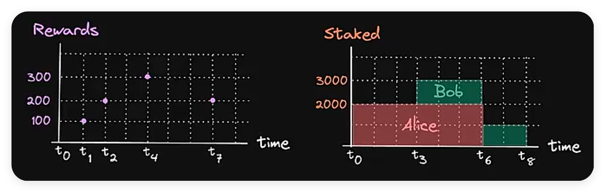

# 质押奖励代币

质押奖励代币（Staking Reward Tokens）是 DeFi（去中心化金融）中的一种机制，允许用户通过质押（staking）他们的代币来获得奖励。

**质押奖励代币的工作原理**：

1. 质押代币：

    - 用户调用智能合约中的 `stake` 函数，将一定数量的代币转移到合约中。

    - 合约会记录用户质押的数量，并更新总质押量。

2. 更新奖励：

    - 每次用户进行质押、解除质押或领取奖励时，合约会更新奖励数据。

    - 更新奖励时，合约会计算每个代币的累计奖励，并记录上次更新的时间。

3. 计算奖励：

    - 合约通过 `rewardPerTokenStored` 函数计算每个代币的累计奖励。

    - 通过 `earned` 函数计算用户应得的奖励。

4. 领取奖励：

    - 用户调用 `getReward` 函数领取奖励代币。

    - 合约会将计算好的奖励代币转移到用户的账户中，并将用户的奖励余额清零。

5. 解除质押：

    - 用户调用 `withdraw` 函数解除质押。

    - 合约会更新总质押量和用户的质押余额，并将质押代币转回给用户。

**demo**：

```solidity
import "@openzeppelin/contracts/token/ERC20/IERC20.sol";

contract StakingRewards {
    // 定义质押代币和奖励代币
    IERC20 public immutable stakingToken;
    IERC20 public immutable rewardsToken;

    // 合约的所有者
    address public owner;

    // 质押代币的总量
    uint public totalSupply;

    // 奖励的持续时间
    uint public duration;

    // 奖励的结束时间
    uint public finishAt;

    // 合约的更新时间
    uint public updatedAt;

    // 每秒奖励代币的数量
    uint public rewardRate;

    // 每个代币的累计奖励; RPT
    // 等于 rewardRate * 持续时间 / 质押代币的总量
    uint public rewardPerTokenStored;

    // 记录每个用户的 RPT
    mapping(address => uint) public userRewardPerTokenPaid;

    // 记录每个用户的奖励金额
    mapping(address => uint) public rewards;

    // 记录每个用户质押了多少代币
    mapping(address => uint) public balances;

    // 构造函数
    constructor(address _stakingToken, address _rewardsToken) {
        stakingToken = IERC20(_stakingToken);
        rewardsToken = IERC20(_rewardsToken);
        owner = msg.sender;
    }

    // 修饰符: 只有合约的所有者才能调用
    modifier onlyOwner() {
        require(msg.sender == owner, "only owner can call");
        _;
    }

    // 修饰符: 更新奖励
    modifier updateReward(address _account) {
        rewardPerTokenStored = rewardPerToken();
        updatedAt = lastTimeRewardApplicable();
        if (_account != address(0)) {
            rewards[_account] = earned(_account);
            userRewardPerTokenPaid[_account] = rewardPerTokenStored;
        }
        _;
    }

    // 设置奖励的持续时间
    function setRewardsDuration(uint _duration) public onlyOwner {
        require(
            finishAt < block.timestamp,
            "can't update duration before finish"
        );
        duration = _duration;
    }

    // 设置奖励金额
    function notifyRewardAmount(
        uint _amount
    ) public onlyOwner updateReward(address(0)) {
        if (block.timestamp >= finishAt) {
            // 如果上一轮奖励已经结束, 则直接更新
            rewardRate = _amount / duration;
        } else {
            // 如果这一轮奖励还未结束, 则需要先计算剩余时间的奖励
            uint leftover = finishAt - block.timestamp * rewardRate;
            rewardRate = (_amount + leftover) / duration;
        }

        require(rewardRate > 0, "reward rate must be positive");
        require(
            rewardRate * duration <= rewardsToken.balanceOf(address(this)),
            "not enough reward token"
        );

        updatedAt = block.timestamp;
        finishAt = block.timestamp + duration;
    }

    // 用户进行质押
    function stake(uint _amount) public updateReward(msg.sender) {
        require(_amount > 0, "Cannot stake 0");
        stakingToken.transferFrom(msg.sender, address(this), _amount);
        balances[msg.sender] += _amount;
        totalSupply += _amount;
    }

    // 用户解除质押
    function withdraw(uint _amount) public updateReward(msg.sender) {
        require(balances[msg.sender] >= _amount, "Insufficient balance");
        balances[msg.sender] -= _amount;
        totalSupply -= _amount;
        stakingToken.transfer(msg.sender, _amount);
    }

    function _min(uint a, uint b) private pure returns (uint) {
        return a < b ? a : b;
    }

    // 上一次奖励的时间
    function lastTimeRewardApplicable() public view returns (uint) {
        return _min(block.timestamp, finishAt);
    }

    // 获取每个代币的累计奖励
    function rewardPerToken() public view returns (uint) {
        if (totalSupply == 0) {
            return rewardPerTokenStored;
        }
        // 当前的 RPT = 之前的 RPT + 持续时间 * 每秒奖励 / 总供应量
        return
            rewardPerTokenStored +
            (((lastTimeRewardApplicable() - updatedAt) * rewardRate) * 1e18) /
            totalSupply;
    }

    // 用户查看奖励
    function earned(address _account) public view returns (uint) {
        // 用户的奖励 = 用户的质押余额 * (当前的 RPT - 用户的 RPT) + 用户的奖励余额
        return
            (balances[_account] *
                (rewardPerToken() - userRewardPerTokenPaid[_account])) /
            1e18 +
            rewards[_account];
    }

    // 用户领取奖励
    function getReward() public updateReward(msg.sender) {
        uint reward = rewards[msg.sender];
        if (reward > 0) {
            rewards[msg.sender] = 0;
            rewardsToken.transfer(msg.sender, reward);
        }
    }
}
```

1. 部署两个 ERC20 合约，分别代表质押代币和奖励代币

```solidity
import "@openzeppelin/contracts/token/ERC20/ERC20.sol";

contract MyToken is ERC20 {
    constructor(string memory name, string memory symbol) ERC20(name, symbol) {}

    function mint(address to, uint amount) external {
        _mint(to, amount);
    }
}
```

2. 传入质押代币和奖励代币的地址，部署 StakingRewards 合约

3. 传入 1000，调用 setRewardsDuration 设置奖励的持续时间

4. 传入 StakingRewards 地址、1000000000000000000000 (1000 \* 1e18)，调用奖励代币的 mint 函数，设置奖励代币的总供应量

5. 传入 1000000000000000000000 (1 \* 1e18)，调用 notifyRewardAmount 设置奖励金额

6. 切换编辑器账户 2 作为质押账户

7. 传入账户 2 地址、1000000000000000000000 (1 \* 1e18)，调用质押代币的 mint 函数，设置质押代币的总供应量

8. 传入 StakingRewards 地址、1000000000000000000000 (1 \* 1e18)，调用质押代币的 approve 函数，授权 StakingRewards 合约转移质押代币

9. 传入 1000000000000000000000 (1 \* 1e18)，调用 stake 进行质押

10. 传入账户 2 地址，调用 balances 查看质押余额，返回 1000000000000000000000 (1 \* 1e18)

11. 传入账户 2 地址，调用 earned 查看奖励

12. 调用 getReward 领取奖励；再次调用 earned 查看奖励，可以看到奖励数据已更新

13. 传入账户 2 地址，调用奖励代币的 balanceOf，可以看到账户 2 的奖励代币余额增加

14. 传入 1000000000000000000000 (1 \* 1e18)，调用 withdraw 解除质押；再次调用 balances 查看质押余额，返回 0

<br><br>

# 离散质押奖励

离散质押奖励（Discrete Staking Rewards）是质押奖励机制的一种变体，它在预定义的离散时间间隔内计算和分发奖励，而不是连续计算。

**离散质押奖励的特点**：

1. 周期性更新：奖励在固定的时间间隔（如每天、每周或每个区块）更新。

2. 快照机制：在每个奖励周期开始时，记录质押者的余额快照。

**计算讲解**：



1. 设 `R(i)` 表示 `t(i)` 时发放的奖励、`T(i)` 表示 `t(i)` 时的总质押量；

有 `R(0) = 0`、`R(1) = 100`、`R(2) = 200`、`R(3) = 0`、`R(4) = 300`、`R(5) = 0`、`R(6) = 0`、`R(7) = 200`、`R(8) = 0`

有 `T(0) = 2000`、`T(1) = 2000`、`T(2) = 2000`、`T(3) = 3000`、`T(4) = 3000`、`T(5) = 3000`、`T(6) = 3000`、`T(7) = 1000`、`T(8) = 1000`

2. 设 `r(i)` 表示 `t(i)` 时的奖励指数；

因为 `r(i) = R0/T0 + R1/T1 + ... + R(i)/T(i)`

所以奖励指数：`r(0) = R(0)/T(0) = 0/200 = 0`、`r(1) = r(0) + R(1)/T(1) = 100/2000`、`r(2) = r(1) + R(2)/T(2) = 100/2000 + 200/2000 = 300/2000`、`r(4) = r(2) + R(4)/T(4) = 300/2000 + 300/3000 = 1500/6000`、`r(7) = r(4) + R(7)/T(7) = 1500/6000 + 200/1000 = 2700/6000`

3. 设 `r(u,k,n)` 表示用户 `u` 在 `t(k)` 到 `t(n)` 这段时间内的奖励指数；

因为 `r(u,k,n) = R0/T0 + R2/T2 + ... + Rk/Tk = r(k)`

所以用户的奖励指数：`r(Alice,0,6) = r(0) = 0`、`r(Bob,3,8) = r(3) = 300/2000`

4. 设 `S(u,k,n)` 为用户 `u` 在 `t(k)` 到 `t(n)` 这段时间内质押的总量、`R(u,k,n)` 为用户 `u` 在 `t(k)` 到 `t(n)` 这段时间内的奖励金额：

因为 `S(Alice,0,6) = 2000`、`S(Bob,3,8) = 1000`；又因为 `R(u,k,n) = S(u,k,n) * ( r(n) - r(u,k,n) )`

所以：
`R(Alice,0,6) = 2000 * (r6 - r0) = 2000 * (r4 - r0) = 2000 * (1500/6000 - 0) = 500`
`R(Bob,3,8) = 1000 * (r8 - r3) = 1000 * (r7 - r2) = 1000 * (2700/6000 - 300/2000) = 300`

**代码示例**：

```solidity
import "@openzeppelin/contracts/token/ERC20/IERC20.sol";

contract DiscreteStakingRewards {
    // 定义质押代币和奖励代币
    IERC20 public immutable stakingToken;
    IERC20 public immutable rewardsToken;

    // 质押代币的总量
    uint public totalSupply;

    // 记录每个用户质押了多少代币
    mapping(address => uint) public balances;

    // 奖励指数
    uint private rewardIndex;

    // 记录每个用户的奖励指数
    mapping(address => uint) private userRewardIndex;

    // 记录每个用户的奖励金额
    mapping(address => uint) private rewards;

    // 构造函数
    constructor(address _stakingToken, address _rewardsToken) {
        stakingToken = IERC20(_stakingToken);
        rewardsToken = IERC20(_rewardsToken);
    }

    // 更新奖励指数
    function updateRewardIndex(uint _reward) public {
        if (totalSupply == 0) {
            return;
        }
        rewardsToken.transferFrom(msg.sender, address(this), _reward);
        // 新的奖励指数 = 旧的奖励指数 + 奖励 / 质押代币的总量
        rewardIndex += (_reward * 1e18) / totalSupply;
    }

    // 获取用户的奖励
    function calculateReward(address _account) public view returns (uint) {
        return
            // 用户的奖励 = 用户的奖励余额 + 用户的质押余额 * (当前的奖励指数 - 用户的奖励指数)
            rewards[_account] +
            (balances[_account] * (rewardIndex - userRewardIndex[_account])) /
            1e18;
    }

    // 修饰符: 更新用户的奖励、奖励指数
    modifier updateReward(address _account) {
        rewards[_account] = calculateReward(_account);
        userRewardIndex[_account] = rewardIndex;
        _;
    }

    // 用户进行质押
    function stake(uint _amount) public updateReward(msg.sender) {
        balances[msg.sender] += _amount;
        totalSupply += _amount;
        stakingToken.transferFrom(msg.sender, address(this), _amount);
    }

    // 用户解除质押
    function withdraw(uint _amount) public updateReward(msg.sender) {
        require(balances[msg.sender] >= _amount, "Insufficient balance");
        balances[msg.sender] -= _amount;
        totalSupply -= _amount;
        stakingToken.transfer(msg.sender, _amount);
    }

    // 用户领取奖励
    function getReward() public updateReward(msg.sender) {
        uint reward = rewards[msg.sender];
        if (reward == 0) {
            return;
        }
        rewards[msg.sender] = 0;
        rewardsToken.transfer(msg.sender, reward);
    }
}
```

<br>
