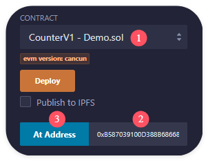

```
// 1.  重现透明可升级代理，并探讨其错误实现。
// 2.  视频系列内容：
//     -  错误实现可升级代理合约，分析错误实现中的问题
//     -  返回回退函数中的数据 fallback
//     -  在智能合约的存储槽中写⼊任意数据
//     -  存储实现合约地址和 admin 地址
//     -  分离 admin 和 user 接⼝
//     -  proxy admin 合约
//     -  实际操作演⽰
```

现有 CounterV1 合约：

```solidity
contract CounterV1 {
    uint public count;

    function inc() external {
        count += 1;
    }
}
```

编写代理合约 BuggyProxy：

```solidity
contract BuggyProxy {
    address public implementation;
    address public immutable admin;

    constructor() {
        admin = msg.sender;
    }

    function _delegate() private {
        (bool success, ) = implementation.delegatecall(msg.data);
        require(success, "delegatecall failed");
    }

    fallback() external {
        _delegate();
    }

    receive() external payable {
        _delegate();
    }

    function upgradeTo(address _implementation) external {
        require(msg.sender == admin, "admin only");
        implementation = _implementation;
    }
}
```

1. 部署 CounterV1 合约、BuggyProxy 合约

2. 传入 CounterV1 合约的地址，调用 BuggyProxy 合约的 upgradeTo 方法

3. 查看 BuggyProxy 合约的 implementation 值，可以看到其变为 CounterV1 合约的地址

4. 复制 BuggyProxy 合约的地址，作为 CounterV1 合约添加到 Remix 中



5. 调用步骤 4 中新增的 CounterV1 合约的 inc 方法

6. 查看 CounterV1 合约的 count 值，发现其未发生变化

7. 查看 BuggyProxy 合约的 implementation 值，却发现被修改了

问题原因：CounterV1 合约的第一个存储槽为 count，而 BuggyProxy 合约的第一个存储槽为 implementation，导致 BuggyProxy 合约调用 CounterV1 合约的 inc 方法时，修改的是 BuggyProxy 合约的 implementation 值。

解决方法：使 CounterV1 的存储槽与 BuggyProxy 的存储槽保持一致。
