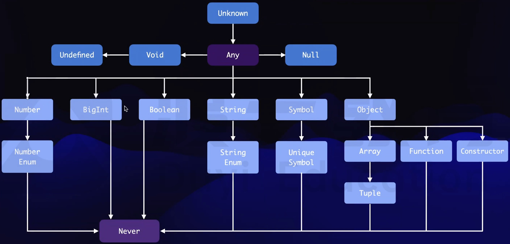

# 可用的类型



<br>

## object

`object` 表示引用类型；约束变量为 `object` 后，将不能对其赋原始类型的值。

```typescript
let obj: object; // 约束该变量的类型 object
obj = {};
obj = [];
obj = function () {};

// obj = 1; // 报错

// obj = null; // strictNullChecks 为 true 时报错
// obj = undefined; // strictNullChecks 为 true 时报错
```

<br>

## array

`array` 类型有两种写法：① `XXX[]` (字面量写法)、 ② `Array<XXX>` (构造函数的泛型写法)

```ts
let array1: number[]; // 元素为 number 类型
let array2: Array<string>; // 元素为 string 类型
```

如果不显式声明类型，TS 会自行推断：

```ts
let arr1 = [1]; // number[]
let arr2 = []; // compilerOptions.noImplicitAny 为 true 时, 会推断成 any[]; 反之, 会推断成 never[]
```

<br>

## tuple

`tuple` 类型的写法：`[XXX, XXX]` (其实就是固定长度的数组)

```ts
let tuple1: [string, number]; // 表示第 1 元素为 string 类型、 第 2 元素为 number 类型、且只有这两个元素的数组
```

<br>

## enum

```ts
enum Gender {
    female,
    male,
}
console.log(Gender.male); // 1
console.log(Gender[1]); // male
```

此时，数据库中存储的是数值 0 1，但使用时 需通过 `Gender.male` 的方式使用，既能节省存储空间，又能使代码更语义化。

可以给枚举类型设置默认值：

```ts
enum Gender {
    female = 1,
    male,
}
console.log(Gender.male); // 2
console.log(Gender[1]); // female
```

<br>

## any

-   any 表示 "任意类型"，其实就是让 TS 不进行类型检查。
-   any 类型的变量可以赋值给任意类型的变量，任意类型的变量也可以赋值给 any 类型的变量；在 any 类型的变量上访问任何属性都是合法的。
-   当变量没有被显式声明类型，且 TS 推导不出其类型时，TS 就会隐式声明该变量为 any 类型。

<br>

## unknown

-   unknown 表示 "未知的类型"。
-   任意**其他**类型的变量都可以直接赋值给 unknown 类型的变量，但 unknown 类型的变量赋值给任意**其他**类型（any 类型除外）的变量前，需要先判断 unknown 变量的准确类型；除 any 类型的变量外，unknown 类型的变量之间也可以直接赋值。

```typescript
let unknownVal: unknown = "superman"; // 将字符串赋值给 unknown 类型的变量
let numberVal: number = 0;

if (typeof unknownVal === "number") {
    // 将 unknown 类型的变量赋值给其他类型的变量之前; 需要先判断该 unknown 变量的准确类型; 如果不判断, 会直接飘红
    numberVal = unknownVal;
}
```

<br>

## void

在 JS 中，`void` 有特殊的用法，比如：

```html
<a href="javascript:void(0)">click me</a>
```

这里的 `void(0)` 等价于 `void 0`，即 `void expression` 的语法，我们可以使用它来实现立即执行函数：

```js
void (function () {
    console.log("IIFE");
})();
```

在 TS 中，`void` 用于修饰没有 `return` 的函数：

```ts
function fun1(): void {} // 没有返回值
```

-   `void` 表示没有类型
-   `void` 类型的变量只能被赋值为 `undefined`

```ts
function fun2(): void {
    return; // 隐式返回 `undefined`
}

function fun3(): void {
    return undefined; // 显式返回 `undefined`
}
```

<br>

## never

-   `never` 表示不存在的类型
-   `never` 类型的变量不能被赋其他类型的值

**TIPS ①**：可以使用 never 类型做一些兜底处理

```ts
type Method = "GET" | "POST";

function request(method: Method) {
    if (method === "GET") {
        console.log(typeof method);
    } else if (method === "POST") {
        console.log(typeof method);
    } else {
        console.log(typeof method); // 此时 method 为 never 类型
        const _neverVariable: never = method;
        throw new Error(`Unsupported method: ${_neverVariable}`);
    }
}

request("GET");
```

如此，后续如果拓展了 Method 类型，如 `type Method = "GET" | "POST" | "PUT" | "DELETE"`，代码 `const _neverVariable: never = method` 这里就会飘红（因为 `never` 类型的变量不能被赋其他类型的值），就能起到提醒我们处理拓展类型 `"PUT" | "DELETE"` 的效果。

**TIPS ②**：如果确定某函数会抛出错误，可以使用 never 声明该函数的返回值类型

```ts
function error(message: string): never {
    throw new Error(message);
}

function fail() {
    error("Something failed");
    console.log("这行代码将不会被执行"); // 编辑器中这行会被置灰
}
```

<br><br>

# 类型拓宽

如何使用 `const` 定义常量，TS 会以如下形式推导该常量的类型：

```ts
const str = "Hello, World!"; // "Hello, World!"
const num = 42; // 42
const bool = true; // true
const und = undefined; // undefined
const nul = null; // null
const sym = Symbol("symbol"); // typeof sym
const big = BigInt(42); // bigint
```

如何使用 `let` / `var` 定义变量，TS 会以如下形式推导该变量的类型：

```ts
let str = "Hello, World!"; // string
let num = 42; // number
let bool = true; // boolean
let und = undefined; // any
let nul = null; // any
let sym = Symbol("symbol"); // symbol
let big = BigInt(42); // bigint
```

可见 `let` / `var` 定义的变量，被 TS 推导出来的类型更 "宽" 了，我们称之为 "类型拓宽" 。

<br><br>

# 装箱类型 & 拆箱类型


上图中，左边的类型为 "父类型"（装箱类型），右边的类型为 "子类型"（拆箱类型）。"父类型" 的变量可以接收 "子类型" 的值，但反之则不行。

demo1：

```ts
const temp1: Object = { name: "jack" };
const temp2: Object = () => {};
const temp3: Object = [];
const temp4: Object = new String("hello");
const temp5: Object = "world";
const temp6: Object = 123;
const temp7: Object = true;
const temp8: Object = Symbol("a");

// strictNullChecks 为 false 的话, 下面也成立
// const temp9: Object = undefined;
// const temp10: Object = null;
```

上例的 `Object` 可以简写为 `{}` 。

demo2：

```ts
const str1: string = "Hello World";
let str2: String = "Hello World";

const str3: String = new String("Hello World");
// let str4: string = new String("Hello World"); // Error

str2 = str1;
// str1 = str2; // Error

const str5: "Hello World" = "Hello World";
str2 = str5;
// str5 = str2; // Error

// strictNullChecks 为 false 的话, 下面也成立
// const str6: String = undefined;
// const str7: String = null;
```

<br><br>

# 类型断言

上述 `unknown` 的示例中，可以使用 [**类型断言**] 表示你确定当前变量一定会是指定类型。

写法 1 - `变量 as 类型`、 写法 2 - `<类型>变量`：

```typescript
let unknownVal: unknown = 100;
let numberVal: number = 0;
numberVal = unknownVal as number; // 此时, 你得确保当前变量 unknownVal 一定会是 number 类型
numberVal = <number>unknownVal; // 因为, 使用类型断言后 TS 不再判断, 会直接将 unknownVal 赋值给 numberVal
```

<br><br>

# 非空断言

在 TS 中，有时候我们明确知道某个变量不会是 `null` / `undefined`，但 TS 仍然会提示错误。此时，可以使用 [**非空断言**]：`!`，表示当前变量一定不会是 `null` / `undefined`：

```ts
let box1 = document.getElementById("box1")!; // 我们明确知道 box1 一定不会是 null / undefined
box1.addEventListener("click", () => {
    console.log("click box1");
});
```

<br><br>

# 字面量类型

约束普通变量：

```ts
let username: "superman"; // 约束 username 只能为 "superman"
```

约束对象变量，需要使用 `as const`：

```ts
let obj = { name: "superman" } as const; // 约束 obj 只能为 { name: "superman" }
```

<br><br>

# 联合类型

```ts
let gender: "male" | "famale"; // 约束 gender 只能为 "male" 或 "famale"
let account: (string | number)[]; // 约束 account 为数组, 数组元素的类型只能为 string / number
```

**TIPS ①**：使用联合类型时，需要注意接收的数据具体是什么类型的，才能执行具体的操作

```ts
function showName(name: string | number) {
    if (typeof name === "number") console.log(name);
    else console.log(name.toLocaleUpperCase());
}
showName("superman");
```

**TIPS ②**："大" 类型的变量不能直接赋值给 "小" 类型的变量

```ts
let identity = "user"; // 此时 identity 的类型被约束为 string
function showIdentity(id: "user" | "root" | "superRoot"): void {
    console.log("id", id);
}

// showIdentity(identity);
// 直接飘红，因为类型 `string` 比 `"user" | "root" | "superRoot"` "大"
// 需要约束其类型比 `"user" | "root" | "superRoot"` "小"，才能正常使用
```

此时可以使用 **[类型断言]**：

```ts
let identity = "user";
function showIdentity(id: "user" | "root" | "superRoot"): void {
    console.log("id", id);
}

showIdentity(<"user" | "root">identity); // 表示你确保 identity 只会是 "user" / "root"
showIdentity(identity as "user" | "root");
```

此外，还能在定义变量时使用 **`as const`** 约束变量类型为当前 **[字面量]**：

```ts
let identity = "user" as const; // 此时 identity 的类型被约束为 "user"
function showName(id: "user" | "root" | "superRoot"): void {
    console.log("id", id);
}

showName(identity); // 可以直接使用，因为类型 `"user"` 比 `"user" | "root" | "superRoot"` "小"
```

**TIPS ③**：处理 "对象" 类型时需要注意

demo1：

```ts
type Student = { name: string; className: string };
type Teacher = { name: string; subject: string; office: string };
type Person = Student | Teacher;

const person1: Person = { name: "Doe", className: "1" };
const person2: Person = { name: "Dof", subject: "Math", office: "101" };

// 创建时, 可以同时包含 Student 和 Teacher 的属性
const person3: Person = {
    name: "Dog",
    className: "1",
    subject: "Math",
    office: "101",
};
// 但如果这么写, 使用时只能访问 Student 和 Teacher 共有的属性
console.log(person3.name);
// console.log(person3.className); // Error
```

demo2：

```ts
type UserTextEvent = { value: string; target: HTMLInputElement };
type UserAgeEvent = { value: number; target: HTMLButtonElement };

type UserEvent = UserTextEvent | UserAgeEvent;

function handleUserEvent(event: UserEvent) {
    if (typeof event.value === "string") {
        // 这里我们希望 TS 能够推断出 event 是 UserTextEvent 类型, target 应该是 HTMLInputElement
        console.log(typeof event.target); // HTMLInputElement | HTMLButtonElement
    } else {
        // 这里我们希望 TS 能够推断出 event 是 UserAgeEvent 类型, target 应该是 HTMLButtonElement
        console.log(typeof event.target); // HTMLInputElement | HTMLButtonElement
    }
}
```

可以发现，target 属性都被 TS 推断为 `HTMLInputElement | HTMLButtonElement` 。这是因为，联合类型 UserEvent 其实为 `{ value: string | number; target: HTMLInputElement | HTMLButtonElement }` 。可以发现 TS 的推导其实并没有想象中那么智能 hhh...

我们可以这样修改 demo2：

```ts
type UserTextEvent = { value: string; target: HTMLInputElement; type: "text" }; // 添加标识属性 type: "text"
type UserAgeEvent = { value: number; target: HTMLButtonElement; type: "age" }; // 添加标识属性 type: "age"

type UserEvent = UserTextEvent | UserAgeEvent;

function handleUserEvent(event: UserEvent) {
    // 判断标识属性值
    if (event.type === "text") {
        console.log(typeof event.target); // HTMLInputElement
    } else {
        console.log(typeof event.target); // HTMLButtonElement
    }
}
```

这样，类型就能被正确推导出来啦。我们称这种有标识属性的联合类型为 "可辨识的联合类型" 。

**TIPS ④**：联合类型中有 never 类型时，never 类型会被忽略

```ts
let a: string | number | never; // a 的类型是 string | number
```

<br><br>

# 交叉类型

先回顾一下 "联合类型"：

```ts
let obj2: { name: string } | { age: number }; // name 和 age 属性有一个即可, 都有也行
obj2 = { name: "John" };
obj2 = { age: 25 };
obj2 = { name: "John", age: 25 };
```

再对比一下 "交叉类型"：

```ts
let obj1: { name: string } & { age: number }; // name 和 age 属性都必须有
obj1 = { name: "John", age: 25 };
```

**TIPS ①**：如果有相同的属性名，且属性类型不一致，则该属性类型会被 TS 限制为 `never` 类型：

```ts
let obj1: { name: string } & { name: number };
obj1 = { name: "123" }; // Type 'string' is not assignable to type 'never'
```

从上例可以猜到，对于基本类型：

```ts
let obj1 = string | number;
let obj2 = string & number; // obj2 被 TS 限制为 never 类型
```

**TIPS ②**："联合类型" 搭配 "交叉类型" 的 demo

```ts
type A = { name: string | number };
type B = { name: string };
type C = A & B; // { name: string }
```

从上例可以猜到，对于基本类型：

```ts
type A = string | number;
type B = string;
type C = A & B; // string
```

<br><br>

# 类型别名

如果类型很长，可以给类型起别名：`type XX = XXX`

**对于 [联合类型]**：

```ts
const num1: 1 | 2 | 3 | 4 | 5 = 1;
const num2: 1 | 2 | 3 | 4 | 5 = 2;
```

```ts
type MyType = 1 | 2 | 3 | 4 | 5;
const num1: MyType = 1;
const num2: MyType = 2;
```

**对于 [对象的类型]**：

```ts
const obj1: { name: string; age: number } = { name: "superman", age: 21 };
const obj2: { name: string; age: number } = { name: "monster", age: 20 };
```

```ts
type ObjType = { name: string; age: number };
const obj1: ObjType = { name: "superman", age: 21 };
const obj2: ObjType = { name: "monster", age: 20 };
```

**对于 [函数的类型]**：

```ts
const sum: (num1: number, num2: number) => number = (num1, num2) => num1 + num2;
const sub: (num1: number, num2: number) => number = (num1, num2) => num1 - num2;
```

```ts
type FunType = (num1: number, num2: number) => number;
const sum: FunType = (num1, num2) => num1 + num2;
const sub: FunType = (num1, num2) => num1 - num2;
```

<br>
