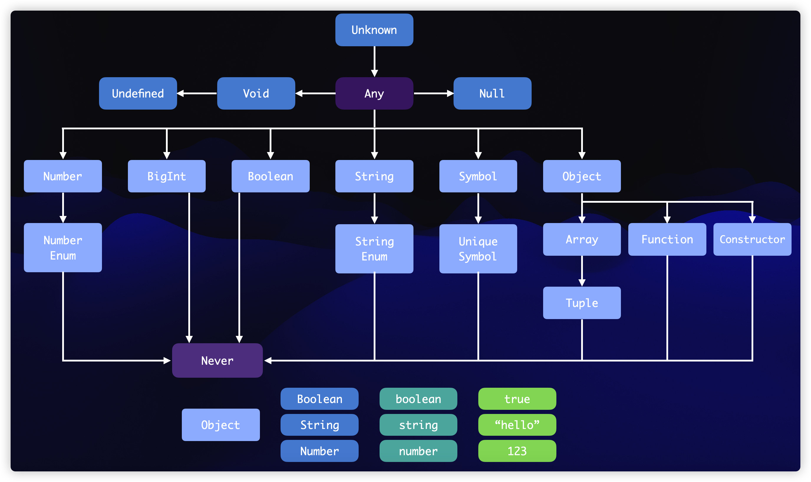

# 结构化类型系统

TS 的类型系统是结构化类型系统，这意味着它通过比较类型的实际属性和方法来判断类型是否相同，而不是通过类型的名称。例如：

```ts
type User = {
    id?: number;
    name: string;
};

type Animal = {
    id?: number;
    name: string;
};
```

这两个类型是等价的，因为它们具有相同的属性。

<br><br>

# 子类型与父类型

在 TS 中，子类型和父类型通过结构来区分，而不需要使用 `extends` 或 `implements` 关键字。例如：

```ts
type User = {
    id?: number;
    name: string;
};

type AdminUser = {
    id?: number;
    name: string;
    role: string;
};
```

AdminUser 类型完全实现了 User 类型，因此 AdminUser 是 User 的子类型。

<br><br>

# 协变与逆变

-   **协变**：子类型可以赋值给父类型。
-   **逆变**：父类型可以赋值给子类型。

对于结构化类型，主要的型变方式是协变。例如：

```ts
type User = {
    id?: number;
    name: string;
};

type AdminUser = {
    id?: number;
    name: string;
    role: string;
};

let user: User;
let admin: AdminUser = { id: 1, name: "Admin", role: "admin" };
user = admin; // 合法，因为 AdminUser 是 User 的子类型
```

<br><br>

# 类型层次结构



从上图中可以看出：

-   Array 是 Object 的子类型，需要 Object 的地方都可以使用 Array

-   Tuple 是 Array 的子类型，需要 Array 的地方都可以使用 Tuple

-   所有类型都是 Any 的子类型，需要 Any 的地方，任何类型都能用

-   Never 是所有类型的子类型

-   字面量类型是对应基础类型的子类型，需要基础类型的地方都能使用字面量类型

<br><br>

# 复杂对象的型变

对于复杂对象，每个属性的类型也需要满足子类型关系。例如：

```ts
type User = {
    id?: number;
    name: string;
};

type ExistUser = {
    id: number;
    name: string;
};

type LegacyUser = {
    id?: number | string;
    name: string;
};
```

注意，和之前 User 类型的区别主要在 id 这个属性上：

```
User       ---> id ---> number | undefined

ExistUser  ---> id ---> number

LegacyUser ---> id ---> number | string | undefined
```

也就是说，每个类型的 id 属性的类型是不一样的，这里是联合类型。

> **简单来说，越具体、越形象的类型，就是子类型**：
>
> -   `"hello"` 字面量类型比 `string` 类型更具体，那么 `"hello"` 字面量类型就是 `string` 类型的子类型
>
> -   `[number, number]` 元组类型比数组类型更具体，那么元组类型就是数组类型的子类型
>
> -   `a | b` 联合类型比 `a | b | c` 联合类型更具体，那么 `a | b` 就是 `a | b | c` 的子类型

因此，在这个例子中，`ExistUser` 是 `User` 的子类型，而 `User` 是 `LegacyUser` 的子类型。

<br>
