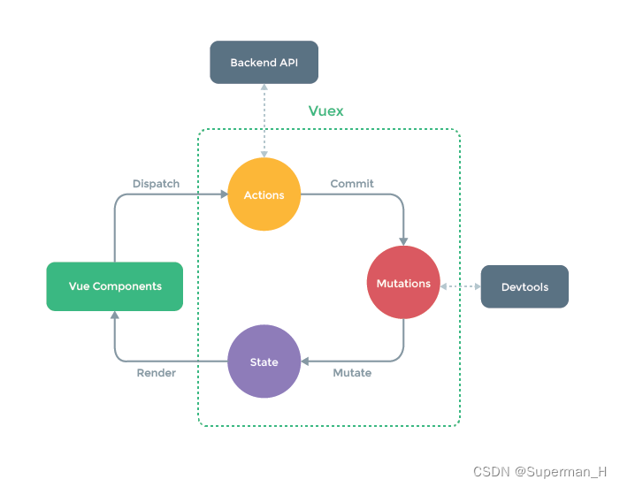

# Vuex 简介

Vuex 是官方提供的一个插件，用于集中式管理组件共用的数据。使用 Vuex 后，任何组件之间都可以进行通信。Vuex 的数据存储是响应式的，当组件从 store 中获取并改变数据时，模版会被重新渲染。

<br>



1. State (状态)：用于存储数据。存储的数据供 Vue Components 使用。
2. Vue Components (组件)：与用户交互，将更新的数据 Dispatch(发送) 给 Actions
3. Action**s** (行动)：处理交互行为，将更新的数据 Commit(提交) 到 Mutations。可处理 [同步] & [异步] 操作。
4. Mutation**s** (变化)：**更新 State 中的数据，尽可能不做逻辑处理**。只处理 [同步] 操作。

-   如果只有 [同步] 操作，Vue Components 可以直接操作 Mutations，进而修改 State 里面的数据。

<br><br>

# Vuex 的使用

**第一步：下载 vuex**

```bash
npm i vuex
```

注意版本问题：vuex3 - vue2、vuex4 - vue3

<br>

**第二步：配置 store 文件**

创建、配置 @/store/index.js 文件：

```js
import Vue from 'vue';
import Vuex from 'vuex';

// 该指令必须在 store 创建之前执行
Vue.use(Vuex);

// Actions(行动): 处理交互行为
const actions = {
    // context: 简化版的 store;  value: 发送过来的数据
    changeDispatch(context, value) {
        console.log('actions', context, value);
        // 将数据 commit 给 mutations
        // 设置 2 个实参: commit 中的方法名 & 发送的数据
        context.commit('changeCommit', value);
    },
};

// Mutations(变化): 修改 state 中的数据
const mutations = {
    // state: 存储的数据;  value: 发送的数据
    changeCommit(state, value) {
        console.log('mutations', state, value);
        // 修改 state 中存储的数据;  修改后，页面会重新渲染
        state.name = value;
    },
};

// State: 用于存储数据
const state = { name: 'superman' };

// 创建并导出 store
export default new Vuex.Store({
    actions,
    mutations,
    state,
});
```

<br>

**第三步：在入口文件 main.js 中注册 store 文件**

```js
import Vue from 'vue';
import App from './App.vue';
import store from './store'; // 引入 store 文件

new Vue({
    store, // 注册 store
    render: (h) => h(App),
}).$mount('#app');
```

注册完 store 文件后，组件实例身上就会有 `$store` 属性，可通过 `$store` 属性获取并修改 store 中存储的数据。

```vue
<template>
    <div>
        <p>name: {{ $store.state.name }}</p>
        <button @click="changeName">点击修改 state 中的数据</button>
    </div>
</template>

<script>
export default {
    name: 'App',
    methods: {
        changeName() {
            // 在组件中 将数据 dispatch 给 Actions
            // 传入 2 个实参: dispatch 中的方法名 & 发送的数据
            this.$store.dispatch('changeDispatch', 'superVue');
        },
    },
};
</script>
```

建议 `[this.]$store.state.XXX` 放在计算属性中：

```vue
<template>
    <div id="app">
        <p>name: {{ getName }}</p>
        <button @click="changeName">点击修改 state 中的数据</button>
    </div>
</template>

<script>
export default {
    name: 'App',
    methods: {
        changeName() {
            // 在组件中 将数据 dispatch 给 Actions
            // 传入 2 个实参: dispatch 中的方法名 & 发送的数据
            this.$store.dispatch('changeDispatch', 'superVue');
        },
    },
    computed: {
        getName() {
            return this.$store.state.name;
        },
    },
};
</script>
```

<br>

**对于同步操作：**

-   如果只有同步操作，Vue Components 可以直接将数据 commit 到 Mutations，进而处理 State 里面存储的数据
-   当然，也可以一步一步来：Vue Components - Dispatch 👉 Actions - Commit 👉 Mutations

```vue
<template>
    <div id="app">
        <p>name: {{ getName }}</p>
        <button @click="changeName">点击修改 state 中的数据</button>
    </div>
</template>

<script>
export default {
    name: 'App',
    methods: {
        changeName() {
            // 在组件中 将数据 commit 给 Mutations
            // 传入 2 个参数: commit 中的方法名 & 发送的数据
            this.$store.commit('changeCommit', 'superVue');
        },
    },
    computed: {
        getName() {
            return this.$store.state.name;
        },
    },
};
</script>
```

如果需要传递多个数据，应该写成一个对象：

```js
changeName() {
    this.$store.commit("changeCommit", {
        name: "superVue",
    });
},
```

```js
mutations: {
    increment(state, payload) {
        state.name += payload.amount;
    },
},
```

对象风格的提交方式：

```js
changeName() {
    this.$store.commit({
        type: "changeCommit", // 使用 type 字段指定 mutations 中的方法名
        name: "superVue",
    });
},
```

此时，整个对象都作为载荷传给 mutations 函数

<br>

**一些个 summary：**

1. Vue Components 中获取 State 中的数据：`{{$store.state.属性名}}` || `this.$store.state.属性名`
2. Vue Components 通过 `this.$store.dispatch("actions事件名"[, 数据])` 执行同步 / 异步操作
3. 同步代码修改 state 中的数据：
    - Actions 中：通过 `context.commit("mutations事件名"[, 数据])` 执行同步操作
    - Vue Components 中：通过 `this.context.commit("mutations事件名"[, 数据])` 执行同步操作

<br><br>

# getters

-   用于对 state 中的数据进行加工，类似组件中的**计算属性 computed**
-   Vue Components 获取 getters 中的数据：`[this.]$store.getters.属性名`
-   当前仓库的 `state` 会作为 getters 方法的第 1 参数传入

```js
import Vue from 'vue';
import Vuex from 'vuex';

Vue.use(Vuex);

const actions = {};

const mutations = {};

// 设置 getters 对象
const getters = {
    // state 会作为第 1 参数传入！！！
    gettersArr(state) {
        return state.arr.filter((item) => {
            if (item.id % 2 == 0) return item;
        });
    },
};

const state = {
    arr: [
        { id: 0, name: 'JS' },
        { id: 1, name: 'Java' },
        { id: 2, name: 'Python' },
        { id: 3, name: 'C++' },
    ],
};

export default new Vuex.Store({
    actions,
    mutations,
    state,
    getters,
});
```

```vue
<template>
    <div id="app">
        <ul>
            <li v-for="item of computedArr" :key="item.id">
                {{ item.id }}--{{ item.name }}
            </li>
        </ul>
    </div>
</template>

<script>
export default {
    name: 'App',
    computed: {
        computedArr() {
            // 在组件中获取 getters 中的数据
            return this.$store.getters.gettersArr;
        },
    },
};
</script>
```

<br><br>

# 辅助函数

每次在模板中访问 store 文件中的数据 / 方法时，都需要用一大串代码获取 (eg: `[this.]$store.dispatch()`)，非常不方便，此时我们可以使用辅助函数

<br>

## mapState

-   mapState 可以帮助我们生成**计算属性**，方便我们获取 state 中的数据
-   mapState 的参数可以是 [对象] / [数组]

```vue
<template>
    <div class="app">
        <p>name: {{ staName }}</p>
        <p>gender: {{ staGender }}</p>
        <p>age: {{ staAge }}</p>
    </div>
</template>

<script>
import { mapState } from 'vuex'; // 引入 mapState
export default {
    name: 'App',
    computed: {
        // 参数是对象: 属性名为相当于 computed 的属性名，属性值为 state 对象的属性名
        ...mapState({
            staName: 'name',
            staGender: 'gender',
            staAge: 'age',
        }),
        // 因为 mapState 返回的是一个对象，所以要用 ... 将其与 computed 合并
    },
};
</script>
```

-   mapState 的参数是对象，如果要对数据进行额外操作，对象属性的属性值还可以为 [函数] 形式；

```js
import { mapState } from 'vuex';
export default {
    name: 'App',
    data() {
        return { num: 1 };
    },
    computed: {
        ...mapState({
            // 此时，store 的 `state` 会作为第 1 参数传入
            staName: (state) => state.name, // 箭头函数
            staGender: (state) => state.gender.toUpperCase(),
            // 如果要获取 this, 那还是老老实实写普通函数吧
            staAge(state) {
                return state.age + this.num;
            },
        }),
    },
};
```

-   mapState 的参数是对象，当该对象的属性值与属性名一样时，可以使用数组作为参数

```vue
<template>
    <div class="app">
        <p>name: {{ name }}</p>
        <p>gender: {{ gender }}</p>
        <p>age: {{ age }}</p>
    </div>
</template>

<script>
import { mapState } from 'vuex'; // 引入 mapState
export default {
    name: 'App',
    computed: {
        // 使用数组作为参数
        ...mapState(['name', 'gender', 'age']),
        // 相当于
        // ...mapState({ name: "name", gender: "gender", age: "age" }),
        // 注意: 这种情况下，不能使用 ES6 的对象简写，因为属性值是字符串，不是变量
    },
};
</script>
```

上例的 store 文件：

```js
import Vuex from 'vuex';
import Vue from 'vue';

Vue.use(Vuex);

const actions = {};
const mutations = {};
const state = {
    name: 'superman',
    gender: 'male',
    age: 21,
};

export default new Vuex.Store({
    actions,
    mutations,
    state,
});
```

<br>

## mapGetters

-   mapGetters 可以帮助我们生成**计算属性**，方便我们获取 getters 中的数据
-   mapGetters 的参数可以是 [对象] / [数组]

```vue
<template>
    <div class="app">
        <h1>App</h1>
        <ul>
            <!-- 可以在模板中直接使用 computedArr 获取 store 中 getters 的数据 -->
            <li v-for="item of computedArr" :key="item.id">
                {{ item.id }} -- {{ item.name }}
            </li>
        </ul>
    </div>
</template>

<script>
import { mapGetters } from 'vuex'; // 引入 mapGetters
export default {
    name: 'App',
    computed: {
        // 参数是对象：属性名相当于 computed 的属性名，属性值为 getters 对象的属性名
        ...mapGetters({ computedArr: 'computedArr' }),
        // 因为 mapGetters 返回的是一个对象，所以要用 ... 将其与 computed 合并
    },
};
</script>
```

-   mapGetters 的参数是对象，当该对象的属性值与属性名一样时，可以使用数组作为参数

```js
    computed: {
        // 使用数组作为参数
        ...mapGetters(["computedArr"])
        // 相当于
        // ...mapGetters({ computedArr: "computedArr" }),
        // 注意: 这种情况下，不能使用 ES6 的对象简写，因为属性值是字符串，不是变量
    },
```

上例的 store 文件：

```js
import Vuex from 'vuex';
import Vue from 'vue';

Vue.use(Vuex);

const actions = {};
const mutations = {};
const getters = {
    computedArr(state) {
        return state.arr.filter((item) => {
            if (item.id % 2 == 0) return item;
        });
    },
};
const state = {
    arr: [
        { id: 0, name: 'JS' },
        { id: 1, name: 'Java' },
        { id: 2, name: 'Python' },
        { id: 3, name: 'C++' },
    ],
};

export default new Vuex.Store({
    actions,
    mutations,
    state,
    getters,
});
```

<br>

## mapMutations

-   mapMutations 帮助我们生成对应**方法**，方法中会调用 commit 联系 Mutations

```vue
<template>
    <div class="app">
        <p>num：{{ num }}</p>
        <button @click="add">add</button>
        <button @click="reduce">reduce</button>
    </div>
</template>

<script>
import { mapState, mapMutations } from 'vuex'; // 引入 mapState、mapMutations
export default {
    name: 'App',
    computed: {
        ...mapState(['num']),
    },
    methods: {
        ...mapMutations({ add: 'muAdd', reduce: 'muReduce' }),
        // if 属性名 == 属性值，参数可以写成数组形式
        // ...mapMutations(["add", "reduce"]),
        // 相当于
        // ...mapGetters({ add: "add", reduce: "reduce" }),
        // 注意: 这种情况下，不能使用 ES6 的对象简写，因为属性值是字符串，不是变量
    },
};
</script>
```

```js
import Vuex from 'vuex';
import Vue from 'vue';

Vue.use(Vuex);

const actions = {};
const mutations = {
    muAdd(state, val = 1) {
        state.num += val;
    },
    muReduce(state, val = 1) {
        state.num -= val;
    },
};
const state = { num: 21 };

export default new Vuex.Store({
    actions,
    mutations,
    state,
});
```

此时，如果想传入参数，可以在调用函数时一并传入

```vue
<template>
    <div class="app">
        <p>num: {{ num }}</p>
        <!-- 调用方法的时候，一并传入参数 -->
        <button @click="add(2)">add 2</button>
        <button @click="reduce(2)">reduce 2</button>
    </div>
</template>

<script>
import { mapState, mapMutations } from 'vuex';
export default {
    name: 'App',
    computed: {
        ...mapState(['num']),
    },
    methods: {
        ...mapMutations({ add: 'muAdd', reduce: 'muReduce' }),
    },
};
</script>
```

或者，调用自身方法，再调用 mapMutations 的方法、并传入参数

```vue
<template>
    <div class="app">
        <p>num: {{ num }}</p>
        <!-- 调用自身方法 -->
        <button @click="myAdd">add 2</button>
        <button @click="myReduce">reduce 2</button>
    </div>
</template>

<script>
import { mapState, mapMutations } from 'vuex';
export default {
    name: 'App',
    computed: {
        ...mapState(['num']),
    },
    methods: {
        // 在自身方法中调用 mapMutations 的方法、并传入参数
        myAdd() {
            this.add(2);
        },
        myReduce() {
            this.reduce(2);
        },
        ...mapMutations({ add: 'muAdd', reduce: 'muReduce' }),
    },
};
</script>
```

<br>

## mapActions

-   mapActions 帮助我们生成对应**方法**，方法中会调用 dispatch 联系 Actions

```vue
<template>
    <div>
        <p>num: {{ num }}</p>
        <!-- 调用方法的时候，一并传入参数 -->
        <button @click="add(2)">add 2</button>
        <!-- 调用自身方法 -->
        <button @click="myReduce">reduce 2</button>
    </div>
</template>

<script>
import { mapState, mapActions } from 'vuex';
export default {
    name: 'App',
    computed: {
        ...mapState(['num']),
    },
    methods: {
        // 在自身方法中，调用 mapActions 中的方法并传入参数
        myReduce() {
            this.reduce(2);
        },
        ...mapActions({ add: 'acAdd', reduce: 'acReduce' }),
    },
};
</script>
```

```js
import Vuex from 'vuex';
import Vue from 'vue';

Vue.use(Vuex);

const actions = {
    acAdd(context, value) {
        context.commit('muAdd', value);
    },
    acReduce(context, value) {
        context.commit('muReduce', value);
    },
};
const mutations = {
    muAdd(state, value) {
        state.num += value;
    },
    muReduce(state, value) {
        state.num -= value;
    },
};
const state = { num: 21 };

export default new Vuex.Store({
    actions,
    mutations,
    state,
});
```

<br><br>

# 获取页面数据

1. 通过钩子函数 `mounted` 调用 Actions 的方法
2. 在 Actions 中发送 Ajax 获取页面所需数据，并调用 Mutations 的方法
3. 在 Mutations 中修改 State 的数据，以存储 Ajax 获取到的数据

<br><br>

# 模块化 store 文件

1. 创建多个 store 文件，每个文件负责指定模块功能的数据及其操作方法
2. 将模块化后的 store 文件，导入到主 store 文件，再集中导出

```bash
store
├── count.js // 计数器模块
├── index.js // 主 store 文件
└── show.js // 显示 / 隐藏模块
```

-   对于模块内部的 `mutation` 和 `getter`，接收的第 1 个参数是模块的局部状态对象
-   同样，对于模块内部的 `action`，局部状态通过 `context.state` 暴露出来，根节点状态则为 `context.rootState`
-   对于模块内部的 `getter`，根节点状态会作为第 3 个参数暴露出来

<br>

count.js：

```js
export default {
    namespaced: true, // 设置 namespaced，生成命名空间
    // 如果不设置 namespaced，store 中只有 [state] 被分模块
    // [action]、 [mutation]、[getter] 都还是全局数据

    mutations: {
        add(state, value) {
            state.num += value;
        },
        reduce(state, value) {
            state.num -= value;
        },
    },
    state: { num: 0 },
};
```

在带命名空间的模块内访问全局内容：
① 如果你希望使用全局 `state` 和 `getter`，`rootState` 和 `rootGetters` 会作为第 3 和第 4 参数传入 `getter`；
② `rootState` 和 `rootGetters` 也会通过 `context` 对象的属性传入 `action`；
③ 若需要在全局命名空间内分发 `action` 或提交 `mutation`，将 `{ root: true }` 作为第 3 参数传给 `dispatch` 或 `commit` 即可。

<br>

show.js：

```js
export default {
    namespaced: true, // 设置 namespaced 生成命名空间
    state: {
        show: 1,
        name: 'superman',
        arr: [
            { id: 0, name: 'JS' },
            { id: 1, name: 'Java' },
            { id: 2, name: 'Python' },
            { id: 3, name: 'C++' },
        ],
    },
    actions: {
        acShow(context) {
            if (context.state.show) context.commit('muShow', 0);
            else context.commit('muShow', 1);
        },
    },
    mutations: {
        muShow(state, value) {
            state.show = value;
        },
    },
    getters: {
        computedArr(state) {
            return state.arr.filter((item) => {
                if (item.id % 2 == 0) return item;
            });
        },
    },
};
```

<br>

index.js：

将功能模块导入主 store 文件，再在此集中导出：

```js
import Vuex from 'vuex';
import Vue from 'vue';

Vue.use(Vuex);

// 引入模块
import countAbout from './count';
import showAbout from './show';

export default new Vuex.Store({
    // 模块化
    modules: {
        countAbout,
        showAbout,
    },
});
```

注意：只有主 store 文件需要导入 vue 和 vuex

<br>

App.vue：

-   获取 state 中的数据： `[this.]$store.state.模块名.属性名`
-   获取 getters 中的数据： `[this.]$store.getters['模块名/属性名']`
-   调用方法： `this.$store.commit("模块名/方法名"[, 数据])` / `this.$store.dispatch("模块名/方法名"[, 数据]);`

```vue
<template>
    <div class="app">
        <p>num: {{ $store.state.countAbout.num }}</p>
        <p>num: {{ num }}</p>
        <button @click="add">add 10</button>
        <button @click="reduce">reduce 10</button>
        <hr />
        <ul>
            <li
                v-for="item of $store.getters['showAbout/computedArr']"
                :key="item.id"
            >
                {{ item.id }} -- {{ item.name }}
            </li>
        </ul>
        <button @click="show">隐藏 / 显示</button>
        <p :style="{ opacity: $store.state.showAbout.show }">
            name: {{ $store.state.showAbout.name }}
        </p>
    </div>
</template>

<script>
export default {
    name: 'App',
    computed: {
        num() {
            return this.$store.state.countAbout.num;
        },
    },
    methods: {
        add() {
            this.$store.commit('countAbout/add', 10); // 模块化后，调用方法需要添加模块名！！！！！！
        },
        reduce() {
            this.$store.commit('countAbout/reduce', 10);
        },
        show() {
            this.$store.dispatch('showAbout/acShow');
        },
    },
};
</script>
```

如果使用辅助函数的话，则第 1 参数为 `模块名`，第 2 参数才是对应的 `属性名`：

-   获取 state 中的数据：`mapState("模块名", ["属性名1", "属性名2"])`
-   获取 getters 中的数据：`mapGetters("模块名", ["属性名1", "属性名2"])`
-   调用方法：`mapMutations("模块名", ["方法名1", "方法名2"])` / `mapActions("模块名", ["方法名1", "方法名2"])`

```vue
<template>
    <div class="app">
        <p>num: {{ num }}</p>
        <button @click="add(2)">add 2</button>
        <button @click="reduce(2)">reduce 2</button>
        <hr />
        <ul>
            <li v-for="item of computedArr" :key="item.id">
                {{ item.id }} -- {{ item.name }}
            </li>
        </ul>
        <button @click="acShow">隐藏 / 显示</button>
        <p :style="{ opacity: show }">name: {{ name }}</p>
    </div>
</template>

<script>
import { mapState, mapGetters, mapMutations, mapActions } from 'vuex';
export default {
    name: 'App',
    computed: {
        ...mapState('countAbout', ['num', 'name']),
        ...mapState('showAbout', ['name', 'show']),
        ...mapGetters('showAbout', ['computedArr']),
    },
    methods: {
        ...mapActions('countAbout', { setData: 'setData' }), // 使用对象式写法
        ...mapMutations('countAbout', ['add', 'reduce']), // 使用数组式写法
        ...mapActions('showAbout', { acShow: 'acShow' }),
    },
};
</script>
```

<br><br>

# 一些报错

`Uncaught TypeError: (0 , vue__WEBPACK_IMPORTED_MODULE_20__.reactive) is not a function`

解：版本兼容问题，vue2 使用 vuex3；vue3 使用 vuex4

<br>

[vuex] unknown action type: XXX

解：模块化 store 时，调用 dispatch 等方法，需要添加模块名

<br>
