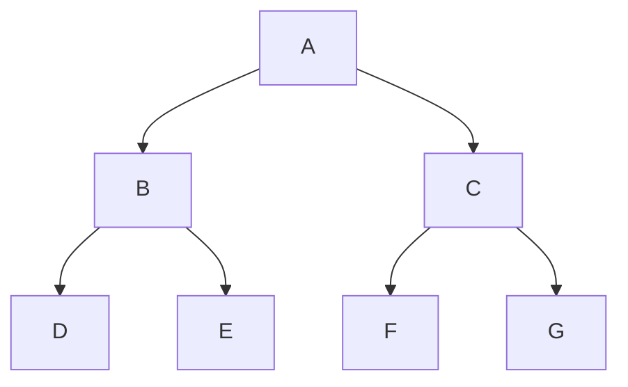

<br>

标题

```
# 一级标题
...
###### 六级标题
```

<br>

无序列表

```
- 无序列表 1
- 无序列表 2
- 无序列表 3
```

<br>

有序列表

```
1. 有序列表 1
2. 有序列表 2
3. 有序列表 3
```

<br>

任务列表

```
- [ ] 未做任务
- [x] 已做任务
```

<br>

删除线

```
~~删除线~~
```

<br>

下划线

```
<u>下划线</u>
```

<br>

下标

```
~下标~
```

<br>

上标

```
^上标^
```

<br>

倾斜

```
*倾斜*
```

<br>

加粗

```
**加粗**
```

<br>

分割线

```
---
```

<br>

行内代码

```
`code`
```

<br>

多行代码

````
```python
多行 python 代码
```
````

<br>

顺序图

````
```sequence
张三->李四: 嘿，⼩四⼉, 写博客了没?
Note right of 李四: 李四愣了⼀下，说：
李四-->张三: 忙得吐⾎，哪有时间写。
```
````

```sequence
张三->李四: 嘿，⼩四⼉, 写博客了没?
Note right of 李四: 李四愣了⼀下，说：
李四-->张三: 忙得吐⾎，哪有时间写。
```

<br>

流程图

````
```flow
st=>start: 开始
e=>end: 结束
op=>operation: 我的操作
cond=>condition: 确认？
st->op->cond
cond(yes)->e
cond(no)->op
```
````

```flow
st=>start: 开始
e=>end: 结束
op=>operation: 我的操作
cond=>condition: 确认？
st->op->cond
cond(yes)->e
cond(no)->op
```

<br>

树状图

````

````


<br>
