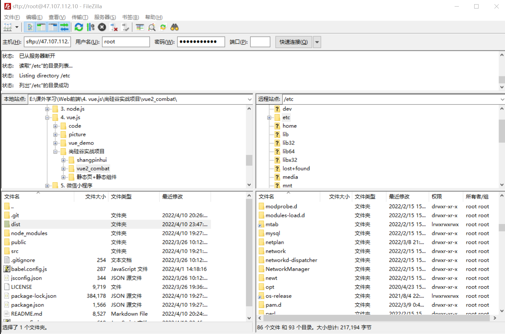
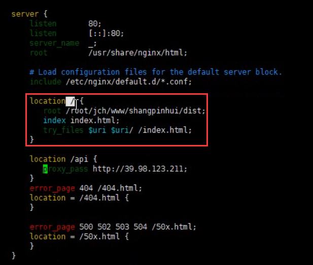
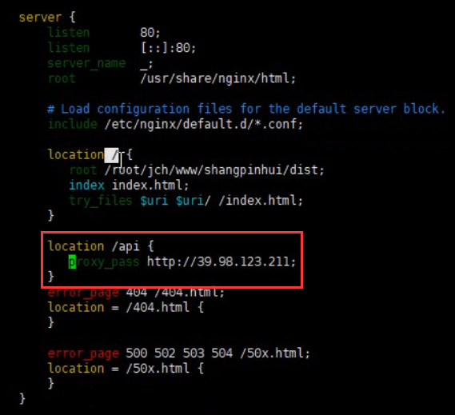

# XShell 连接服务器

1. 创建会话：输入 [名称] 和 [域名].
2. 填写 [用户名 root] 和 [密码]，即可连接成功

# FileZilla

# nginx

帮我们购买的服务器向别的域名获取数据

- 安装 nginx：`yum install nignx`
- 配置：

> #### 使我们访问服务器 ip 时，能访问到项目文件

> #### 项目数据来源 `http://39.98.123.211` 

- 编辑文件 nignx.conf：`vim nignx.conf`

