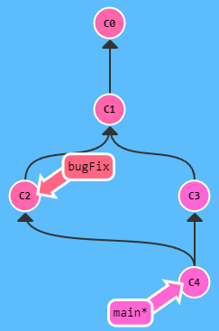
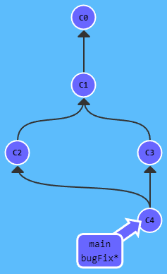
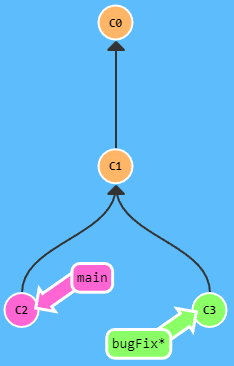
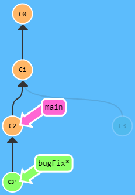
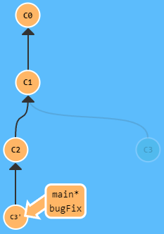

# Git

> #### 区域理解：

1. 工作区：存放项目的文件夹
2. 暂存区：用于暂时存放代码；能提高 Git 做 diff 时的速度
   暂存信息存储在 .git/index 文件中，所以暂存区有时也叫作 "索引" (index)
3. 本地仓库：
   ① 本地分支：分支代码信息存储在 .git/refs/heads 目录下
   ② 远程分支的本地副本：远程分支代码信息存储在 .git/refs/remotes 目录下
4. 远程仓库


> #### 常用的 Linux 命令：

- `ls`：查看当前目录下的文件(夹)
  `ls -a`：查看当前目录下的文件(夹)，包括隐藏文件(夹)
  `ls -l`：查看当前目录下的文件(夹)的详细信息
- `pwd`：查看当前路径
- `mkdir XXX`：创建目录 - `mkdir demo`
- `touch XXX`：创建文件 - `touch index.js`
- `cd XXX`：进入指定目录 - `cd ..`
- `cp XXX XXX`：拷贝文件 - `cp old.js new.js`
  `cp -r XXX XXX`：拷贝文件夹 - `cp -r oldDir newDir`
- `mv XXX XXX`：移动文件、并修改文件名 - `mv a.js bDir/b.js`
- `rm XXX`：删除文件 - `rm a.js`
  `rm -r XXX`：删除文件夹 - `rm -r aDir`
- `cat XXX`：查看文件 - `cat a.js`
- `vim XXX`：编辑文件 -  `vim a.js`（ `i` 开始编写、`esc` 完成编写、`:wq + 回车` 保存并退出 ）
- `clear`：清屏

<br><br>

# 安装 & 配置

- 打开[Git官网](https://git-scm.com/downloads)下载，傻瓜式安装即可
- `git -v`：查看 Git 版本

<br>


## 全局配置 Git

在任意目录下右键，选择 [Git Bash Here]

1. 设置用户名 & 邮箱

```sh
git config --global user.name <YourName>
git config --global user.email <email@example.com>
```

2.   让 git 区分大小写：

```bash
git config --global core.ignorecase false
```

默认情况下，如果你的文件系统是不区分大小写的（如 Windows 或者 macOS），那么 core.ignorecase 会被设置为 true，这意味着 git 会认为 foo.txt 和 FOO.TXT 是同一个文件。

把 core.ignorecase 设置为 false 在不区分大小写的文件系统上可能会导致一些奇怪的错误，比如重命名一个文件只改变了大小写，可能会导致 git 报告冲突或者创建重复的文件。

<br>

## 配置 SSH

- 本地生成 ssh 公钥，并配置到代码托管平台上，即可使用 [ssh 链接] 免密码 push、pull

```shell
ssh-keygen -t rsa -C "<邮箱>"
```

- 代码托管平台有 Github、Gitlab、Gitee，上面的 `<邮箱>` 为你在该平台上注册的邮箱
- rsa：非对称加密协议

```js
PS E:\combat> ssh-keygen -t rsa -C "<邮箱>"
Generating public/private rsa key pair. // 生成 rsa 公私钥对
Enter file in which to save the key (C:\Users\superman/.ssh/id_rsa):  // 输入保存密钥的文件
Created directory 'C:\Users\superman/.ssh'.
Enter passphrase (empty for no passphrase): // 输入创建密码
Enter same passphrase again:  // 再次输入创建密码
Your identification has been saved in C:\Users\superman/.ssh/id_rsa.
Your public key has been saved in C:\Users\superman/.ssh/id_rsa.pub.
The key fingerprint is:
SHA256:w2IdXg9ECG9Vryk <邮箱>
The key's randomart image is:
+---[RSA 3072]----+
|        .o=.o. . |
|         +.+. = +|
| o.. o. .. ..    |
+----[SHA256]-----+
```

- 进入保存密钥的文件夹 `cd ~/.ssh`、查看公钥  `cat id_rsa.pub`
  将获取到的公钥配置到你的代码托管平台即可

<br><br>

# git clone

1. `git clone <url>`：克隆代码；默认停留在 master 分支
   `<url>`：远程库上的 HTTPS / SSH 的地址
2. `git clone <url> -b <指定分支名>`：克隆代码，并自动切到指定分支

- [克隆代码] 会：
  ① 初始化本地仓库
  ② 把整个项目文件下载下来
  ③ 自动配置 `origin` 为远程库的别名

<br><br>

# git init

- 用于为当前目录创建一个 git 仓库
- 初始化本地库后，当前目录下会多出一个**隐藏目录** .git，这个目录是 Git 用来管理本地库的，不要随意改动
- 不过本地 init 的仓库无法与远端交互，所以还需去 github / gitlab / gitee 创建一个远端仓库 并关联
- 关联远端仓库使用 `git remote`

> #### .gitignore 文件

.gitignore 文件一般创建在项目的根目录下，其内容是一些文件(夹)的路径，用于设置哪些文件(夹)不需要被 Git 管理

```sh
# 所有以 .md 结尾的文件
*.md  

# lib.a 不能被忽略
!lib.a

# [node_modules 文件夹] & [.vscode 文件] 被忽略
node_modules
.vscode

# build 目录下的文件被忽略
build/

# doc 目录下的.txt文件被忽略
doc/*.txt

# doc 目录下多层目录的所有以 .pdf 结尾的文件被忽略
doc/**/*.pdf
```

<br><br>

# git remote

用于关联远端仓库

1. `git remote add <自定义仓库别名> <远程库链接>`：关联远程库
2. `git remote`：查看已关联的远程库
   `git remote -v`：显示对应的克隆地址
3. `git remote rename <oldName> <newName>`：远程库重命名
4. `git remote rm <仓库别名>`：撤销关联
5. `git remote show origin`：查看代码的更新状态。有 3 个状态值：
   ① `up to date`：本地代码与远程代码保持一致
   ② `fast-forwardable`：本地代码有更新
   ③ `local out of date`：远程代码有更新，需要先拉取最新代码

<br><br>

# git push

1. `git push <远程库>  [ <本地分支名>[:<远程分支名>] ]`：将本地仓库的修改推送到远程仓库
   `<远程分支名>`-默认与 `<本地分支>` 同名、 `<本地分支名>`-默认为当前分支
   如果只有一个远程库，则 `<远程库>` 可以省略
   如果远程不存在该分支，则会被新建

   `git push origin :<远程分支名>`：仅省略本地分支名，表示推送一个空的本地分支到远程分支；相当于删除指定的远程分支

2. `git push origin --delete <远程分支名>`：删除指定的远程分支；会把与其关联的本地分支也删除掉

3. `git push -u origin <远程分支名>`：对于新建的本地分支，首次 push 需要与远程分支建立联系
   该命令会在远程库创建同名分支，并与当前分支建立联系。之后就可直接 push 啦

<br><br>

# git pull

1. `git pull <远程库> <远程分支名>[:<本地分支名>]`：从远程库获取最新代码、合并到指定分支
   `<本地分支名>`-默认为当前分支、 `<远程分支名>`-默认与 `<本地分支>` 同名
   如果只有一个远程库，则 `<远程库>` 可以省略

<br><br>

# git fetch

1. `git fetch <远程库>`：取回所有分支的更新
2. `git fetch <远程库> <分支名>`：取回指定分支的更新

- 如果只有一个远程库，则 `<远程库>` 可以省略
- 在本地主机上使用取回的更新，需要用 “远程主机名/分支名” 的形式读取

<br><br>

# git branch

1. `git branch`：查看本地分支
   `git branch -r`：查看远程分支的本地副本
   `git branch -a`：查看所有分支
   `git branch -v`：显示最后一次 commit 的信息
2. `git branch <自定义分支名>`：创建分支
3. `git branch -m <oldName> <newName>`：分支重命名
4. `git branch -d <branchName>`：删除分支（不能删除正在使用的分支）
   `git branch -D <branchName>`：强制删除分支（不能删除正在使用的分支）
   如果分支包含 [未合并的更改] / [未推送的提交]，Git 会拒绝删除 (避免意外丢失数据)。此时可以使用强制删除

<br><br>

# git add

1. `git add <fil1> <fil2>`：将修改添加到暂存区
2. `git add .`：把当前目录下所有修改都添加到暂存区
3. `git add -A`：把当前仓库内所有修改都添加到暂存区

<br><br>

# git commit

1. `git commit <file1> -m "my description"`：将暂存区的文件提交到版本库

2. `git commit -m "my description"`：将暂存区的所有文件都提交到版本库

3. `git commit -am "my description"`：`git add .` + `git commit -m "my description"`
   这条命令是对于已经被 Git 管理的文件而言的；对于未被 Git 管理的文件，还是得分支执行 add & commit

4. `git commit --amend`：与上一次提交合并，并修改提交的信息 (打开编辑器修改)
   `i`-开始编写修改的信息、 `esc`-完成编写、`:wq + 回车`-保存并退出

   `git commit --amend -m "my description"`：与上一次提交合并，并修改提交的信息 (直接重写)

   `git commit --amend --no-edit`：与上一次提交合并，不修改提交的信息

<br><br>

# git merge

1. `git merge <branch>`：将指定分支合并到当前分支

eg：`git merge bugfix` - 将 bugfix 合并到当前分支上


> 实际开发中，我们会这么操作：
>
> 1. 在主分支上，merge 需要合并的分支。如果两个分支修改了同一行代码，就会出现冲突
>
> 2. 如果没有冲突：会显示 past-forward 快照
>
>    如果有冲突：会显示 conflict 冲突；**需要手动解决冲突，然后提交解决冲突后的代码**
>
> ```sh
> git add .
> git commit -m "finish conflict" # 这里不可以带文件名，否则会报错
> ```

如果我们合并分支后，想同步所有分支的代码
① 可以将原来的分支 bugfix 删除、再基于 main 创建新的分支 bugfix
② 可以切换到 bugfix 分支，再合并 main 分支：**`git switch bugFix`、`git merge main`**
（因为 main 继承自 bugfix，所以 Git 只是简单地把 bugfix 移动到 main 所指向的那个提交记录）


<br><br>

# git checkout

1. `git checkout <branch_1>`：切换分支
   `git switch <branch_1>`
2. `git checkout -b <branch_1>`：创建并切换分支
3. `git checkout -b <branch_1> origin/<branch_1>`：基于远程分支，创建并切换分支

<br><br>

# git switch

1. `git switch <branch_1>`：切换分支 (新版命令)

<br><br>

# git restore

1. `git restore -- <file_1>`：将暂存区指定文件的修改回退到工作区；会覆盖工作区
2. `git restore -- .`：将暂存区所有修改回退到工作区；会覆盖工作区

<br><br>

# git reset

1. `git reset <target>`：回退版本库的提交，并将修改更新到暂存区
2. `git reset --soft <target>`：仅回退版本库的提交，不修改暂存区
3. `git reset --hard <traget>`：回退版本库的提交，并将修改更新到暂存区和工作区

- `<target>`：`HEAD^` / `HEAD~`，有多少个 `^` / `~` 就回退多少个版本

  多个  `^` / `~` 可以简写：`HEAD~~~~~` / `HEAD^^^^^` → `HEAD~10`
  注意：`^` 后面不可以跟数字，`~` 后面才可以

- `<target>`：版本 id，表示回退到指定版本

  版本 id 不需要写全，能唯一标识指定版本即可

<br><br>

# git log

1. `git log`：查看详细的日志信息
   当版本信息过多时：下一页-`空格`、上一页-`b`、退出查看-`q`
2. `git log --oneline`：查看简要的日志信息
3. `git log --graph --oneline`：美化日志

<br><br>

# git reflog

1. `git reflog`：查看所有的操作记录

<br><br>

# git rm

1. `rm <file_1>`：删除 [工作区] 的指定文件
2. `git rm <file_1>`：删除 [工作区]、[暂存区] 的指定文件
3. `git rm <file_1> --cache`：删除 [暂存区] 的指定文件
   前提是：[工作区文件] & [暂存区文件] 一样

- 可以使用 `-f` 暴力删除
- 可以使用 `-r` 递归删除

<br><br>

# git rebase

1. `git rebase <branch_1>`：将当前分支 [线性合并] 到指定分支上

`git rebase main`：将 bugFix 放到 main 的最顶端
注意：提交记录 C3 依然存在，而 C3' 是我们 rebase 到 main 分支上的 C3 的副本


如果我们合并分支后，想同步所有分支的代码：
① 可以将原来的分支 bugfix 删除、再基于 main 创建新的分支 bugfix
② 可以切换到 main 分支，再将 main 移动到 bugFix 的顶端：**`git switch main`、`git rebase bugFix`**
（因为 bugFix 继承自 main，所以 Git 只是简单地把 main 分支的引用向前移动了一下而已）


<br><br>

# git stash

1. `git stash`：暂存当前未 commit 的代码
   该命令会保存所有未提交的更改，并恢复到上次提交到版本库的状态
2. `git stash save "备注"`：暂存当前未 commit 的代码，并添加备注
3. `git stash list`：查看暂存记录
4. `git stash apply`：恢复最新的暂存记录
5. `git stash apply stash@{XXX}`：恢复指定暂存记录
6. `git stash clear`：清空暂存记录
7. `git stash pop`：恢复最新的暂存记录、同时立刻将其从堆栈中移走

> 假设：我们在 feat 分支开发到一半，被告知需要到别的分支修复 bug。但是，当前分支的功能还没开发完，还不方便提交。
> 此时，我们可以先暂存当前分支，然后切换到别的分支修复 bug。修复完后，合并最新的代码，再恢复尚未完成的功能分支
>
> 1. `git stash`
> 2. `git switch bugFix` → 修复 bug
> 3. `git switch feat`
> 4. `git stash apply`

<br><br>

# git cherry-pick

1. `git cherry-pick <branch_1> <commitId_1> <commitId_2> ...`：将指定分支的指定提交合并到当前分支
2. `git cherry-pick <branch_1> <commitId_1> -x`：将指定分支的指定提交合并到当前分支，并生成标准化的提交信息

> 假设：我们本应在 feat 分支进行开发并提交，却把开发的代码错误地提交到了 master 分支。此时可以先在 master 上找到错误提交的 commitId，然后在 feat 分支上将提交合并过来。最后回退 master 上的提交版本。
>
> 1. `git log --oneline`
> 2. `git switch feat`
> 3. `git cherry-pick master commitId`
> 4. `git switch master`
> 5. `git reset --soft HEAD^`

<br><br>

# git tag

标签有点像是对某个提交的引用，从表现上看，像基于当前分支提交给你创建了一个不可变的分支，它支持你直接 checkout 到这个分支上，但它和普通分支又有着本质的区别。如果你切换到这个 tag "分支" 上，修改代码并产生一次提交，或者 reset 版本，对于该 tag 本身不会有任何影响，而是为你生成了一个独立的提交。但在你的分支历史中是找不到该提交的，你只能通过 commitId 来切换到本次提交

1. 轻量标签：`git tag v1.0.0`

2. 附注标签：`git tag -a v1.0.1 -m "发布正式版 1.0.1"`

3. 查看标签的信息：`git show v1.4`

4. 推送标签：`git push origin tagName`

   推送所有本地标签：`git push origin --tags`

5. 列出所有标签：`git tag`

6. 删除标签：`git tag -d v1.0.1`

7. 删除远程标签：`git push origin --delete v1.0.2` / `git push origin :refs/tags/v1.0.1`

8. 基于标签创建新的本地分支：`git checkout -b <branch_1> <tag_1>`

<br><br>

# 简单工作流程

1. 在 github 上创建远程仓库
2. 将项目克隆到本地：`git clone <url>`
3. 从 master 分支 checkout 一个新的 feature 分支进行开发
4. 编写项目
5. 将变更提交至暂存区：`git add .`
6. 将代码同步到本地仓库：`git commit -m "description"`
7. 首次将代码 push 到远程库：`git push -u origin feature ` ( push 代码并建立联系 )
8. 后续将代码 push 到远程库：`git push`
   1. 如果在远程库上有代码更新，会 push 失败
      此时 应当先同步最新代码：`git pull`
   2. 若有代码冲突，则手动解决，再 push；若无代码冲突，即可直接 push
9. 当我们开发完所有需求后，会创建一个测试分支 test；我们会把代码合并到这个测试分支上，然后部署到测试环境进行测试
10. 测试无误后，我们再把代码合并到 master 分支并部署；
    一般需要先在当前分支合并 master 分支，解决冲突并提交后，再在 master 分支上合并当前分支

<br><br>
