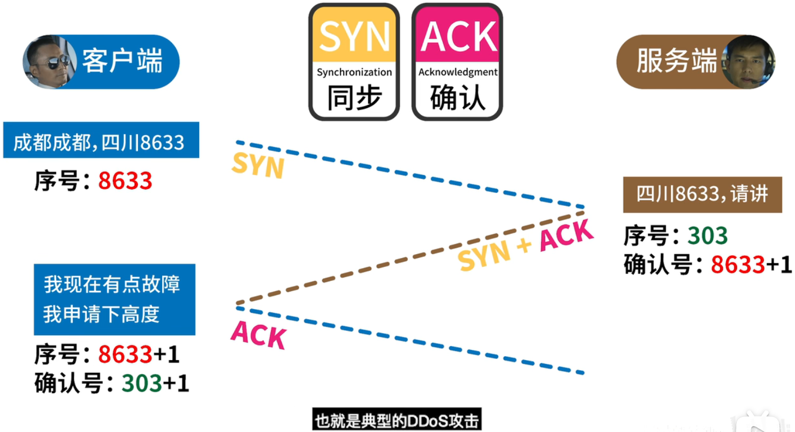
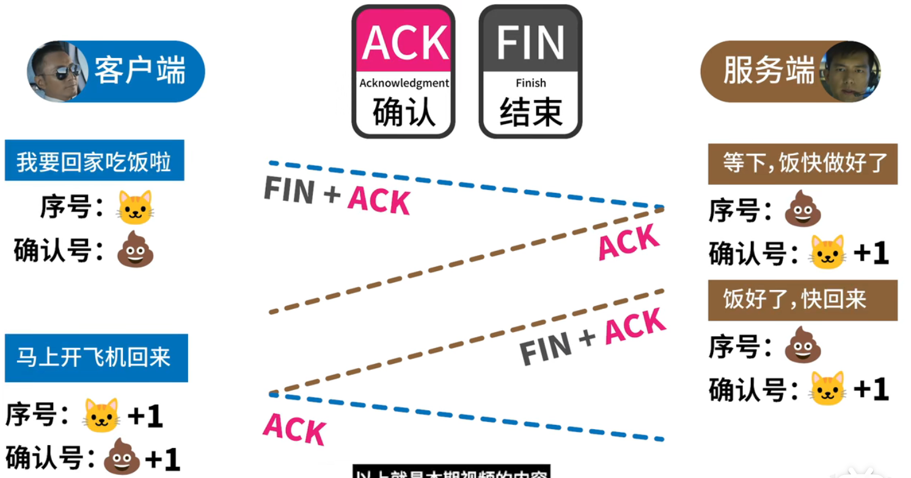

# CDN

CDN，Content Delivery Network，内容分发网络

为了缩短服务器与用户的距离，会在世界各地搭建**边缘服务器**

## 数据分发

> #### 对于静态资源

源服务器会把静态内容提前分发给 CDN，用户在需要使用时，CDN 即可把静态内容发送给用户，不用每次都劳烦源服务器

如果 CDN 中没有备份，则需要向源服务器请求，然后再进行备份。之后的用户再获取该静态资源，即可直接在 CDN 获取

> #### 对于动态资源

有些 CDN 会提供可以运行在 CDN 上的接口，让源服务器使用 CDN 的接口，而不是服务器自己的代码。

这样，用户即可直接在 CDN 上获取动态数据

## 安全性 & 可靠性

监控 CDN 的负载情况，如果有服务器超载了，就会把请求分发到没有超载的服务器上，即 "负载均衡"

这里是采用 "任播" 技术，采用任播后，服务器对外拥有一样的 IP 地址。如果这个 IP 地址收到了用户的请求，请求就会由最靠近用户的服务器来响应。

除此之外，CDN 还会采用 TLS / SSL 证书来保护网站

## 一加一减

- CDN 又叫 "加速器"，增加了请求的响应速度
- 因为缩短了服务器与用户的距离，减少了 CDN 到源服务器之间占用的带宽，从而减少开销

# TCP & UDP

> #### TCP

1. TCP 是**面向连接**的

2. TCP 提供**可靠交付**的服务

3. TCP 连接只能是**一对一**的

4. TCP 是**面向字节流**

   不保证 [接收方收到的数据块] 和 [发送方发出的数据块] 具有对应大小的关系

   但 [接收方收到的字节流] 必须和 [发送方发出的字节流] 一样

5. TCP 提供全双工通信 (双向同时通信)

> #### UDP

1. UDP 是**无连接**的，发送数据前 不用建立连接，以减少开销 & 加快发送速度
2. UDP 不保证可靠交付，因此主机不需要维持复杂的 [连接状态表]
3. UDP 支持一对一、一对多、多对一、多对多的交互通信
4. UDP 是**面向报文**的。应用层的报文怎么传下来，就怎么发出去。UDP 一次交付一个完整的报文
5. UDP 没有拥塞控制；如果网络出现拥塞，也不会降低主机的发送速率。这对某些实时应用非常重要
6. UDP 的首部开销小，只有 8 个字节（TCP 的首部有 20 个字节）

## 3 握 4 挥

因为服务器可能还没发送完数据，所以需要 4 次挥手

